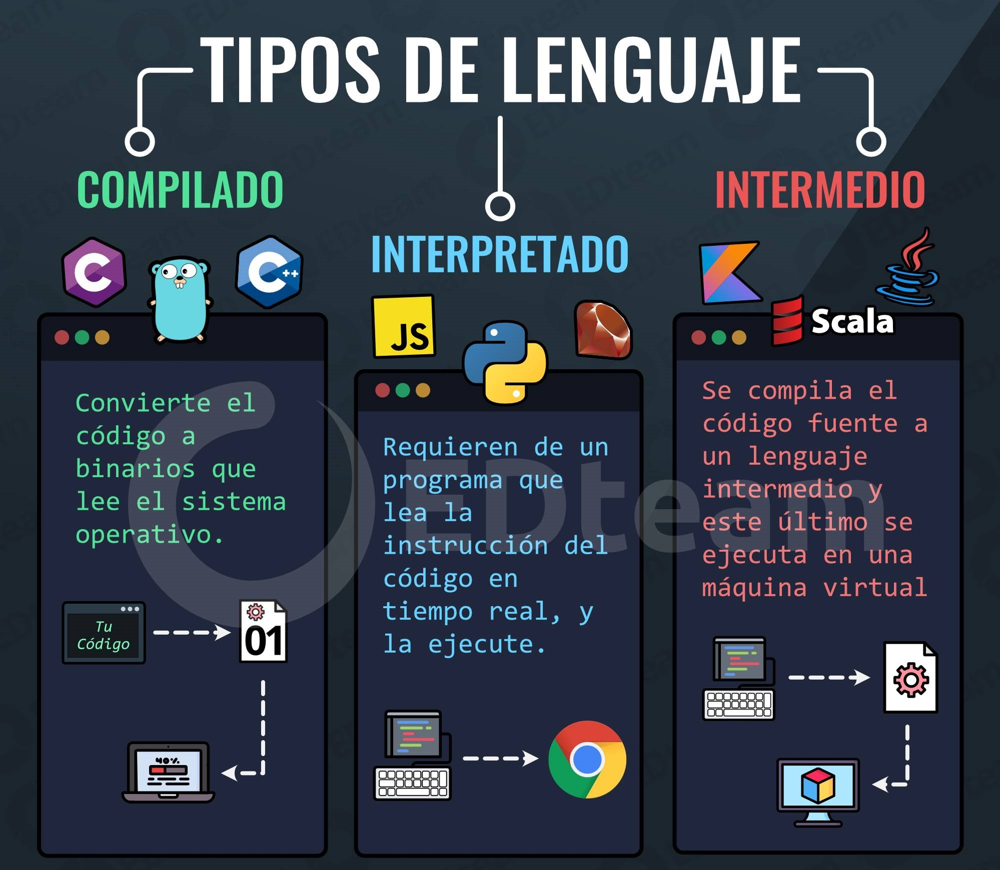

# Conceptos

**Modeló MVC:** Modelo-Vista-Controlador es un patrón en el diseño de software comúnmente utilizado para implementar interfaces de usuario, datos y lógica de control.

**Palabras reservadas:** palabras que tiene un significado especial para el lenguaje de programación y no pueden ser utilizadas como un identificador de objetos en códigos del mismo.

**Lenguaje de programación**: conjunto de instrucciones escritas que interpreta la maquina.

**Case sensitive:** sensible ha mayúsculas. La mayoría de lenguajes son case sensitive.

En un array se puede almacenar un conjunto de objetos o variables. Se pueden declarar e inicializar en la misma línea.

En java podemos declarar o inicializar objetos en la primera línea.

El constructor es un método con el nombre de la clase que nos permite instanciar objetos, se utilizan para inicializar objetos.

**Sobrescrito**: cuando se reescribe un método de otra clase.

**Archivos binarios**: archivos informáticos que contiene información codificada en binario.

**Archivos de texto plano**: archivos informáticos que contiene únicamente texto formado solo por caracteres que son legibles por humanos y carece de cualquier tipo de formato tipográfico.

El puerto 5000 arrojo una vulnerabilidad porque windows XP lo dejaba por defecto abierto y se podia entrar a el.

**Web developers**: programador especializado en desarrollar aplicaciones de la World Wide Web o aplicaciones distribuidas en red que se ejecutan mediante HTTP desde un servidor web a un navegador web.

**HTML dinámico desde el servidor**: utilizando los lenguajes mas populares de la época, principalmente C, C++ y mas adelante PHP y Java, se creaba el HTML de forma dinámica.

**C++**: lenguaje versátil pero muy peligroso en caso de no conocer el lenguaje. Fácil de desbordar la pila de memoria. Entro en desuso.

**Unreal**: motor de desarrollo de videojuegos, usando C++.

**Unity**: motor de videojuegos multiplataforma.

**Usenet (Users Network)**: sistema global de discusión en Internet, que evoluciona de las redes UUCP.

**Ingeniería inversa**: proceso llevado a cabo con el objetivo de obtener información o diseño de un producto, con el fin de determinar cuáles son sus componentes y de qué manera interactúan entre sí y cuál fue el proceso de fabricación.

**Flash**: surge a finales de 1995 para hacer animaciones en la Web. Se creaban archivos con extension .swf utilizando Flash Builder (costaba como 500$). Utilizaba un lenguaje de programación llamado ActionScript. Adobe (Macromedia).

**Java Applets**: Los Java Applets eran programas de Java que corrían sobre el navegador.

**PHP**: PHP fue el primer lenguaje creado exclusivamente para la web. Fue lanzado a mediados de 1995 como el primer lenguaje de programación para la Web. PHP + MySQL.

**Apache**: Apache es un servidor web HTTP de código abierto, que implementa el protocolo HTTP.

**CRUD (Create Read Update Delete)**: conjunto de operaciones básicas de gestión.
**Tipos de datos**: un tipo de dato es un atributo de los datos que indica al ordenador sobre la clase de datos que va a manejar.

**Cpanel (Configuration panel)**: panel de configuración, elemento de la interfaz que permite configurar nuestro alojamiento.

Las bases de datos son explotadas por aplicaciones.

**Alta cohesión**: número de propósitos que tienen un elemento. Cuanto menor número de propósitos mayor cohesión. Las aplicaciones tienen que ser fáciles de mantener y extender.

**Source code (src)** → Código fuente

**String** → Clase de java que manipula cadenas de caracteres

**CD** → Change Directory

**Literal →** Valor de una variable escrito a mano (no recomendado)

**null** → Término utilizado en la computación para hacer referencia a la nada.

**Wrapper** → Envoltura

**LTS** → Long Term Support

**Get** → Obtener

**Set** → Establecer

**Ruta canónica** → `C:\Users\Usuario\Descargas\`

**Ruta absoluta** → `C:\Users\Usuario\..\Usuario\Descargas\`

**Dummy data** → Datos de muestra

**Localhost** → `http://localhost/index.php`

`C:\xampp\htdocs\web\index.html` ↔ `http://localhost/web/index.html`

Pasarelas de pago recomendada para WordPress → Stripe

<aside>
 **Escape Sequence:**

\’ → Comilla simple

\" → Comilla doble

\? → Interrogación

\\ → Contrabarra

\a → Alerta (timbre, alarma)

\b → Retroceso

\f → Alimentación de formularios (página nueva)

\n → Salto de linea

\r → Retorno de carro

\s → Espacio

\t → Tab horizontal

\u → Unicode

\v → Tab vertical

</aside>

Especificadores de conversión:

| Especificador | Formato |
| --- | --- |
| %b | Booleano |
| %h | Hashcode |
| %s | Cadena |
| %c | Carácter Unicode |
| %d | Entero decimal |
| %o | Entero octal |
| %x | Entero hexadecimal |
| %f | Real decimal |
| %e | Real notación científica |
| %g | Real notación científica o decimal |
| %a | Real hexadecimal con mantisa y exponente |
| %t | Fecha u hora |

**Lenguaje compilado:** lenguajes que convierten el código a binarios para que el sistema operativo pueda leerlo.

Ejemplos: C, Go y C++

**Lenguaje interpretado:** lenguajes que requieren de un programa que lea la instrucción del código en tiempo real y la ejecute.

Ejemplos: JavaScript, Python y Ruby

**Lenguaje intermedio:** lenguajes en los que se compila el código fuente a un lenguaje intermedio y este se ejecuta en una máquina virtual.

Ejemplos: Java, Kotlin y Scala

## Java RegEx

### Patrones de expresiones regulares

| Expresión | Descripción |
| --- | --- |
| [abc] | Busca un carácter de las opciones entre los corchetes |
| [^abc] | Busca un carácter que NO esté entre los corchetes |
| [0-9] | Buscar un carácter del 0 al 9 |

### Metacaracteres

| Metacaracteres | Descripción |
| --- | --- |
| | | Buscar una coincidencia para cualquiera de los patrones separados por | como en: cat|dog|fish |
| . | Encontrar una sola instancia de cualquier carácter |
| ^ | Encuentra una coincidencia como el principio de una cadena como en: ^Hello |
| $ | Encuentra una coincidencia al final de la cadena como en: World$ |
| \d | Encontrar un dígito |
| \s | Buscar un carácter de espacio en blanco |
| \b | Encuentre una coincidencia al principio de una palabra como esta: \bWORD, o al final de una palabra, así: WORD\b |
| \uxxxx | Buscar el carácter Unicode especificado por el número hexadecimal xxxx |

### Cuantificadores

| Cuantificadores | Descripción |
| --- | --- |
| n+ | Coincide con cualquier cadena que contenga al menos un n |
| n* | Coincide con cualquier cadena que contenga cero o más apariciones de n |
| n? | Coincide con cualquier cadena que contenga cero o una ocurrencias de n |
| n{x} | Coincide con cualquier cadena que contenga una secuencia de X n's |
| n{x,y} | Coincide con cualquier cadena que contenga una secuencia de X a Y n's |
| n{x,} | Coincide con cualquier cadena que contenga una secuencia de al menos X n's |

<aside>
💡 Buenas practicas en empresa

index.php enlazado a index.html

---

www.domino.es

www.dominio.com

</aside>

<aside>
🗣️ Pasos de proyecto:

**Al acabar cada fase hay que enseñar el resultado al cliente**

<aside>
🏢 Necesidades del cliente

1. Documentos del proyecto grafico → Breafing
    1. Cobro del 50% al firmar el contrato
2. Investigación
3. Análisis de datos
4. Inventario de contenidos
</aside>

<aside>
💼 Solución

1. Flujo de  y arquitectura de contenidos
2. Diseño de la funcionalidad
3. Diseño visual → Proyecto de branding (Cambio del aspecto de la identidad corporativa)
</aside>

1. Maquetación y desarrollo
    1. Cobro del 50% o +
2. Despliegue (≠viernes)
3. Mantenimiento
</aside>