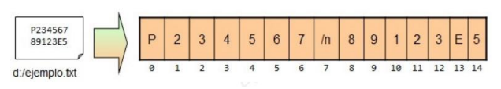
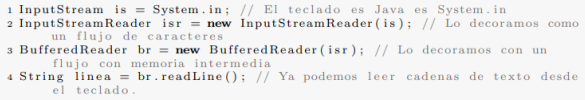
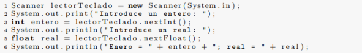

# Java: Repaso y ampliación

## Tipos de datos primitivos en Java

Los tipos primitivos de Java son tipos básicos, representan valores simples y se encuentran definidos por el lenguaje Java. Esto quiere decir que para cada tipo de dato básico existe un tipo equivalente en Java nombrado con una palabra, estos nombres se denominan “palabras reservadas” del lenguaje y no puedes ser utilizadas por el programador cuando cree nombres de variables. Los tipos primitivos en Java son los siguientes:

- Números enteros:
    - Byte: representa un tipo de dato de 8 bits con signo. De tal manera que puede almacenar los valores numéricos de -128 a 127 (ambos inclusive).
    - Short: representa un tipo de dato de 16 bits con signo. De esta manera, almacena valores numéricos de -32768 a 32767.
    - Int: es un tipo de dato de 32 bits con signo para almacenar valores numéricos.
    - Long: es un tipo de dato de 64 bits con signo.
- Números reales:
    - Float: es un tipo de dato para almacenar números en coma flotante con precisión simple de 32 bits.
    - Double: es un tipo de dato para almacenar números en coma flotante con doble precisión de 64 bits.
- Boolean: sirve para definir tipos de dato booleanos. Es decir, aquellos que tienen un valor de true o false. Ocupa 1 bit de información.
- Char: es un tipo de dato que representa a un carácter Unicode sencillo de 16 bits.

### Valores por defecto de los datos primitivos y otros datos

| Dato primitivo | Valor por defecto |
| --- | --- |
| byte | 0 |
| short | 0 |
| int | 0 |
| long | 0L |
| float | 0.0f |
| double | 0.0d |
| char | 'u0000' |
| String (o cualquier objeto) | null |
| boolean | false |

### Clases de Java relacionadas con los datos primitivos

El paquete `Java.lang` es uno de los paquetes mas importantes de Java, ya que incluye muchas clases relevantes que forman parte del eje básico del lenguaje Java. No es necesario importar el paquete explícitamente, ya que siempre esta incluido en cualquier aplicación. Clases del paquete `Java.lang`:

- **System**: proporciona objetos para entrada/salida, y funcionalidades del sistema.
- **Math**: proporciona funciones matemáticas usuales.
- **Object**: la raíz de la jerarquía de clases. Define el comportamiento base de todos los objetos.
- **String y StringBuilder**: manipulación de cadenas de caracteres.
- **Class**: proporciona información sobre las clases.

El paquete `Java.lang`, además:

- Contiene interfaces:
    - **Comparable**: especifica el método de ordenación natural entre objetos (`compareTo()`).
    - **Cloneable**: especifica que un objeto puede ser clonado.
    - **Runnable**: especifica el método a ejecutar por el gestor de hilos (`run()`).
- Contiene también excepciones y errores.

### Palabras reservadas de Java

Son palabras que no se pueden utilizar para declarar variables.

- **abstract**: especifica la clase o  método que se va  a implementar más tarde en una subclase.
- **boolean**: tipo de dato que sólo puede tomar los valores  verdadero o falso.
- **break**: sentencia de control para salirse de los bucles.
- **byte**: tipo de dato que soporta valores en 8 bits.
- **byvalue**: reservada para uso futuro.
- **case**: se utiliza en las sentencias switch para indicar bloques de texto.
- **cast**: reservada para uso futuro.
- **catch**: captura las excepciones generadas por las sentencias try.
- **char**: tipo de dato que puede soportar caracteres Unicode sin signo en 16 bits.
- **class**: declara una clase nueva.
- **const**: reservada para uso futuro.
- **continue**: devuelve el control a la salida de un bucle.
- **default**: indica el bloque de código por defecto en una sentencia switch.
- **do**: inicia un bucle do-while.
- **double**: tipo de dato que soporta números en coma flotante, 64 bits.
- **else**: indica la opción alternativa en una sentencia if.
- **extends**: indica que una clase es derivada de otra o de una interfaz.
- **final**: indica  que  una variable  soporta  un valor  constante  o  que  un método no se sobrescribirá.
- **finally**: indica  un  bloque de código en  una estructura try – catch que siempre se ejecutará.
- **float**: tipo de dato que soporta un  número en coma flotante en 32 bits.
- **for**: utilizado para iniciar un bucle for.
- **future**: reservada para uso futuro.
- **generic**: reservada para uso futuro.
- **goto**: reservada para uso futuro.
- **if**: evalúa si  una expresión  es verdadera o falsa y  la dirige adecuadamente.
- **implements**: especifica que una clase implementa una interfaz.
- **import**: referencia a otras clases.
- **inner**: reservada para uso futuro.
- **instanceof**: indica si un objeto es una instancia de una clase específica o implementa una interfaz específica.
- **int**: tipo de dato que puede soportar un entero con signo de 32 bits.
- **interface**: declara una interfaz.
- **long**: tipo de dato que soporta un entero de 64 bits.
- **native**: especifica que un  método está implementado con código nativo (específico de la plataforma).
- **new**: crea objetos nuevos.
- **null**: indica que una referencia no se refiere a nada.
- **operator**: reservado para uso futuro.
- **outer**: reservado para uso futuro.
- **package**: declara un paquete Java.
- **private**: especificador de acceso que indica que un método o variable sólo puede ser accesible desde la clase en la que está declarado.
- **protected**: Especificador de acceso que indica que un método o variable sólo puede ser accesible desde la clase en la que está declarado (o una subclase de la clase en la que está declarada u otras clases del mismo paquete).
- **public**: especificador de acceso utilizado para clases, interfaces, métodos y variables que indican que un tema es accesible desde la aplicación (o desde donde la clase defina que es accesible).
- **rest**: reservada para uso futuro.
- **return**: envía control  y  posiblemente devuelve un valor desde el método que fue invocado.
- **short**: tipo de dato que puede soportar un entero de 16 bits.
- **static**: indica que una variable o método sono de una clase (más que estar limitado a un objeto particular).
- **super**: se refiere a una clase base de la clase (utilizado en un método o constructor de clase).
- **switch**: sentencia que ejecuta código basándose en un valor.
- **synchronized**:  especifica secciones  o  métodos críticos  de  código multihilo.
- **this**: se refiere al objeto actual en un método o constructor
- **throw**: crea una excepción.
- **throws**: indica qué excepciones puede proporcionar un método.
- **transient**: especifica que una variable no es parte del estado persistente de un objeto.
- **try**: inicia un bloque de código que es comprobado para las excepciones.
- **var**: reservado para uso futuro.
- **void**: especifica que un método no devuelve ningún valor.
- **volatile**: indica que una variable puede cambiar de forma asíncrona.
- **while**: inicia un bucle while.
- **`//`**: comentario de línea.
- **`/*`**: apertura de comentario de bloque.
- `*/`: cierre de comentario de bloque.

### Creación de variables y constantes de datos primitivos

Variables

```java
tipo identificador;
tipo identificador = expresion;
tipo identificador1, identificador2 = expresion;
```

Constantes

```java
final tipo identificador = expresion;
```

Notas: las constantes, también denominadas literales, son “variables” de valor fijo. Una vez dado un valor inicial, este no se puede cambiar posteriormente. Su contenido puede ser de cualquier longitud y tipo único.

Operadores

Los operadores son símbolos que tienen asociada una operación, se emplean en expresiones para operar los elementos que relacionan. Existen varios tipos de operadores. A continuación se muestran los diferentes tipos existentes:

| Aritméticos | Relacionales | Lógicos | Unitarios | A nivel de bits | Asignación | Condicional |
| --- | --- | --- | --- | --- | --- | --- |
| + | < | && | + | & | = | ? : |
| - | <= | || | - | | | += |  |
| * | > | ! | ++ | ^ | -= |  |
| / | >= |  | -- | << | *= |  |
| % | != |  | ! | >> | /= |  |
|  | == |  |  | >>> | %= |  |
|  |  |  |  |  | <<= |  |
|  |  |  |  |  | >>= |  |
|  |  |  |  |  | >>>= |  |
|  |  |  |  |  | &= |  |
|  |  |  |  |  | |= |  |
|  |  |  |  |  | ^= |  |
- Ejemplos sobre el uso de operadores:
    
    ```java
    int a = 10, b = 3;
    double v1 = 12.5, v2 = 2.0;
    char c1 = 'P', c2 = 'T';
    ```
    
    | Operación | Valor | Operación | Valor | Operación | Valor |
    | --- | --- | --- | --- | --- | --- |
    | a + b | 13 | v1 + v2 | 14.5 | c1 | 80 |
    | a - b | 7 | v1 - v2 | 10.5 | c1 + c2 | 164 |
    | a * b | 30 | v1 * v2 | 25.0 | c1 + c2 + 5 | 169 |
    | a / b | 3 | v1 / v2 | 6.25 | c1 + c2 + '5' | 217 |
    | a % b | 1 | v1 % v2 | 0.5 |  |  |
    
    ```java
    int i = 7;
    double f = 5.5;
    char c = ‘w’;
    byte b = 1;
    ```
    
    | Operación | Valor | Tipo |
    | --- | --- | --- |
    | i + f | 12.5 | double |
    | i + c | 126 | int |
    | i + c - 'o' | 78 | int |
    | (i + c) - (2 * f / 5) | 123.8 | double |
    | b + c | 120 | int |
    
    ```java
    int a = 7, b = 9, c = 7;
    ```
    
    | Operación | Resultado |
    | --- | --- |
    | a == b | false |
    | a >= c | true |
    | b < c | false |
    | a != c | false |
    
    Tablas de verdad para los operadores lógicos:
    
    | A | B | A OR B |
    | --- | --- | --- |
    | F | F | F |
    | F | V | V |
    | V | F | V |
    | V | V | V |
    
    | A | B | A AND B |
    | --- | --- | --- |
    | F | F | F |
    | F | V | F |
    | V | F | F |
    | V | V | V |
    
    | A | NOT A |
    | --- | --- |
    | F | V |
    | V | F |
    
    ```java
    int i = 7;
    float f = 5.5f;
    char c = 'w';
    ```
    
    | Operación | Resultado |
    | --- | --- |
    | i >= 6 && c != 'w' | false |
    | i >= 6 || c != 'w' | true |
    | f < 10 && i > 100 | false |
    | !(c != 'p') || i % 2 == 0 | false |
    | i + f <= 10 | false |
    | i >= 6 && c == 'w' && f == 5 | false |
    | c != 'p' || i + f <= 10 | true |

## Casting

La conversion de tipos se denomina casting, e incluye las transformaciones de tipos de datos primitivos, numéricos y no numéricos, y clases. A continuación, se detallan los tipos de casting diferentes que existen. Es importante resaltar que para que se produzca una conversion de tipos estos deben de ser compatibles.

### Casting de tipos numéricos primitivos

Implícito: ocurre cuando el tipo de dato de origen es menor que el tipo de dato de destino. La conversion de realiza automáticamente por el compilador. 

Ejemplos de casing implícito:

```java
byte byteVar = 42;
short shortVar = byteVar;
int intVar = shortVar;
long longVar = intVar;
float floatVar = longVar;
double doubleVar = floatVar;
...
```

Promoción de tipos de datos básicos numéricos: el casting implícito permite transformar un dato de un tipo a otro, e incluye la asignación de datos y los operadores aplicados, que se denomina promoción de datos básicos numéricos.

Ejemplo de promoción:

```java
char char1 = 1,char2 = 2;
short short1 = 1, short2 = 2;
int int1 = 1, int2 = 2;
float float1 = 1.0f, float2 = 2.0f;
```

Explícito: se produce cuando el tipo de dato de origen es mayor que el tipo de dato de destino. Para que se efectué el casting se debe dejar escrito en el código el tipo de destino a representar. La conversion explicita de tipos de datos en coma flotante (double y float) a tipos de datos de números enteros primitivos produce un redondeo a la baja.

Ejemplos de casting explicito:

```java
// Explicit casting
double doubleVar = 42.0d;
float floatVar = (float)doubleVar;
long longVar = (long)floatVar;
int intVar =  (int)longVar;
short shortVar = (short)intVar;
byte byteVar = (byte)shortVar;
```

Anotaciones para el casting de tipos de datos primitivos no numéricos:

- El tipo de dato primitivo booleano no puede ser convertido a ningún otro tipo y viceversa.
- Un char se puede convertir hacia/desde cualquier tipo numérico utilizando las asignaciones de puntos de código especificadas por Unicode. Un char es representado en la memoria como un valor entero de 16 bits sin signo (2 bytes), por lo que la conversión a  byte (1 byte) eliminará 8 de esos bits (esto es seguro para caracteres ASCII). Los métodos de utilidad de la clase Character usan int (4 bytes) para transferir
hacia/desde valores de puntos de código, pero un short (2 bytes) también sería suficiente para almacenar un punto de código Unicode.
    
    Ejemplos:
    

```java
int badInt = (int)true; // Compiler error: incompatyble types
```

```java
char char1 = (char)65; // A
byte byte1 = (byte)'A'; // 65
short short1 = (short)'A'; // 65
int int1 = (int)'A'; // 65

char char2 = (char)8253; // ?
byte byte2 = (byte)'?'; // 61
short short2 = (short)'?'; // 8253
int int2 = (int)'?'; // 8253
```

### Casting de objetos

Al igual que con las primitivas, los objetos se pueden convertir tanto explicita como implícitamente.

La conversion implícita, también llamada upcasting o conversion ascendente, ocurre cuando el tipo de origen extiende o implementa el tipo de destino (conversion a una superclase o interface).

La conversion explicita, también llamada downcasting o conversion descendente, debe realizarse cuando el tipo de destino extiende o implementa el tipo de origen (transmisión a un subtipo). Esto puede producir una excepción de tiempo de ejecución (ClassCastException) cuando el objeto que se esta convirtiendo no es del mismo tipo de objetivo (o el subtipo del objeto).

Ejemplos de conversion de objetos:

```java
Float floatVar = new Float(42.0f);
Number n = floatVar;  // Implicit
Float floatVar2 = (Float)n;  // Explicit
Double doubleVar = (Double)n;  //Throws exception
```

### Instanceof

Java proporciona el operador instanceof para probar si un objeto es de un determinado tipo o una subclase. El programa puede entonces elegir convertir o no ese objeto en consecuencia.

```java
Object obj = Calendar.getInstance();
long time = 0;

if (obj instanceof Calendar) {
	time = ((Calendar)obj).getTime();
}
if (obj instanceof Date) {
	time = ((Date)obj).getTime();
}
```

## Caracteres de escape

Es un carácter precedido por una barra invertida `\` y tienen un significado especial para el compilador.

| Secuencia de escape | Descripción |
| --- | --- |
| \t | Inserta un tab en el texto |
| \b | Inserta un retroceso en el texto |
| \n | Inserta una nueva línea en el texto |
| \r | Inserta un retorno de carro en el texto |
| \f | Inserta un formateo en el texto |
| \’ | Inserta una comilla simple en el texto |
| \” | Inserta una comilla doble en el texto |
| \\ | Inserta una contra barra en el texto |

## Clases

Una clase es un patron o plantilla que define un tipo complejo y responde a las necesidades del programa para manejar el dato complejo resultante del modelado. Los objetos son instancias de clases.

### Sintaxis general de una clase de Java

```java
[modificadoresDeAcceso] class NombreClase [extends NombreSuperClase][implements Interface1, Interface2 ...] {
	// Atributos de la clase (0 o mas atributos)
	[modificadoresDeAcceso] tipo nombreAtributo;

	// Metodos de la clase (0 o mas atributos)
	[modificadoresDeAcceso] tipoDevuelto nombreMetodo([lista parametros]) [throws listaExcepciones] {
		// Instrucciones del metodo
		[return valor;]
	}

}
```

Nota: Lo que aparece entre corchetes es opcional.

- Modificadores de acceso
    
    Sirven para indicar el nivel de visibilidad de los miembros de la clase (atributos y métodos).
    
    Existen los siguientes tipos:
    
    | Modificador de acceso | Efecto | Aplicable a |
    | --- | --- | --- |
    | private | Restringe la visibilidad al interior de la clase | Atributos y metodos |
    | <sin modificador> | Solo puede ser usado por las clases de dentro de su mismo paquete | Clases, atributos y métodos |
    | protected | El elemento puede ser utilizado por cualquier clase dentro de su paquete y cualquier subclase independientemente del paquete donde se encuentre | Atributos y métodos |
    | public | El elemento es visible desde cualquier clase | Clases, atributos y métodos |
- Otros modificadores
    
    Unido a los modificadores de acceso pueden aparecer otros modificadores que se aplican a las clases, los atributos y los métodos.
    
    
    
    **Extends**: permite heredar de la superclase. Todas las clases heredan implícitamente de la superclase Object de Java.
    
    **Implements**: indica que la clase codifica los interfaces que recibe en la definición de la clase. Una interface es un conjunto de constantes y declaraciones de métodos. La clase receptora debe implementar todos los métodos de la interface.
    
    Nota: al conjunto de métodos de una clase se le denomina interfaz de la clase.
    
    **Atributos**: permiten almacenar los datos relevantes del objeto. Generalmente, se definen al principio de la clase y se hace de la misma forma que una variable local en un método. Pueden tener modificadores de acceso y ser de tipo primitivo o referencias a objetos. El valor del atributo puede ser asignado en la misma línea de creación, aunque esto se hace en el constructor de la clase.
    
    Existen dos tipos de atributos, o variables:
    
    - Atributos de instancia: no son declarados static y pertenecen a la instancia del objeto, es decir; son locales al objeto.
    - Atributos de clase: son declarados static y pertenecen a la clase, es decir son globales y compartidos por todas las instancias de objeto.
        
        La notación de acceso es → `Nombreclase.Atributo` si el atributo es public, si el atributo es private el acceso se hace a través del método correspondiente.
        
    
    Nota: no es necesario que existan objetos de la clase para acceder a los atributos estáticos.
    
    **Métodos**: establecen el comportamiento de los objetos de la clase y a través de ellos se accede a los datos de la clase. Representan el conjunto de mensajes a los que la clase puede responder, por ello es básico la implementación de, al menos, los métodos de acceso a la clase; también llamados getters/setters. Los métodos también pueden ser:
    
    - Métodos de instancia: no declarados static. Operan sobre las variables del objeto y sobre las variables estáticas.
    - Métodos de clase: declarados como static. Solo tienen acceso a los atributos estáticos de la clase.
        
        Nota: la llamada a los métodos, en ambos casos, es igual. No es necesario que exista un objeto de la clase para llamar a los métodos estáticos.
        
    - Constructores: es un método especial para inicializar la instancia del objeto y asignar valores iniciales a sus variables. Los constructores no devuelven ningún valor.
        
        Tipos de constructores:
        
        - Por defecto o predeterminado: es proporcionado automáticamente por Java, en caso de que no se defina explícitamente ningún constructor en la clase. Asigna los valores iniciales predeterminados a los miembros de datos de la clase. El programador puede crear un constructor vacío, lo cual es altamente recomendable.
        - Parametrizado: incluye parámetros en su signatura que recibirán los valores con los que se inicializarán los miembros de datos de la clase. El programador debe crear un constructor parametrizado, no es proporcionado automáticamente por Java. Se pueden crear tantos constructores en una clase como se desee, con una justificación de uso.
        
        Nota importante: Hay que prestar especial atención a los constructores, el código de inicialización incluido, cuando tenemos miembros de datos que son referencias o estructuras complejas.
        
        Nota: se denomina signatura a la cabecera de un método, de manera que dos métodos con el mismo nombre y distintos parámetros tienen distinta signatura. También recibe le nombre de firma.
        
    - Getters/setters: permiten acceder a los valores o introducir nuevos valores respecto de los miembros de datos privados de la clase.
        
        ¿Por qué los miembros de datos son privados?
        
        La naturaleza de la programación orientada a objetos habla de encapsulación y protección de la información. Los datos privados mantienen la naturaleza de protección de los datos y los métodos permiten interactuar con el objeto: evitando los accesos no autorizados, como dicta la naturaleza de la programación orientada a objetos. Existe otra razón para la existencia de los datos privados: la extensibilidad. Otro rasgo de la programación orientada a objetos es la reutilización de código, la reusabilidad.
        
        Por ejemplo, si queremos sincronizar el acceso y la modificación de un miembro de datos, la forma de realizarlo es la siguiente:
        
        - Datos privados:
            
            ```java
            public class CountHolder {
            	private int  count = 0;
            
            	public synchronized int getCount() { return count; }
            	public synchronized void getCount(int c) { count = c; }
            }
            ```
            
        - Datos no privados:
            
            Hay que controlar el acceso/modificación allí donde se produzca, lo cual resulta casi imposible. Si la implementación está en una librería consumida por terceros no existe la posibilidad de controlar el acceso y la modificación de los datos. En el caso de una API queda comprometido el mantenimiento de la implementación.
            

### Referencias de tipos de datos

Referenciar un tipo de dato significa que el dato tiene asignado un espacio de memoria propio y una dirección que apunta a ese espacio, la dirección suele ser manejada por un nombre. La gestión interna habitual de las referencias es realizada por Java, pero la instanciación de la referencia de tipo debe ser hecha explícitamente por el programador. Los datos primitivos no se referencian, Java se encarga de ello.

Ejemplo de instanciación de un tipo de datos:

```java
Object obj = new Object();
```

Ejemplo de desreferencia de tipos de datos:

```java
Object obj = new Object();
String text = obj.toString();
```

La desreferenciación sigue la dirección de memoria almacenada en una referencia, hasta el lugar en la memoria donde se encuentra el objeto real. Cuando se encuentra un objeto, se llama al método solicitado y realmente asociado (toString en este caso).

Ejemplo de objeto no instanciado:

Un objeto que no ha sido instanciado no contiene una referencia de memoria, su referencia es nula (null). Esto provocará errores en tiempo de ejecución.

```java
Object obj = null;
obj.toString();
```

### Sobrecarga de métodos

Pueden existir diferentes versiones de un mismo método dentro de una clase, siempre que sean diferentes (número de parámetros y/o sus tipos, valores devueltos). Cuando tenemos una clase con versiones de un mismo método se denomina sobrecarga, Overloading o polimorfismo en tiempo de compilación.

## Herencia

La herencia es una característica básica orientada a objetos en la que una clase adquiere y extiende las propiedades de otra clase, usando la palabra clave `extends`.

El uso de la palabra clave extends entre clases hace que todas las propiedades de la superclase (también conocida como padre, clase padre, clase base) están presentes en la subclase (también conocida como clase secundaria o clase derivada).

Las modificaciones, ampliaciones que se hagan en una clase derivada sólo afectan a esa clase. No afectan a la clase padre u otras clases derivadas.

Java no permite la herencia múltiple. Una clase derivada puede contener múltiples ascendientes, solo uno por nivel, hasta llegar a la clase Object, que es la clase raíz de las clases en Java. Existe una simulación de herencia múltiple con clase e interfaces.

Redefinir atributos de la clase base en la clase derivada

Una clase derivada puede volver a declarar un atributo heredado (declarado como pubic o protected en la clase padre). Si el atributo es vuelto a declarar, el atributo de la clase padre queda oculto. Para acceder a un atributo de la clase padre, empleamos la siguiente notación: `super.atributo`.

Redefinir métodos de la clase base en la clase derivada

Esto quiere decir que vamos a modificar, ampliar el mismo método existente en la clase base, es decir debe la clase derivada tiene su propia implementación del método. Estamos redefiniendo el método. La redefinición conlleva una directiva del compilador en el código: `@Override`, situada antes de la cabecera del método.

La redefinición sólo puede ser menos restrictiva. El método redefinido de la clase base y todas las sobrecargas del mismo quedan ocultos en la clase derivada, para acceder a ellos podemos emplear la notación `super.metodo()`. La redefinición se conoce como Overriding o polimorfismo en tiempo de ejecución.

Se puede sobrecargar el método main, siempre que definamos correctamente los parámetros de entrada.

Ejemplo de sobrecarga del método `main`.

```java
class Demo {

	public static void main(String[] args) {
		System.out.println("Hello World");
		Demo.main("Ducks");
	}

	// Sobrecargando
	public static void main(String arg1) {
		System.out.println("Hello, " + arg1);
		Demo.main("Dogs", "Cats");
	}

	public static void main(String arg1, String arg2) {
		System.out.println("Hello " + arg1 + " and " + arg2);
	}

}
```

Si queremos proteger de redefinición posterior a un método de una clase, empleamos el modificador final sobre dicho método.

```java
public final void metodo() {
	
}
```

Ejemplo, resumen:

```java
// Clase Alumno deriva de la clase persona
public class Alumno extends Persona {

	private String curso;

	public String getCurso() {
		return curso;
	}

	public void setCurso(String curso) {
		this.curso = curso;
	}

	@Overide
	public void leer() {
		Scanner sc = new Scanner(System.in);
		super.leer(); // Se llama al metodo leer de la clase heredada Persona
		System.out.print("Curso: ");
		curso = sc.nextLine(); // Se lee el curso
	}

}
```

### Herencia y constructores

Características:

- Los constructores no se heredan.
- La clase base y la clase derivada inicializan sus propios atributos.
- La creación de un objeto de una clase derivada implica la ejecución del constructor de la clase base y después la ejecución del constructor de la clase derivada. No es necesario escribir la llamada al constructor padre, se llama implícitamente como primera instrucción en el constructor de la clase derivada.
- La llamada al constructor de la clase base, desde la clase derivada, se hace con la instrucción: `super()`.
- Los constructores parametrizados deben recoger los atributos respectivos y pasarlo entre la clase base y la clase derivada. El orden correcto es: clase base y clase derivada.

La siguiente imagen muestra un resumen de las características.

```java
public class Persona {
	
	private String nif;
	private String nombre;
	
	public Persona() {
		System.out.println("Ejecutando el constructor de Persona");
	}

	public Persona(String nif, String nombre) {
		this.nif = nif;
		this.nombre = nombre;
	}

}

public class Alumno extends Persona() {
		
	private String curso;

	public Alumno() {
		System.out.println("Ejecutando constructor de Alumno");
	}

	// Constructor con parametros recibe los valores de todos los atributos
	public Alumno(String nif, String nombre, String curso) {
		super(nif, nombre);
		this.curso = curso;
	}

}
```

### Clase final

Si queremos que una clase no sea heredable debemos declararla con el método `final`.

```java
public final class A {

}
```

### Clases abstractas

Son clases que no se pueden instanciar. El sentido de su diseño es que otras clases hereden de ella. Son clases que normalmente son la raíz de la jerarquía de clases a desarrollar y tienen definido el comportamiento de todas las subclases. Las clases derivadas de la clase abstracta son las que contienen la implementación y deben hacerlo con todos los métodos abstractos heredados.

Las clases abstractas:

- Pueden contener cero o más métodos abstractos.
- Pueden contener métodos no abstractos.
- Pueden contener atributos.
- Pueden contener constructores para inicializar sus atributos. Aunque no se instancien, las clases derivadas serán las que invoquen al constructor cuando sean instanciadas.
- Si una clase derivada no implementa algún método abstracto heredado, se convierte en una clase abstracta y debe ser declarada como tal.

La sintaxis para crear una clase abstracta es la siguiente:

```java
[modificador] abstract class nombreClase {

}
```

Notas:

- Cuando manejamos un objeto a través de una referencia a una superclase, solo se pueden llamar a métodos de la superclase.
- Para objetos manejados con referencias: si el método llamado está en la superclase y ha sido redefinido en la subclase, entonces se ejecuta el método de la subclase. Es decir, se ejecuta el método del objeto no el de la referencia.
- El modelado de una jerarquía de objetos es fundamental para la posterior implementación. Todos los métodos por desarrollar en la posterior jerarquía de objetos deberán aparecer en la clase abstracta, raíz de dicha jerarquía.

### Relaciones

Una relación representa una dependencia entre dos o mas clases, o una clase hacia si misma; denominada dependencia o relación reflexiva.

Propiedades de las relaciones:

- Multiplicidad: Es decir, el número de elementos de una clase que participan en una relación. Se puede indicar un número en los diagramas UML, un rango… Se utiliza `n` o `*` para identificar un número cualquiera.
- Nombre de la asociación: En los diagramas UML , en ocasiones se escribe una indicación de la asociación que ayuda a entender la relación que tienen dos clases. Suelen utilizarse verbos como por ejemplo: «Una empresa contrata a n empleados». Java implementa las relaciones de diversas formas y no siempre tienen nombre.

Tipos de relaciones:

- **Asociación**: representa una dependencia semántica. En los diagramas UML se dibuja con una línea continua entre las clases de la asociación y pueden tener un nombre.
Ejemplo: una mascota pertenece a una persona. Dos instancias de objetos en Java pueden existir independientemente la una de la otra. La relación se establece por los datos que se transmiten, los servicios que se prestan. Así dos objetos pueden tener varias relaciones y cada una de ellas se identifica por su rol. Java implementa una asociación cuando:
    - Un objeto de una clase utiliza un método o propiedad de otra clase.
    - Un objeto de una clase crea otro objeto de otra clase.
    - Un método de un objeto de una clase recibe parámetros de objetos de otra clase.
- **Agregación**: representa una relación jerárquica de una clase y otras clases que la componen. En los diagramas UML se dibuja con una línea con un rombo en la parte de la clase compuesta. Ejemplo: una mesa está formada por tablas y tornillos. Existen agregaciones de objetos. Son relaciones de la forma todo-parte (pertenece a, tiene un, es parte de). Por ejemplo, un taller mecánico tiene clientes.
- **Composición**: es parecida a la agregación, pero aquí la relación es más fuerte; ya que una clase “parte” no existe sin la clase compuesta. Otra característica es que las clases “parte” no se comparten en otras relaciones. El tiempo de vida de la clase compuesta y las clases parte son el mismo. En los diagramas UML se representan con una línea continua y un rombo relleno en el extremo que va a la clase compuesta. Ejemplo; un vuelo de una compañía aérea este compuesto por varios pasajeros. Java representa la composición como un atributo dentro de una clase, que a su vez es otra clase.
- **Dependencia**: permite representar que una clase necesita de otra clase para realizar sus funcionalidades. En los diagramas UML se dibuja con una flecha de línea discontinua desde la clase que necesita la funcionalidad hasta la otra clase que suministra. Ejemplo: gastos de pagos y pasarela de pagos. Una clase utiliza los datos que genera otra clase; los necesita para operar y no los tienen como propios.
- Herencia: permite reflejar que una clase hija recibe atributos y/o operaciones de otra clase padre. En los diagramas UML se dibujan con una línea continua y un triángulo hacia la clase padre. Ejemplo: animal, pez, perro, gato. Java implementa la herencia con la palabra clave “extends”.
    
    Nota: la diferencia entre agregación y composición es la contención. La representación de la composición en UML es útil para detectar limitaciones en el diseño y evitar problemas en el posterior desarrollo del sistema.
    

## Polimorfismo

El polimorfismo es una característica de la POO que trabaja sobre los métodos. Un método presta un servicio en el programa, contiene acciones y define un comportamiento deseado o requerido del objeto. La ejecución de un método trivial es inmediata, produce el efecto buscado. ¿Es posible definir varias versiones de un mismo método? Si lo es, ya hemos hablado del overloading o sobrecarga de métodos. Si se hereda un método ¿lo puedo volver a implementar adaptándolo a la clase derivada? Si, es posible y aconsejable. Se denomina overriding o redefinición de métodos. Así, la ejecución de un método depende de la llamada o del objeto que llama al método. El comportamiento del flujo del programa varia, adopta diferentes formas durante los pasos de ejecución, es decir, es polimórfico y puede responder a las necesidades de la realidad programada.

Existen dos tipos de polimorfismo:

- Polimorfismo estático o de sobrecarga: el overloading permite que una clase tenga varios métodos con el mismo nombre, pero con diferente número de parámetros. El compilador conoce el método invocado por el número de parámetros empleados. La sobrecarga es una característica de la POO en Java, toda clase puede sobrecargar cualquier método.
- Polimorfismo dinámico o de redefinición: el overriding permite redefinir métodos heredados de la superclase en la subclase. Las redefiniciones de la subclase sustituyen a la implementación original de la superclase y es el código que se ejecuta. El overriding necesita de una jerarquía de objetos y herencia, todos los elementos han construido el polimorfismo dinámico.

### Ventajas del polimorfismo:

- Limpieza de código
- Mantenimiento de código
- Generalización del código
- Fácil extensibilidad del código
- Simplificación de código
- Ocultación de detalles

### Cuadro resumen sobre las diferencias entre herencia y polimorfismo

| Herencia | Polimorfismo |
| --- | --- |
| Clase derivada que hereda las características de la clase base | Aquello que se puede definir en multiples formas |
| Se aplica a las clases | Se aplica a funciones y métodos |
| Respalda el concepto de reutilización y reduce la longitud del código en la programación orientada a objetos | Permite que el objeto decida que forma de función implementar en un tiempo de compilación (sobrecarga) y en tiempo de ejecución (anulación) |
| Puede ser unica, hibrida, multiple, jerárquica y multinivel | Puede ser polimorfismo en tiempo de compilación (sobrecarga), así como polimorfismo en tiempo de ejecución (anulación) |
| Se utiliza en el diseño de patrones | Se utiliza en el diseño de patrones |

### Ejemplo de polimorfismo paramétrico (Overloading)

```java
class Polymorph() {

	public int add(int a, int b) {
		return a + b;
	}

	public int add(int a, int b, int c) {
		return a + b + c;
	}

	public int add(float a, float b) {
		return a + b;
	}

	public static void main(String[] args) {
		
		Polymorph poly = new Polymorph();
		int a = 1, b = 2, c = 3;
		float d = 1.5, e = 2.5;

		System.out.println(poly.add(a, b);
		System.out.println(poly.add(a, b, c);
		System.out.println(poly.add(d, e);

	}

}
```

### Ejemplo de polimorfismo de redefinición (Overrriding)

```java
class Animal {

	public void mover() {
		System.out.println("Los animales se mueven");
	}

	public void ladrar() {
		
	}

}

class Perro extends Animal {

	public void mover() {
		System.out.println("Los perros se mueven tambien");
	}

	public void ladrar() {
		System.out.println("Guauuuu");
	}

}

public class PruebaPerro {

	public static void main(String[] args) {

		Animal a = new Animal();
		Animal b = new Perro();

		a.mover();
		b.mover();
		b.ladrar();		

	}

}
```

## Eficiencia

La medida del software en el uso de los recursos del sistema, referido al tiempo y los recursos empleados por el software en ejecución, es la eficiencia. Su estudio esta incluido dentro de la calidad del software y corresponde a una disciplina de la informática.

Este apartado es una sencilla aproximación a la medida de la eficiencia por medio del cálculo del tiempo transcurrido de un programa ejecutado.

La medida del tiempo de ejecución esta directamente relacionada con los datos. Si la carga de datos es máxima, el tiempo es mayor y a la inversa. El tiempo de ejecución de un algoritmo se mide con la carga de datos, el volumen. Así aparecen tres casos posibles: carga completa (n), carga media (n/2) y carga baja. El comportamiento del algoritmo puede variar en función de los datos y así las necesidades de respuesta aceptaran una solución algorítmica u otra. El estudio de la complejidad algorítmica y la eficiencia depende del contexto.

La aproximación que vamos a ver en este apartado simplemente mide el tiempo de ejecución de un algoritmo. Utilizamos el método `nanoTime()` de la clase `System` del paquete `java.lang`. Capturaremos los valores al comienzo y al final de la aplicación. La diferencia entre los valores representa el tiempo transcurrido, que se puede expresar en milisegundos (diferencia/1000000).

```java
public static void main(String[] args) {

	long startTime = System.nanoTime();
	
	Frase frase = new Frase();
	Frase frase2 = new Frase();
	frase.setTexto("Programando en Java");
	
	System.out.println("Caracter: " + frase.getCaracter());
	frase.mostrarFrase();
	System.out.println("Tiene: " + frase.contar() + " palabras.");
	System.out.println("Tiene: " + frase.contar(true) + " caracteres " + 'a');
	frase2.setTexto("Programa en Java, segunda frase");
	frase2.mostrarFrase();
	System.out.println("Tiene: " + frase2.contar() + " palabras.");
	System.out.println("Tiene: " + frase2.contar(true) + " caracteres " + 'a');
	System.out.println(frase.toString());

	long endTime = System.nanoTime();
	long timeElapsed = endTime - startTime;

	System.out.println("Execution time in milliseconds: " + timeElapsed / 1000000);

}
```

## Interfaces

El concepto de interface evoluciona la idea de clase abstracta. Una interface es una clase abstracta pura, sólo contiene la signatura o firma de sus métodos sin su implementación. También puede contener la definición de datos, pero estos serán constantes. Existe la posibilidad de declarar e implementar métodos son los llamados métodos por defecto y tienen el código por defecto que se ejecutara si una clase derivada no redefine el método heredado de la interface. Otros métodos que se pueden implementar en una interface son los métodos estáticos que son propiedad de la clase y se declaran como static. Otros modificadores de acceso pueden ser aplicados en la definición de métodos dentro de una interface.

Sintaxis de una interface:

```java
public interface nombreInterface {

	[static final tipo CONSTANTE = valor;]

	public tipoDevuelto nombreMetodo(parametros);

	[default tipoDevuelto nombreMetodo(parametros) {
		// cuerpo del método
	}]

	[[acceso] static tipoDevuelto nombreMetodo(parametros) {
		// cuerpo del método
	}]

}
```

Las características de la interface son las siguientes:

- Son colecciones de métodos y constantes.
- Todos los métodos son abstractos.
- El acceso a una interface es público:
    - Los métodos son `public`.
    - Los atributos son `public`, `static` y `final`.
    - Las declaraciones de acceso son implícitas, es decir no es necesario indicar el tipo de acceso.
- Son elementos totalmente de diseño.
- No pueden contener métodos constructores, no se pueden instanciar.

Nota: a partir de la versión Java 8 se añaden nuevas funcionalidades a los interfaces, lo que amplia y matiza las características de los interfaces. A continuación, se habla de los detalles de las interfaces.

### Herencia

Una clase puede heredar de una interface, pero debe implementar sus métodos. La palabra clave para realizar la herencia es `implements`. Las interfaces permiten la herencia múltiple en las clases, una clase puede implementar múltiples interfaces.

Una interface puede heredar múltiples interfaces. La palabra clave es extends. La sintaxis es la siguiente:

```java
interface nombreInterface extends nombreInterface {
	tipoRetorno nombreMetodo(argumentos);
}
```

### Interfaces como contenedores de constantes

Los datos que se definen en una interface son implícitamente de tipo `public`, `static` y `final`, es decir son constantes de acceso público. Resulta útil emplear las interfaces para definir conjuntos de constantes. El acceso a los datos de la interface se hace empleando la notación: `nombreInterface.dato`.

```java
public interface Meses {
	int ENE = 0, FEB = 1, MAR = 2, ABR = 3, MAY = 4, JUN = 5, JUL = 6, AGO = 7, SEP = 8, OCT = 9, NOV = 10, DIC = 11;
	String[] NOMBRES_MESES = {"Enero", "Febrero", "Marzo", "Abril", "Mayo", "Junio", "Julio", "Agosto", "Septiembre", "Octubre", "Noviembre", "Diciembre"};};
}

System.out.println(Meses.NOMBRES_MESES[ENERO]);
```

### Instancia de una interface

Java considera las interfaces como tipos de datos. Lo anterior implica que podemos crear variable del tipo de una interfaz. Si creamos una clase que implementa una interface, entonces podemos asignar la instancia de un objeto de dicha clase a una variable de interface. De esta forma, se puede implementar el polimorfismo con interfaces.

```java
public interface Vehiculo {
	public String matricula = "";
	public float maxVel;
	public void arrancar();
	public void detener();
	public void claxon() {
		System.out.println("Sonando claxon");
	}
}
```

```java
public class Coche implements Vehiculo {
	public void arrancar() {
		System.out.println("Arrancando motor...");
	}
	public void detener() {
		System.out.println("Deteniendo motor...");
	}
}
```

```java
Vehiculo tesla = new Coche();
tesla.arrancar();
```

### Interfaces y proliferación de nombres

Una aplicación tiene un numero de clases e interfaces. El mantenimiento del software aumenta dicha cantidad de clases e interfaces. Si dos o mas interfaces emplean la misma signatura de un método, la llamada al método confunde al compilador de Java y se produce un error en tiempo de compilación. La solución consiste en llamar al método del interface deseado y emplear la palabra reservada `super`.

```java
public interface Radio {
	default public void siguiente() {
		System.out.println("Siguiente emisora de radio");
	}
}

public interface ReproductorMusica {
	default public void siguiente() {
		System.out.println("Siguiente canción del reproductor de música");
	}
}

public class Smartphone implements Radio, ReproductorMusica {
	public void siguiente() {
		ReproductorMusica.super().siguiente();
	}
}

Smartphone motoG = new Smartphone();
motoG.siguiente();
```

### ¿Interfaces o clases abstractas?

Utilizaremos una clase abstracta en una jerarquía de clases, cuando necesitemos definir una plantilla para un grupo de clases derivadas.

Si necesitamos definir un rol para un grupo de clases, independientemente de la jerarquía de clases que ocupen, emplearemos una interface.

## Entrada y salida

Java, como todos los lenguajes de programación, tiene mecanismos para llevar a cabo operaciones de entrada y salida de datos. Los datos son de entrada cuando son recibidos por la aplicación desde un origen de datos, denominado generalmente fuente de datos. Los datos son de salida cuando la aplicación envía datos hacia un destino de datos, denominado generalmente sumidero de datos.

Las operaciones de entrada y salida de datos son sensibles a los errores y por ello suelen generar excepciones. El uso de operaciones de entrada y salida conlleva la gestión de excepciones en la aplicación.

Java utiliza un concepto de entrada/salida transversal, lo que significa que es independiente del dispositivo con el que se trabaja. El mecanismo empleado por Java son los Flujos (Streams).

### Flujos

Un flujo es un canal por donde circula la información y permite tratar la información entre el programa y el exterior. Los flujos pueden ser unidireccionales (entrada, salida) o bidireccionales (entrada/salida). Los flujos son independientes del dispositivo al que estén conectados.

Java tiene dos grandes categorías de flujos con sus respectivas clases, los flujos de bytes y los flujos de caracteres. El empleo de un grupo concreto depende de la naturaleza de los datos.

### Ficheros

Hasta ahora cada vez que hemos ejecutado un programa éste se ha ejecutado desde cero. Pero si quisiéremos poder ejecutar un programa recuperando los valores de la última vez que se ha ejecutado necesitaríamos almacenar estos valores en estructuras de datos persistentes como un fichero o una base de datos.

Un fichero o archivo es una secuencia de bytes almacenada en la memoria persistente de la computadora e identificada y gestionada por un sistema de ficheros formando una entidad lógica.

Cada fichero tiene asociado un nombre que ha de ser único dentro del directorio en el que se crea. Eso convierte la ruta hacia el directorio en el identificador inequívoco del fichero.

El tamaño y contenido de un fichero puede variar en cualquier momento. El sistema de ficheros del sistema operativo será el encargado de controlar en todo momento quien tiene acceso al fichero evitando que dos programas lo puedan modificar en el mismo instante. Cada vez que queramos modificar o leer un fichero tendremos que pedir permiso al sistema de ficheros.

En función de cómo queramos acceder a un fichero para leer o modificarlo vamos a poder diferenciar dos métodos de acceso:

- Acceso secuencial: accedemos a los valores contenidos en el fichero como si fuera un archivo de texto, empezando por la primera palabra hasta que encontremos el valor que queremos y decidamos detener la lectura. Es un método cuya rapidez dependerá de lo pronto o tarde que encuentre la información.
- Acceso directo: accedemos directamente a la posición del contenido que quiero modificar. Este acceso es más rápido pero implica conocer exactamente la posición en donde quiero leer/modificar un dato.

Aunque podríamos modificar manualmente cada 0 y 1 que componen el contenido de un fichero, utilizaremos funcionalidades Java para leer y escribir texto formateado.

### La clase File de Java - Gestión de archivos y carpetas

Para trabajar con ficheros utilizaremos variables del tipo `File`. Estas variables nos van a permitir gestionar toda la información relativa a ficheros y carpetas a partir de la ruta de acceso al archivo o carpeta. Las funciones de `File` relativas al tratamiento de carpetas no funcionarán si la variable hace referencia a un archivo y evidentemente las funciones relativas al tratamiento de archivos no funcionarán si la variable `File` hace referencia a una carpeta.

Para crear una nueva variable del tipo `File` utilizaremos la sintaxis: `File` `nombreVariableFile = new File ("ruta al archivo o carpeta");`

Para utilizar alguna de sus funciones asociadas utilizaremos la sintaxis: `nombreVariableFile.nombreFuncion();`

Algunas de las funciones más importantes que va a tener una variable `File` son:

- `.isDirectory()` → Retorna true o false según la variable haga referencia a un directorio o no.
- `.isFile()` → Retorna true o false según la variable haga referencia a un archivo o no.
- `.exists()` → Retorna true o false según haga referencia a un archivo o directorio que exista o no.
- `.canRead()` → Retorna true o false según tengamos o no permisos de lectura.
- `.canWrite()` → Retorna true o false según tengamos o no permisos de escritura.
- `.length()` → Retorna un valor long con la longitud del archivo.
- `.getName()` → Retorna una String el nombre del fichero o carpeta.
- `.getParent()` → Retorna el nombre de la carpeta padre que contiene el fichero o carpeta.
- `.getPath()` → Retorna la ruta relativa del archivo.
- `.mkdir()` → Crea una carpeta en la ruta indicada en la variable `File` siempre que no exista previamente. Retorna true si se ha podido crear y false en caso contrario.
- `.createNewFile()` → Crea un archivo en blanco en la ruta definida en la variable `File` siempre que no exista previamente. Retorna true o false según si se ha podido crear o no.
- `.renameTo(File)` → La variable `File` desde la que se llama la función se le asigna el nombre de la variable `File` pasada como parámetro. Las dos variables han de apuntar a la misma carpeta. Retorna true o false según si se ha podido renombrar o no.
- `.delete()` → Borra el archivo o carpeta referenciados en la variable `File`. Retorna true o false según se haya o no podido eliminar el archivo o carpeta.
- `.list()` → Retorna un array de Strings con el nombre de los ficheros contenidos en la carpeta referenciada en la variable `File`. Es posible pasar un filtro como parámetro para obtener solo un tipo de ficheros.
- `.listFiles()` → Retorna un array de variables del tipo `File` que hacen referencia a los ficheros y directorios contenidos dentro de la carpeta referenciada en la variable `File`.

### Elementos básicos en la lectura y escritura de información

Java clasifica la escritura y lectura de datos entre aquellas operaciones que se dan entre las propias variables del programa y aquellas operaciones con elementos externos al programa, los que llamaremos periféricos. Un periférico va a poder ser el teclado, la pantalla, un fichero, una impresora, un scanner… y siempre que trabajemos leyendo o escribiendo datos contra un periférico utilizaremos dos grandes grupos de variables: los Streams y los Buffers.

Cuando creemos una variable del tipo `Stream` le vamos a tener que vincular un periférico. A través de esta variable podremos escribir o leer bytes con el periférico.

Como nosotros no estamos acostumbrados a trabajar con bytes, a cada `Stream` que creemos le asociaremos un `Buffer` que nos permitirá comunicarnos con el `Stream` a través de Strings en vez de bytes.

Ya veremos que de variables tipo `Stream` y `Buffer` encontraremos una gran variedad dependiendo del tipo de periférico con el que queramos conectar, del tipo de acceso y si vamos a realizar operaciones de lectura y escritura.

La gran mayoría de variables del tipo `Stream` y `Buffers` las encontraremos en el package: `java.io`. El nombre `java.io` hace referencia a operaciones de Input/Output (lectura/Escritura). Así que deberemos importar la librería con: `import java.io.*;`

### Ficheros - Escritura secuencial

Para la escritura secuencial sobre un fichero utilizaremos el siguiente tipo de variables:

- `File`: para gestionar la información del fichero. Al crear la variable del tipo `File` le vincularemos la ruta al fichero con la sintaxis:
    
    `File variableFile = new File(ruta_al_documento);`
    
- `FileWriter`: como variable del tipo `Stream` para conectar y escribir sobre el fichero. Al crear la variable le vincularemos el fichero con la sintaxis: `FileWriter variableFileWriter = new FileWriter(variableFile);`
    
    `FileWriter` también admite como parámetro la ruta al documento:
    
    `FileWriter variableFileWriter = new FileWriter(ruta_al_documento);`
    
- `BufferedWriter`: como variable del tipo `Buffer` a la que escribiremos Strings para que se los pase a `FileWriter`. Al crear la variable le vincularemos el stream `FileWritter` con la sintaxis: `BufferedWriter variableBuffer = new BufferedWriter(variableFileWriter);`

Una vez creadas las variables necesarias utilizaremos las funciones de la variable `Buffer` para escribir, vaciar y cerrar la comunicación con el fichero. La sintaxis será la siguiente:

- `variableBuffer.write("texto")` → Para escribir un texto en el fichero.
- `variableBuffer.flush()` → Para escribir todo aquello que pudiera haber quedado pendiente en el buffer y vaciarlo.
- `variableBuffer.close()` → Para finalizar la comunicación con el fichero.

En el siguiente código se muestra un ejemplo en el que se accede a un documento con la ruta `D:\ejemplo.txt` para escribir el texto “Nuevo texto” y finalmente cerrar la conexión:

```java
import java.io.*;

public class EjemploEscrituraFichero {
	public static void main(String[] args) throws IOException {
		String ruta = "D:\ejemplo.txt";
		File document = new File(ruta);
		FileWritter fw = new FileWriter(document);
		BufferedWriter bw = new BufferedWritter(fw);
		bw.writer("Nuevo texto");
		bw.flush();
		bw.close();
	}
}
```

Nota: cada vez que abramos el archivo para escribir en él se borrarán todos los datos contenidos. Si queremos añadir contenido tendremos que leer el contenido, guardarlo en una String, modificar la String y escribirla como el contenido del nuevo archivo.

### Ficheros - Lectura secuencial

Para la lectura secuencial de un archivo utilizaremos el siguiente tipo de variables:

- `File`: para gestionar la información del archivo. Al crear la variable del tipo `File` le vincularemos la ruta al archivo con la sintaxis:
    
    `File variableFile = new File(ruta_al_documento);`
    
- `FileReader`: será el `Stream` que conectará con archivo para poder leer su contenido byte a byte. Al crear la variable le vincularemos el archivo con la sintaxis: `FileReader variableFileReader = new FileReader(variableFile);`
    
    `FileReader` también admite como parámetro la ruta al documento:
    
    `FileReader variableFileReader = new FileReader(ruta_al_documento);`
    
- `BufferedReader`: lo vincularemos con `FileReader` y nos va a permitir leer el contenido del archivo línea a línea. Al crear la variable le vincularemos el `stream FileReader` con la sintaxis:
    
    `BufferedReader variableBuffer = new BufferedReader (variableFileReader);`
    

Una vez creadas las variables necesarias utilizaremos las funciones de la `variableBuffer` para leer una línea y cuando queramos cerrar la comunicación con el archivo. La sintaxis será la siguiente:

- `variableBuffer.readLine()` → Para leer una línea del archivo (hasta encontrar un salo de línea).
- `variableBuffer.close()` → Para finalizar la comunicación con el archivo.

En el siguiente código se muestra un ejemplo en el que se accede a un documento con la ruta `D:\ejemplo.txt` para escribir el texto “Nuevo texto” y finalmente cerrar la conexión:

```java
import java.io.*;

public class EjemploLecturaFichero {
	public static void main(String[] args) throws IOException {
		String ruta = "D:\ejemplo.txt";
		File document = new File(ruta);
		FileReader fr = new FileReader(document);
		BufferedReader br = new BufferedReader(fr);
		String linea = br.readLine();
		br.close();
		System.out.println(linea);
	}
}
```

Nota: cada vez que ejecutemos `br.readLine()` obtendremos una string con el siguiente contenido almacenado en el archivo hasta encontrar un salto de línea. Si mi archivo contiene 3 líneas cada vez que ejecute `br.readLine()` me retornará una línea, la cuarta vez me retornará un null porque ya no hay más texto dentro del archivo.

Teniendo presente que obtendremos un null cuando ya no queden más datos en un archivo, podemos crear un bucle para mostrar todo el contenido de un archivo ejecutando en cada iteración un `br.readLine()` hasta obtener null;

El siguiente ejemplo muestra una posible solución para mostrar todo el contenido de un array utilizando un bucle for.

```java
for (String linea = br.readLine(); linea != null; linea = br.readLine()) {
	System.out.println(linea);
}
```

### Rutas, separadores de rutas y saltos de línea

Las direcciones en las que se indica todo el path completo las llamaremos “rutas absolutas” y las evitaremos utilizar a toda costa en la programación. En vez de ello utilizaremos “rutas relativas”, que serán rutas en donde como programadores solo indicaremos la ubicación del archivo respecto a nuestro programa y la ubicación del programa se lo preguntaremos al
Sistema Operativo.

Para conocer la ruta absoluta a nuestro proyecto utilizaremos la función `getProperty("user.dir");` de System.

La siguiente línea guarda en `rutaProyecto` la ruta hasta nuestro proyecto:

`String rutaProyecto = System.getProperty("user.dir");`

Para conocer qué carácter utiliza el sistema operativo que ejecuta mi programa para separar las carpetas en una ruta utilizaremos la propiedad separator de `File`.

La siguiente línea guarda en separador el carácter utilizado para separar carpetas:

`String separador = File.separator;`

Para conocer qué String utiliza el sistema operativo que ejecuta mi programa para indicar un salto de línea separator utilizaremos la función `getProperty("line.separator");` de System.

La siguiente línea guarda en `saltoLinea` la string utilizada para insertar un salto de línea:

`String saltoLinea = System.getProperty(“line.separator”);`

### Ficheros - Acceso directo

Hasta ahora hemos visto como acceder a ficheros de forma secuencial. Al acceder directamente a un fichero su contenido va a ser tratado como un array de chars al que tendremos asociado una variable del tipo `RandomAccessFile` que contendrá una variable apuntando a una posición de ese array. Cada vez que queramos leer o escribir en el archivo deberemos apuntar a una posición en concreto y luego o bien leer o escribir un carácter.

Cuando nos refiramos al “puntero” de `RandomAccessFile` nos estaremos refiriendo a esa variable que va a apuntar a una dirección en concreto.

El siguiente esquema ilustra cómo un fichero de texto es transformado en un array de bytes (cada byte contiene una variable char).



En Java vamos a poder acceder a de forma directa al contenido de un fichero utilizando una variable del tipo `RadomAccessFile`. La sintaxis va a ser:

`RandomAccessFile variable = new RandomAccessFile(“rutaArchivo”,”modoAcceso”);`

El modo de acceso es una string que puede tener dos valores:

- `r` → Indicando que queremos acceder al archivo solo para leer su contenido.
- `rw` → Indicando que queremos acceder al archivo para leer y modificar su contenido.

Las principales funciones que `RandomAccessFile` nos ofrece para trabajar con archivos son las siguientes:

- `.seek(numero)` → Sitúa el puntero en la posición indicada por el número. La primera posición es la 0.
- `.readByte()` → Retorna el byte en el que se ha situado el puntero.
- `.writeBytes("texto")` → Se sustituyen los bytes siguientes a la posición en donde esté el punto por cada carácter del texto pasado como String. Automáticamente se incrementa la longitud del archivo si es necesario.
- `.readLine()` → Avanza el puntero hasta el primer salto de línea o fin de fichero y retorna una string con todos los caracteres leídos.
- `.length()` → Retorna la longitud del fichero.
- `.getFilePointer()` → Retorna la posición actual del puntero.

```java
String sep = File.separator;
String rutaProyecto = System.getProperty("user.dir");
String saltoLinea = System.getProperty("line.separator");
String rutaDocumento = rutaProyecto + sep + "ejemplo.txt";
RandomAccessFile raf = new RandomAccessFile(rutaDocumento, "rw");
String text = "primera linea" + saltoLinea + "segunda linea";
raf.writeBytes(text);
raf.seek(raf.legth());
raf.writeBytes(saltoLinea + " nueva linea añadida");
raf.seek(0);
while (raf.getFilePointer() < raf.length()) {
	System.out.println(raf.length());
}
raf.close();
```

### Serialización

La serialización es un proceso mediante el cual un objeto es transformado en una secuencia de bytes que representa el estado de dicho objeto, es decir, el valor de sus atributos, para luego ser guardado en un fichero, ser enviado por la red, etc. Un objeto serializado se puede recomponer luego sin ningún problema.

Para hacer que una clase pueda ser serializable hay que hacer que implemente la interfaz `Serializable`. Esta interfaz no define ningún método, por lo que no tendremos que implementar nada nuevo en nuestra clase.

```java
import java.io.Serializable;
public class Empleado implements Serializable {

	private String nombre;
	private int edad;
	private double sueldo;

	public Empleado(String nombre, int edad, double sueldo) {
		super();
		this.nombre = nombre;
		this.edad = edad;
		this.sueldo = sueldo;
	}

	public String getNombre() {
		return nombre;
	}

	public void setNombre(String nombre) {
		this.nombre = nombre;
	}

	public int getEdad() {
		return edad;
	}

	public void setEdad(int edad) {
		this.edad = edad;
	}

	public double getSueldo() {
		return sueldo;
	}

	public void setSueldo(double sueldo) {
		this.sueldo = sueldo;
	}

	@Override
	public String toString() {
		return "Empleado [nombre=" + nombre + ",edad=" + edad + ",sueldo=" + sueldo + "]";
	}

}
```

Una vez la clase se ha marcado como serializable, ya podemos guardar los objetos de esta clase en un fichero como una secuencia de bytes. Java se encarga de este proceso.

- Clase `ObjectOutputStream` y clase `ObjectInputStream`
    
    La clase `ObjectOutputStream` es la que usaremos para guardar objetos en un fichero. Por su parte, la clase `ObjectInputStream` será la encargada de recuperar los datos de los objetos del fichero.
    
    ```java
    import java.io.*;
    
    public class Principal {
    	public static void main(String[] args) throws FileNotFoundException, IOException, ClassNotFoundException{
    		Empleado e1 = new Empleado("e1", 44, 30000);
    		ObjectOutputStream oos = new ObjectOutputStream(new FileOutputStream(archivo));
    		oos.close();
    		ObjectInputStream ois = new ObjectInputStream(new FileInputStream(archivo));
    		Empleado e2 = (Empleado)ois.readObject();
    		ois.close();
    		System.out.println(e2);
    	}
    }
    ```
    
    En el código anterior vemos que creamos un objeto de la clase Empleado que se ha implementado antes y que se ha definido como serializable. Es importante destacar este hecho ya que, si intentásemos guardar en un fichero un objeto que no se haya definido como serializable, obtendríamos un error de compilación.
    
    Para guardar el objeto en el fichero “Empleados” se crea un objeto de la clase `ObjectOutputStream` sobre el fichero, y se llama al método `writeObject`, pasándole como parámetro el objeto a guardar.
    
    Para leer el objeto del fichero, se crea un objeto de la clase `ObjectInputStream`, y se obtienen los datos del empleado con el método `readObject`. Para realizar la asignación se hace un casting indicando entre paréntesis que los datos leídos deben convertirse en un objeto de tipo Empleado.
    
    No hay que olvidarse de cerrar los flujos de salida y entrada de datos una vez ya hemos escrito o leído todo lo que queríamos. Para ello usamos el método close que está implementado tanto en la clase `ObjectOutputStream` como en la clase `ObjectInputStream`.
    
- El modificador `transient`
    
    En algunas ocasiones querremos que uno o varios atributos de una clase serializable no se incluyan en la secuencia de bytes que representa el estado del objeto. Es decir, no queremos que se guarde el valor de un atributo. Pensemos, por ejemplo, en el caso de guardar los datos de los usuarios en un fichero. ¿Debemos guardar también sus contraseñas?
    
    Para que el valor de un atributo no se guarde cuando serializamos un objeto usaremos el modificador `transient`.
    
    ```java
    import java.io.Serializable;
    public class Empleado implements Serializable {
    	private String nombre;
    	private int edad;
    	private double sueldo;
    	private transient String clave "12345";
    	public Empleado(String nombre, int edad, double sueldo) {
    		super();
    		this.nombre = nombre;
    		this.edad = edad;
    		this.sueldo = sueldo;
    	}
    }
    ```
    
    En el código anterior vemos el atributo clave de la clase Empleado declarado como transient. Esto hace que, en caso de que un empleado se serializase, no se guardaría el valor del atributo clave.
    

### Entrada desde teclado

A través de la técnica empleada con los flujos se consigue realizar la entrada por teclado. Vemos una forma de realizar la entrada de datos por teclado:



1. Definimos la referencia `is` hacia el teclado, que es el flujo de entrada de byte desde el que queremos leer.
2. Convertimos el flujo de entrada bytes a un flujo de entrada de caracteres con la ayuda de la clase `InputStreamReader`, en este momento ya podríamos leer caracteres desde el teclado, pero es más eficiente utilizar una memoria intermedia.
3. Estamos creando una instancia de la clase `BufferedReader` sobre el flujo de entrada de caracteres (`InputStreamReader`).
4. Leer cadenas de caracteres con la ayuda del método `String readLine()`.

Otra forma de realizar la entrada de datos por teclado es la siguiente:



1. Declaramos la variable de tipo `Scanner(Scanner lectorTeclado)` y recibimos el flujo de datos de entrada desde teclado (`System.in`).
2. Leemos un valor entero desde teclado.
3. Leemos un valor real desde teclado.

## Excepciones

Durante la ejecución de nuestros programas se pueden producir diversos errores, que deberemos controlar para evitar fallos. Algunos ejemplos de estos errores en tiempo de ejecución son:

- El usuario introduce datos erróneos (letras cuando se esperan números).
- Se intenta realizar una división entre cero.
- Se quiere abrir un archivo que no existe.

Todas estas situaciones se pueden controlar para que el programa no se cierre de manera inesperada, y actúe de la forma que nosotros le digamos.

Los errores antes comentados son lo que se conoce como excepciones en Java.

Java clasifica las excepciones en dos grupos:

- Error: producidos por el sistema y de difícil tratamiento.
- Exception: errores que se pueden llegar a dar por diversas situaciones, y que se pueden controlar y solucionar (formato numérico incorrecto, ausencia de fichero, error matemático, etc.).

### Captura de excepciones

En nuestros programas debemos identificar situaciones en que se puedan producir errores, con el fin de desviar el flujo de ejecución y realizar las operaciones necesarias para solucionar el problema.

Esto se consigue con los bloques `try/catch`. La sintaxis es la siguiente:

```java
try {
	/* Instrucciones que pueden producir error */
} catch(tipoExcepcion e) {
	/* Instrucciones que se ejecutan si se da algun error
		en alguna de las instrucciones que hay en try tipo tipoExcepcion */
} finally {
	/* Instrucciones que se ejecutan siempre */
}
```

En el momento en que se produjera un error de tipo `TipoExcepcion` en alguna de las instrucciones del bloque `try`, pasaría a ejecutarse el bloque `catch`.

Si no hay error en las instrucciones del bloque `try`, las del bloque `catch` no se ejecutan.

Por cada bloque `try` podemos poner varios bloques `catch` asociados. Así podremos dar diferente trato a ciertos tipos de excepciones, ejecutando código distinto. También podemos poner un único `catch` que capture todos los tipos de excepciones, usando la clase `Exception`, que es la clase de la que heredan el resto de las excepciones.

En caso de poner varios bloques `catch`, el que capture la clase `Exception` deberá ir en último lugar, ya que, de otra forma, no se llegarían a ejecutar nunca las excepciones tratadas en los bloques catch siguientes.

Al final de los bloques `catch` podemos poner opcionalmente un bloque `finally`. En él incluimos instrucciones que queremos que se ejecuten siempre, independientemente de si se ha producido un error o no.

Veamos un programa de ejemplo que usa el bloque `try-catch` vista antes:

```java
import java.io.*;
public class Excepciones {
	public static void main(String[] args) {
		int dividendo, divisor, result;
		InputStreamReader isr = new InputStreamReader(System.in);
		BufferedReader br = new BufferedReader(isr);
		try {
			System.out.println("Introduce el dividendo de la división: ");
			dividendo = Integer.parseInt(br.readLine());
			System.out.println("Introduce el divisor de la división: ");
			divisor = Integer.parseInt(br.readLine());
			result = dividendo / divisor;
			System.out.println("La división " + dividendo + " entre " + divisor + " da " + result);
		} catch(ArithmeticException e) {
			System.out.println("No se puede dividir entre 0.");
		} catch(NumberFormatException e) {
			System.out.println("Has insertado letras en vez de números.");
		} catch(Exception e) {
			System.out.println("Se ha producido un error inesperado.");
		} finally {
			System.out.println("Gracias por utilizar este programa.");
		}
	}
}
```

Es importante poner el bloque `catch` correspondiente al tipo general `Exception` en último lugar. Así nos aseguramos de que se ejecutarán los bloques anteriores en caso de error (siempre que el tipo de error corresponda con el de algún bloque `catch`).

Otra forma de capturar excepciones es poner las palabras `throws Exception` en la cabecera de un método (en el main por ejemplo). De esta forma no necesitamos poner los bloques `try-catch`, pero cuando se produzca un error éste no será capturado, y no podremos tratarlo como deseemos.

Un método puede lanzar más de una excepción:

`public static void main(String[] args) throws IOException, NumberFormatException {`

### Excepciones de usuario

Java nos proporciona una estructura de clases para tratar diversos tipos de excepciones. `Exception` es la superclase que gestiona cualquier tipo de excepción. De ella heredarán sus métodos un gran número de subclases encargadas en la gestión de excepciones específicas.

El programador puede crear sus propias clases de excepciones para tratar errores específicos que Java no contempla. Para ello hay que usar el concepto de herencia sobre la clase `Exception`. Normalmente, la nueva clase contendrá un único constructor con un parámetro de tipo `String`, que será el mensaje de error que queremos mostrar. Este mensaje lo mostraremos con el método `getMessage()` de la clase `Exception`. Veamos un ejemplo de programa que crea y lanza excepciones propias:

```java
public class MiExcepcion extends Exception {
	public Exception(String mensaje) {
		super(mensaje);
	}
}

import java.io.*;
public class Main {
	public static void main(String[] args) {
		int nota;
		InputStreamReader isr = new InputStreamReader(System.in);
		BufferedReader br = new BufferedReader(isr);
		try {
			System.out.println("Introduce una nota entre 0 y 10: ");
			nota = Integer.parseInt(br.readLine());
			if (nota < 0 || nota > 10) {
				throw new MiException("Nota fuera de rango");
			}
		} catch(MiException e) {
			System.out.println(e.getMessage());
		} catch(Exception e) {
			System.out.println(e.getMessage());
		}
	}
}
```

### Propagación de excepciones

Cuando se produce una excepción dentro de un método, se puede capturar dentro de éste y tratarlo. De no hacerse, la excepción se propaga automáticamente al método que lo llamó, y así sucesivamente hasta que un método captura la excepción o llegamos al `main`.

NOTA: los errores de la clase `Exception` no se propagan.

Observemos el siguiente ejemplo. ¿Qué ocurre cuando se produce un error de tipo `NumberFormatException` y no lo capturamos en el método `leerNumero`? Saldrá el mensaje de error que tenemos en el bloque `catch` en el `main`.

```java
public static void main(String[] args) {
	int num;
	try {
		System.out.println("Introduce un número: ");
		num = leerNumero();
		System.out.println("El número es " + num);
	} catch(NumberFormatException e) {
		System.out.println("Has insertado letras en vez de números");
	}
}
public class leerNumero() {
	int numero = 0;
	InputStreamReader isr = new InputStreamReader(System.in);
	BufferedReader br = new BufferedReader(isr);
	try {
		numero = Integer.parseInt(br.readLine());
	} catch (IOException e) {
		System.out.println("ERROR");
	}
	return numero;
}
```

¿Qué ocurrirá ahora si capturamos la excepción en el método `leerNumero`? En este caso no debe ejecutarse el bloque `catch` del `main`, por tanto, se ejecutará todo el código del `try`, incluido el `System.out.println`. Se mostrará un mensaje cuando no debería hacerse.

```java
public static void main(String[] args) {
	int num;
	try {
		System.out.println("Introduce un número: ");
		num = leerNumero();
		System.out.println("El número es " + num);
	} catch(NumberFormatException e) {
		System.out.println("Has insertado letras en vez de números");
	}
}
public class leerNumero() {
	int numero = 0;
	InputStreamReader isr = new InputStreamReader(System.in);
	BufferedReader br = new BufferedReader(isr);
	try {
		numero = Integer.parseInt(br.readLine());
	} catch (Exception e) {
		System.out.println("ERROR");
	}
	return numero;
}
```

Con estos ejemplos vemos la utilidad de no capturar el error dentro del método donde se produce, sino dejarlo que se propague, debido a la necesidad de tener que controlarlo fuera.

## Colecciones

En los capítulos anteriores hemos ido haciendo programas basados en

Hasta ahora nuestros programas constaban de variables cuyos tipos de datos nos permitían guardar un único valor alfanumérico. Disponemos también de los arrays y las cadenas de caracteres (`String`) para poder almacenar varios valores de un mismo tipo. Incluso los objetos nos ofrecen una forma de almacenamiento de información, mediante los atributos.

Estos no son los únicos mecanismos que nos brinda Java para poder almacenar información. Hay otras estructuras avanzadas, como pueden ser las listas, colas, pilas, árboles, etc., cada una de ellas con sus métodos de acceso a los datos. En este capítulo nos centraremos en el funcionamiento de las listas (`ArrayList`) y colecciones (`HashMap`).

### `ArrayList`

Un `ArrayList` lo podemos comparar con un array estático de los que se han visto en temas anteriores, por el hecho de permitirnos guardar varios valores de un mismo tipo bajo un único nombre de variable. Pero hay una diferencia muy importante entre los array y los `ArrayList`: éste último es dinámico. Esto quiere decir que su tamaño puede cambiar a lo largo de la ejecución del programa.

Si recordamos los arrays, en su declaración debíamos especificar el tamaño que tendrá, y este no cambiará en todo el programa. Esto puede suponer un gasto innecesario de memoria, o puede ocurrir que nos quedemos cortos al querer añadir un nuevo elemento al array. Con los arrays dinámicos, los `ArraysList`, este problema desaparece, ya que su tamaño se adaptará a su contenido. Durante la ejecución del programa podemos añadir y eliminar tantos elementos como queramos.

Para usar `ArrayList` en nuestro programa, tendremos que importar la librería `java.util.ArrayList`. A continuación, vemos la sintaxis de características destacables empleadas con los `ArrayList`.

Creación de un `ArrayList` vacío → `ArrayList miLista = new ArrayList();`

Nota: el `ArrayList` así creado puede contener elementos de cualquier tipo.

Añadir elementos al `ArrayList`.

```java
miLista.add("Hola");
miLista.add(31);
miLista.add('d');
miLista.add(5.5);
```

Nota: los elementos se añaden al final de la colección. El `ArrayList` inserta el primer elemento, que es de tipo `String`. Los elementos posteriores serán insertados como objetos de las clases contenedoras de los tipos básicos.

Parametrización del `ArrayList` → `ArrayList<tipo> miLista = new ArrayList<tipo>();`

Nota “tipo” se refiere al tipo de datos que va a contener el `ArrayList`. No se pueden insertar tipos de datos básicos, se deben insertar dentro de sus clases contenedoras.

`ArrayList<Integer> miLista = new ArrayList<Integer>();`

Es posible insertar un elemento en un lugar concreto del `ArrayList`, una posición. Empleamos la función add, con otros parámetros.

`miLista.add(0, 1000);`

Nota: La instrucción anterior añadirá el entero 1000 en la primera posición del `ArrayList` (posición 0). Hay que decir que la posición que especifiquemos debe estar comprendida entre 0 y `ArrayList.size()-1`, sino se producirá una excepción.

Métodos de la clase `ArrayList`

| size() | Devuelve un valor entero con el numero de elementos de ArrayList |
| --- | --- |
| add(x) | Añade el objeto x al final de ArrayList |
| add(posicion, x) | Inserta el objeto x en la posición indicada del ArrayList |
| get(posicion) | Devuelve el elemento que esta en la posición indicada |
| remove(posicion) | Elimina el elemento que se encuentra en la posición indicada y devuelve el elemento eliminado |
| remove(x) | Elimina la primera ocurrencia del elemento x y devuelve el elemento sustituido |
| clear() | Elimina todos los elementos del ArrayList |
| set(posicion, x) | Sustituye el elemento  que se encuentra en la posición indicada por el objeto x y devuelve el elemento sustituido |
| containts(x) | Comprueba si la colección contiene el objeto x y devuelve true o false |
| indexOf(x) | Devuelve la posición del objeto x y si no existe devuelve -1 |

### Métodos `equals` y `hashCode`

Cuando sobreescribimos el método `equals()` en nuestra clase para cambiar la lógica que se hereda de la clase `Object`, tenemos que sobreescribir el método `hashCode()` de manera que si dos instancias de nuestra clase son iguales según la nueva lógica en `equals()`, el método `hashCode()` deberá retornar el mismo valor si lo llamo para dichas instancias. Si la lógica de `equals()` dice que las instancias son distintas el método `hashCode()` puede retornar cualquier valor al ser llamado para cada instancia. Es decir puede retornar el mismo valor o no.

Estos dos métodos son los que debemos usar si queremos tener control sobre cuándo dos elementos se consideran iguales. Ambos métodos son proporcionados por la interfaz `Map`, los cuales tendremos que sobrescribir para programar el comportamiento que queremos que tengan.

El método `equals` nos devuelve un booleano que indica si dos elementos son iguales o no. Por defecto, se considera que dos elementos son iguales si tienen la misma clave. Podemos ir más allá y hacer que, por ejemplo, dos elementos se consideren iguales si tienen el mismo valor. Por ejemplo, consideramos dos personas iguales si tienen el mismo nombre y apellidos.

El método `hashCode` viene a hacer lo mismo que el método equals, es decir, compara dos elementos y nos dice si son iguales. Pero la comparación la hace más rápida, ya que utiliza un número entero. Dos objetos que sean iguales devuelven el mismo valor `hash`.

Cuando comparamos dos objetos en estructuras de tipo `hash` (`HashMap`, `HashSet`, etc.) primero se invoca al método `hashCode` y luego al `equals`. Si los métodos `hashCode` de cada objeto devuelve un entero diferente, se consideran los objetos distintos. En caso contrario, en que ambos objetos tengan el mismo código `hash`, Java ejecutará el método `equals` y revisará en detalle si se cumple la igualdad.

Veamos un ejemplo en el que creamos la clase Persona e implementamos los métodos `hashCode` y equals:

```java
public class Persona {
	String nombre;
	String apellido;
	int edad;
	public Persona(String nombre, String apellido, int edad) {
		this.nombre = nombre;
		this.apellido = apellido;
		this.edad = edad;
	}
}
```

Vemos que tenemos los atributos nombre, apellido y edad.

Vamos a considerar que dos personas son iguales si tienen el mismo valor en los atributos nombre y apellidos.

Implementamos el método `hashCode`:

```java
@override
public int hashCode() {
	int result = this.nombre.hashCode() + this.apellido.hashCode();
	return result;
}
```

Lo que hacemos es declarar un entero, cuyo valor vendrá de sumar el número hash del nombre y del apellido. Se puede ver que invocamos el método `hashCode` sobre los `Strings` nombre y apellidos. La clase String tiene el método `hashCode` implementado, como todas las clases de Java (lo heredan de la clase `Object`). Lo que nosotros podemos hacer es sobrescribirlo, como estamos haciendo en la clase Persona.

El método equals considerará los mismos criterios que
`hashCode`, es decir, dos personas son iguales si tienen el mismo
nombre y apellido.

```java
@Override
public boolean equals(Object obj) {
	if (this == obj) {
		return true;
	}
	if (obj == null) {
		return false;
	}
	if (getClass() != obj.getClass()) {
		return false;
	}
	Persona other = (Persona)obj;
	if (apellido == null && other.apellido != null) {
		return false;
	} else if (!apellido.equals(other.apellido)) {
		return false;
	}
	return true;
}
```

## Interfaces de usuario

En los capítulos anteriores hemos ido haciendo programas basados en la consola. Esto quiere decir que no usan interfaz gráfica de usuario (GUI). Pese a que los programas hechos en la consola son completamente operativos, la mayoría de las aplicaciones tienen una interfaz gráfica. En este capítulo, veremos un kit de herramientas GUI que ofrece Java, llamado `Swing`.

Cabe destacar que `Swing` ofrece una amplia variedad de componentes, por lo que en este capítulo se tratará el tema de forma superficial. Será un punto de partida para entender `Swing` y saber utilizarlo, siendo capaces de crear aplicaciones con una interfaz gráfica completa y funcional.

### Componentes

| JButton | Botón |
| --- | --- |
| JLabel | Etiqueta de texto |
| JTextField | Cuadro de texto |
| JCheckBox | Casilla de verificación |
| JRadioButton | Botón de opción |
| JComboBox | Lista desplegable |

Todas las clases de componentes empiezan por la letra `J`. Para incorporar alguno de estos componentes en nuestro programa simplemente se debe instanciar un objeto de uno de estas clases. Su uso no difiere del resto de objetos ya vistos en Java. Más adelantes veremos un ejemplo completo de creación de una aplicación que usará interfaz gráfica y se mostrará el código para crear diversos componentes y cómo editarlos a través de sus propiedades y métodos.

Hay un grupo de componentes especiales que sirven para agrupar otros componentes, y poder así organizarlos dentro de nuestra ventana: los contenedores.

### Contenedores

Un contenedor es un tipo especial de componente cuyo propósito es agrupar un conjunto de componentes. Todas las GUI de `Swing` deben tener como mínimo un contenedor que almacenará el resto de los componentes de nuestra interfaz gráfica. Sin un contenedor, el resto de los componentes no se pueden mostrar.

`Swing` ofrece varios tipos de contenedores. Podemos clasificarlos en dos tipos: los de nivel superior (o pesados) y los de nivel inferior (o ligeros).

Los contenedores de nivel superior ocupan el primer lugar en la jerarquía, es decir, no se incluyen en ningún otro contenedor. Es más, en nuestra GUI siempre debemos empezar por un contenedor de nivel superior que incluirá el resto de los componentes.

Entre los contenedores de nivel superior podemos destacar:

- `JFrame`: implementa una ventana. Sería la ventana principal de nuestra aplicación.
- `JDialog`: implementa una ventana de tipo diálogo. Serían las ventanas secundarias de nuestra aplicación, que se llamarían desde la ventana principal (`JFrame`).
- `JApplet`: implementa una zona dentro de un Applet donde poder incluir componentes de Swing.

El que más usaremos en este curso será `JFrame`. Podemos destacar varios métodos, de los muchos que tiene la clase `JFrame`, por el uso que les daremos:

| setDefaultCloseOperation(int) | Especifica la acción a realizar cuando cerremos la ventana |
| --- | --- |
| setVisible(boolean) | Hace que la venta se muestre |
| setSize(int, int) | Establece el tamaño de la ventana |
| setLocationRelativeTo(Component) | Establece la posición de la ventana respecto al componente especificado |

Los contenedores de nivel inferior, o contenedores ligeros, se usan para organizar grupos de componentes relacionados entre sí. Algunos ejemplos de contenedores ligeros son `JPanel`, `JScrollPane` o `JRootPane`.

A modo de resumen, para tener una idea más clara de cómo funcionan los diferentes tipos de contenedores y cómo se relacionan entre sí, podemos tener una aplicación con una ventana principal, `JFrame`. Dentro de este contenedor, podríamos tener un `JRootPane`, que sirve para gestionar otros paneles y además se encarga de gestionar la barra de menús opcional de nuestra aplicación. Luego podríamos tener otros contenedores ligeros para agrupar diferentes componentes de nuestra aplicación, que se podrían ir mostrando u ocultando según ciertos eventos, como podrían ser seleccionar una opción concreta de la barra de menús.

Para terminar con el concepto de contenedor, debemos conocer los administradores de diseño, que sirven para ubicar los componentes gráficos de nuestra aplicación dentro del contenedor.

En la siguiente tabla vemos los administradores de diseño que
nos ofrece `Swing`.

| FlowLayout | Los componentes se ubican de izquierda a derecha y de arriba abajo |
| --- | --- |
| BorderLayout | Los componentes se ubican en el centro o los bordes del contenedor, dividiéndolo en 5 partes |
| GridLayout | Los componentes se organizan en una cuadricula |
| GridBagLayout | Los componentes se organizan en un cuadricula flexible |
| BoxLayout | Los componentes se organizan horizontal o verticalmente en un cuadrado |
| SpringLayout | Los componentes se organizan respecto a una serie de restricciones |

No siempre tendremos que usar uno de los layouts anteriores en nuestra aplicación. Una práctica bastante habitual es la de no usar ningún layout, es decir, usar el layout NULL. Con esto tenemos completa libertad para ubicar los componentes en la posición que queramos y con el tamaño deseado.

### Controladores de eventos

En todas las aplicaciones hay componentes que reaccionan a algún evento. Por ejemplo, cuando pulsamos un botón, cuando cerramos una ventana, cuando presionamos la tecla Intro sobre un campo de texto, etc.

Java ofrece una serie de controladores de eventos, llamados `listeners`, especializados en un evento concreto sobre un componente. En estos `listeners` podemos implementar las acciones que se llevarán a cabo después de dicho evento. En la siguiente tabla se pueden ver algunos listeners y la acción a la que responden.

| ActionListener | Hace referencia a la acción típica de un componente |
| --- | --- |
| FocusListener | Ejecuta acciones cuando un componente obtiene o pierde el foco |
| KeyListener | Responde a la acción de pulsar una tecla cuando un componente tiene el foco |
| ItemListener | Hace referencia a la acción de seleccionar o deseleccionar una opción |
| MouseListener | Responde al clic del ratón |
| MouseMonitionListener | Responde a acciones como arrastrar un elemento o pasar por encima |
| WindowListener | Responde a las acciones sobre una ventana |

Para incorporar listeners a nuestro programa, debemos crear primero el componente. Podemos añadir varios `listeners` a un mismo componente. Por ejemplo, podemos querer que un botón realice una acción al pulsarlo con el ratón, pero también queremos que reaccione al pulsar Intro cuando el botón tenga el foco.