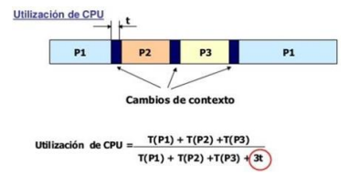
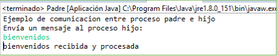

# Procesos

## Conceptos básicos

- El sistema operativo es un conjunto de programas que gestiona los recursos de hardware del ordenador y hace de intermediario entre las aplicaciones y los usuarios.
- Programa es un conjunto de instrucciones de código escritas en un determinado lenguaje de programación para solucionar una determinada tarea o necesidad.
- Proceso es una instancia de un programa en ejecución. El proceso necesita también otros recursos como el contador de instrucciones, el contenido de los registros y un espacio de memoria.
- Ejecutable es un fichero que contiene instrucciones en un determinado código y permite crear el proceso asociado a ese programa.
- Demonio es un proceso no interactivo controlado por el sistema operativo que se ejecuta en segundo plano y no dispone de una interfaz directa con el usuario. Como ejemplo podemos indicar el cron que realiza tareas programadas de mantenimiento del sistema en segundo plano.
- Sistema monoprocesador y multiprocesador.

## Programación concurrente, paralela y distribuida

La programación concurrente es cuando se ejecutan en un mismo dispositivo diferentes procesos de forma simultánea. No quiere decir que se deben ejecutar al mismo tiempo, si se van intercalando procesos también se considera concurrencia.

En cambio, si el sistema tiene más de un procesador o un procesador con varios núcleos (cores) los procesos se pueden ejecutar de forma realmente simultánea, en este caso hablamos de programación paralela.

Los principales problemas de la programación paralela son la sincronización y comunicación de los procesos que se ejecutan para que su resultado sea correcto.

Dos procesos se necesitan sincronizar o comunicar cuando:

- Un proceso necesita un dato que está procesando el otro.
- Necesita esperar que finalice el otro proceso para poder continuar su ejecución.

La programación distribuida es un tipo de programación concurrente donde los procesos se ejecutan en varios ordenadores distribuidos en una red de comunicaciones. Cada uno de los equipos tendrá su procesador y su propia memoria. Como no existe memoria compartida, la comunicación entre los procesos para intercambiar datos o sincronizarse se realiza mediante mensajes que se envían a través de la red de comunicaciones que comparten.

La principal ventaja es que son sistemas muy escalables y de alta disponibilidad. Pero la desventaja más importante es que son complejos de sincronizar debido a que utilizan mensajes en una red de comunicaciones compartida.

## Planificación de procesos

La planificación de procesos es un conjunto de políticas que deciden en qué orden se van a ejecutar los procesos en el procesador siguiendo algunos criterios, entre los que podemos destacar:

- La prioridad del proceso.
- El tiempo de utilización de la CPU.
- El tiempo de respuesta del proceso.

El scheduler del núcleo del sistema operativo es el encargado de decidir qué proceso entra en el procesador.

Esta planificación puede dividirse en tres niveles:

- Planificación a largo plazo.
- Planificación a medio plazo.
- Planificación a corto plazo.

Algoritmos:

- Planificación sin desalojo o cooperativa.

Cambia cuando el proceso en ejecución se bloquea o termina:

- Planificación apropiativa → Se cambia cuando aparece otro proceso con mayor prioridad.
- Tiempo compartido → Todos los procesos tienen la misma prioridad y cada cierto tiempo (quantum) se cambia de proceso.

Entre los distintos algoritmos de planificación podemos destacar:

- **FIFO (First Input First Output)** o **FCFS (First Come First Served)**: Los procesos se ejecutan en el orden de llegada y los siguientes deberán esperar su turno.
- **SJF (Short Job First)**: Este algoritmo coge de los procesos en espera más cortos.
- **SRTF (Short Remaining Time First)**: De los procesos que están en espera escoge el que le queda menos tiempo para terminar.
- Algoritmo por prioridades: se asigna una prioridad a cada proceso en el momento de entrar en la CPU, siempre se ejecutarán los de mayor prioridad.
- **RR (Round Robin)**: Se asigna un tiempo o quantum a cada proceso, tras el cual abandona la CPU y da paso al siguiente proceso.


Se llama cambio de contexto a la operación de desalojar un proceso de la CPU para que empiece otro a ejecutarse. Esta operación debe realizarse con la mayor rapidez posible y almacenar la información sobre el estado del mismo, para que cuando vuelva al procesador continúe en el mismo punto y con los mismos valores en que se encontraba.

La información que se almacena al cambiar de contexto es:

- Estado del proceso
- Estado del procesador
- Información de gestión de memoria
- Los registros de la CPU
- La pila (stack)
- Los flags

Los cambios de contexto también se deben tener en cuenta al calcular el tiempo de utilización de la CPU.



Estados de un proceso:

- **Nuevo**: el proceso está siendo creado a partir del fichero ejecutable.
- **Listo**: el proceso no se encuentra en ejecución aunque está preparado para hacerlo. El sistema operativo no le ha asignado todavía un procesador para ejecutarse.
- **En ejecución**: el proceso se está ejecutando. El sistema operativo utiliza el mecanismo de interrupciones para controlar su ejecución.
- **Terminado**: el proceso ha finalizado su ejecución y libera sus datos de la memoria.
- **Bloqueado**: el proceso está bloqueado esperando que ocurra algún suceso. Cuando ocurre el evento que lo desbloquea, el proceso no pasa directamente a ejecución, sino que tiene que ser planificado de nuevo por el sistema.


## Gestión de procesos

Árbol de procesos


Para verlos desde la línea de comandos escribiremos la orden `tasklist` en el CMD. Con esta instrucción podemos ver también el PID, identificador del proceso.


En Linux disponemos de varias instrucciones para visualizar los procesos en ejecución:

- `ps` → Genera la lista de procesos.
- `ps –f` → Nos aparece también el PPID, el identificador del proceso padre.
- `pstree` → Nos muestra el árbol de procesos de todo el sistema.


## Creación de procesos

Clases `ProcessBuilder` y `Runtime` que con los métodos de `ProcessBuilder.start()` y `Runtime.exec()` crean un proceso nativo en el sistema operativo y devuelven un objeto de la clase `Process` que puede ser utilizada para controlar dicho proceso.

### La clase `ProcessBuilder`

Esta clase se usa para crear procesos del sistema operativo. Cada instancia de `ProcessBuilder` administra una colección de atributos de proceso. El método `start()` crea una nueva instancia de `Process` con esos atributos.

Los atributos son:

- Un comando, una lista de cadenas que indica el archivo de programa externo que se invocará y sus argumentos, si los hay.
- Un entorno, que es un mapeo dependiente del sistema de variables a valores.
- Un directorio de trabajo. El valor predeterminado es el directorio de trabajo actual del proceso actual, generalmente el directorio nombrado por la propiedad del sistema `user.dir`
- Una fuente de entrada estándar.
- Un destino para salida estándar y error estándar.

### La clase `Runtime`

El método `exec(cmdarray, envp, dir)` de `Runtime` ejecuta el comando especificado y los argumentos en `cmdarray` en un proceso hijo independiente con el entorno `envp` y el directorio de trabajo especificado en `dir`.

En el siguiente ejemplo vemos como se crea un proceso utilizando los métodos `start` de `ProcessBuilder` y el `exec` de Runtime.

```java
Process hijo = new ProcessBuilder("java", "-jar", "c:\\sources\\programa.jar").start();
String[] cmd2 = {"java", "-jar", "c:\\sources\\programa.jar"};
Process hijo = Runtime.getRuntime().exec(cmd2);
```

La diferencia entre las dos clases reside en la forma de enviar los argumentos. En la clase `Runtime` podemos enviar una sola cadena con todos los argumentos.

## Finalizar procesos

```java
public class RuntimeProcess {
	public static void main(String[] args) {
		Runtime objrun = Runtime.getRuntime();
		try {
			Process objProcess = objrun.exec("C:\\Program Files (x86)\\Dia\\bin\\Dia.exe");
			objProcess.destroy();
			System.out.println("Proceso destruido");
		} catch (Exception e) {
			System.out.println("Error executing program");
		}
	}
}
```

## Comunicación entre procesos

Cuando se ejecuta un programa desde java, su salida se redirige a nuestro programa en vez de a la pantalla. Esto es útil porque así podemos leer lo que proviene del programa externo y tratarlo.

Para leer lo que proviene del proceso hijo, debemos utilizar el objeto `Process` que nos devuelve el `Runtime.exec`. Con él podemos obtener la salida del programa, su salida de error e incluso enviarle datos como si se estuvieran tecleando.

Si queremos leer su salida, obtenemos un `InputStream` por medio del método `getInputStream()` y leemos en él. Puesto que un `InputStream` es algo incómodo para leer cadenas de texto, lo combinamos con el `BufferedReader` que dispone de un método `readLine()` que nos devuelve directamente una línea de texto en forma de String.

En Java, el proceso hijo no tiene su propia interfaz de comunicación, por lo que el usuario no puede comunicarse con él directamente. `stdin`, `stdout` y `stderr` están redirigidas al proceso padre a través de los flujos de datos:

- `OutputStream`: flujo de salida del proceso hijo.
- `InputStream`: flujo de entrada del proceso hijo.
- `ErrorStream`: flujo de error del proceso hijo.

Comunicación entre proceso padre e hijo. El proceso padre envía información y el proceso hijo la lee.

```java
PrintStream ps = new PrintStream(hijo.getOutputStream(), true);
ps.println(line);
```

El proceso hijo lee la información que recibe del proceso padre de la siguiente forma:

```java
BufferedReader br = new BufferedReader(new InputStreamReader(System.in));
datos = new String();
datos = br.readLine();
```

Comunicación entre proceso hijo y proceso padre. El proceso hijo envía información y el proceso padre la recibe.

El proceso hijo solo debe hacer un `println`.

```java
System.out.println("datos a enviar");
```

El proceso padre lee la línea que viene del proceso hijo utilizando un `BufferedReader` del `InputStream`.

```java
BufferedReader br = new BufferedReader(new InputStreamReader(hijo.getInputStream()));
datosRecibidos = br.readLine();
System.out.println(datosRecibidos);
```

Ejemplo de comunicación de dos procesos java. Padre e hijo. El padre envía un mensaje al hijo, este lo recibe y lo devuelve.

```java
import java.io.BufferedReader;
import java.io.IOException;
import java.io.InputStreamReader;

public class Hijo {
	public static void main(String[] args) {

		String lineaEnvio;

		try {
			BufferedReader br = new BufferedReader(new InputStreamReader(System.in));
			lineaEnvio = new String();
			lineaEnvio = br.readLine() + " recibida y procesada";
			System.out.println(lineaEnvio);
		} catch (IOException e) {
			System.out.println("Error: " + e.getMessage());
		}

	}
}

public class Padre {
	public static void main(String[] args) {

		String line;
	
		try {
			Process hijo = new ProcessBuilder("java", "-jar", "C:\\tempjava\\Hijo.jar").start();
			BufferedReader br = new BufferedReader(new InputStreamReader(hijo.getInputStream()));
			PrintStream ps = new PrintStream(hijo.getOutputStream(), true);
			BufferedReader in = new BufferedReader(new InputStreamReader(System.in));
			
			System.out.println("Ejemplo de comunicación entre proceso padre e hijo");
			System.out.println("Envía un mensaje al proceso hijo");
			
			line = in.readLine();
			ps.println(line);
			line = br.readLine();
			System.out.println(line);
		} catch (IOException e) {
			System.out.println("Error: " + e.getMessage());
		}

	}
}
```

