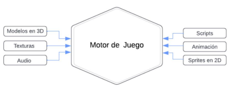
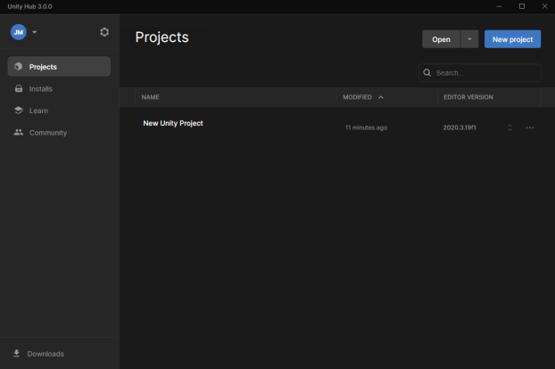

# Unity Hub

## ¿Qué es Unity?

### Descripción general

Unity empezó como un motor de juego, pero se convirtió en una herramienta creativa que se usa en diferentes industrias. Pero Unity todavía conserva sus raíces como motor de juego, y la historia sobre cómo y por qué se creó ayuda a entender su funcionamiento.

Si desconoces lo que significa el término motor de juego, no eres el único. Los motores de juego son un foco de debate constante en la industria de los juegos, pero pocas veces se explica qué son, algo que puede ser confuso para los usuarios nuevos y los creadores de otras industrias. Así que, para empezar, definamos lo que es un motor de juego.

### ¿Qué es un motor de juego?

El proceso de creación de un juego es mucho más complicado de lo que parece. La computadora o el dispositivo móvil en el que estás leyendo esto ejecutan un sistema operativo que le indica al dispositivo cómo llevar energía a la pantalla, cómo mantener la configuración del brillo según tus indicaciones, cómo iniciar y mantener el acceso a internet, y cómo mostrar el texto y las imágenes en la pantalla. También realiza mucho trabajo relacionado con las principales funciones de forma indirecta, como regular el acceso del dispositivo a su fuente de energía. ¡Es un arduo trabajo solamente para mostrar el texto!

Ahora piensa en la creación de contenido, en lugar de su lectura o visualización. Si alguna vez escribiste un correo electrónico, sabes que no necesitas entender personalmente el funcionamiento interno del programa de correo electrónico para escribir un mensaje. Todo ese trabajo ya está hecho y tú solo tienes que centrarte en crear el contenido del mensaje. Un motor de juego es exactamente lo mismo. 

Un motor de juego es el punto de convergencia de todos los aspectos de creación de un juego. Los juegos, como todas las aplicaciones, se crean con piezas más pequeñas, como modelos en 3D, Scripts y archivos de audio. Al combinarlos, crean la experiencia completa del usuario. Si los modelos en 3D, los Scripts y los archivos de audio fueran ingredientes, Unity (y otros motores de juego) serían la olla donde los mezclas.

Un motor de juego es el punto de convergencia de todos los componentes necesarios para crear un juego.

Al igual que el sistema operativo que te permite leer este tutorial, los motores de juego garantizan que tu juego se muestre en la pantalla, que los objetos puedan interactuar con otros objetos, que los sonidos sean audibles y que tu aplicación se publique en un formato que tu dispositivo pueda ejecutar. Tú aportas el contenido y el motor de juego proporciona las herramientas para implementarlo en un entorno que funcione.

### ¿Qué haces en un motor de juego?

Ahora que tienes una idea básica de lo que es un motor de juego, veamos más información sobre qué hacen los creadores en él. Si un motor de juego se usa para implementar el contenido que aportas, ¿cuál es ese contenido?

En un motor de juego, el creador combina todo lo que el usuario experimentará en el producto final. Si ese producto es un juego, el creador diseña la jugabilidad, como saltar en plataformas. Si se trata de una animación, el creador idea la acción que se graba. Si es una visualización arquitectónica de VR, el creador desarrolla un entorno fotorrealista por el que el usuario se moverá. El motor de juego también proporciona al creador un medio para convertir su producto en una experiencia interactiva para el usuario. El trabajo de Unity va mucho más allá, de modo que tú, el creador, solo tengas que centrarte en lo más importante: la experiencia del usuario.

### ¿Qué no haces en un motor de juego?

Dentro de un motor de juego, no tienes que crear los recursos (los objetos y sonidos que son los bloques de creación de la experiencia interactiva). Los recursos se crean en programas externos especializados llamados herramientas de creación de contenidos digitales (Digital Content Creation, DCC). Muchas DCC se integran con Unity para facilitar el proceso de importación de estos recursos.

Los tipos más comunes de herramientas de DCC que se usan en el desarrollo en tiempo real incluyen:

- DCC en 3D: programas para crear modelos, entornos y personajes animados en 3D.
    - Ejemplos: Maya, ZBrush y Blender.
- DCC en 2D: programas para crear imágenes, ilustraciones, texturas e interfaces en 2D.
    - Ejemplos: Photoshop, Illustrator, Substance Painter y Gimp.
- DCC de audio: programas para grabar, editar y mezclar efectos de sonido y música.
    - Ejemplos: Audition, Logic Pro, Reaper y Audacity.
- Entornos de desarrollo integrado (Integrated Development Environments, IDE): programas para programar en diferentes lenguajes.
    - Ejemplos: Visual Studio y Rider.
- Motores en tiempo real: programas para desarrollo, renderizado y publicación en tiempo real de aplicaciones o contenido en 3D.
    - Ejemplos: Unity y Unreal.

### La historia de Unity

- Empezó con un juego
    
    El primer producto lanzado por Unity Technologies no fue un motor de juego, sino un juego.
    
    En 2005, los fundadores de Unity, Joachim Ante, David Helgason y Nicholas Francis, lanzaron el videojuego GooBall para MacOS, un año después de la fundación de su empresa, que entonces se llamaba Over the Edge Entertainment. El juego se creó con un motor que desarrollaron de cero, con la intención de vender la licencia del motor a otros desarrolladores.
    
- ¿Cómo se creaban los juegos (antes de Unity)?
    
    Antes, la mayoría de las empresas de juegos creaban sus propios motores internamente para varios proyectos, en ocasiones, incluso, creaban uno nuevo para cada juego que desarrollaban. De este modo, podían crear un conjunto de herramientas que satisfacía sus necesidades especiales, pero a expensas de una mayor inversión de tiempo y dinero. Si bien el desarrollo de un juego podía darse en paralelo con la producción del motor, cualquier cambio importante en el concepto del juego podía terminar en una corrección del motor, lo que implicaba una demora para lanzar un producto vendible.
    
    La disponibilidad limitada de los motores preconstruidos era un gran problema para los desarrolladores independientes, de manera individual y en equipos pequeños. La creación de un motor de juego es un proceso extremadamente técnico y requiere de vasta experiencia en programación. A menos que los desarrolladores independientes tuvieran mucha experiencia en programación, no tenían otra opción que comprar la licencia de un motor, lo que a menudo era demasiado costoso. Por estas razones, antes de mediados de la década del 2000, el desarrollo de juegos por parte de personas independientes era mucho menos habitual que para sus contrapartes corporativas, y los juegos independientes exitosos eran inusuales.
    
- El nacimiento de un motor
    
    GooBall no fue un éxito, pero Unity lo sería. Ante, Francis y Helgason presentaron el motor de Unity en la Conferencia Mundial de Desarrolladores de Apple. La adopción inicial del motor fue lenta, pero pronto se extendió entre los desarrolladores independientes.
    
    Unity se lanzó al mercado a mediados de la década del 2000, cuando la industria de los juegos estaba comenzando a cambiar. Unity se posicionó exclusivamente como parte importante de la «revolución de los juegos independientes», como se le llamó. Tres factores fueron críticos para el éxito inicial de Unity: la incorporación de modelos de distribución digital seguros para los juegos, el enfoque en atraer a desarrolladores independientes y la compatibilidad con los primeros teléfonos inteligentes.
    
    La adopción de internet de alta velocidad estaba en auge cuando se lanzó Unity, lo que convirtió a la distribución digital de juegos en una opción viable por primera vez. Antes de ese momento, los desarrolladores independientes tenían muy pocas opciones de modelos de distribución para los juegos. Casi todos los juegos se vendían en tiendas minoristas, mediante acuerdos con editores importantes (los mismos grupos de quienes no querían depender los desarrolladores independientes). Con acceso más rápido a internet y la fácil disponibilidad del servicio, un usuario promedio podía descargar juegos alojados en el sitio web personal de un desarrollador o a través de tiendas en línea llamadas servicios de distribución digital, que empezaron a surgir en ese momento. Estos servicios administran el alojamiento, el procesamiento de ventas, la administración de los derechos digitales (en ocasiones) y, a menudo, también un componente social. Con estos servicios, los desarrolladores podían dedicar más tiempo a crear y mantener sus juegos, en lugar de encargarse de las ventas y la distribución. Si bien las ventas de juegos en tiendas minoristas seguían representando la mayor parte de las ventas de juegos a mediados de la década del 2000, un número cada vez mayor de consumidores empezaban a adoptar esta nueva forma de encontrar y jugar juegos. De repente, los desarrolladores independientes tuvieron acceso a su público.
    
    Cuando Unity se lanzó por primera vez, se diferenció de otros motores con licencia porque ofrecía precios que eran asequibles para los desarrolladores independientes. Unity también se enfocó en brindar una buena experiencia a los desarrolladores, algo que la mayoría de los motores con licencia pasaban por alto. Estos dos factores ayudaron a Unity a ganar terreno en la creciente comunidad de desarrollo independiente.
    
    Cuando el iPhone original abrió la App Store a aplicaciones de terceros, Unity fue una de las primeras herramientas en admitir la plataforma, lo que consolidó su posición en la explosión del mercado de los juegos móviles. Pronto más de la mitad de los juegos de la App Store se desarrollaban con Unity, una tendencia que continúa en la actualidad para los juegos móviles para iOS y Android.
    

### Próximos pasos

En algún momento, el principal valor de Unity era «democratizar el desarrollo de los juegos». Hoy simplemente es «democratizar el desarrollo», no para quitar el foco en los juegos, sino para abrir las puertas a muchas posibilidades más. Unity ha evolucionado de un motor de juego a un motor en tiempo real al agregar nuevas capacidades para desarrolladores de juegos, así como para animadores, ingenieros, diseñadores, instructores y comerciantes de muchas industrias.

- Ecosistema de aprendizaje de Unity
    
    Hay muchas opciones para aprender. Llamamos a todos los recursos el Ecosistema de aprendizaje de Unity.
    
    Además de la plataforma Unity Learn, el Ecosistema de aprendizaje de Unity incluye:
    
    - Grupo Unity Learners: un panel de mensajes dedicado a quienes están aprendiendo a usar Unity.
    - Microjuegos de Unity: experiencias guiadas diseñadas para que los usuarios nuevos trabajen en el Editor de manera rápida y simple. Aquí seguirás tutoriales incorporados en el Editor de Unity para entender mejor cómo funciona todo junto, y tomarás tus propias decisiones creativas y personalizarás tu juego al mismo tiempo.
    - Pestaña Learn en el Unity Hub: te brinda acceso a una variedad de recursos de aprendizaje que te ayudan a comenzar a usar Unity.
    - Documentos de Unity: el Manual de usuario de Unity (en inglés) y la referencia de la API de creación de scripts de Unity (en inglés) te ayudan a aprender a utilizar el editor de Unity y sus servicios asociados.
    - Respuestas de Unity (en inglés) o Foros de Unity (en inglés): aquí puedes realizar preguntas o buscar respuestas.
    - Canal de YouTube de Unity (en inglés): el canal oficial de YouTube con videos para aprender más sobre Unity, los tipos de proyectos creados con el motor, tutoriales, demostraciones y mucho más.
    - Blog de Unity: ofrece noticias, anuncios y una mirada dentro de Unity Technologies.
    - Tuesday Tips o Consejos de los martes (en inglés) de Unity en Twitter: todos los martes, los creadores comparten sus #unitytips favoritos.
    - Ayuda de la Tienda de recursos: ayuda para compartir contenido de la Tienda de recursos.

## Unity Hub

### Descripción general

El Unity Hub es una herramienta esencial para gestionar los proyectos que creas y las versiones en constante cambio del editor de Unity. En este tutorial, utilizarás el Hub para comenzar un nuevo proyecto y lo configurarás para las tareas que completarás en este trayecto. También verás las funciones importantes del Hub.

### Explorar el Unity Hub

El Hub reúne varios recursos y herramientas de Unity que te ayudarán a mantenerte organizado y actualizado. Abre el Unity Hub si todavía no lo has hecho. Verás el menú principal del Unity Hub. Observa rápidamente cada una de las pestañas que se describen a continuación.

Pestaña Projects

En Unity, trabajarás en múltiples proyectos, como cuando trabajas en varios documentos utilizando las aplicaciones de Office, o con múltiples imágenes utilizando software de gráficos. La pestaña (Projects) es donde crearás y a donde importarás nuevos proyectos, y donde gestionarás los existentes.

Pestaña Learn

La pestaña (Learn) es tu conexión instantánea con los recursos para aprender a usar Unity.

Pestaña Community

La pestaña (Community) es un recurso de referencia rápida que enumera varios lugares en los que puedes interactuar y conectarte con la comunidad más extensa de Unity.

Pestaña Installs

Instalarás nuevas versiones de Unity a medida que el motor evolucione. La pestaña (Installs) es donde gestionarás y configurarás estas instalaciones en el Hub.

Preferencias del Hub y configuración de la cuenta

Hay dos controles adicionales en la pantalla principal del Hub:

1. Al seleccionar la configuración (icono de engranaje), se abre la configuración de preferencias para Unity Hub.
2. Al seleccionar sus iniciales, se abre un menú de cuenta para su ID de Unity.

### Identificar las versiones de Unity

En el Editor de Unity, se realizan cambios y mejoras de manera habitual, y se lanzan varias versiones constantemente. En el Unity Hub, puedes administrar muchas versiones del Editor. Existen dos tipos diferentes de versiones de Unity:

- Versiones de soporte a largo plazo (LTS)
- Versiones de TECH Stream, incluidas las versiones alfa y beta

Como regla general, deberías usar la versión de LTS más reciente para tu proyecto de Unity.

En algunas circunstancias, quizás recomendemos usar una versión diferente, lo que incluye:

- Al usar funciones que solo están disponibles en una versión de TECH stream.
- Al unirse a un proyecto colaborativo que ya estuvo en progreso en una versión diferente.

Los números de versiones se forman con el año más un número de una versión anterior: 1, 2 o 3. Hay dos versiones de TECH stream por año (2021.1 y 2021.2) y una versión de soporte a largo plazo (2021.3 LTS).

Nota: En 2018 y 2019, hubo tres versiones de TECH stream y una versión de LTS.

En el Unity Hub, verás números de versiones con un número de compilación, como 2021.2.6f1. Las letras en el número de compilación indican lo siguiente:

- Alfa (a)
- Beta (b)
- Una posible versión final (rc)
- Una versión final (f)

### Agregar una instalación de Unity a tu Hub

La primera vez que instalaste Unity, tal vez se te indicó que instalaras la última versión de LTS. Habitualmente hay dos versiones de LTS disponibles al mismo tiempo. Como práctica, instala una versión de LTS adicional para que puedas ver cómo aparecen estas instalaciones en el Hub.

1. Ve a la pestaña Installs (Instalar). Verifica qué versión ya has instalado.
2. Selecciona Add (Agregar) y explora las Official Releases (Versiones oficiales) disponibles.
3. Selecciona una versión de LTS distinta de la que ya tienes e instálala.

### Agregar un módulo a tu instalación más reciente

Los módulos son componentes adicionales que puedes agregar a la instalación de una versión de Unity. Por lo general, estos son compatibles con varias plataformas, como Android o iOS, para las que puedes crear aplicaciones con Unity.

En este trayecto, crearás proyectos utilizando WebGL, que te permite publicar en la web aplicaciones que se pueden jugar. Vamos a agregar este módulo:

1. Abra Unity Hub y seleccione la pestaña Instalaciones.
2. Busca tu instalación de LTS más reciente y selecciona su ícono de tres puntos.
3. Selecciona Add Modules (Agregar módulos).
4. Desplázate por la lista hasta encontrar WebGL Build Support (Asistencia para crear WebGL) y selecciónalo.
5. Seleccione SIGUIENTE para continuar y agregue el módulo a su instalación.

### ¿Qué son los modelos?

Al usar Unity, es probable que crees muchos proyectos. El formato general, como 2D o 3D, y la tecnología que se requiere para alcanzar los estándares de rendimiento y calidad puede variar mucho en cada proyecto.

Los modelos (Templates) son proyectos de Unity «iniciales» con varios formatos, con configuraciones preseleccionadas y funciones basadas en prácticas recomendadas comunes. Algunos modelos hasta incluyen tutoriales y proyectos de muestra, como los modelos de microjuego que quizás hayas descubierto la primera vez que instalaste Unity.

Cada versión de Unity tiene su conjunto de modelos. Usarás estos modelos cada vez que crees un proyecto nuevo. Al aprender a usar Unity, descubrirás más información sobre los distintos tipos.

### Crear un proyecto nuevo

Ya estás listo para crear un proyecto nuevo usando una instalación y un modelo de Unity.

1. Vaya a la pestaña Proyectos.
2. Use el menú desplegable junto al botón NUEVO (New) para seleccionar la versión de Unity que tiene compatibilidad con la compilación WebGL.
3. En la pantalla siguiente, seleccione Plantilla 3D.
4. Asígnale a tu proyecto el nombre «Essentials 3D project».
5. Si quieres, cambia la ubicación de este proyecto, pero no hay problema si dejas la ubicación como está por ahora.
6. Selecciona CREATE (CREAR).