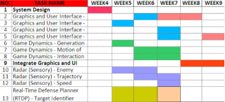

# Fases de desarrollo de videojuegos

## Fase de concepción

Todo comienza con una idea a partir de la cual se conformaran los aspectos fundamentales. Se determina el género o géneros del videojuego, como será el proceso de juego (game play), y también se constituye un guion gráfico (story board) en el que se tratan todo tipo de ideas preconcebidas que pueden ir adaptándose, come por ejemplo el estilo de los personajes, el ambiente, la música, etc. Una vez se sabe qué hacer entonces es el momento de diseñar.

## Fase de diseño

Se empieza definiendo los elementos que componen el juego. Se desarrolla la historia, se crean bocetos de guiones para determinar los objetivos, se deciden los personajes principales, el contexto, etc.

Utilizando estos esbozos de guiones, los artistas se ponen manos a la obra para crear conceptos del aspecto del juego, la forma en que se visualizaran los personajes, los escenarios, objetos, etc. Su trabajo es presentar propuestas visuales para ir dando forma a la idea original.

Todo lo anterior tendrá como objetivo generar el Documento de Diseño que especificará el desarrollo del arte, las mecánicas y la programación del videojuego.

También se describen los elementos sonoros de los que consta el juego: efectos de sonidos, ambientación, música, voces, etc. Aunque todavía no se compone ni se graba nada.

Paralelamente, se especifica el funcionamiento general del videojuego, algo que depende del género, ya que señalan la forma en que las entidades virtuales interactúan dentro del juego.

Finalmente, con una idea algo más clara del rumbo que tomara el juego, se hace el diseño de la programación que describe la manera en la que se implementara el videojuego, el lenguaje o lenguajes de programación que se utilizarán, las metodologías que se seguirán, etc.

## Fase de planificación

Esta etapa tiene como objetivo identificar las diferentes tareas para desarrollar el videojuego. Se reparte el trabajo entre los distintos componentes del equipo de desarrollo, se fijan plazos de entregas, se planifican reuniones de seguimientos, etc.

## Fase de producción

Una vez se tiene claro lo que hay que hacer, como hacerlo, y se ha planificado el tiempo para llevarlo a cabo, entonces se empieza la producción con el objetivo de crear el juego, como mínimo en una versión inicial o prototipo a mejorar gradualmente.

Se llevan por tanto a cabo todas las tareas de la fase de planificación teniendo como guía el documento de diseño: programación, ilustración, desarrollo de interfaces, animación, modelado, desarrollo del sonido, etc.

Si finalmente se logra ensamblar correctamente todas las piezas, entonces esta fase culmina (por ahora). Sin embargo, al igual que en el desarrollo de software tradicional, es muy difícil que todo salga bien a la primera, por lo que se entra en una fase para probar a fondo el videojuego.

## Fase de pruebas

En esta etapa se corrigen los errores del proceso de programación y se mejora la jugabilidad a medida que se prueba el juego.

Generalmente, encontraremos dos tipos: las pruebas alpha, realizadas por un pequeño grupo de personas, generalmente involucradas en el desarrollo, y las pruebas beta, realizadas por un equipo externo de jugadores. Las primeras tienen el objetivo de corregir defectos graves y mejorar características fundamentales no contempladas en el documento de diseño, mientras que las segundas se enfocan en detectar fallos menores y perfilar la experiencia de usuario.

## Fase de distribución/marketing

En cuanto a la distribución, es el proceso de crear las copias del juego ya finalizado y llevarlo a las tiendas (ya sean físicas o digitales) para que los jugadores puedan comprarlo o hacerse con él.

Por otro lado, el marketing es también fundamental para dar a conocer el videojuego y conseguir el mayor número de jugadores posibles. No tiene un orden concreto dentro del desarrollo, pues algunas empresas empiezan a hacer campaña de sus videojuegos meses e incluso años antes de publicarlos.

La verdad es que depende de los recursos que los desarrolladores quieran destinar a promocionar la obra y no tiene por qué ser un departamento dentro de la propia empresa, sino que tanto la distribución como el marketing se pueden delegar a empresas externas especialistas en estas áreas.

Vale la pena comentar el fenómeno “hype”, que ocurre cuando una empresa hace uso de una excesiva publicidad para dar a conocer su producto, creando incluso una necesidad inexistente en los potenciales consumidores. Lo malo ocurre cuando el producto no está a la altura de lo prometido y entonces se convierte en el blanco de multitud de críticas en muy poco tiempo, algo que puede perjudicar gravemente la imagen de los creadores.

## Fase de mantenimiento

Pese a que el juego este finalizado y en las manos de los jugadores, su ciclo de vida aun está lejos de terminar. La fase de mantenimiento es el momento de arreglar nuevos errores, mejorarlo, etc. Esto se hace sacando parches o actualizaciones al mercado.

Sin embargo, es también una oportunidad para seguir sacándole partido. Ya sea en forma de microtransacciones, suscripciones, suscripciones de pago o incluso con expansiones completas que añaden nuevas características al videojuego sin modificar en profundidad el motor del mismo, digamos que sería más o menos como aprovechar al máximo la base inicial.