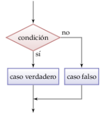
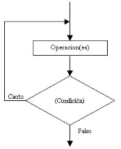
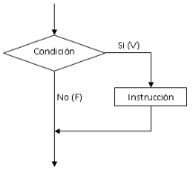

# Estructuras básicas de control

## Estructuras básicas de control

- Estructuras de selección
    
    Sentencias If, If…else.
    
    Sentencia Switch…Case
    
- Estructuras de repetición
    
    While
    
    Do_while
    
    For
    
- Estructuras de salto
    - Break
    - Continue

## Estructuras de selección

### Sentencias If, If…else

Normalmente, los algoritmos vienen definidos por instrucciones que se ejecutan de manera secuencial, primero una, después la siguiente y así sucesivamente. Sin embargo, en la mayoría de los casos, seguir un orden secuencial resulta imposible, pues ocurre que algunas sentencias se ejecutan acorde a una condición donde tenemos dos o más instrucciones a ejecutar, pero solo una de estas tendrá lugar según los criterios dados por la condición que se evalúan en este caso por las sentencias If.

- Ejemplos:
    1. Ejemplo simple
        
        
        
        
        ```java
        //Ejemplo seudocodigo
        import java.lang.*;
        
        public class Ejemplo1
        
        	public static void main(String[] args){
        	
        		if (condicion){
        			sentencia;
        		}
        
        	}
        
        }
        ```
        
    2. Suponiendo por ejemplo que estamos conduciendo un vehículo y llegamos a la altura de un semáforo. Si la luz del semáforo es roja nos detendremos, si es verde seguiríamos nuestro camino a la misma velocidad. Aquí se presentan dos alternativas: continuar con la marcha o frenar, dadas por la condición del estado de la luz del semáforo.
        
        Si `luzSemaforo=rojo`, entonces `velocidadVehiculo=0`
        
        ```java
        //Ejemplo seudocodigo
        import java.lang.*;
        
        public class Ejemplo2
        
        	public static void main(String[] args){
        		
        		String luzSemaforo=args[0];
        		int velocidadVehiculo;
        		
        		if (luzSemaforo.equals("rojo")){
        			velocidadVehiculo=0;
        		}
        
        		System.out.println(velodidadVehiculo);
        
        	}
        
        }
        ```
        
    3. Estamos ante dos alternativas. En este tipo de selección la condición toma un valor lógico de verdadero o falso. Se tienen que especificar las acciones que deben ocurrir si la condición es verdadera. Si la luz es verde, la condición no se cumple y la velocidad del vehículo se mantendría en 40. Opcionalmente se puede indicar que debe ocurrir si la condición es falsa.
        
        Si `luzSemaforo=rojo`, entonces `velocidadVehiculo=0`
        
        Si no `velocidadVehiculo=40`
        
        
        
        ```java
        //Ejemplo seudocodigo
        import java.lang.*;
        
        public class Ejemplo3
        
        	public static void main(String[] args){
        		
        		String luzSemaforo=args[0];
        		int velocidadVehiculo;
        		
        		if (luzSemaforo.equals("rojo")){
        			velocidadVehiculo=0;
        		}
        		else{
        			velodidadVehiculo=40;
        		}
        
        		System.out.println(velodidadVehiculo);
        
        	}
        
        }
        ```
        
    4. Si se requiere la evaluación de diferentes condiciones una detrás de otra, se utilizara la expresión else if. El programa evaluara la primera condición la cual se cumplirá si es verdadera, si no, seguirá y evaluara la segunda, si no, la tercera, así hasta n condiciones.
        
        
        
        Siguiendo el ejemplo del vehículo, pero añadiendo la luz ámbar como condición para detener el vehículo. En lenguaje java se escribiría el siguiente código:
        
        ```java
        //Ejemplo seudocodigo
        import java.lang.*;
        
        public class Ejemplo4
        
        	public static void main(String[] args){
        		
        		String luzSemaforo=args[0];
        		int velocidadVehiculo;
        		
        		if (luzSemaforo.equals("rojo")){
        			velocidadVehiculo=0;
        		}
        		else if (luzSemaforo.equals("ambar")){
        			velocidadVehiculo=0;
        		}
        		else{
        			velodidadVehiculo=40;
        		}
        
        		System.out.println(velodidadVehiculo);
        
        	}
        
        }
        ```
        
    5. Las estructuras de selección con operadores lógicos y de relación nos permiten simplificar la estructura del código en muchas ocasiones. Sin ellos nos veríamos en la necesidad de anidar las sentencias complicando la comprensión del código y haciéndolo más extenso.
        
        Ejemplo del caso anterior, si el semáforo esta en rojo o en ámbar, el vehículo debe parar.
        
        ```java
        //Ejemplo seudocodigo
        import java.lang.*;
        
        public class Ejemplo5
        
        	public static void main(String[] args){
        		
        		String luzSemaforo=args[0];
        		int velocidadVehiculo=40;
        		
        		if (luzSemaforo.equals("rojo") || luzSemaforo.equals("ambar")){
        			velocidadVehiculo=0;
        		}
        		else{
        			velodidadVehiculo=40;
        		}
        
        		System.out.println(velodidadVehiculo);
        
        	}
        
        }
        ```
        

### Sentencia Switch…case

En el caso de dos o más bloques alternativos se debe usar la sentencia de control switch. La sentencia Switch evalúa una expresión del tipo primitivo de datos (byte, short, char y int) o de la clase String y va comparando cada uno de los casos a ver cuál de ellos cumple la condición. En el caso de que uno de ellos sea verdadero, se ejecutan las sentencias del bloque hasta que se rompe su ejecución mediante la orden “break” o llegue al final de la sentencia switch. Si ninguna de los casos se cumpliera, se ejecutaría la opción por defecto en caso de existir, puesto que es opcional, o ninguna de ellas.


- Ejemplos:
    
    Switch de enteros
    
    ```java
    //Ejemplo seudocodigo
    public class Ejemplo1 {
    
    	public static void main(String[] args){
    	
    		int valor=4;
    
    		switch(valor=4) {
    			
    			case 1:
    				//Operaciones a realizar si valor==1
    				break;
    
    			case 2:			
    				//Operaciones a realizar si valor==2
    				break;
    		
    			case 3:
    				//Operaciones a realizar si valor==3
    				break;
    		
    			case 4:
    				//Operaciones a realizar si valor==4
    				break;
    
    			default:
    				//Operaciones a realizar si valor es distinto de 1 a 4
    
    		}
    		
    	}
    
    }
    ```
    
    Switch de String
    
    ```java
    //Ejemplo seudocodigo
    public class Ejemplo2 {
    
    	public static void main(String[] args){
    	
    		String valor="Martes";
    
    		switch(valor) {
    			
    			case "Lunes":
    				//Operaciones a realizar si valor es Lunes
    				break;
    
    			case "Martes":			
    				//Operaciones a realizar si valor es Martes
    				break;
    		
    			case "Miercoles":
    				//Operaciones a realizar si valor es Miercoles
    				break;
    		
    			case "Jueves":
    				//Operaciones a realizar si valor es Jueves
    				break;
    
    			case "Viernes":
    				//Operaciones a realizar si valor es Viernes
    				break;
    
    			default:
    				//Operaciones a realizar si valor es distinto de los anteriores
    
    		}
    
    	}
    
    }
    ```
    

## Estructuras de repeticion

Las estructuras de repetición o bucle nos permiten ejecutar un número de veces determinado una serie de instrucciones. La mayor utilidad es evitar la repetición de lineas de código iguales. Es frecuente que determinados cálculos requieran la ejecución repetitiva de un conjunto de sentencias, como por ejemplo, buscar un nombre en un fichero, leyendo secuencialmente linea a linea. Las estructuras repetitivas se ejecutan un número finito de veces, al principio o final de cada iteración se evalúa una condición la cual determina si ha de continuar o no la ejecución pasando a la siguiente o terminando el bucle.

Existen tres tipos principalmente: while, do-while y for.

| Estructura | Usar si |
| --- | --- |
| while | Usar si el bule se ejecuta 0 o mas veces. Es decir, si hay casos donde no se ejecute |
| do-while | Usar si la parte de ejecución del bucle se ha de hacer al menos una vez |
| for | Usar si se sabe el número de veces que se va a repetir el bucle
Usar si al utilizar la inicialización y la actualización del bucle permite escribir el código de forma más clara
Usar si se realiza un recorrido en una estructura de almacenamiento
Usar si la estructura de almacenamiento se va a recorrer completa realizando operaciones con sus valores, se utilizará la segunda versión de for |

### Sentencia While

Un ejemplo común de uso de este tipo de estructuras es la lectura de un fichero en donde la condición de continuidad es que no se ha llegado al final del fichero. De esta manera, si el fichero está vacío, ya no se cumple la condición desde el principio ahorrando tiempo de ejecución.



Importante destacar la necesidad de que si la condición se cumple, dentro del bucle debe existir alguna sentencia para que la condición en algún momento de la ejecución sea falsa, si no, entraríamos en un bucle infinito.

### Sentencia Do-While

A diferencia del while, el do while evalua la condicion al final del bucle, ejecutando el codigo que lo forma al menos una vez.


```java
//Ejemplo seudocodigo
public class Ejemplo1 {

	public static void main(String[] args){
	
		do{
			instrucciones;
		}
		while(condiciones);
				
	}

}
```

Usando el mismo ejemplo que con el while, el bucle do_while quedaría de la siguiente manera:

```java
//Ejemplo seudocodigo
import java.lang.*;

public class Ejemplo2 {

	public static void main(String[] args) {
	
		//se realiza el cast a Long para tratar numeros grandes
		long numero=Long.parseLong(args[0]);
		int digitos=0;

		do {
			numero/=10;
			digitos++;
		} while(numero>0);
		System.out.println(digitos);

	}

}
```

Como vemos la diferencia no es muy grande, salvo que en el while si el número fuese 0, el resultado seria 0, lo cual no es cierto, mientras que en do_while, al ejecutarse al menos una vez, dígitos se incrementa.

### Sentencia For

Hasta el momento, se ha visto casos de iteraciones donde el número de repeticiones eran desconocidas, finalizando mediante la evaluación de una condición utilizando las sentencias while y do_while. Ahora se estudiara con más detalle aquellos casos en donde se sabe de antemano cuantos ciclos se deben cumplir para terminar la ejecución.

Partes importantes dentro del bucle for:

- Inicialización: Se puede declarar e inicializar la variable entera que se usara de contador.
- Condición: Se determina el final del bucle evaluando una condición, como si un if se tratase.
- Actualización: línea dentro del bucle donde se incrementara o decrementa el valor del contador, puede ser de 1 en 1, 2 en 2 o de más valor en más valor (5 en 5, etc...).



| for( | inicializacion; | condicion; | pasos) |
| --- | --- | --- | --- |
|  | int | True o False | + o - |
- Ejemplos:
    
    ```java
    //Ejemplo seudocodigo
    import java.lang.*;
    
    public class Ejemplo1 {
    
    	public static void main(String[] args) {
    	
    		for(inicializacion; condicion fin; incremento) {
    			sentencias;
    		}
    
    	}
    
    }
    ```
    
    ```java
    //Ejemplo seudocodigo
    import java.lang.*;
    
    public class Ejemplo2 {
    
    	public static void main(String[] args) {
    	
    		for(int i=1; i<=10; i++) {
    			System.out.println(i);
    		}
    
    	}
    
    }
    ```
    
    También indicar que se pueden ejecutar bucles for anidados, es decir, uno dentro de otro. Su utilización es necesaria en el caso por ejemplo de recorrer matrices de dos dimensiones o interactuar con procesos que requieran el manejo de filas o columnas. Un ejemplo de bucle anidado seria:
    
    ```java
    //Ejemplo seudocodigo
    import java.lang.*;
    
    public class Ejemplo3 {
    
    	public static void main(String[] args) {
    	
    		for(int i=1; i<=10; i++) {
    			for(int j=1; j<=10; j++) {
    				System.out.println("Fila "+i+" Columna "+j);
    			}
    		}
    
    	}
    
    }
    ```
    

## Estructuras de salto

### Break

La instrucción break permite finalizar la ejecución de una sentencian de repetición for, while o do_while antes de que se completen las repeticiones o ciclos definidos en las condiciones.
Detrás de una sentencia break no se debe poner ninguna instrucción, pues no se ejecutara nunca. Si un break está dentro de un bucle que a su vez está dentro de otro bucle, romperá la ejecución del bucle donde está, pero no del otro.

Aquí el bucle imprimiría por pantalla los valores de i y j hasta llegar a ambos con valor 2, después, saltaría la ejecución volviendo al primer bucle cuando i=3 y empezando de nuevo de 1 a 3 con j, omitiendo la impresión o ejecución del paso en Fila 2 Columna 3.

```java
//Ejemplo seudocodigo
import java.lang.*;

public class Ejemplo1 {

	public static void main(String[] args) {
	
		for(int i=1; i<=3; i++) {
			for(int j=1; j<=3; j++) {
				System.out.println("Fila "+i+" Columna "+j);
				if(i==2&&j==2) {
					break;
				}
			}
		}

	}

}
```

### Continue

Esta instrucción se asemeja al antes mencionado break, con la particularidad de que a la hora de interrumpir una iteración, vuelve a evaluar la condición del bucle en lugar de salir por completo como hacia break.

En este pequeño fragmento de código, cuando la condición del if que compara si la división del valor de i entre 2 es cero (número par) se cumple, salta a la línea del for en lugar de imprimir. Si no se cumple imprimiría el valor, que en este ejemplo sería una lista de los números impares del 1 al 9.

```java
//Ejemplo seudocodigo
import java.lang.*;

public class Ejemplo1 {

	public static void main(String[] args) {
	
		for(int i=1; i<=10; i++) {
			if(i%2==0) {
				continue;
			}
			System.out.println(i);
		}

	}

}
```