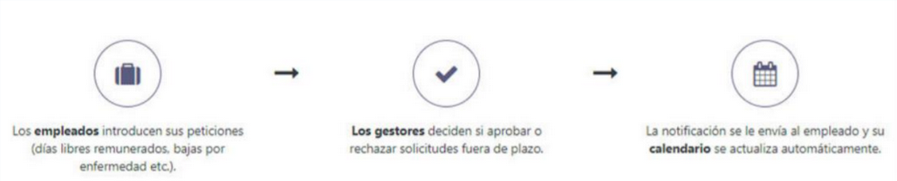
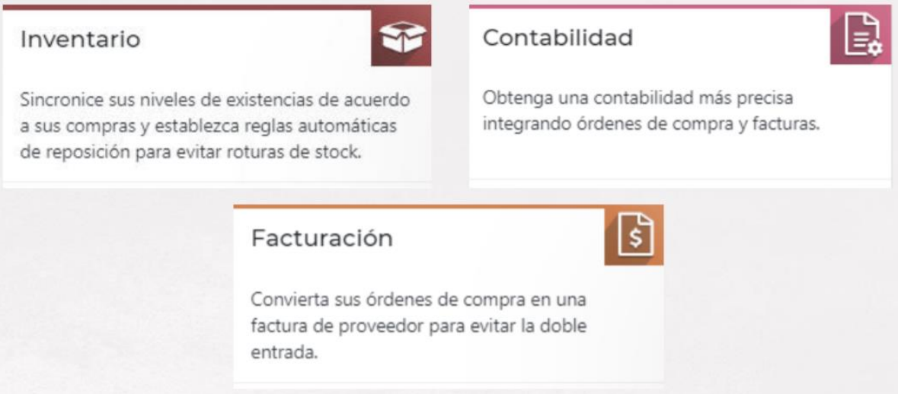
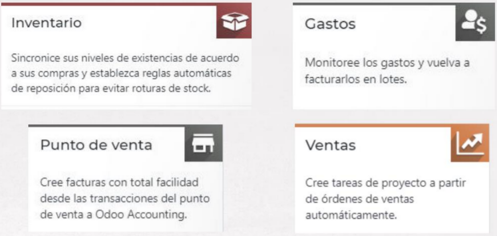
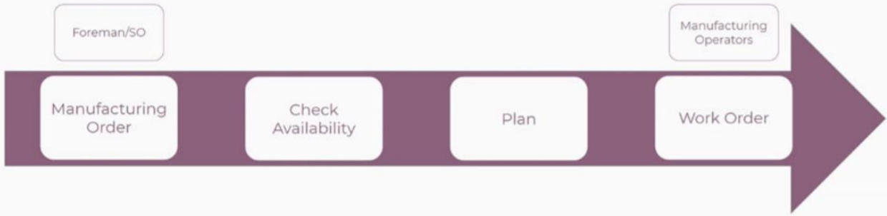

# Módulos de operaciones

## Módulo de inventario

- Gestión de almacenes
- Productos
- Stock
- Trazabilidad
- Informes

### Funciones avanzadas

### ¿Que haremos?

- Creación de un producto
- Reglas de abastecimiento
- Conexión con los módulos de Ventas, Compras y Web

## Módulo de recursos humanos

- Selección
- Evaluación
- Vacaciones
- Bajas
- Asignación
- Horas de trabajo
- Asistencias
- Evaluaciones
- Gastos

### Gestion de bajas

### Gestion de gastos

- Los empleados pueden presentar y justificar gastos
- Los gerentes pueden revisarlos y aprobar o rechazar solicitudes

### ¿Qué haremos?

- Creación de empleados
- Creación de departamentos y asociación con empleados
- Gestión de ausencias
- Gestión de gastos de los empleados

## Módulo de compra

- Órdenes de proveedores
- Órdenes de compra
- Reglas de contratación en función de los niveles de existencias
- Diferentes métodos de reposición
- Listas de precios del proveedor
- Disponibilidad del producto
- Estadísticas

### Integración

### ¿Qué haremos?

- Solicitud de presupuesto
- Pedido de compra
- Crear proveedores
- Facturas
- Informes

## Módulo de contabilidad

- Sincronización bancaria
- Facturación
- Gestión de facturas y gastos
- Facturas electrónicas y seguimiento automatizado
- Pagos en línea
- Recordatorios a deudores
- Informes de ganancias, hojas de balance o estados de flujo de efectivo

### Integración

### ¿Qué haremos?

- Gestionar cuentas bancarias
- Facturas de proveedor
- Facturas de cliente
- Pagos
- Informes

## Otros módulos interesantes de operaciones

### Proyectos

- Programación de trabajadores en distintos proyectos teniendo en cuenta las vacaciones de cada empleado
- Planificación con antelación de tareas para el futuro con previsiones basadas en datos comparables de proyectos pasados
- Comparación de previsiones con hojas de horas reales para aumentar la rentabilidad
- Flujo de trabajo
- Informes específicos

### Fabricación

- MRP (Manufacturing Resource Planning)
- Calidad
- Mantenimiento
- PLM (Product Lifecycle Management)

