# Repaso

### ¿Qué diferencia hay entre el modelo ER y el modelo ER extendido?

- El modelo ER extendido incluye patrones y estructuras más complejos que permiten representar la realidad de una forma más detallada. Estructuras como generalización y agregación.

### ¿Qué diferencia hay entre un atributo compuesto y uno multivaluado?

- Un atributo compuesto tiene varios atributos y uno multivaluado puede tener varios valores.

### Una tienda online permite que sus clientes tengan varias direcciones en su sistema para los envíos. ¿Cómo se hará la representación en el diagrama ER?

- La dirección es un atributo multivaluado en el sistema.

### ¿Por qué aumenta el coste de los cambios efectuados en un sistema de información a medida que pasa el tiempo y se completan más hitos?

- Porque a medida que pasa el tiempo los elementos del proyecto se relacionan entre sí, haciendo que la modificación de los mismos sea más costosa, al tener que modificar el elemento y todos los elementos relacionados.

### ¿Cómo se llama el patrón de diseño que define la dependencia o relación entre elementos en una aplicación?

- Acoplamiento.
- Que un método llame a otros métodos o que una clase tenga propiedades de otras clases.

### Dentro de un proceso de selección, el departamento de RR.HH. pide a sus empleados una recomendación para promocionar a otros empleados a un departamento de nueva creación. ¿Cómo modelarías la gestión de las recomendaciones de los empleados?

- Con una relación monaria en la que un varios recomendadores recomiendan a varios recomendados.

### Cada vez que un socio se incorpora a nuestra empresa aporta un capital de 10000 euros. En el sistema de gestión llevamos un registro tanto de los socios como del capital acumulado. ¿Qué tipo de modelado requerirá “el capital acumulado” y como se implementará?

- Los representas como un atributo derivado y lo implementas como un trigger.

### En una base de datos tenemos la información sobre los clientes de una empresa. ¿Cómo podemos facilitar las búsquedas por apellido?

- Con indexado con duplicados porque crea una tabla temporal ordenada por el campo indexado con duplicados, facilitando la búsqueda.

### ¿Cuáles son las repercusiones negativas del indexado con duplicados?

- Al insertar valores tiene que trabajar sobre dos tablas.

### Modela una relación de grado 2,5 entre alumnos y profesores.

- No existe esa relación.
- El grado de una relación es el número de entidades que se relacionan.

### ¿Que alternativa de modelado propones para dos conjuntos de entidades con una relación 1-1 en la que la segunda no tiene ningún atributo excepto la clave principal?

- Convertir el atributo del segundo conjunto de entidades en un atributo del primer conjunto de entidades.

### ¿En qué casos utilizarías una generalización total solapada? Pon un ejemplo.

- Cuando las entidades del conjunto superior pertenecen a una o varias del conjunto inferiores.

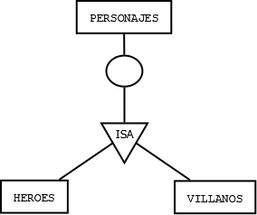

### ¿Qué papel tiene el diagrama ER en la comunicación entre desarrollador y cliente?

- Es una canal de comunicación entre el desarrollador y el cliente porque el desarrollador plasma la propuesta del cliente al modelo entidad relación.

### ¿Cuál es el motivo para modelar un atributo como un conjunto de entidades ya existente en un diagrama ER?

- No se puede, ya que el modelado sería incorrecto.

### ¿Cuántas entidades puede haber en un conjunto de entidades?

- Puede haber infinitas entidades.

### ¿Cómo se representa el tipo de dato en el diagrama entidad relación?

- No se representa el tipo de dato en el modelo entidad relación.

### En una relación N-1, ¿Cuántas entidades del primer conjunto se relacionan con cuantas entidades del segundo conjunto?

- Una entidad del primer conjunto se relaciona con una entidad del segundo conjunto.

### Lee la cardinalidad de la relación de tercer grado

- Una canción incluida en un álbum es de un artista
- Un álbum de un artista incluye varias canciones
- Un artista tiene una canción es incluida en varios álbumes

### ¿Cómo modelarías el siguiente sistema?

- En una biblioteca guardamos publicaciones. Solo disponemos de novelas, poemarios y libros de texto.
- De una publicación guardaremos su ISBN, número de páginas y editorial.
- De una novela queremos saber su género, del poemario, el nombre completo del autor (nombre, primer y segundo apellido) y de los libros de texto, los estudios a los que corresponde.
    
    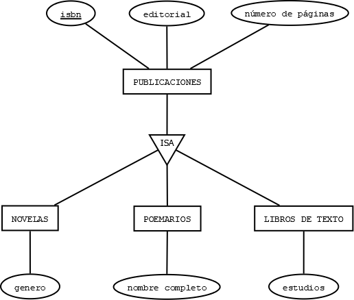
    

### ¿Qué elemento del modelado de datos nos asegura que el sistema va a funcionar como debe hacerlo?

- Las reglas de negocio.

### ¿Cómo podemos establecer una restricción de manera que un trabajador solo pueda ser asignado a departamentos ya existentes en su empresa?

- Con una clave foránea que haga referencia a la clave principal del departamento.

### ¿Para qué necesitamos establecer una cardinalidad máxima en las relaciones?

- Para saber cuantas entidades de los dos conjuntos se van a relacionar.

### ¿Qué diferencia hay entre un conjunto de entidades y un atributo?

- El conjunto de entidades tiene entidades (cosas únicas del mundo real) que tienen características (atributos).

### ¿En qué tipo de relación tenemos subentidades?

- En una relación ISA o generalización.

### ¿Cómo se representa un atributo multivaluado en ER?


### ¿Cómo se representa un atributo derivado en ER?

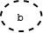

### ¿Cómo se representa un atributo compuesto en ER?

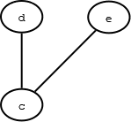

### ¿Qué define una entidad débil?

- Lo define el conjunto de entidades fuerte, uniendo la clave débil con el discriminante.

### ¿Cómo se representa la relación que identifica a una entidad débil?

- Con un rombo de doble línea.

### ¿Cómo se representa un discriminante?

- Con un subrayado discontinuo.

### Ordena según el nivel de abstracción de mayor a menor (Diagrama ER, diagrama relacional y código SQL)

1. Diagrama ER
2. Diagrama relacional
3. Código SQL

### ¿A qué paradigma de programación pertenece SQL?

- Declarativo, porque se centra en el que se quiere obtener.

### ¿Qué tipo de clave repercute en el rendimiento de las consultas de inserción? ¿Cómo lo hace?

- El indexado con duplicados porque al insertar un valor, el valor se insertara en las dos tablas.

### ¿Qué tipo de clave preserva la integridad referencial de la base de datos?

- La foreign key.

### Una página web requiere que cada cliente solo tenga una dirección, ¿con qué tipo de clave podemos implementar esta restricción?

- Con la unique key.

### ¿Cuántas tuplas tiene la tabla?

| id | nombre | edad | requerido |
| --- | --- | --- | --- |
| 1 | Juan | 23 | No |
| 2 | Marcos | 22 | SI |
- 2 tuplas.

### ¿Cuántos campos tiene la tabla?

| id | nombre | edad | requerido |
| --- | --- | --- | --- |
| 1 | Juan | 23 | No |
| 2 | Marcos | 22 | SI |
- 4 campos.

### ¿De qué manera identifica una entidad la clave primaria?

- Unívocamente.

### ¿Puede una foreign key ser NULL? ¿Por qué? Pon un ejemplo

- Puede ser nula, porque el valor de la foreign key aún no este asignado.
- A un desarrollador se le asigna un departamento, hasta que no este asignado ese capo será null.

### ¿Cuál es el paso a tablas de un atributo multivaluado?

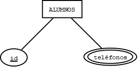

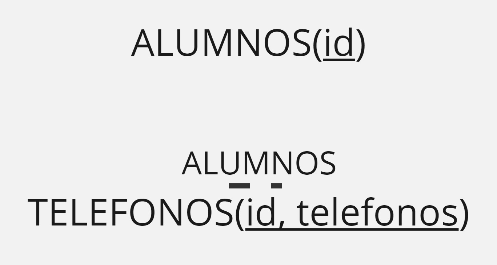

### El atributo NIF debe tener una longitud de 9 caracteres. ¿Cómo lo representamos en el diagrama relacional de la base de datos?

- No se puede representar en el diagrama relacional.

### ¿Cuál es el paso a tablas de una relación 1-N?

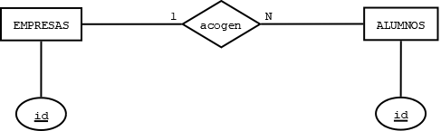

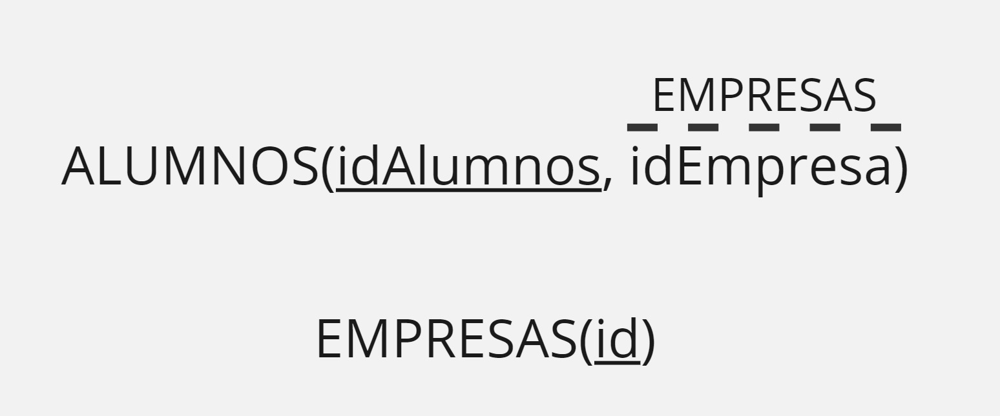

### ¿Cuál es el paso a tablas de un atributo compuesto?

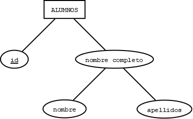


### ¿Cuál es el número máximo de veces que puede repetirse una tupla?

- No se puede repetir nunca, porque si no sería redundante.

### ¿Cuál es el número máximo de veces que se puede repetir un campo?

- Es posible, aunque en la práctica no se puede implementar.

### ¿Que papel tienen los roles en un diagrama relacional?

- Indican que función realiza cada uno de los participantes de la relación.

### Realiza el diagrama ER que corresponda a este diagrama relacional

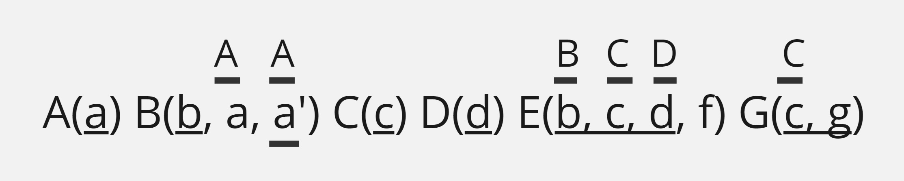

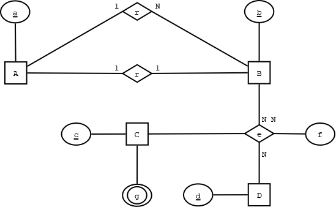

### ¿A qué equivale una relación (ER) en el modelo relacional?

- Depende de la cardinalidad de la relación, puede ser una relación, una foreign key o indexado sin duplicados.

### ¿Qué efecto tiene normalizar una relación?

- Que pasamos de una relación con clave principal de varios atributos a una relación con clave principal de un atributo.

### ¿Cuál es el paso a tablas de una relación N-N?

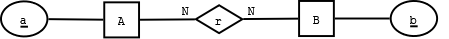

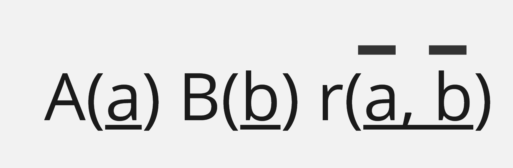

### ¿Cuál es el paso a tablas de una relación N-N-N?

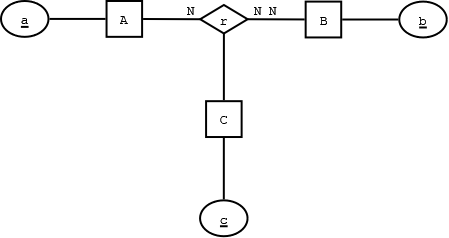

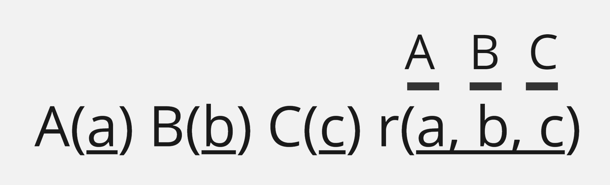

### ¿Con qué problemas podemos encontrarnos si al realizar un script de creación de tablas incluimos solo una sentencia para crear la base de datos y las sucesivas cláusulas para la creación de tabla?

- Con que si la base de datos ya existe dará error porque no podría crearla de nuevo.

### Corrige el siguiente código

```sql
CREATE TABLE gestball.jugadores(
	id int(11) DEFAULT NULL AUTO_INCREMENT,
	id_equipos int(11) NOT NULL,
	dni char(9) NOT NULL,
	nombre varchar(55) NOT NULL,
	apellidos varchar(55) NOT NULL,
	cod_licencia char(4) NOT NULL,
	fecha_licencia date NOT NULL,
	caducidad_licencia date NOT NULL,
	temporada char(9) NOT NULL,
	PRIMARY KEY(id)
);
```

### Corrige el siguiente código

```sql
CREATE TABLE gestball.jugadores(
	id int(11) NOT NULL AUTO_INCREMENT,
	id2 int(11) NOT NULL AUTO_INCREMENT,
	id_equipos int(11) NOT NULL,
	dni char(9) NOT NULL,
	nombre varchar(55) NOT NULL,
	apellidos varchar(55) NOT NULL,
	cod_licencia char(4) NOT NULL,
	fecha_licencia date NOT NULL,
	caducidad_licencia date NOT NULL,
	temporada char(9) NOT NULL,
	PRIMARY KEY(id)
);
```

### ¿Qué devuelve la siguiente consulta?

```sql
SELECT provincia, MAX(poblacion) FROM provincias GROUP BY autonomia;
```

- Devuelve la primera provincia y la máxima población de cada autonomía.

### ¿Qué devuelve la siguiente consulta?

```sql
SELECT provincia, COUNT(*) FROM provincias GROUP BY autonomia ORDER BY 2;
```

- Devuelve la primera provincia y el número de provincias de cada autonomía en orden ascendente por el número de provincias de cada autonomía.
- Se ordena por el campo que ocupa el lugar que está en la posición del número.

### ¿Qué devuelve la siguiente consulta?

```sql
SELECT provincia, COUNT(*) FROM provincias GROUP BY autonomia HAVING(COUNT) ORDER BY 1 LIMIT 1;
```

- Da error porque el argumento de having no es una condición.

### ¿Qué devuelve la siguiente consulta?

```sql
SELECT provincia, poblacion FROM provincias ORDER BY 2;
```

- Devuelve todas las provincias y poblaciones de las provincias ordenadas ascendentemente por la población.

### ¿Qué devuelve la siguiente consulta?

```sql
SELECT provincia
FROM provincias
WHERE autonomia = (
	SELECT * FROM provincias
	WHERE(poblacion > 100))
ORDER BY 1
LIMIT 1;
```

- La consulta da error porque intenta comparar un valor con una subconsulta que devuelve varios valores.

### ¿Para qué sirve la cláusula `CREATE OR REPLACE`?

- Sirve para crear una tabla o sobrescribirla si ya exista.

### ¿Qué restricción tiene implícita la operación de proyección en álgebra relacional?

- Que no admite duplicados.

### ¿Qué elementos deben aparecer en una operación de selección en álgebra relacional?

- El operador sigma minúscula y la condición a comprobar y el origen de los datos.

### ¿Qué operador de álgebra relacional comparte dos operaciones de SQL?

- El operador de selección (sigma minúscula) → `HAVING` y `WHERE`
- El operador de funciones de totales y agrupación → funciones de totales y `GROUP BY`

### ¿Qué tipo de operaciones no pueden representarse mediante álgebra relacional?

- Las operaciones de presentación de los datos.

### ¿En qué se parecen y en que se diferencian `INNER JOIN` y `UNION`?

- En `INNER JOIN` se unen varias tablas por un elemento en común, en `UNION`, las tablas se unen verticalmente y se eliminan los duplicados.

### ¿Puede realizarse `LEFT JOIN` y `RIGHT JOIN` para obtener el mismo resultado? ¿Cómo?

- Sí, cambiando el orden de los conjuntos que se relacionan.

### ¿Qué operación sobre conjuntos implementa `LEFT JOIN`?

- Resta de conjuntos.

### ¿Cómo podemos realizar una resta de conjuntos sin utilizar `LEFT JOIN`?

- Con `RIGHT JOIN` o `NOT IN`.

### ¿Es necesario que una base de datos tenga las foreign keys implementadas para operar con `INNER JOIN`? Razona tu respuesta.

- No es necesario, las tablas tienen que tener un campo en común, pero no es necesario que haya foreign key.

### Para maximizar la eficiencia de una consulta, ¿en qué orden realizaremos las operaciones?

1. FROM
2. JOIN
3. WHERE
4. GROUP BY
5. Funciones de totales
6. HAVING
7. SELECT
8. DISTINCT
9. ORDER BY
10. LIMIT

### ¿Para qué sirve la cláusula `LIMIT`?

- Para limitar el número de registros que quieres que devuelva la consulta.

### ¿Qué diferencia hay entre las cláusulas `WHERE` y `HAVING`?

- Es que `WHERE` compara una condición sobre datos no agrupados y `HAVING` compara datos agrupados.
- `WHERE` se ejecuta antes.

### ¿Cuál es la diferencia hay entre `WHERE` y `HAVING` respecto al origen de sus datos?

- El origen de los datos de `WHERE` no están agrupados y `HAVING` sí lo están.

### ¿Cuál es el mejor tipo de dato para representar un número de teléfono con prefijo internacional?

- Tipo `VARCHAR`.

### ¿Qué cláusulas de MySQL admiten alias?

- En el `SELECT` y en el `FROM`.
- `AS` define el alias.

### ¿Qué cláusula de MySQL no admite alias cuando se usan subconsultas?

- La cláusula `WHERE`.

### Si utilizamos una consulta como subconsulta, ¿qué debemos eliminar antes de utilizarla?

- El `;`.

### ¿Qué diferencia hay entre los tipos de datos bool y boolean?

- No hay diferencia, son `TINYINT` (0 o 1).

### ¿Qué función de MySQL utilizamos si queremos contar los bytes de un campo?

- La función `LENGTH()`.

### ¿Qué función de MySQL utilizamos si queremos contar los caracteres de un campo?

- La función `CHAR_LENGTH()`.

### ¿Cómo se hace el paso a tablas de un atributo derivado?

- Pasará a ser un atributo de la relación.

### ¿Qué elemento de una base de datos puede variar al utilizar el operador `DISTINCT`?

- Los registros duplicados.

### ¿Qué diferencia hay entre utilizar el operador `<>` y `BETWEEN`?

- `<>` es distinto de y `between` es entre un campo y otro.

### Si aprueban los alumnos que cumplan: (alumnos que estudian) OR (alumnos que no estudian) ¿Cuántos alumnos aprueban?

- Todos aprueban.

### ¿Qué diferencia a una función de totales del resto de las funciones de MySQL?

- Que las funciones de totales siempre devuelven un valor.

### ¿A qué fase del desarrollo pertenece el modelo entidad relación?

- A la fase de análisis.

### ¿A qué fase del desarrollo pertenece el modelo relacional?

- A la fase de diseño

### ¿A qué fase del desarrollo pertenece la creación de tablas?

- A la fase de implementación.

### ¿En qué fase del desarrollo se realiza la documentación?

- Durante todo el proceso de desarrollo.

### Nombra un tipo de base de datos no relacional

- MongoDB, NoSQL.

### ¿Qué ocurre si insertamos el valor `'Vargas, 65, 39010, Santander, Cantabria'` en un campo definido como varchar(30)?

- Se corta la cadena.

### Pon dos ejemplos de paso a tablas donde se incluya una unique key

- En las relaciones monarias y en las relaciones con cardinalidad 1-1.

### El modelo ER es un modelo de tipo lógico. ¿Verdadero o falso?

- Falso, el modelo lógico es el relacional estático.
- El modelo ER es conceptual y semántico.

### ¿Con qué operador de MySQL podemos utilizar comodines?

- Con `LIKE`.

### ¿Cómo accederías a las propiedades de una clase con encapsulamiento correcto?

- Es con el método `get`.

### ¿Cuál es el número máximo de propósitos de una clase con alta cohesión?

- Solo definirá un objeto.

### ¿Cómo afecta la cohesión en el diseño OO (Orientado a Objetos) a la mantenibilidad del software?

- Cuando la cohesión es alta, la mantenibilidad sube.

### ¿Qué grado de acoplamiento hace más costoso el mantenimiento de una aplicación? ¿Por qué?

- Alto acoplamiento, porque complica la modificación de partes individuales y aumenta el riesgo de errores.

### ¿Cómo afectará esto a la clase alumno?

- Complicaría las modificaciones, reduciría la reutilización y aumentaría el riesgo de errores en el desarrollo de software.

### El grado de interrelación entre las clases también es llamado…

- Acoplamiento.

### ¿Qué es un objeto?

- Una instancia de una clase.

### ¿Qué tienen en común un array, una pila y una cola?

- Todos son colecciones de datos.

### ¿Una pila es una cola?

- No.

### ¿Una pila es un `Arraylist`?

- No.

### ¿Qué operación usamos para obtener un elemento de una pila?

- Obtener → `pop`.
- Introducir → `push`.

### ¿Qué tipo de metodología es SCRUM?

- Metodología ágil.

### ¿Es PHP un lenguaje compilado o interpretado?

- Es un lenguaje interpretado.

### ¿Es PHP un lenguaje de back o de front?

- Es un lenguaje de backend.

### ¿Cómo se llama la característica de orientación a objetos por la que dos métodos con el mismo nombre pueden tener distintos comportamientos?

- Polimorfismo.

### ¿Es posible utilizar un mismo método `calcularArea` para calcular el área de un objeto de tipo `circulo` y de otro de tipo `cuadrado`?

- Sí, si está sobrecargado.

### ¿Es posible sobrecargar un constructor?

- Sí, porque puede haber constructor parametrizado, por defecto…

### ¿Qué diferencia hay entre un objeto y una clase?

- Un objeto es la instancia de una clase y una clase es la plantilla que representa un objeto de la vida real con características y comportamientos.

### Ordena de mayor a menor grado de abstracción: Java, ensamblador, máquina

1. Java
2. Ensamblador
3. Máquina

### ¿Qué método nos permite modificar el valor de una propiedad de una clase?

- El método `set`.

### ¿Qué modificador añadiremos a una clase para hacerlo accesible sin necesidad de instanciar un objeto?

- El modificador `static`.

### ¿Qué operador usaremos para utilizar un método sin necesidad de instanciar un objeto en PHP?

- Operador de resolución de ámbito `::`.

### ¿A qué elementos de la programación orientada a objetos se puede aplicar el concepto de modularidad?

- A las clases, paquetes, proyectos y métodos.

### ¿Para qué sirve la herencia?

- Para que las propiedades y los comportamientos de una clase se puedan usar en otras clases hijas.

### ¿Cómo se llaman las clases involucradas en una relación de herencia?

- Superclase y subclase.

### ¿Para qué utilizamos el operador `super`?

- Para acceder a los métodos y atributos de la clase padre.

### ¿Qué significa y que define MVC?

- Define un patrón de diseño. Modelo Vista Controlador.

### ¿Qué significa y que define un CRUD?

- Create, read, update, delete.
- Las operaciones básicas de gestión que se pueden ejecutar contra una base de datos.

### ¿Cuáles son las ventajas del MVC?

- Mejora la mantenibilidad.
- Los errores son fáciles de detectar.
- Menor coste de mantenimiento.
- Diferentes equipos pueden utilizar el mismo código.

### Representa a un usuario feliz en conjunto y las relaciones entre los elementos de MVC

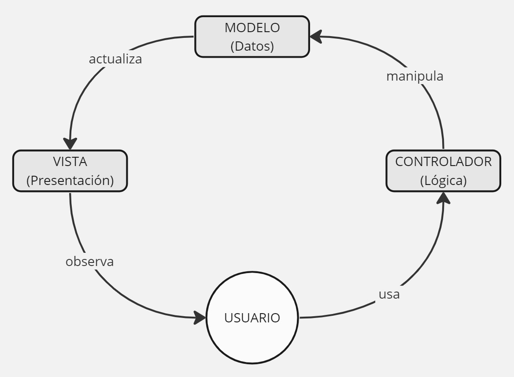

### ¿Dónde pueden encontrarse las reglas de negocio en el MVC?

- En el método rules dentro de los modelos.

### ¿Dónde pueden encontrarse la lógica de la aplicación en el MVC?

- En los controladores.

### ¿Dónde se encuentran las acciones disponibles para modificar el modelo en el MVC?

- En los controladores.

### ¿Qué capa del MVC se utiliza para visualizar los datos?

- La vista.

### ¿Qué método usamos en un controlador para mostrar los resultados en una vista?

- El método render.

### ¿Qué parámetro necesitamos pasarle al método render?

- El nombre de la vista.

### ¿De cuántas capas se compone el MVC?

- De tres capas.

### ¿Qué es Yii?

- Es un framework de PHP, basado en el MVC.

### ¿Qué es Bootstrap?

- Es un framework de frontend que contiene un conjunto de herramientas que ayudan a maquetar y estilizar la página.
- Está basado en HTML, CSS y JavaScript.

### ¿Qué es Gii?

- Una herramienta mágica de creación de código, como modelos y el CRUD.

### ¿Qué es Git?

- Una herramienta de control de versiones.

### ¿Qué es Active Record?

- Es un conector de bases de datos de tipo ORM (mapeo relacional).

### ¿Qué es un ORM?

- Es el mapeo relacional de la base de datos.

### ¿Cuál es el nivel de abstracción del ORM en comparación con DAO?

- ORM tiene un nivel de abstracción más alto porque no depende del lenguaje de programación.

### ¿Cuáles son los beneficios de utilizar Active Record en lugar DAO?

- Con active record te puedes abstraer.

### ¿Qué son `ActiveDataProvider` y `SQLDataProvider`? ¿Para qué pueden utilizarse?

- Son clases que se usan para hacer consultas con Active Record y DAO.

### ¿Qué son `GridView`, `ListView` y `DetailView`? ¿En qué se parecen y en qué se diferencian?

- Son clases (widgets de visualización) que necesitan un proveedor de datos y se diferencian en la forma de representar la información.

### ¿Cómo se llama este operador `::`?

- Operador de resolución de ámbito, sirve para acceder a métodos estáticos o constantes.

### ¿Qué es el layout y cuáles son sus características en Yii2?

- Es una vista de configuración del header y el footer.
- Renderizan los elementos que permanecen siempre visibles en la aplicación.

### ¿Cuáles son los pasos para configurar un proyecto básico de Yii que acabamos de crear?

1. Desde la carpeta config, cambiar el `dbname` por el nombre de la base de datos.
2. En el archivo `web.php`, descomentar de la línea 48 a la 55 y poner las opciones de enrutamiento a true.

### ¿Qué elementos forman una URL en Yii2 y cómo se representan?

- Se configuran como `url base/controlador/accion`
- Controlador: `SiteController` → `site`
- Acción: `actionIndex` → `index`

### ¿Qué clase de Yii nos ayuda a formatear enlaces e imágenes?

- HTML Helper.

### ¿Es aconsejable almacenar una imagen en una base de datos? ¿Por qué?

- Una imagen ocupa mucho espacio en la tabla, lo recomendable sería guardar el enlace.

### ¿Para qué se utiliza el método find en Yii2?

- Es un método estático que prepara una consulta desde el modelo en el que es instanciado.

### ¿Para qué se utiliza el método `andWhere()` en Yii2?

- Si quieres tener dos condiciones en un `where` unidas por el operador lógico `AND`, puedes utilizar primero el método `Where()` y luego `andWhere()`.
- También existe `orWhere()`.

### ¿De cuántas columnas está formado el grid básico de Bootstrap?

- 12 columnas.

### ¿Qué define la clase `btn` en Bootstrap?

- `btn` define que un vínculo es un botón.

### ¿De qué color es el botón `btn-info` en Bootstrap?

- `btn-info` es de color azul.

### ¿Qué versión de Bootstrap se usa en la aplicación base en su versión estable actual en Yii2?

- La versión 4.3 de Bootstrap.

### ¿Con qué clase podemos asignar a dos `divs` para que ocupen cada uno la mitad del contenedor con Bootstrap?

- Con la clase `col-md-6`.

### ¿En qué archivo de una aplicación de Yii2 se cargan las extensiones a utilizar?

- En el archivo `composer.json`.

### ¿En qué sección incluiremos las extensiones que queremos utilizar incluso después de terminar el desarrollo de una aplicación en Yii2?

- En la sección `require`.

### ¿Qué tenemos que tener en cuenta a la hora de nombrar una acción en Yii2?

- Se nombra escribiendo action y la primera letra del nombre va en mayúscula.

### ¿Dónde podemos cambiar la etiqueta que visualiza el nombre de un campo en Yii2?

- Dentro del modelo, en el método `atributeLabels`.

### ¿Qué operación se implementa automáticamente cuando mostramos en un `GridView` un campo perteneciente al modelo?

- Se implementa automáticamente la operación de ordenación, por ello no hace falta poner `ORDER BY` ni `LIMIT`.

### ¿Cómo solucionamos el error: `Class 'app\controllers\Ciclista' not found`?

- Escribiendo en la parte superior `use add\models\ciclista`.

### ¿Qué datos necesitamos dar a Gii para crear un CRUD necesariamente?

- El controlador y el modelo.

### ¿Qué tipo de widget de visualización utiliza la acción index generada para un CRUD por Gii por defecto?

- El widget `GridView`.

### ¿Qué tipo de widget de visualización utiliza la acción view generada para CRUD por Gii?

- El widget `DetailView`.

### ¿Cuántos parámetros utiliza el método index? ¿Cuáles son?

- No se le pasa ningún parámetro al método index.

### ¿Cuántos parámetros utiliza el método view? ¿Cuáles son?

- Se le pasa un solo parámetro, el registro que utiliza.

### ¿Qué devuelve `isGuest`? Pon un ejemplo de su uso la aplicación básica de Yii2

- Devuelve verdadero o falso en función de si el usuario está logueado o no.
- En Yii2 si el usuario está logueado se muestra el item de menu `Logout` y si no lo está muestra `Login`.

### ¿Qué estructura de datos utiliza Yii para almacenar su configuración?

- En arrays asociativos.

### ¿En qué archivo se configura la base de datos a explotar por una aplicación de Yii2 y donde se localiza dicho archivo?

- En el archivo `config\db.php`.
- El parámetro `dbname`.

### ¿En qué archivo se configura el idioma de una aplicación de Yii2 y dónde podemos encontrarlo?

- En el archivo `config\web.php`.

### ¿Dónde iremos a buscar la vista que renderiza la acción index del controlador provincias?

- En la ruta `views\provincias\`.

### ¿Pueden hacerse consultas con subconsultas en Yii2? Indica cómo

- Se pueden hacer, guardando el resultado de la subconsulta en una variable para usarlo posteriormente en la consulta final.

### ¿Pueden hacerse consultas con varias tablas en Yii2?

- Si se puede.

### Nombra un framework que trabaje con PHP sin que sea Yii ni Yii2 ni Yii3

- Laravel y Symfony.

### Nombra un framework que trabaje con Python

- Django y Flask.

### Nombra un framework que trabaje con HTML y CSS

- Bootstrap

### Nombro un framework que trabaje con Java

- Spring y Struts.

### ¿Qué ventajas tiene utilizar un framework para un proyecto de programación?

- Es más fácil de mantener y de desarrollar.
- Facilita el trabajo en grupo.

### Nombra un lenguaje que se base en el paradigma de orientación a objetos

- Python.

### Nombra un lenguaje que se base en el paradigma funcional

- Haskell.

### Nombra un lenguaje que se base en el paradigma lógico

- Prolog.

### Nombra un lenguaje que se base en el paradigma imperativo

- Java.

### Nombra un lenguaje que se base en el paradigma declarativo

- SQL.

### Nombre una diferencia entre el paradigma de programación imperativo y declarativo

- El paradigma imperativo se centra en la expresión del cómo (pasos para llegar al resultado).
- El paradigma declarativo se centra en la expresión del que (le indicamos el resultado al que queremos llegar sin indicar los pasos).

### ¿Qué formato tiene el operador condicional ternario?

- `condicion ? ejecutaSiTrue : ejecutaSiFalse`.

### ¿Es JavaScript un superconjunto o un subconjunto de TypeScript? ¿Por qué?

- JavaScript es un subconjunto de TypeScript porque TypeScript se basa en JavaScript.
- TypeScript es de tipado fuerte y JavaScript de tipado débil.

### ¿Qué caracteriza a un método abstracto?

- Los métodos abstractos se definen en la clase padre y se implementan en la clase hija.

### ¿Qué caracteriza a los métodos de una interfaz en programación?

- Que son abstractos.

### ¿Cómo se puede hacer una conversión de tipo de dato en un lenguaje fuertemente tipado?

- Mediante un casteo.

### ¿Qué significa que un lenguaje sea de tipado débil?

- Que no hace falta definir el tipo de dato de una variable.
- Como JavaScript o PHP.

### ¿Qué significa que un lenguaje sea de tipado fuerte?

- Que tienes que definir el tipo de dato de una variable.
- Como Java o TypeScript.

### ¿Qué significa que un lenguaje sea de tipado estático?

- Cuando se define la variable se define el tipo de dato.

### ¿Qué significa que un lenguaje sea de tipado dinámico?

- El tipo de dato no se define hasta la ejecución.

### Frameworks

- React, Angular, Vue, Boostrap, Yii2, Django, Rails, Laravel, Spring, Symfony, Yii1, Yii3, Flask, Gin, Next.JS, Struts, Astro, ASP.NET y Ionic.

### Lenguajes de programación

- JavaScript, Java, Python, Go, PHP, C, C++, C#, Prolog, Rust, F#, Lisp, Cobol, Fortran, Perl, Lua, Pascal, SQL, NoSQL y TypeScript.

### Sistemas Operativos

- Windows 10, Ubuntu Server, Debian, Windows XP, Windows 11, RedHat, KaliLinux, Zentyal, Windows Server 2019, PearOS, Android, Arch Linux, Windows Vista, Windows 7, ChromeOS, ParrotOS, Windows 8, Windows 95, Windows Server 2008 y Windows Server 2022.

### ¿Qué diferencia hay entre `⇒` y el `→` en PHP?

- `⇒` → Asignar valores a variables en arrays asociativas.
- `→` → Acceder a un método o propiedad de un objeto.

### ¿Diferencia entre `==` y `===`?

- `==` → Evalúa que dos valores sean iguales.
- `===` → Evalúa que dos valores sean iguales y que tengan el mismo tipo de dato.

### ¿Cuáles son los patrones de diseño?

- Alta cohesión y bajo acoplamiento.

### Nombra un framework de backend

- Ruby on Rails.