# Modelo relacional

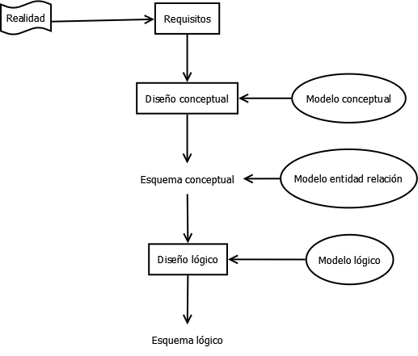

Diseño lógico:

- **Estático**: contempla aquellas propiedades del universo del discurso que son invariantes en el tiempo, es decir, su estructura. Nos genera el paso a tablas.
- **Dinámico**: relativa a las propiedades del universo del discurso que varían con el tiempo. Incluye las operaciones que se aplican a los datos o valores almacenados en las estructuras. Son las consultas.

## Modelo relacional estático

### Elementos

- Objetos (relaciones)
- Asociaciones entre objetos (interrelaciones)
- Propiedades o características de los objetos o asociaciones (atributos)
- Elementos no permitidos o restricciones: Limitaciones impuestas a la estructura del esquema o a los datos que invalidan ciertas ocurrencias de la base de datos (evitar redundancias: no permitir que dos tuplas de una tabla sean iguales)

| código | codAlumno | codAsignatura |
| --- | --- | --- |
| 1A | 1 | A |
| 2B | 2 | B |

- Relación (tabla)
- Tupla o registro(cada fila de la tabla)
- Atributo (cada columna de la tabla)

### Reglas

- No existen tuplas repetida (redundancias)
- Las tuplas no están ordenadas (de arriba hacia abajo)
- Los atributos no están ordenados (de izquierda a derecha)
- Los valores de un atributo deben ser atómicos, es decir, no es divisible en componentes. Por ello en el modelo relacional **no se permiten atributos compuestos ni multivaluados**
- Los atributos multivaluados se deben representar con relaciones individuales (en una tabla), y los atributos compuestos se representan únicamente mediante sus atributos componentes simples

### Ejemplo simple


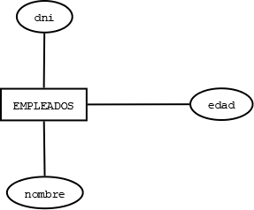

### Claves

Clave primaria (primary key): clave elegida por el diseñador de la base de datos como elemento principal para identificar las entidades dentro de un conjunto de entidades

- Ningún componente de la clave primaria de una relación puede en algún momento no tener valor (aceptar nulos)

Claves ajenas o claves foráneas (foreign keys): asociación de una relación a otra, mediante su clave, es decir, tendremos que un atributo de una relación es la clave principal de otra

- Se implementa la propiedad de integridad referencial en la base de datos
- Una clave foránea puede ser nula cuando no participa en una relación
    
    
    

Indexado sin duplicados (unique keys): impide que los valores de los atributos marcados de esa forma puedan repetirse, pero si admite valores nulos

Indexado con duplicados (index): crea una copia virtual de la tabla ordenándola por el valor indexado con duplicados, facilitando las búsquedas. El inconveniente es que a la hora de añadir nuevas tuplas va a ir más lento, ya que tiene que crear datos en dos tablas.

### Paso a tablas

- Relación binaria
    - Varios a varios
        
        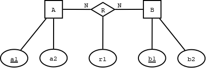
        
        
        
    - Uno a varios
        
        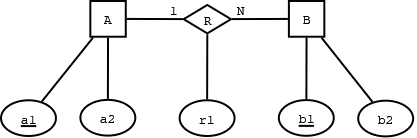
        
        La clave principal del lado 1 se propaga al lado N
        
        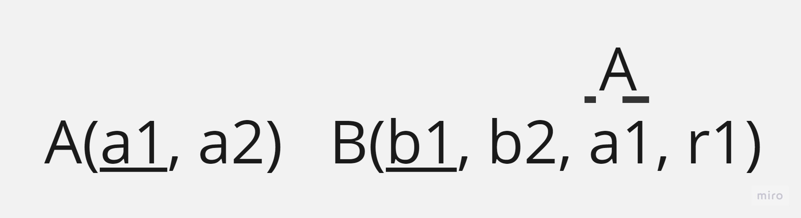
        
    - Uno a uno
        
        
        
        Opción 1:
        
        
        
        Opción 2:
        
        
        
- Relación reflexiva
    
    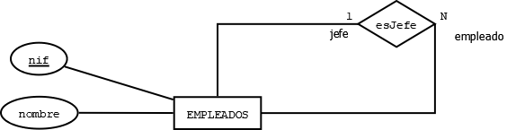
    
    
    
    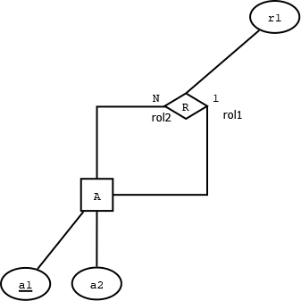
    
    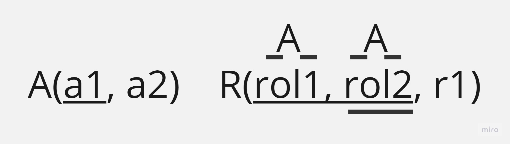
    
- Relación ternaria
    
    
    
    
    
    
    Por cada ‘1’ que haya, habrá un indexado sin duplicados.
    
    
    
    
    
    
    
    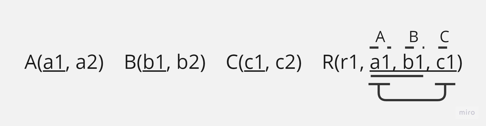
    
    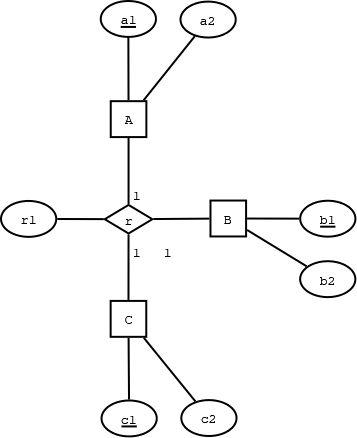
    
    
    
- Atributos multivaluados
    
    
    
    
    
    
    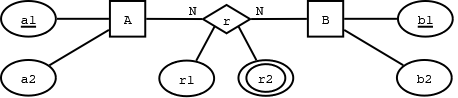
    
    
    
- Entidades débiles

    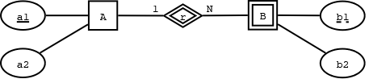
    
    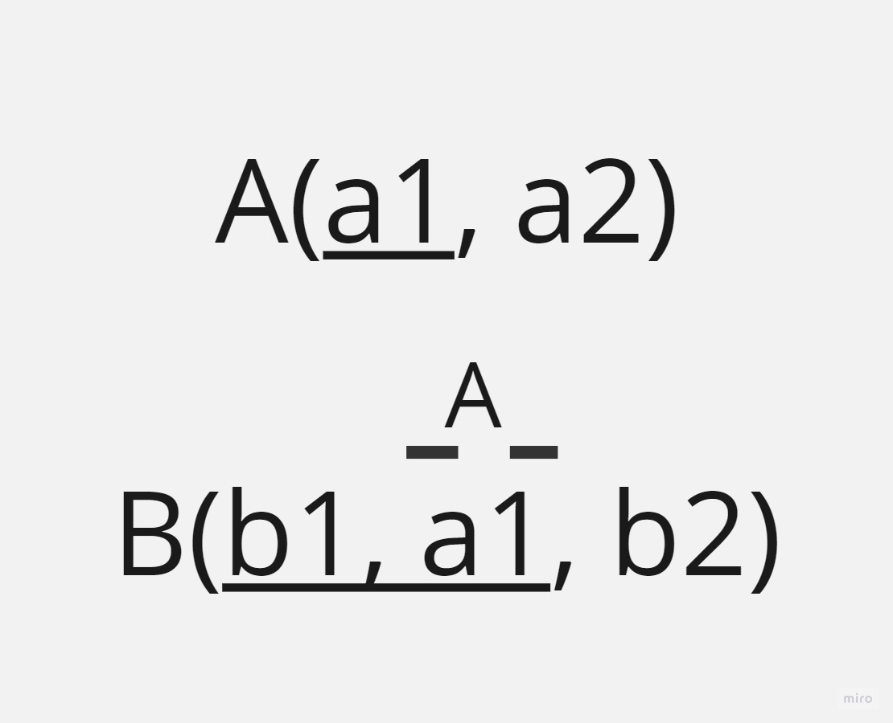
    
- Normalización
    
    Normalizar una relación es transformar una clave principal con varios atributos en un solo atributo inventándonos la clave principal, sustituyendo la anterior clave principal en clave única.
    
    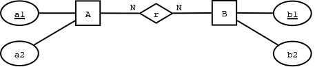
    
    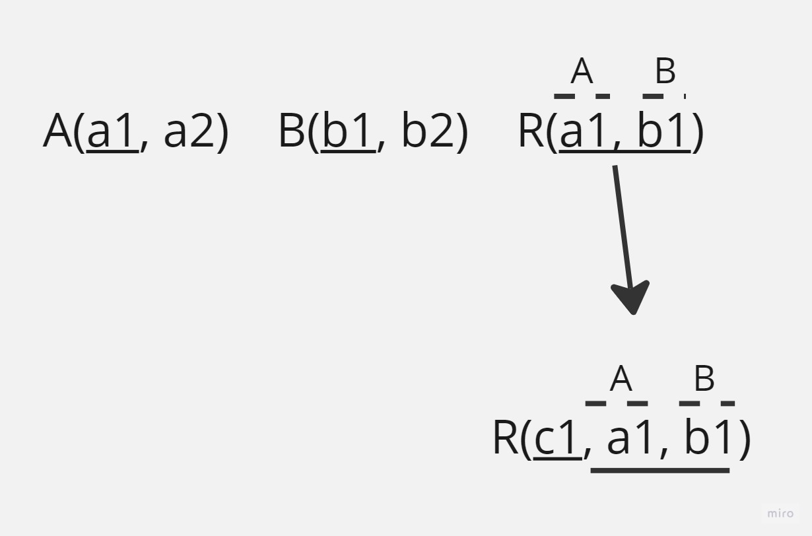
    

## Modelo relacional dinámico

La componente dinámica consta de un conjunto de operadores que se definen sobre la estructura del modelo de datos relacional.

Realizaremos una serie de operaciones sobre la base de datos:

- Selección → Read
- Creación → Create
- Actualización → Update
- Eliminación → Delete

### Ejemplo de script de creación de tablas

```sql
/* creación de la base de datos */

DROP DATABASE IF EXISTS proveedores;
CREATE DATABASE proveedores;

USE proveedores;

/* crear las tablas */

-- proveedores

CREATE OR REPLACE TABLE proveedores(
  nif varchar(9),
  nombre varchar(20),
  direccion varchar(50),
  PRIMARY KEY (nif)
);

-- productos

CREATE OR REPLACE TABLE productos(
  codigo varchar(10),
  nombre varchar(25),
  precio int,
  nif_proveedor varchar(9),
  PRIMARY KEY (codigo)
);

-- clientes

CREATE OR REPLACE TABLE clientes(
  dni varchar(9),
  nombre varchar(20),
  apellidos varchar (50),
  direccion varchar(50),
  f_nac date,
  PRIMARY KEY(dni)
);

-- compras

CREATE OR REPLACE TABLE compras(
  id int AUTO_INCREMENT, -- cuando un campo se tipifica como incremental SIEMPRE va a ser la clave principal
  cod_producto varchar(10), -- las claves ajenas tienen que ser del mismo tipo que los campos en la tabla donde están definidos
  dni_cliente varchar(9),
  PRIMARY KEY(id)
);

/** creación de las restricciones **/

ALTER TABLE productos
  ADD CONSTRAINT fk_productos_proveedores
  FOREIGN KEY (nif_proveedor)
  REFERENCES proveedores(nif);

ALTER TABLE compras
  ADD CONSTRAINT fk_compras_clientes
  FOREIGN KEY (dni_cliente)
  REFERENCES clientes(dni),

  ADD CONSTRAINT fk_compras_productos
  FOREIGN KEY (cod_producto)
  REFERENCES productos(codigo),

  ADD CONSTRAINT uk_producto_cliente
  UNIQUE KEY (cod_producto,dni_cliente);
```