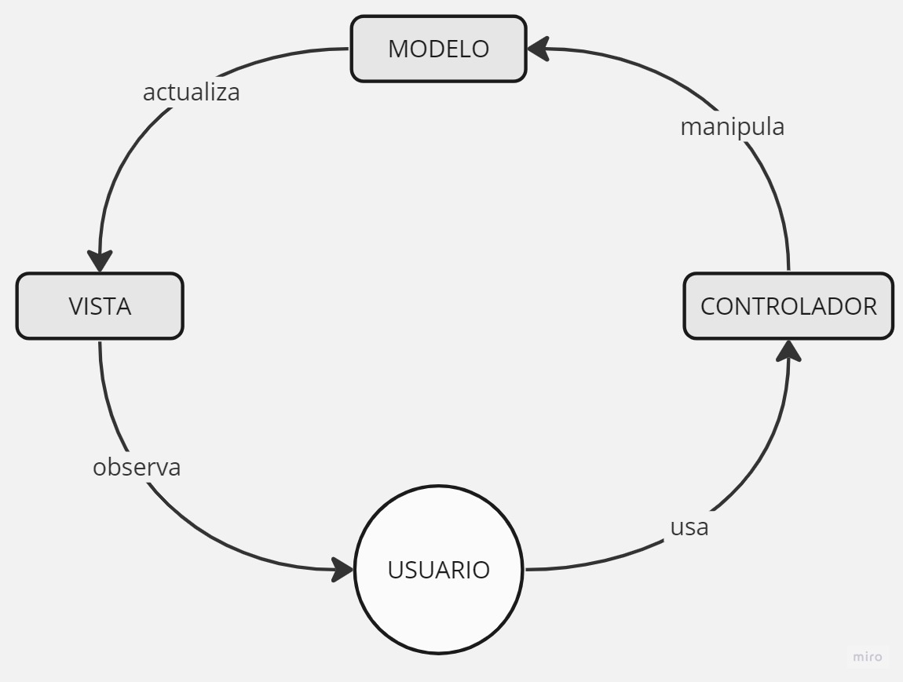

# Yii2

**MySQLi**: clase con la que se conecta una base de datos con la aplicación. Es dependiente del lenguaje de programación y de la tecnología de la base de datos.

**Modelo Vista Controlador (MVC)**: patrón en el diseño de software utilizado para implementar interfaces de usuario, datos y lógica de control.

- El controlador usa acciones (funcionalidad)
- El controlador lo compone la lógica
- El controlador manipula datos (modelo)
- Se representan en una vista (presentación de las operaciones de los datos)

**DAO (Data Access Object)**: provee de una serie de métodos para realizar las consultas.

- Depende del lenguaje (bajo nivel de abstracción)

**ORM (Object Relational Mapping)**: mapea la base de datos para convertirla en clases.

- Cada columna es una clase.

**Framework**: conjunto de reglas y convenciones que se usan para desarrollar software de manera más eficiente y rápida.

**Yii2**: es un framework en PHP.

- La carpeta `vendor` en la que está el núcleo de Yii2 (no se edita).

Las URL en Yii dan mucha información:

| URL Base | Controlador | Acción |
| --- | --- | --- |
| http:localhost/proyecto/index.php | /site | /index |
- Se puede devolver el renderizado de una vista: la acción termina lanzando la presentación de los datos.

Utilizar en PHP comillas simples y en SQL y HTML comillas dobles.

Active Record no depende del lenguaje (alto nivel de abstracción)

Operador de resolución de ámbito (`::`) → Permite acceder a contantes o funciones estáticas de un objeto.

Widgets de visualización:

- `GridView`: rejilla
- `ListView → ItemView`: permite maquetar los elementos que devuelve `DataProvider` de cualquier forma.
    - El conjunto se maqueta con `ListView`.
    - El contenido de cada registro se visualiza con `ItemView`.
- `DetailView`: visualizar un registro de la base de datos.