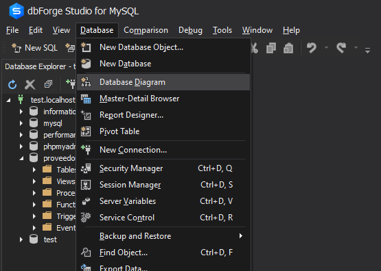
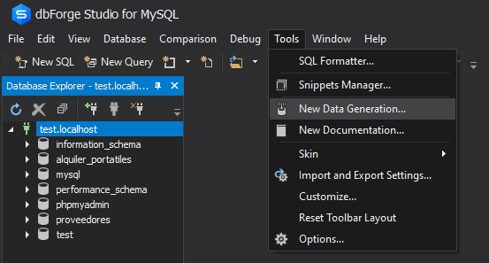
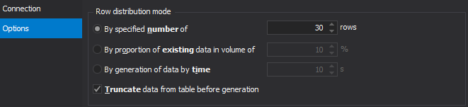
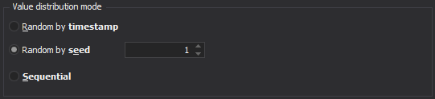
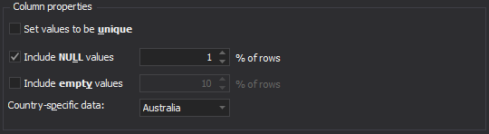
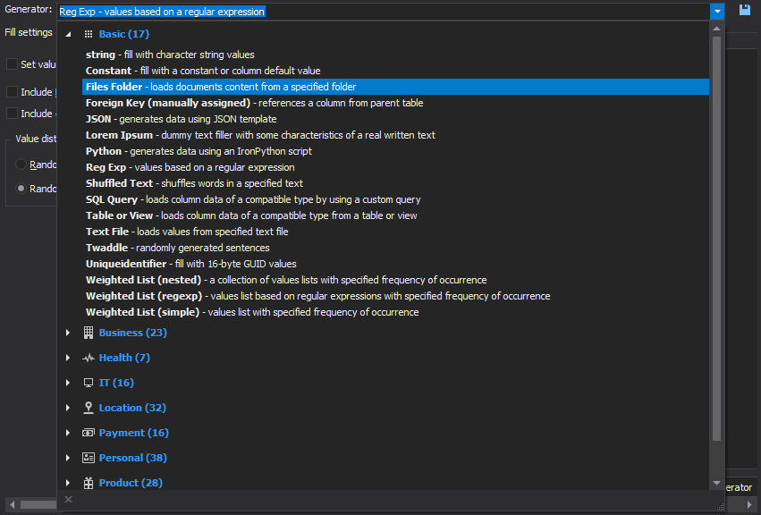
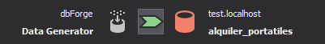
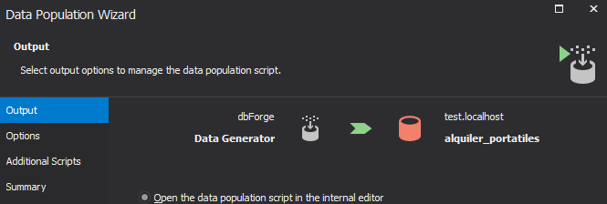
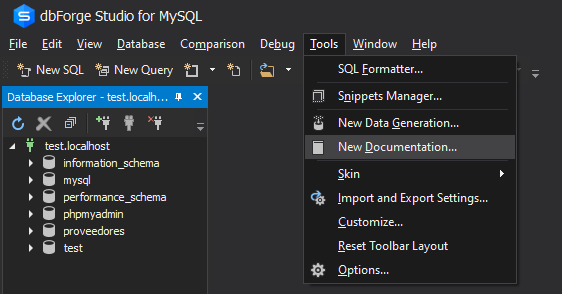

# dbForge

Antes de iniciar dbForge, activar los siguientes servicios en Xampp:

- MySQL
- Apache

Clic en una tabla de la base de datos → Ver la estructura de la tabla y scripts

### Crear diagrama automático

1. Database → Database diagram
    
    
    
2. Arrastrar la base de datos al fondo blanco
- Reorganizar la dirección de una línea: Clic derecho → Reroute
- Guardar diagrama: File → Save (extensión .dbd)

### Añadir registros

1. Tools → New Data Generation…
    
    
    
2. Database → Escoger la base de datos
3. Options:
    - Número de registros a añadir y truncate de los datos una vez generados
        
        
        
    - Distribución de los datos de forma secuencial o aleatoria
        
        
        
    - Incluir valores nulos, vacíos y seleccionar el país de los datos
        
        
        
4. Open
5. Marcar casilla de la base de datos
6. Cambiar el tipo de generación de un campo → Clic en Generator
    
    
    
    - Text File → Generar los valores definidos en un .txt

7. Clic en la flecha superior verde después de añadir los datos
    
    
    
8. Marcar opción de Abrir script en el editor de dbForge
    
    
    
9. Clic en Generate (si da error, deshabilitar las claves foráneas)

### Crear documentación

1. Tools → New Documentation…
    
    
    
2. Añadimos la conexión
3. Marcamos las tablas y la base de datos a documentar
4. Generate → Seleccionas el formato → Generate

### Crear backup

1. Clic derecho en la base de datos
2. Backup and restore → Backup Database…
3. Backup Content → Seleccionar estructura que se guardara en el Backup
4. Options → General script options → Include CREATE DATABASE statement
5. Clic al botón de Backup