# Consultas en SQL

## Álgebra relacional

El álgebra relacional es un lenguaje formal con una serie de operadores que trabajan sobre una o varias relaciones (tablas) para obtener otra relación resultado, sin que cambien las relaciones originales.

- El álgebra relacional se aplica en consultas de selección
- Nos devuelve otra tabla
- No se representa ni `ORDER BY` ni `LIMIT`
- Los conjuntos disjuntos no se pueden unir porque no tienen campos en común

## Operadores

### Primitivos

- Selección (Sigma minúscula → `σ`): selecciona tuplas que satisfacen una condición. Dicha condición puede tener: atributos, constantes, operadores de comparación (`<`, `>`, `<>`, `<=`, `>=`), operadores lógicos (AND → `^`, OR → `v`, NOT → `!`).
    - Representación → `σcondición (tabla)`
    - Selecciona consultas
    - `where` se utiliza para seleccionar datos sin agrupar y `having` se utiliza para seleccionar datos agrupados.
    - Ejemplos:
        
        
        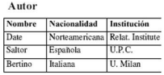
        
        `σnacionalidad='Española' (Autor)`
        
        ```sql
        SELECT * FROM Autor WHERE nacionalidad='Española';
        ```
        
        ---
        
        Dada la relacion R1, selecciona aquellas tuplas cuyo atributo A valga 1.
        
        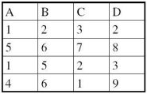
        
        ```sql
        σA=1 (R1)
        SELECT * FROM R1 WHERE A=1;
        ```
        
        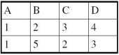
        
- Proyección (PI mayúscula → `Π`): es una operación unaria que devuelve una relación con las mismas tuplas que la relación dada pero con los atributos (y sus valores) incluidos en el predicado, eliminando los valores duplicados.
    - Representación → `Πcampos (tabla)`
    - Dado que las relaciones son conjuntos, se eliminan todas las filas duplicadas
    - La consulta con una proyección siempre tendrá un `DISTINCT`
    - Proyecta campos
    - Los campos proyectados no tienen porque estar relacionados
    - Ejemplos:
        
        
        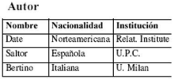
        
        `Πnacionalidad (Autor)`
        
        ```sql
        SELECT DISTINCT nacionalidad FROM Autor;
        ```
        
        ---
        
        Dada la relación R1, obten la proyeccion de los atributos b y c de R1
        
        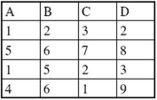
        
        ```sql
        Πb,c (R1)
        SELECT DISTINCT b, c FROM R1;
        ```
        
        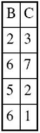
        

```sql
-- Nombre y edad de los alumnos de 2DAM
Πnombre,edad(σcurso='2DAM'(alumnos))
SELECT DISTINCT nombre,edad FROM alumnos WHERE curso='2DAM';
```

### Operadores de agrupamiento y funciones de totales

- Agrupamiento (G con cedilla → `Ģ`): permite reunir tuplas con valores comunes en subconjuntos, de manera que pueden aplicarse funciones de totales.
    - Representación → `camposAgrupadosĢ[campos] (tabla)`
    - Ejemplos
        
        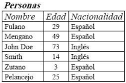
        
        ```sql
        NacionalidadĢ (Personas)
        SELECT * FROM Personas GROUP BY Nacionalidad;
        ```
        
        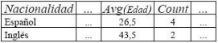
        
- Totales (G con cedilla → `Ģ`): toman una colección de valores y devuelven como resultado un único valor. Son funciones de totales: Suma, resta, promedio, máximo, mínimo, cuenta, primero y ultimo.
    - Representación → `[camposAgrupados]Ģ[campos,]funciónTotales(campos) (tabla)`
    - Ejemplos
        
        
        
        
        
        
        ```sql
        -- Total de personas
        Ģcount(nombre) (Personas)
        SELECT count(nombre) FROM Personas;
        
        -- Media de edad de las personas
        Ģavg(edad) (Personas)
        SELECT avg(edad) FROM Personas;
        ```
        

```sql
-- Media de edad de cada grupo de alumnos
nombreGrupoĢAVG(edad) (alumnos)
SELECT AVG(edad) FROM alumnos GROUP BY nombreGrupo;
```

### Orden en la ejecución de las instrucciones de SQL

1. `from`
2. `join`
3. `where`
4. `group by`
5. funciones de totales
6. `having`
7. `select`
8. `distinct`
    
    Presentación:
    
9. `order by`
10. `limit`

## Producto cartesiano y combinaciones

El producto cartesiano es la operación mas ineficiente (NO USAR).

Producto cartesiano (Aspa → `×`): permite combinar información de cuales quiera dos relaciones.

- Representación → `tabla1 x tabla2`
- Ejemplos
    
    Dadas las relaciones R1 y R2, obtener R1 x R2
    
    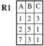
    
    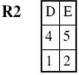
    
    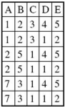
    

## Combinaciones

Suele resultar deseable simplificar ciertas consultas que exigen un producto cartesiano. Generalmente, las consultas que implican un producto cartesiano incluyen un operador selección sobre el resultado del producto cartesiano.

Inner join (Circulo con aspa → `⦻`): a la izquierda y derecha del operador se escriben las relaciones sobre las que se hace la operación. Como subíndice a la derecha del operador se escribe el campo o campos por los que se va a unir las tablas.

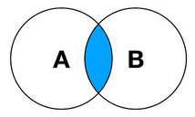

Representación → `tabla1 ⦻campo tabla2`

- Código (nombre igual de los campo) → `tabla1 t1 INNER JOIN tabla2 t2 USING(campo)`
- Código (nombre diferente de los campo) → `tabla1 t1 INNER JOIN tabla2 t2 ON t1.campo = t2.campo`
- Ejemplos
    
    
    Libro
    
    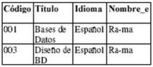
    
    Editorial
    
    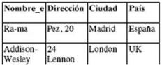
    
    `Libro ⦻ Editorial`
    
    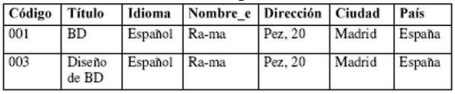
    
    `SELECT * FROM libro INNER JOIN editorial USING(nombre_e)`
    
    `SELECT * FROM libro l INNER JOIN editorial e ON l.nombre_e = e.nombre_e;`
    

## Otros tipos de combinaciones

Según la condición que necesitemos aplicar para combinar las relaciones utilizaremos un tipo de combinación u otra. Las combinaciones más comunes son: `INNER JOIN`, `LEFT JOIN` (seleccionando que un campo sea nulo) y `RIGHT JOIN` (seleccionando que un campo sea nulo).

Left join (Aspa con barra en la izquierda → `IX`): seleccionamos los campos de la tabla izquierda seleccionando que un campo sea nulo.

- Representación → `tabla1 IXcampo tabla2`

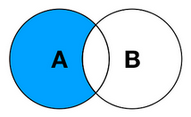

- Código (nombre igual de los campo) → `tabla1 t1 LEFT JOIN tabla2 t2 USING(campo) WHERE t2.campo IS NULL`
- Código (nombre diferente de los campo) →`tabla1 t1 LEFT JOIN tabla2 t2 ON t1.campo = t2.campo WHERE t2.campo IS NULL`

Right join (Aspa con barra en la derecha → `XI`): seleccionamos los campos de la tabla derecha seleccionando que un campo sea nulo.

- Representación → `tabla1 XIcampo tabla2`

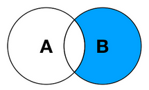

- Código (nombre igual de los campo) → `tabla1 t1 RIGHT JOIN tabla2 t2 USING(campo) WHERE t2.campo IS NULL`
- Código (nombre diferente de los campo) → `tabla1 t1 RIGHT JOIN tabla2 t2 ON t1.campo = t2.campo WHERE t2.campo IS NULL`

Natural join (Pajarita → `⋈`): une las tablas por todos los campos que tengan en común.

- Representación → `tabla1 ⋈ tabla2`
- Código → `tabla1 t1 NATURAL JOIN tabla2 t2`

Union (U → `∪`): une verticalmente dos tablas con campos relacionados.

- Representación → `consulta1 ∪ consulta2`
- Código (sin duplicados) →  `SELECT * FROM tabla1 UNION SELECT * FROM tabla2 t2`
- Código (con duplicados) → `SELECT * FROM tabla1 UNION ALL SELECT * FROM tabla2 t2`