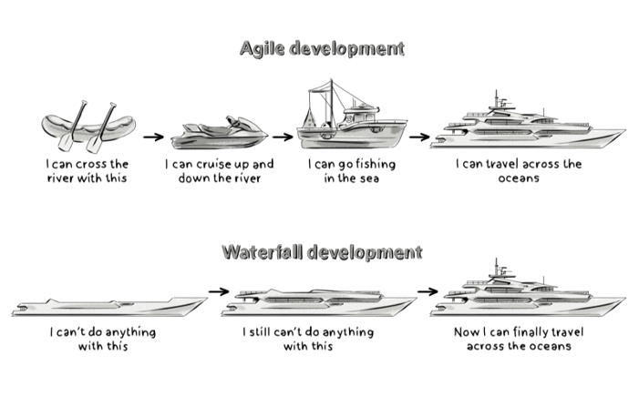
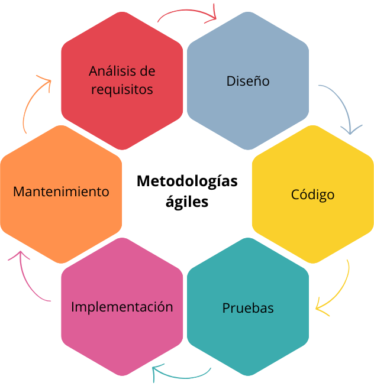

# Programación

## Estado actual del desarrollo de software

Problemas en el desarrollo de software:

- Falta de comunicación efectiva con los clientes
    - Hay que consensuar con el cliente aunque haya cambios de necesidades que provengan del usuario final.
- Falta de comunicación efectiva con el usuario final
- Requisitos no definidos
    - Van a fallar si fallan los dos puntos anteriores porque no hace lo que debería hacer.
- Requerimientos demasiado rígidos
    - El proyecto falla si no permitimos que haya modificaciones.
    - Hay que tener un grado de flexibilidad dentro de la redacción de los requisitos.
- Falta de planificación
    - Sin planificación, seguro que se va de tiempo y de costes y el proyecto va a fallar.
- Falta de pruebas
    - Tiene que dar tiempo a hacer pruebas formales.
- Falta de gestión del proyecto
    - Los superiores tienen que hacer un buen trabajo para que el proyecto no falle.
- Resistencia al cambio
    - Hay que adaptarse a los cambios.
- Alta rotación del personal
- Equipos con falta de diversidad
    - Tiene que haber diferentes perfiles en los equipos de trabajo, así el proyecto es más completo.
    - Que el equipo esté más equilibrado y tenga más logros.
- Falta de formación

## Metodología de desarrollo de software

### Metodologías en cascada

- Ideal si el proyecto es pequeño y hay pocos desarrolladores trabajando.
- Cuando aumenta el número de desarrolladores y el ámbito o áreas que van a estar dentro del proyecto es recomendable pasar a una metodología ágil.

Planificación → Análisis → Diseño → Implementación → Pruebas → Mantenimiento

### Metodologías ágiles

## Lenguajes más populares

- Python (Librerías)
- Java (Paradigma de orientación a objetos)
- JavaScript (Back/Front)
    - Versatilidad para trabajar en frontend y backend
- C y C++ (gaming-sistemas de acceso a memoria)
    - No hay orientación a objetos, es estructurado, imperativo
    - Da acceso directo a memoria donde se cargan las instrucciones (punteros → apuntan a la memoria)
    - Afecta al hardware del ordenador, en lugar de dar excepciones
    - C++ → También llamado C con clase o C con clases
- C# (gaming-versatilidad)
    - Como tendencia ha subido C# por encima de C++
- R (ciencia de datos-subido)
    - Cálculos de estadística y representación de datos
- PHP (servidor cms)
    - El 75% de las webs están hechos con un CMS, y por ende con PHP
    - Hay muchos proyectos que están basados en estructuras de PHP + SQL
    - Frameworks → Laravel, CodeIgniter
- TypeScript
    - Fuertemente tipado
    - Es un superconjunto de JavaScript
- Swift (2014) y Objetive C
    - Desarrollados por Apple

## Paradigmas de programación

Sienta las bases en los que se basan el conjunto de lenguajes de programación.

**Imperativo** (cómo): se le da una “receta” con unos pasos que tiene que seguir para obtener un resultado.

- Programación estructurada → C
- Programación orientada a objetos → C++, C#, Java

**Declarativo** (qué): le decimos que queremos y nos abstraemos de cómo.

- SQL hace internamente las instrucciones para obtener el resultado.
- Programación lógica → Prolog
- Programación funcional → Haskell

## Características de los lenguajes de programación

### Orientación a objetos

- Modularidad
    - Clases
    - Métodos (comportamiento)
        - Firma de un método: es la cabecera de un método, da la información necesaria al programador para que sepa lo que hace sin la necesidad de ejecutarlo.
- Herencia
- Encapsulamiento
    - Uso de modificadores de acceso
- Polimorfismo

### Abstracción

- Alta abstracción (lenguaje natural)
- Baja abstracción (lenguaje máquina)

### Lenguajes fuertemente tipados

- Antes de ejecutar ya se sabe que tipo de dato tienen las variables a usar
- El error se ve antes

### Lenguajes débilmente tipados

- No se sabe el tipo de dato hasta el tiempo de ejecución
- Tiene más flexibilidad

### Lenguajes compilados

- El código pasa por un compilador (se transforma en lenguaje maquina o Bitetype)
- Basado en la teoría de autómatas y lenguajes formales

### Lenguajes interpretados

- La excepción la lanza el navegador
- Son más rápidos
- Pierde el control de errores

## Entornos de programación

Usar un Framework

- Proyectos de empresa

Programar “a mano”

- Proyectos personales

## Arquitecturas de software

Cliente - Servidor → Modelo de dos capas

Modelo - Vista - Controlador → Modelo de tres capas

## Buenas prácticas

Mejora la calidad del código.

**Patrones de diseños (GRASP)**: modelos o estructuras de código ya hechas o consolidadas que ayudan a solucionar problemas que ya han sucedido.

- **Patrón de diseño de bajo acoplamiento**: la dependencia con otros elementos de la programación. Si uno de los elementos tiene un mal funcionamiento provoca un mal funcionamiento de todo el código.
- **Patrón de diseño de alta cohesión**: cada módulo que creamos tiene solo una finalidad. Al hacer un método solo va a tener un propósito.

Propiedades:

- Bajo coste de mantenimiento
- Código legible, reusable y fiable
- Menos coste de producción