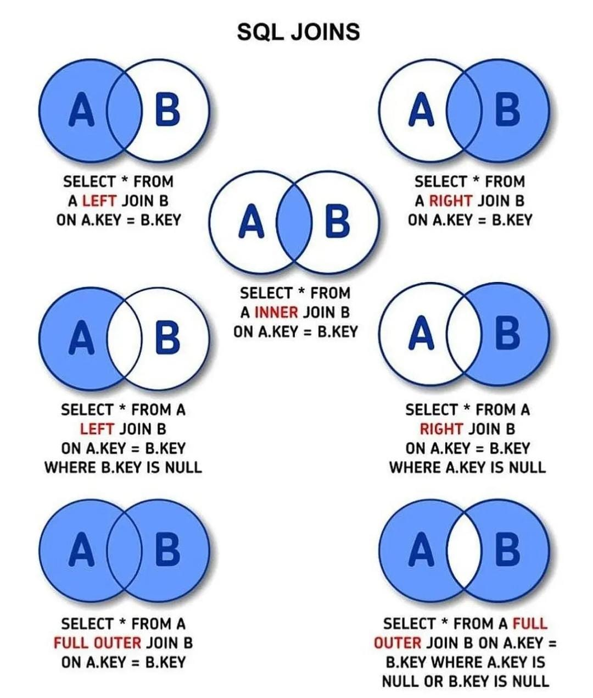

# Lenguaje SQL

Lenguaje estructurado que sirve para hacer consultas en las bases de datos

## Grupos de sentencias

- Grupo DDL (lenguaje de definición de datos): son las instrucciones que permiten crear, modificar y borrar objetos de la base de datos.
- Grupo DML (lenguaje de manipulación de datos): se usa para añadir, eliminar, modificar y consultar filas. Instrucción select
- Grupo DCL (lenguaje de control de datos): estas permiten, crear y borrar privilegios a los usuarios de una base de datos.

## Reglas

- **Identificadores (nombre de las tablas, atributos):** Se pueden usar hasta 64 caracteres alfanuméricos sin espacios. Para bases de datos, tiene que empezar por una letra y no pueden contener `/`, `\` y `.`
- **Palabras reservadas:** hay que escribirlas en mayúscula y no pueden usarse como nombre de identificadores
- El espacio se sustituye por el guion bajo.
- Los números no son para los nombres.
- El nombre de las tablas puede ser singular o plural
- El nombre de la base de datos se representa en singular.
- Evite el prefijo si es posible.
- Nombre de tabla en Singular
- Elija nombres cortos de no más de dos palabras.
- Los nombres de los campos deben ser fáciles y comprensibles.
- La clave primaria puede ser id o nombre_de_tabla o puede ser un nombre autoexplicativo.
- Evite utilizar una columna con el mismo nombre que el nombre de la tabla.
- Evite nombres abreviados, concatenados o basados en acrónimos.
- **Mayúsculas:** indican que es una palabra reservada del lenguaje. Palabra reservada
- **Minúsculas:** son los nombres de los objetos (tablas, columnas, etc…). Nombre propio
- Llaves `{}`: indica que hay que escoger obligatoriamente algo entre una serie de opciones. Elección obligatoria
- Barra `|`: separa los elementos que se pueden escoger. Separador de opciones
- Corchetes `[]`: indican cuando un elemento es opcional. Elemento opcional
- Puntos suspensivos `…`: indica que un elemento puede repetirse. Repetición de elementos
- **Punto y coma `;`:** final de la instrucción. Final de instrucción
- **Asterisco `*`:** todos los campos de una tabla a seleccionar. Todos los campos

Ejemplo: blog_id → representa el id de la clave foránea de la tabla blog

## Elementos de SQL:

### Datos

- Constantes
    - Numéricas: números(enteros y decimales, signos y notación exponencial) → -37.8
    - Cadena: conjunto de caracteres entre comillas simples o dobles → “hola”
    - Fecha y hora: fecha y hora entre comillas simples o dobles, en formato “AAAA-MM-DD” y “HH:MM:SS” → ‘2022-10-07’
- Variables
    - numéricas (valores operables):
        - INT[(long)] o INTEGER[(num)]: nos sirve para guardar números enteros
        - TINYINT(long) → número enteros (1 byte)
        - DEC(long,decimal)
        - FLOAT(escala,precision) → FLOAT(5,3) = 89.257
        - NUMERIC(escala,precision), DECIMAL(escala,precision) o DEC(escala,precision)
    - Cadenas:
        - CHAR(longitud): búsquedas rápidas → CHAR(5);
        - VARCHAR(long): se suele usar para nombres cortos, hasta 255 caracteres → VARCHAR(20);
        - TEXT(long)
        - LONGTEXT
    - Fechas:
        - DATE(”yyyy-mm-dd”)
        - TIME(”hh:mm:ss”)
        - DATETIME(”yyyy-mm-dd”,”hh:mi:ss”)
    - Binarios o booleanos:
        - BOOLEAN(True, False) → (0 o 1)

### Operadores: símbolos que relacionan operadores

- Aritméticos: sirven para operar con valores numéricos y resuelven un resultado en formato numérico.
    - Sumar → +
    - Restar → -
    - Multiplicar → *
    - División → /
    - Resto → % o div
- Comparación: comparan dos valores, devolviendo un valor booleano.
    - Menor que → <
    - Mayor que → >
    - Igual → =
    - Distinto → <> o !=
    - Menor o igual → <=
    - Mayor o igual >=
        
        ---
        
    - IS NULL
    - BETWEEN
    - IN
    - LIKE
    
    Ejemplo:
    
    select * from Empleados; → muestra todos los valores de la tabla empleados
    
    select * from Empleados where oficio=’vendedor’ ;→ muestra todos los valores de empleados cuyo oficio es vendedor
    
- Lógicos: operan entre datos con valores lógicos (condiciones), y devuelven el valor lógico (True o False)
    - AND o &&
        
        
        | AND | 0 | 1 |
        | --- | --- | --- |
        | 0 | 0 | 0 |
        | 1 | 0 | 1 |
    - OR o ||
        
        
        | OR | 0 | 1 |
        | --- | --- | --- |
        | 0 | 0 | 1 |
        | 1 | 1 | 1 |
    - NOT o !
        
        
        | NOT | 0 | 1 |
        | --- | --- | --- |
        | ≠ | 1 | 0 |
    - XOR
        
        
        | XOR | 0 | 1 |
        | --- | --- | --- |
        | 0 | 0 | 1 |
        | 1 | 1 | 0 |
    
    Ejemplo:
    
    select * from Empleados where oficio=’vendedor’ or edad>18 → vendedor o edad>18
    
    select * from Empleados where oficio=’vendedor’ or oficio=’comercial’ → vendedor o comercial
    
    select * from Empleados where oficio=’vendedor’ or not(edad>18) → vendedor o edad<=18
    
- Prioridad de operadores/preferencia:
    
    
    | Prioridad 1 | * | / | % |  |  |  |  |  |
    | --- | --- | --- | --- | --- | --- | --- | --- | --- |
    | Prioridad 2 | + | - |  |  |  |  |  |  |
    | Prioridad 3 | = | != | > | < | LIKE | IN | BETWEEN | IS NULL |
    | Prioridad 4 | NOT |  |  |  |  |  |  |  |
    | Prioridad 5 | AND |  |  |  |  |  |  |  |
    | Prioridad 6 | OR | XOR |  |  |  |  |  |  |
    
    Se usan paréntesis para separar la prioridad de los operadores.
    

## Sintaxis

### Configuración de BD y tablas

- Crear base de datos -> `CREATE DATABASE nombreBaseDeDatos;`
- Crear tabla -> `CREATE TABLE nombreTabla(...);`
- Eliminar base de datos -> `DROP DATABASE nombreBaseDeDatos;`
- Eliminar tabla -> `DROP TABLE nombreTabla;`
- Eliminar tabla permanentemente -> `TRUNCATE TABLE nombreTabla;`
- Entrar en una base de datos -> `USE nombreBaseDeDatos;`
- Crear tabla a partir de otra -> `CREATE TABLE tabla2 LIKE tabla1;`
- Crear vista → `CREATE VIEW nombreVista AS consulta;`

### Mostrar elementos y estructura

- Ver bases de datos -> `SHOW DATABASES;`
- Ver tablas de una base de datos -> `SHOW TABLES;`
- Ver configuración de la tabla -> `SHOW CREATE TABLE nombreTabla;`
- Ver estructura de la tabla -> `DESC nombreTabal;`
- Ver valor de la variable AUTOCOMMIT -> `SELECT @@AUTOCOMMIT;`

### Consultas

- Seleccionar todas las columnas -> `SELECT * FROM nombreTabla;`
- Seleccionar columnas -> `SELECT nombreColumna FROM nombreTabla;`
- Seleccionar varias columnas -> `SELECT nombreColumna1,nombreColumna2 FROM nombreTabla;`
- Seleccionar valores diferentes -> `SELECT DISTINCT * FROM NombreTabla;`
- Seleccionar columnas con concatenación → `SELECT CONCAT(columna1,columna2,…) FROM nombreTabla;`
- Rangos
    - Entre dos rangos -> `SELECT * FROM nombreTabla WHERE nombreColumna BETWEEN rango1 AND rango2;`
    - Fuera de dos rangos -> `SELECT * FROM nombreTabla WHERE nombreColumna NOT BETWEEN rango1 AND rango2;`
- Patrones
    - Comparación con patron -> `SELECT * FROM nombreTabla WHERE nombreColumna LIKE patron;`
    - Diferente al patron -> `SELECT * FROM nombreTabla WHERE nombreColumna NOT LIKE patron;`
    - Filtro de patrones
        - Indica que hay x caracteres pudiendo ser 0
            - Empieza por x -> `"x%"`
            - Acaba con x -> `"%x"`
            - Está entre -> `"%x%"`
            - Empieza y acaba -> `"x%x"`
        - Indica que hay un carácter
            - Con un carácter delante -> `"_x"`
            - Con dos carácter delante -> `"__x"`
            - Con un carácter detrás -> `"x_"`
- Alias
    - Alias -> `SELECT nombreColumna AS Alias FROM nombreTabla;`
    - Alias grande -> `SELECT nombreColumna AS "Alias grande" FROM nombreTabla;`
- Filtrar
    - Filtro de la consulta -> `SELECT * FROM NombreTabla WHERE condicion;`
- Ordenar
    - Ascendente (bajo a alto) -> `SELECT * FROM NombreTabla ORDER BY nombreColumna ASC;`
    - Descendente (alto a bajo) -> `SELECT * FROM nombreTabla ORDER BY nombreColumna DESC;`
    - Ordenar por varias columnas -> `SELECT * FROM NombreTabla ORDER BY nombreColumna1, nombreColumna2;`
- Agrupar
    - Agrupar por columna -> `SELECT * FROM nombreTabla GROUP BY nombreColumna;`
    - Agrupar por varias columnas -> `SELECT * FROM nombreTabla GROUP BY nombreColumna1, nombreColumna2;`
    - Agrupar por columna con filtro -> `SELECT * FROM nombreTabla GROUP BY nombreColumna HAVING condicion;`
- Subconsultas
    - Devuelven 1 valor -> `SELECT * FROM nombreTabla WHERE nombreColumna=(SELECT nombreColumna FROM nombreTabla WHERE nombreColumna condicion);`
    - Devuelven varios datos -> `SELECT * FROM nombreTabla WHERE nombreColumna IN (SELECT nombreColumna FROM nombreTabla WHERE nombreColumna condicion);`

### Consultas multitabla

- Seleccionar todos los valores de las tablas entre sí -> `SELECT * FROM nombreTabla1 CROSS JOIN nombreTabla2;`
- Relaciones entre dos tablas -> `SELECT * FROM A INNER JOIN B ON A.key=B.key;`
- Seleccionar tabla de la izquierda junto a sus relaciones de la otra tabla -> `SELECT * FROM A LEFT JOIN B ON A.key=B.key;`
- Seleccionar tabla de la derecha junto a sus relaciones de la otra tabla -> `SELECT * FROM A RIGHT JOIN B ON A.key=B.key;`
- Seleccionar tabla de la izquierda -> `SELECT * FROM A LEFT JOIN B ON A.key=B.key WHERE B IS NULL;`
- Seleccionar tabla de la derecha -> `SELECT * FROM A RIGHT JOIN B ON A.key=B.key WHERE A IS NULL;`
- Seleccionar todo entre dos tablas -> `SELECT * FROM A OUTER JOIN B ON A.key=B.key;`
- Seleccionar todo entre dos tablas menos las relaciones -> `SELECT * FROM A OUTER JOIN B ON A.key=B.key WHERE A IS NULL OR B IS NULL;`
- Unir el resultado de dos consultas -> `SELECT * FROM nombreTabla1 UNION SELECT * FROM nombreTabla2;`



### Consultas de resumen

- Valor máximo -> `MAX()`
- Valor mínimo -> `MIN()`
- Media de valores -> `AVG()`
- Cuenta -> `COUNT(*)` o `COUNT(nombreColumna)`
- Suma los valores numéricos -> `SUM()`

### Insertar y modificar datos

- Introducir datos -> `INSERT INTO nombreTabla VALUES(...),(...);`
- Cambiar valores de una tabla -> `UPDATE nombreTabla SET nombreColumna=valor;`
- Borrar valores de una tabla -> `DELETE FROM nombreTabla;`

### Modificar estructura

- Añadir columna -> `ALTER TABLE nombreTabla ADD nombreColumna valoresColumna;`
- Eliminar columna -> `ALTER TABLE nombreTabla DROP COLUMN nombreColumna;`
- Añadir primary key -> `ALTER TABLE nombreTabla ADD PRIMARY KEY(nombreColumna);`
- Eliminar primary key -> `ALTER TABLE nombreTabla DROP PRIMARY KEY nombrePrimaryKey;`
- Añadir foreign key -> `ALTER TABLE nombreTabla ADD FOREIGN KEY(nombreColumna) REFERENCES nombreTabla(nombreColuman);`
- Eliminar foreign key -> `ALTER TABLE nombreTabla DROP FOREIGN KEY nombreForeignKey;`
- Modificar el tipo de dato de una columna -> `ALTER TABLE nombreTabla MODIFY COLUMN nombreColumna TipoDeDato;`
- Renombrar columna → `ALTER TABLE nombreTabla RENAME COLUMN nombreColumna to nuevoNombre;`
- Modificar columna → `ALTER TABLE nombreTabla MODIFY COLUMN nombreColumna tipoDeDato [restricciones];`
- Modificar columna a NOT NULL → `ALTER TABLE nombreTabla ALTER COLUMN nombreColumna tipoDato NOT NULL;`
- Añadir UNIQUE → `ALTER TABLE nombreTabla ADD UNIQUE(nombreColumna);`
- Eliminar UNIQUE → `ALTER TABLE nombreTabla DROP INDEX nombreColumna;`
- Añadir CHECK → `ALTER TABLE nombreTabla ADD CHECK (nombreColumna operador valor);`
- Eliminar CHECK → `ALTER TABLE nombreTabla DROP CONSTRAINT nombreColumna;`
- Añadir valor por defecto → `ALTER TABLE nombreTabla ALTER nombreColumna SET DEFAULT valor;`

### Transacciones

- Inicia la transacción -> `START TRANSACTION;`
- Confirma los cambios -> `COMMIT;`
- Deshace los cambios -> `ROLLBACK;`
- Predefinir transacción -> `SET AUTOCOMMIT=1;`

### Copias de seguridad

- Copia de seguridad (fuera de MySQL) -> `mysqldump -u root -p nombreBD > archivo.sql`
- Copia de seguridad de varias bases de datos → `mysqldump -u root -p --databases nombreBD1 nombreBD2 nombreBD3 > archivo.sql`
- Copia de seguridad de todas las bases de datos → `mysqldump -u root -p --all-databases > archivo.sql`
- Recuperar copia de seguridad → `source archivo.sql;`
- Cargar archivos → `LOAD DATA INFILE “archivo.txt” INTO TABLE nombreTabla [FIELDS [TERMINATED BY ‘\t’] [[OPTIONALLY] ENCLOSED BY ‘’] [ESCAPED BY ‘\\’]] [LINES [STARTING BY ‘’] [TERMINATED BY ‘\r\n’]] [IGNORE numero LINES] nombreColumna;`

### Funciones MySQL

- Matemáticas
    
    Valor absoluto de X → `ABS(x)`
    
    - `SELECT ABS(2);` → `2`
    - `SELECT ABS(-32);` → `32`
    
    Redondea hacia arriba un número con decimales → `CEIL(x)` o `CEILING(x)`
    
    - `SELECT CEILING(1.23);` → `2`
    - `SELECT CEIL(-1.23);` → `-1`
    
    Coseno de X, donde X se da en radianes. → `COS(x)`
    
    - `SELECT COS(PI());` → `-1.000000`
    
    Convierte X, de radianes a grados → `DEGREES(x)`
    
    - `SELECT DEGREES(PI());` → `180.000000`
    
    Redondeo por abajo de un número con decimales → `FLOOR(x)`
    
    - `SELECT FLOOR(1.23);` → `1`
    - `SELECT FLOOR(-1.23);` → `-2`
    
    Redondeo de x al número de decimales de y → `FORMAT(x,y)`
    
    - `SELECT FORMAT(3956842.930,1)` → `3956842,9`
    
    Redondeo en el lenguaje seleccionado de x al número de decimales de y → `FORMAT(x,y,"id_Da")`
    
    - `SELECT FORMAT(3956842.930,1,"de_De")` → `3.956.842,9`
    - `SELECT FORMAT(3956842.930,1,"es_Es")` → `3956842,9`
    
    Módulo de dividir X entre Y → `MOD(x,y)` o `x%y` o `x MOD y`
    
    - `SELECT MOD(234,10);` → `4`
    - `SELECT MOD(29,9);` → `2`
    
    Devuelve el valor de PI → `PI()`
    
    - `SELECT PI();` → `3.141593`
    - `SELECT PI()+0.0000000000;` → `3.1415926535`
    
    Resultado de elevar X a Y → `POW(x,y)` o `POWER(x,y)`
    
    - `SELECT POW(2,2);` → `4.000000`
    - `SELECT POWER(2,-2);` → `0.250000`
    
    Convierte X de grados a radianes → `RADIANS(x)`
    
    - `SELECT RADIANS(90);` → `1.570796`
    
    Valor float aleatorio de 0 a 1.0 → `RAND()`
    
    - `SELECT RAND();` → `0.9233482386203`
    - `SELECT RAND();` → `0.63553050033332`
    
    Valor float aleatorio tomando como base de la generación el
    número X → `RAND(x)`
    
    - `SELECT RAND(20);` → `0.15888261251047`
    - `SELECT RAND(20);` → `0.15888261251047`
    - Dado del 1 al 6 → `SELECT FLOOR(RAND()*6)+1;`
    
    Obtiene X redondeado al entero más próximo → `ROUND(x)`
    
    - `SELECT ROUND(-1.23);` → `-1`
    - `SELECT ROUND(-1.58);` → `-2`
    
    Redondea X a un decimal con el número de cifras indicado en Y → `ROUND(x,y)`
    
    - `SELECT ROUND(1.298, 1);` → `1.3`
    - `SELECT ROUND(23.298, -1);` → `20`
    
    Devuelve el signo de X → `SIGN(x)`
    
    Devuelve el seno de X, donde X está dado en radianes. → `SIN(x)`
    
    - `SELECT SIN(PI());` → `0.000000`
    
    Raíz cuadrada de X → `SQRT(x)`
    
    - `SELECT SQRT(4);` → `2.000000`
    
    Devuelve el número X truncado a Y decimales → `TRUNCATE(x,y)`
    
    - `SELECT TRUNCATE(1.223,1);` → `1.2`
    - `SELECT TRUNCATE(1.999,1);` → `1.9`
- Cadenas de caracteres
    
    ASCII del primer carácter de la cadena → `ASCII(str)`
    
    - `SELECT ASCII('2');` → `50`
    - `SELECT ASCII("dx");` → `100`
    
    Cadena que representa un número BIGINT en binario → `BIN(x)`
    
    - `SELECT BIN(12);` → `"1100"`
    
    Devuelve el tamaño de la cadena str en bits → `BIT_LENGTH(str)`
    
    - `SELECT BIT_LENGTH("text");` → `32`
    
    Pasa los caracteres ASCII a una cadena→ `CHAR(x,y,...)`
    
    - `SELECT CHAR(77,121,83,81,'76');` → `"MySQL"`
    - `SELECT CHAR(77,77.3,'77.3');` → `"MMM"`
    
    Número de caracteres de la cadena str → `CHAR_LENGTH(str)`
    
    - `SELECT CHAR_LENGTH("text");` → `4`
    
    Cadena resultante de concatenar todas las cadenas pasadas → `CONCAT(str1,str2,...)`
    
    - `SELECT CONCAT("My","S","QL");` → `"MySQL"`
    - `SELECT CONCAT("My",NULL,"QL");` → `NULL`
    
    Cadena resultante de concatenar todas las cadenas pasadas separadas con el separador
    que se indique → `CONCAT_WS(separador,str1,str2,...)`
    
    - `SELECT CONCAT_WS('-',"Herrero","de Cos","Luis");` → `"Herrero-de Cos-Luis"`
    - `SELECT CONCAT_WS(',',"First name",NULL,"Last Name");` → `"First name,Last Name"`
    
    Número X expresado en base1 a número expresado en base2 → `CONV(x,base1,base2)`
    
    - `SELECT CONV('a',16,2);` → `"1010"`
    - `SELECT CONV("6E",18,8);` → `"172"`
    
    Devuelve la str de la posición X → `ELT(x,str1,str2,...)`
    
    - `SELECT ELT(4,"ej","Heja","hej","foo");` → `"foo"`
    
    Devuelve la posición donde se encuentra str dentro de la lista de cadenas → `FIELD(str,str1,str2,...)`
    
    - `SELECT FIELD("ej","Hej","ej","Heja","hej","foo");` → `2`
    - `SELECT FIELD("fo","Hej","ej","Heja","hej","foo");` → `0`
    
    Representación hexadecimal del número → `HEX(x)`
    
    - `SELECT HEX(255);` → `"FF"`
    - `SELECT HEX("abc");` → `616263`
    
    Devuelve el resultado de insertar str1 desde la posición X y con el número de caracteres Y, reemplazando a los correspondientes caracteres de str2 → `INSERT(str1,X,Y,str2)`
    
    - `SELECT INSERT("Quadratic",3,4,"What");` → `"QuWhattic"`
    - `SELECT INSERT("Quadratic",-1,4,"What");` → `"Quadratic"`
    
    Posición a partir de la cual se encuentra la primera aparición de str2 en str1 → `INSTR(str1,str2)`
    
    - `SELECT INSTR("foobarbar","bar");` → `4`
    - `SELECT INSTR("xbar","foobar");` → `0`
    
    Devuelve los X primeros caracteres por la izquierda de str → `LEFT(str,x)`
    
    - `SELECT LEFT("foobarbar",5);` → `"fooba"`
    
    Cadena con todas las letras en minúscula → `LCASE(str)` o `LOWER(str)`
    
    - `SELECT LOWER("QUADRATICALLY");` → `"quadratically"`
    
    Devuelve str1 añadiéndole por la izquierda la str2 repetida tantas veces para que el conjunto caracteres añadidos lleguen a los indicados en X → `LPAD(str1,x,str2)`
    
    - `SELECT LPAD("hi",13,"abc");` → `"abcabcabcabhi"`
    - `SELECT LPAD("hi",1,"??");` → `'h'`
    
    Devuelve la cadena str tras eliminarle los espacios de la izquierda → `LTRIM(str)`
    
    - `SELECT LTRIM(" barbar");` → `"barbar"`
    
    Devuelve str a partir del carácter X de str hasta el carácter Y → `MID(str,x,y)`
    
    Devuelve str repetida X veces → `REPEAT(str,x)`
    
    - `SELECT REPEAT("MySQL",3);` → `"MySQLMySQLMySQL"`
    
    Devuelve la cadena str sustituyendo las ocurrencias de str1 en str por ocurrencias de
    str2 → `REPLACE(str,str1,str2)`
    
    - `SELECT REPLACE("www.mysql.com",'w',"Ww");` → `"WwWwWw.mysql.com"`
    
    Cadena str con los caracteres en orden inverso → `REVERSE(str)`
    
    - `SELECT REVERSE("abc");` → `"cba"`
    
    Devuelve los X caracteres de la derecha de la cadena str → `RIGHT(str,x)`
    
    - `SELECT RIGHT("foobarbar",4);` → `"rbar"`
    
    Devuelve str1 añadiéndole por la derecha la str2 repetida tantas veces para que el conjunto caracteres añadidos lleguen a los indicados en X → `RPAD(str1,x,str2)`
    
    - `SELECT RPAD("hi",5,"?0");` → `"hi?0?"`
    - `SELECT RPAD("hi",1,'?');` → `'h'`
    
    Cadena str eliminando los espacios que tenga por la derecha → `RTRIM(str)`
    
    Devuelve 0 si las cadenas str1 y str2 son iguales, -1 si str1 es menor alfabéticamente y +1 si str1 es mayor → `STRCMP(str1,str2)`
    
    - `SELECT STRCMP("text10","text2");` → `-1`
    - `SELECT STRCMP("text2","TEXT2");` → `0`
    
    Cadena str con todos sus caracteres en mayúsculas → `UCASE(str)` o `UPPER(str)`
    
    - `SELECT UPPER("Hej");` → `"HEJ"`
- Fecha y hora
    
    Fecha resultado de sumar al parámetro fecha el intervalo de DAY, MONTH, YEAR → `ADDDATE(fecha,INTERVAL x DAY/MONTH/YEAR)` o `DATE_ADD(fecha,INTERVAL x DAY/MONTH/YEAR)` o `ADDDATE(fecha,dias)`
    
    - `SELECT DATE_ADD("2004-01-02",INTERVAL 31 DAY);` → `"2004-02-02"`
    - `SELECT ADDDATE("2004-12-02",INTERVAL 30 DAY);` → `"2005-01-01"`
    - `SELECT ADDDATE("2004-12-02",100);` → `"2005-03-12"`
    
    Añade expr2 a expr1 → `ADDTIME(expr1,expr2)`
    
    - `SELECT ADDTIME("2004-12-31 23:59:59.999999", "1 0:0:1.000002");` → `"2005-01-02 00:00:01.000001"`
    - `SELECT ADDTIME("01:00:59", "02:04:00");` → `" 03:04:59"`
    
    Devuelven la fecha actual en formato “AAAA-MM-DD” → `CURDATE()` o `CURRENT_DATE` o `CURRENT_DATE()`
    
    - `SELECT CURDATE();` → `"2004-11-04"`
        
        Devuelven la fecha actual en formato numérico → `CURDATE()+0`
        
        - `SELECT CURDATE()+0;` → `20041104`
    
    Devuelven la hora actual en formato “HH:MM:SS” → `CURTIME()+0`
    
    - `SELECT CURTIME();` → `"17:50:26"`
        
        Devuelven la fecha actual en formato numérico → `CURDATE()+0`
        
        - `SELECT CURTIME()+0;` → `175026`
    
    Obtiene la parte correspondiente a la fecha del contenido de expr → `DATE(expr)`
    
    - `SELECT DATE("2003-12-31 01:02:03");` → `"2003-12-31"`
        
        Obtiene la fecha actual → `DATE(NOW())`
        
    
    Devuelve el número de días comprendidos entre expr2 y expr1 → `DATEDIFF(expr1,expr2)`
    
    - `SELECT DATEDIFF("2004-12-31 23:59:59","2004-12-30 00:00:01");` → `1`
    - `SELECT DATEDIFF("2004-11-30 23:59:59","2004-12-31");` → `-31`
    
    Devuelve la fecha expresada con el formato que se indique → `DATE_FORMAT(fecha,formato)`
    
    - Formatos
        
        
        | Especificador | Descripción |
        | --- | --- |
        | %a | Día de la semana (Sunday-Saturday) |
        | %b | Nombre mes (January-December) |
        | %c | Mes numérico (1-12) |
        | %d | Mes numérico (01-31) |
        | %e | Día (1-31) |
        | %H | Hora (00-23) |
        | %h | Hora (1-12) |
        | %i | Minutos (00-59) |
        | %j | Día del año (001-366) |
        | %k | Hora (0-23) |
        | %M | Nombre mes (January-December) |
        | %m | Mes (01-12) |
        | %p | AM o PM |
        | %r | Hora (HH:mm:ss) seguido de AM o PM |
        | %S o %s | Segundos |
        | %T | Hora 24 horas (hh:mm:ss) |
        | %w | Día de la semana ((0=Domingo)-(6=Sabado)) |
        | %Y | Año de 4 dígitos |
        | %y | Año de 2 dígitos |
    - `SELECT DATE_FORMAT("1997-10-04 22:23:00","%W %M %Y");` → `"Saturday October 1997"`
    - `SELECT DATE_FORMAT("1997-10-04 22:23:00","Son las %H:%i horas");` → `"Son las 22:23 horas"`
    
    Diferencia entre dos fechas seleccionando el intervalo → `TIMESTAMPDIFF(DAY/MONTH/YEAR,fecha1,fecha2)`
    
    Dias transcurridos desde el 0 → `TO_DAYS(dia)`
    
    Tiempo transcurrido desde las 00:00:00 → `TIME_TO_SEC(tiempo)`
    
- Control de flujo
    
    ```sql
    CASE valor
    	WHEN	[valor1] THEN resultado1
    	[WHEN [valor2] THEN resultado2 ...]
    	[ELSE resultado]
    END
    
    CASE
    	WHEN [condicion1] THEN resultado1
    	[WHEN [condicion2] THEN resultado2 ...]
    	[ELSE resultado]
    END
    ```
    
    - La primera sintaxis devuelve el resultado correspondiente al primer valorN que coincida con valor. Si ningún valorN coincide con valor, se devuelve el resultado que hay tras la cláusula ELSE, y si no tuviera esta cláusula se devuelve NULL.
    - En la segunda sintaxis se devuelve el resultado correspondiente a la primera condición que se cumpla.
    - `SELECT CASE 1 WHEN 1 THEN 'one' WHEN 2 THEN 'two' ELSE 'more' END` → `'one'`
    - `SELECT CASE WHEN 1 > 0 THEN 'true' ELSE 'false' END` → `'true'`
    - `SELECT CASE BINARY 'B' WHEN 'a' THEN 1 WHEN 'b' THEN 2 END` → `NULL`
        
        ```sql
        SELECT CASE weekday('2005-1-1')
        	WHEN 1 THEN 'martes'
        	WHEN 2 THEN 'miercoles'
        	WHEN 3 THEN 'jueves'
        	WHEN 4 THEN 'viernes'
        	WHEN 5 THEN 'sabado'
        	WHEN 6 THEN 'domingo'
        	ELSE 'lunes'
        END
        
        Resultado → 'sabado'
        ```
        
    
    `IF(expr1,expr2,expr3)`
    
    - Si expr1 es verdadera (`expr1 <> 0` y `expr1 <> NULL`), devuelve expr2, si no devuelve expr3. IF puede devolver expresiones tanto numéricas como alfanuméricas según se empleen en expr2 y expr3. Si expr1 es numérica, es evaluada como entera, por lo que una expresión que sea numérica con decimales se convierte a entera para ser analizada.
    - `SELECT IF(1>2,2,3)` → `3`
    - `SELECT IF(1<2,'yes','no')` → `'yes'`
    - `SELECT IF(STRCMP('test','test1'),'no','yes')` → `'no'`
    - `SELECT IF(0.1,1,0)` → `0`
    - `SELECT IF(0.1<>0,1,0)` → `1`
    
    `IFNULL(expr1,expr2`
    
    - Si expr1 no es NULL, devuelve expr1, si no devuelve expr2.
    - `SELECT IFNULL(1,0)` → `1`
    - `SELECT IFNULL(NULL,10)` → `10`
    - `SELECT IFNULL(1/0,10)` → `10`
    - `SELECT IFNULL(1/0,'yes')` → `'yes'`
    
    `NULLIF(expr1,expr2)`
    
    - Devuelve NULL si se cumple `expr1 = expr2`, si no devuelve expr1.
    - `SELECT NULLIF(1,1)` → `NULL`
    - `SELECT NULLIF(1,2)` → `1`
- Conversión
    
    Opera sobre la cadena de caracteres que se indique para convertirla a cadena binaria o de bytes → `BINARY`
    
    - `SELECT 'a' = 'A';` → `1`
    - `SELECT BINARY 'a' = 'A';` → `0`
    
    Devuelven un valor de un tipo convertido a otro tipo (`BINARY`, `CHAR`, `DATE`, `DATETIME`, `SIGNED`, `TIME`, `UNSIGNED`) → `CAST(*valor* AS *tipo*)` o `CONVERT(*valor*, *tipo*)` o `CONVERT(*valor* USING *transcoding_name*)`
    
    - USING sirve para convertir datos entre diferentes conjuntos de caracteres.
    - `SELECT CONVERT("abc" USING utf8);`
    - Obtener los conjuntos de caracteres que se pueden usar → `SHOW CHARACTER SET`
        - Algunos de esos conjuntos son latin1, latin2, ASCII, utf8.
    - Un ejemplo de uso de estas funciones es para ordenar una consulta sobre una columna `ENUM` de forma alfabética
        - `SELECT *enum_col* FROM *tabla* ORDER BY CAST(*enum_col* AS CHAR);`
    - Para convertir una cadena de caracteres en valor numérico, generalmente no es necesario hacer
    una conversión ya que la puede realizar automáticamente MySQL si el contexto lo implica.
        - `SELECT 1+'1'` → `2`
    - De igual forma se realizan algunas conversiones de forma automática de numérico a cadena de
    caracteres, como se muestra en el siguiente ejemplo.
        - `SELECT CONCAT("hello you ", 2)` → `"hello you 2"`
    
    Si se hace una operación entre dos valores sin signo (`UNSIGNED`), el resultado es sin signo. Para forzar que el resultado con signo, habría que convertir uno de los operandos a numérico con signo (`SIGNED`).
    
    - `SELECT 1- (2 AS UNSIGNED)` → `18446744073709551615`
    - `SELECT CAST(1-CAST(2 AS UNSIGNED)) AS SIGNED)` → `-1`
- Búsqueda sobre índices FULLTEXT
    
    Los índices FULLTEXT pueden definirse para columnas de tipo CHAR, VARCHAR o TEXT.
    
    Buscar las palabras de expr dentro de las columnas de tipo FULLTEXT que se indiquen → `MATCH (col1,col2,...) AGAINST (expr [IN BOOLEAN MODE])`
    
    - Las palabras de expr deben estar separadas por espacios y nunca pueden ser variables o referirse a nombres de columnas.
    - Por cada fila devuelta al aplicar la función MATCH, se devuelve la relevancia de las palabras buscadas en las columnas donde se busca.
    - La relevancia es 0 cuando ninguna de las palabras se encuentran en las columnas en que se buscan.
    - Si se encuentra la palabra, la relevancia se obtiene en función del número de palabras encontradas en cada fila, el número de palabras de cada fila no repetidas, el número de filas que contienen las palabras buscadas, el número total de palabras encontradas. No se pueden buscar palabras de 3 o menos letras. Por defecto no se diferencian mayúsculas y
    minúsculas.
    - Con la función MATCH también se pueden buscar combinaciones de palabras, porciones de
    palabras y otras variantes a través de búsquedas booleanas añadiendo la cláusula IN
    BOOLEAN MODE y usando una serie de operadores que operan con las palabras a buscar.
    - Operador Descripción
        - La palabra que siga al operador es obligatorio que aparezca en todas las filas
        - La palabra no debe aparecer en ninguna de las filas devueltas
        `<` → La palabra siguiente se considerará menos relevante que las otras
        `>` → La palabra siguiente se considerará más relevante que las otras
        `( )` → Para agrupar palabras en subexpresiones
        `~` → La palabra siguiente da contribución negativa a la relevancia
        - Comodín para cualquier cadena `"` entre comillas dobles se representa un conjunto
- Agregado
    
    Las funciones de agregado sirven para obtener cálculos sobre todas las filas de una tabla o sobre cada conjunto de filas que tiene valores iguales en una o más columnas. Algunas de estas funciones.
    
    Número de filas no nulas devueltas en una consulta → `COUNT(expr)`
    
    - Para contar todas las filas de una tabla o de cada grupo se usa `*`.
    - `SELECT COUNT(*) FROM automoviles GROUP BY marca;`
    
    Cantidad de filas con valores no nulos diferentes → `COUNT(DISTINCT expr,[expr...])`
    
    - `SELECT COUNT(DISTINCT marcas) FROM automoviles;`
    
    Valor medio de la expresión indicada → `AVG(expr)`
    
    - Los valores NULL no los usa para el cálculo de la media.
    - `SELECT AVG(precio) FROM automoviles GROUP BY marca;`
    
    Valor mínimo de expr → `MIN(expr)`
    
    Valor máximo de expr → `MAX(expr)`
    
    Suma de expr → `SUM(expr)`
    
    Lista con todos los valores de las expresiones expr → `GROUP_CONCAT([DISTINCT] expr [,expr ...] [ORDER BY col1 [ASC|DESC] [,col2 ...]] [SEPARATOR valor_str])`
    
    - Para separar los valores se usa el carácter coma o los caracteres que se definan tras `SEPARATOR`.
    - `GROUP_CONCAT(precio SEPARATOR '====')`
    
    Varianza de expr → `VARIANCE(expr)`
    
    Desviación estándar de expr → `STD(expr)` o `STDDEV(expr)`
    
    Resultado de realizar la operación binaria OR con todas las filas de cada grupo sobre los valores de expr → `BIT_OR(expr)`
    
    Resultado de realizar la operación binaria XOR con todas las filas de cada grupo sobre los valores de expr → `BIT_XOR(expr)`
    
    Resultado de realizar la operación binaria AND con todas las filas de cada grupo sobre los valores de expr → `BIT_AND(expr)`
    
- Otras funciones
    
    Encriptar → `ENCODE(str1,str2)`
    
    Desencriptar → `DECODE(str1,str2)`
    
    Buscar una cadena en un set → `FIND_IN_SET(cadena_buscando,set_a_buscar)`
    
    Número de bits de valor 1 que tiene la representación binaria de x → `BIT_COUNT(x)`
    
    - `SELECT BIT_COUNT(29);` → `4`
    
    Encriptar información usando la técnica AES → `AES_ENCRYPT(str,key_str)`
    
    - `SELECT AES_ENCRYPT('text','password');`
    
    Desencriptar información usando la técnica AES → `AES_DECRYPT(crypt_str,key_str)`
    
    - `AES_ENCRYPT('text',@p);`
    
    Encriptar una cadena con un método muy básico → `ENCODE(str,key_str)`
    
    Desencriptar una cadena con un método muy básico → `DECODE(crypt_str,key_str)`
    
    Encriptar una cadena usando el método Triple-DES → `DES_ENCRYPT(str[,(key_num|key_str)])`
    
    Desencriptar una cadena usando el método Triple-DES → `DES_DECRYPT(crypt_str[,key_str])`
    
    Ejecuta la expresión expr tantas veces como indique x → `BENCHMARK(x, expr)`
    
    - Devuelve siempre 0 y sirve para poder comprobar cuanto se tarda en ejecutar una función
    - `SELECT BENCHMARK(1000000,ENCODE('hello','goodbye'));` → `0`
    
    Devuelve el conjunto de caracteres o alfabeto al que pertenece str → `CHARSET(str)`
    
    - `SELECT CHARSET(nombre) FROM clientes;` → `latin1`
    
    Devuelve la variante del conjunto de caracteres utilizado → `COLLATION(str)`
    
    - `SELECT COLLATION('abc');` → `latin1_swedish_ci`
    
    Número de identificador de la conexión cliente MySQL al servidor MySQL → `CONNECTION_ID()`
    
    - `SELECT CONNECTION_ID();` → `23`
    
    Nombre del usuario y del equipo donde éste ha sido autenticado → `CURRENT_USER()`
    
    - `SELECT CURRENT_USER();` → `luis@localhost`
    
    Devuelve el nombre de la base de datos abierta actualmente → `DATABASE()`
    
    - `SELECT DATABASE();` → `alquileres`
    
    Permite conocer cuantas filas se podrían haber devuelto en una SELECT ejecutada anteriormente con LIMIT para limitar el número de filas → `FOUND_ROWS()`
    
    - `SELECT FOUND_ROWS();` → `12`
    
    Último valor insertado en una columna AUTO_INCREMENT → `LAST_INSERT_ID()`
    
    - `SELECT LAST_INSERT_ID();` → `195`
    
    Número de filas que se vieron afectadas por la operación precedente de borrado, inserción o modificación. Si la operación no fue ninguna de las anteriores, devuelve `–1` → `ROW_COUNT()`
    
    - `SELECT ROW_COUNT();` → `3`
    
    Nombre del usuario de la sesión cliente y el nombre del equipo → `USER()`, `SESSION_USER()`, `SYSTEM_USER()`
    
    - `SELECT USER();` → `luis@localhost`
    
    Versión del servidor MySQL → `VERSION()`
    
    - `SELECT VERSION();` → `5.0.1-alpha-nt`
    
    Valor por defecto de una columna que tiene la restricción DEFAULT → `DEFAULT(columna)`
    
    - `SELECT DISTINCT DEFAULT(nota1) FROM cursadas;` → `5`
    
    Genera aleatoriamente un Identificador Universal Único (UUID) de acuerdo al protocolo DCE → `UUID()`
    
    - `SELECT UUID();` → `6ccd780c-baba-1026-9564-0040f4311e29`

## Restricciones

1. Nivel columna
    - Clave primaria → `PRIMARY KEY`
    - Posibilidad de nulo → `NULL` o `NOT NULL`
    - Valor por defecto → `DEFAULT *valor*`
    - Unicidad → `UNIQUE`
    - Comprobación de valores → `CHECK({*expresión*})`
    - Autoincremento → `AUTO_INCREMENT`
        - Solo en campos enteros y definidos como claves
    - Atributo repetible → `INDEX`
    - Sin signo → `UNSIGNED`
2. Nivel tabla
    - Clave ajena (foreign key) → `[CONSTRAINT *nombreClave*] FOREIGN KEY(*nombreColumna*) REFERENCES *nombreTabla*(*nombreColumnaClave*);`
    - Clave primaria → `[CONSTRAINT *nombreClave*] PRIMARY KEY(*nombreColumnaClave*);`
    - Unicidad → `[CONSTRAINT *nombre*] UNIQUE(*nombreColumna*);`

## Procedimientos

Un procedimiento es una rutina de sentencias SQL con un nombre y parámetros de entrada `IN`, salida `OUT` y  entrada y salida `INOUT`. Los procedimientos pueden ser llamados por cualquier usuario autorizado.

Se ejecutan con la instrucción `CALL nombre_procedimiento(parametros);`. Los procedimientos aumentan la seguridad del sistema y se pueden reutilizar para construir otras rutinas. Todo procedimiento queda asociado a la base de datos abierta cuando se creó el procedimiento.

La sintaxis para crear un procedimiento es:

```sql
CREATE PROCEDURE NomProc ([parametro[,...]]) [caracteristica ...]
BEGIN
	cuerpo_procedimiento
END

```

El cuerpo del procedimiento comienza con una sentencia BEGIN, termina con una sentencia END y consta de varias instrucciones. Para que durante la creación del procedimiento no se interpreten los caracteres punto y coma como delimitadores de cada instrucción, se debe cambiar temporalmente el carácter delimitador con la sentencia `DELIMITER caracter`.

Dentro de un procedimiento se pueden definir variables locales con la sentencia `DECLARE`. Las variables pueden ser modificadas con la sentencia `SET`.

Ver listado de procedimientos → `SHOW PROCEDURE STATUS;`

Borrar procedimiento → `DROP PROCEDURE nombre_procedimiento;`

- Ejemplos:
    
    ```sql
    DELIMITER //
    CREATE PROCEDURE listados()
    BEGIN
    	SELECT * FROM clientes;
    	SELECT * FROM automoviles;
    END//
    DELIMITER ;
    
    CALL listados();
    ```
    
    ```sql
    DELIMITER //
    CREATE PROCEDURE numcontratos(m CHAR(7),OUT c INT)
    BEGIN
    	SELECT * FROM automoviles WHERE matricula=m;
    	-- Guarda el valor de count(*) en c
    	SELECT COUNT(*) INTO c FROM contratos WHERE matricula_automoviles=m;
    END//
    DELIMITER ;
    
    CALL numcontratos("1732CBS",@i);
    SELECT @i;
    ```
    
    ```sql
    DELIMITER //
    CREATE PROCEDURE numcontratos(m CHAR(7),OUT c INT)
    BEGIN
    	-- Declara una variable local
    	DECLARE x INT;
    	SELECT * FROM automoviles WHERE matricula=m;
    	SET x=c;
    	-- Guarda el valor de count(*) en c
    	SELECT COUNT(*) INTO c FROM contratos WHERE matricula_automoviles=m;
    END//
    DELIMITER ;
    
    CALL numcontratos("1732CBS",@i);
    SELECT @i;
    SELECT @x;
    ```
    

## Variables

Sintaxis variable local → `@nombre_variable`

Sintaxis variable de procedimiento → `nombre_variable`

Asignar un valor a una variable local → `@x:=valor;`

Asignar un valor a una variable local → `SET @x=5;`

Asignar como valor de una variable local una cadena de texto → `SET @z="HOLA";`

Asignar como valor de una variable local una operación → `SET @x=@x-1;`

Seleccionar varias variables locales → `SELECT @x, @z;`

Seleccionar una variable local → `SELECT @X;`

Definir variable en un procedimiento → `DECLARE nombre_variable tipo[DEFAULT valor]`

- `DECLARE x INT DEFAULT 7;`
- `DECLARE z CHAR(6) DEFAULT “Lunes”;`

### Ejemplos:

```sql
DELIMITER //
CREATE PROCEDURE ejem1(p INT)
BEGIN
	DECLARE a INT;
	SET a=5;
	SET a=p+5;
	SELECT a;
END//
DELIMITER ;

SET @x=10;
CALL ejem1(8);
CALL ejem1(@x);
SELECT @x;
```

```sql
DELIMITER //
CREATE PROCEDURE ejem2(p1 INT,OUT p2 INT)
BEGIN
	DECLARE a INT;
	SET a=5;
	SET p2=p1+a;
	SELECT p1;
END//
DELIMITER ;

SET @x=10;
CALL ejem2(@x,@x); -> 10
CALL ejem2(4,@x); -> 4
SELECT @x; -> 9
```

```sql
DELIMITER //
CREATE PROCEDURE ejem3(p1 INT,INOUT p2 INT)
BEGIN
	DECLARE a INT;
	SET a=5;
	SET p2=p1+a+p2;
	SELECT p1;
END//
DELIMITER ;

SET @x=10;
CALL ejem3(@x,@x); -> 10
CALL ejem3(4,@x); -> 4
SELECT @x; -> 34
```

## Funciones

Las funciones son rutinas que consisten en varias declaraciones SQL que devuelven un resultado.

Se crean de manera similar a los procedimientos y, una vez creadas, pueden ser invocadas por cualquier cliente MySQL.

- Distinciones de los procedimientos:
    1. Siempre devuelven un dato a través de una sentencia `return`
    2. Solo tienen parámetros de entrada, no tienen el parámetro `OUT` ni `INOUT`.
    3. Para llamarla solo hay que poner el propio nombre de la función
    4. Una función se puede llamar desde otra instrucción de MySQL

Para crear una función, se utiliza la siguiente sintaxis:

```sql
CREATE FUNCTION nombre_funcion([parametro[,...]]) RETURNS tipo [caracteristica...]
BEGIN
	declaraciones
	RETURN valor
END;

```

Borrar función → `DROP FUNCTION nombre_function;`

Ver estructura de la función → `SHOW CREATE FUNCTION nombre_function;`

- Ejemplos
    
    ```sql
    DELIMITER //
    CREATE FUNCTION saludo(a CHAR(20)) RETURNS CHAR(30)
    BEGIN
    	DECLARE x CHAR(30) DEFAULT "Hola";
    	SET x=CONCAT(x,a,"!!");
    	RETURN x;
    END//
    DELIMITER ;
    
    SELECT saludo("cadena");
    ```
    

## Sentencias de control de flujo

### IF

Si la condición del `IF` es verdadera, se ejecutan sus sentencias. En caso contrario, se evalúa la condición del primer `ELSEIF`. Si esta es verdadera, se ejecutan sus sentencias y se continua con los demás `ELSEIF`. Finalmente, si ninguna condición es verdadera, se ejecutan las sentencias asociadas al `ELSE`, si existe.

```sql
IF condicion THEN
	sentencias
[ELSEIF otra_condicion THEN 
	sentencias]
...
[ELSE sentencias]
END IF;
```

- Ejemplos:
    
    ```sql
    DELIMITER //
    CREATE PROCEDURE proc1(n int)
    BEGIN
    	IF n>0 THEN
    		SELECT "Positivo";
    	END IF;
    END//
    DELIMITER ;
    
    CALL proc1(7); -> "Positivo"
    CALL proc1(-5); ->
    ```
    
    ```sql
    DELIMITER //
    CREATE PROCEDURE proc2(n int)
    BEGIN
    	IF n>0 THEN
    		SELECT "Positivo";
    	ELSE SELECT "Negativo";
    	END IF;
    END//
    DELIMITER ;
    
    CALL proc2(7); -> "Positivo"
    CALL proc2(-5); -> "Negativo"
    ```
    
    ```sql
    DELIMITER //
    CREATE PROCEDURE proc3(n int)
    BEGIN
    	IF n>0 THEN
    		SELECT "Positivo";
    	ELSEIF n<0 THEN
    		SELECT "Negativo";
    	ELSE
    		SELECT "Cero";
    	END IF;
    END//
    DELIMITER ;
    
    CALL proc3(7); -> "Positivo"
    CALL proc3(-5); -> "Negativo"
    CALL proc3(0); -> "Cero"
    ```
    

### CASE

La estructura de decisión múltiple `CASE` tiene dos posibles sintaxis.

La primera ejecuta las sentencias correspondientes al primer valor igual a la expresión. Si no hay un valor igual a la expresión, se ejecutan las sentencias dentro de `ELSE`, si está presente.

```sql
CASE expresion WHEN valor1 THEN
	sentencias1
[WHEN valor2 THEN 
	sentencias2]
...
[WHEN valorN THEN 
	sentenciasN]
[ELSE 
	sentencias]
END CASE;
```

La segunda sintaxis ejecuta las sentencias de la primera condición que se cumple. Si ninguna condición se cumple, se ejecutan las sentencias dentro de `ELSE`, si está presente.

```sql
CASE WHEN condicion1 THEN
	sentencias1
[WHEN condicion2 THEN
	sentencias2]
...
[WHEN condicionN THEN
	sentenciasN]
[ELSE
	sentencias]
END CASE;
```

### LOOP

La sentencia `LOOP` permite la repetición sin una condición de salida y se puede salir del bucle usando la sentencia forzada `LEAVE`.

La sintaxis de la sentencia `LOOP` es:

```sql
[etiqueta:]LOOP
	sentencias
END LOOP [etiqueta];
```

- Ejemplos
    
    ```sql
    DELIMITER //
    CREATE PROCEDURE bucleloop(p1 INT,OUT p2 INT)
    BEGIN
    	SET p2=0;
    	etiq1:LOOP
    		SET p1=p1+1;
    		SET p2=p2+1;
    		IF p1<10 THEN
    			ITERATE etiq1;
    		END IF;
    		LEAVE etiq1;
    	END LOOP etiq1;
    END//
    DELIMITER ;
    
    CALL bucleloop(6,@x); -> 4
    CALL bucleloop(20,@z); -> 1
    ```
    

### LEAVE

Para salir de un bucle, se puede indicar un salto a la etiqueta que marca su final mediante la sentencia `LEAVE etiqueta`.

### ITERATE

`ITERATE etiqueta` se usa solo dentro de `LOOP`, `REPEAT` o `WHILE`. Esta sentencia hace que el bucle comience de nuevo en su primera sentencia.

```sql
CREATE PROCEDURE bucleloop(p1 INT, OUT p2 INT)
BEGIN
	SET p2=0;
	etiq1: LOOP
		SET p1 = p1 + 1;
		SET p2=p2+1;
		IF p1 &lt; 10 THEN
			ITERATE etiq1;
		END IF;
		LEAVE etiq1;
	END LOOP etiq1;
	SET p2 = p1;
END
REPEAT
```

## REPEAT

`REPEAT` es una estructura repetitiva que ejecuta las sentencias dentro de ella hasta que la condición indicada en `UNTIL` se cumple. Si la condición es verdadera, el bucle termina, si es falsa, se repiten las sentencias.

```sql
[etiqueta:] REPEAT
	sentemcias
UNTIL condicion
END REPEAT [etiqueta];
```

- Ejemplos:
    
    ```sql
    DELIMITER //
    CREATE PROCEDURE proc_4(n INT)
    BEGIN
    	DECLARE x INT DEFAULT 0;
    	REPEAT
    		SET x=x+1;
    		SELECT x;
    	UNTIL x=n
    	END REPEAT;
    END//
    DELIMITER ;
    
    CALL proc_4(5); -> 1 al 5
    CALL proc_4(3); -> 1 al 3
    ```
    
    ```sql
    DELIMITER //
    CREATE PROCEDURE bucle_1(p1 INT,OUT p2 INT)
    BEGIN
    	SET p2=0;
    	REPEAT
    		SET p2=p2+1;
    		SET p1=p1-1;
    	UNTIL p2>p1
    	END REPEAT;
    END//
    DELIMITER ;
    
    CALL bucle_1(5,@x); -> 3
    CALL bucle_1(10,@y); -> 6
    CALL bucle_1(3,@z); -> 2
    ```
    

## WHILE

`WHILE` es un bucle del tipo mientras. Si la condición se cumple, se ejecutan las sentencias dentro del bucle. Se repite el proceso anterior si la condición se cumple.

```sql
[etiqueta:] WHILE condicion DO
	sentencias
END WHILE [etiqueta];
```

- Ejemplo:
    
    ```sql
    CREATE PROCEDURE bucle()
    BEGIN
    	DECLARE v1 INT DEFAULT 5;
    	WHILE v1 > 0 DO
    		SET v1 = v1 - 1;
    	END WHILE;
    END
    ```
    

## Triggers

Los triggers están asociados a una tabla. Estos se ejecutan automáticamente cuando se realizan determinadas operaciones en una tabla.

Sintaxis:

```sql
CREATE TRIGGER nombre_trigger disparo evento ON nombreTabla FOR EACH ROW
BEGIN
	sentencia
END;
```

- Disparo → `BEFORE` o `AFTER`
- Evento → `UPDATE`, `DELETE` o `INSERT`

Ejemplo:

```sql
CREATE TRIGGER chequeMod BEFORE UPDATE ON saldos FOR EACH ROW
BEGIN
	IF NEW.saldo < 0 THEN
		SET NEW.saldo = 0;
	ELSE IF NEW.saldo > 100 THEN
		SET NEW.saldo = 100;
	END IF;
END;
```