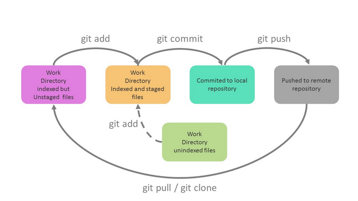

# Git

## ¿Qué es un sistema de control de versiones y cómo afecta directamente a nuestra felicidad?

- Proporciona copias de seguridad automáticas de los ficheros
- Permite volver a un estado anterior de nuestros ficheros
- Ayuda a trabajar de una forma más organizada
- Permite que varias personas trabajen en los mismos ficheros (Fijando regiones críticas)
- Permiten trabajar en varias funcionalidades en paralelo por separado (Ramas)

## Conceptos generales

- Repositorios: contaremos con repositorio local (una carpeta en nuestro ordenador) y un repositorio remoto (alojada en plataformas como GitHub o GitLab)
- Commits: puntos de guardado (o hitos) que se van realizando en los que fijamos los cambios realizados en el código. Podremos volver a ellos para recuperar el estado del código en un determinado momento.
- Remote: conexión que establecemos entre el repositorio local y remoto para la sincronización
- Sincronización (Pull y Push): son los procesos para sincronizar el estado de nuestros sistemas locales con el repositorio remoto, tanto para subir los cambios locales como para descargar las últimas actualizaciones
    - Pull → Servidor a local
    - Push → Local a servidor
- Branches o ramas: son herramientas proporcionadas por los sistemas de control de versiones para poder trabajar paralelamente en distintas versiones del código sin interferir entre si. Suelen utilizarse remas de largo recorrido para las principales versiones de la aplicación (master para la aplicación en producción, staging para aplicación en pruebas…) y ramas puntuales para distintos desarrolladores que participen en el proyecto.

## Control de versiones para trabajo individual

`git add .` → Añadir todos los archivos de la ruta actual a la fase de stage

`git commit -m "mensaje"` → Definir un commit o hito

`git push "remote" "rama"` → Sincronizar los cambios con el repositorio remoto

`git pull` → Sincronizar el repositorio local con el remoto

`git clone "https_url"` → Clonar repositorio en la ruta actual

`git branch -m "nombre" "nuevo_nombre"` → Cambiar el nombre de una rama

`git init` → Inicializar proyecto de git en la ruta actual

`git remote add "remote" "https_url"` → Añadir remote

`git remote remove "nombre_remote"` → Eliminar remote

`git remote -v` → Muestra los remotes con la dirección a la que apuntan

## Guía para trabajar colaborativamente en Git con ramas

Colaboración entre administrador y alumno

1. Administrador
    1. Crea un proyecto
    2. Clona el proyecto en local → `git clone "url"`
    3. Añade contenido
    4. Añade los cambios → `git add .`
    5. Hace commit de los cambios → `git commit -m "mensaje"`
    6. Sube los cambios al repositorio remoto → `git push origin master`
2. Usuario
    1. Hace fork al repositorio remoto del administrador
    2. Elige el destino del fork
    3. Clona su proyecto en local → `git clone "url"`
3. Administrador
    1. Añade contenido
    2. Añade los cambios → `git add .`
    3. Hace commit de los cambios → `git commit -m "mensaje"`
    4. Sube los cambios al repositorio remoto → `git push origin master`
4. Usuario
    1. Añade el remote del repositorio remoto del administrador → `git remote add "nombre" "url"`
    2. Comprueba el remote añadido → `git remote -v`
    3. Sincroniza el repositorio local con el repositorio remoto del administrador → `git pull "nombre_remote" master`
    4. Crea la rama cambios → `git branch cambios`
    5. Cambia de rama a la de cambios → `git checkout cambios`
    6. Añade contenido
    7. Añade los cambios → `git add .`
    8. Hace commit de los cambios → `git commit -m "mensaje"`
    9. Sube los cambios al repositorio remoto → `git push origin cambios`
5. Administrador
    1. Crea una rama en el repositorio remoto para los cambios del usuario
6. Usuario
    1. Crea una merge request desde la rama cambios del repositorio remoto
    2. Cambia la rama raíz y la rama de destino (rama creada por el administrador) de la solicitud de fusión (merge request)
    3. Cambia el titulo de la solicitud
    4. Envía la solicitud de fusión
7. Administrador
    1. Acepta la merge request del usuario
    2. Crea una rama en el repositorio local con el mismo nombre que la rama que se creo en el repositorio remoto → `git branch "nombre_rama"`
    3. Cambia de rama a la recién creada → `git ckeckout "nombre_rama"`
    4. Sincroniza los cambios del repositorio remoto con el repositorio local → `git pull origin "nombre_rama"`
    5. Cambia de rama a la master → `git checkout master`
    6. Fusiona la rama master con la de cambios → `git merge "nombre_rama"`
    7. Sube los cambios al repositorio remoto → `git push origin master`
8. Usuario
    1. Cambia de rama a la master → `git checkout master`
    2. Sincroniza el repositorio local con el repositorio remoto del administrador → `git pull "nombre_remote" master`
    3. Sube los cambios al repositorio remoto → `git push origin master`