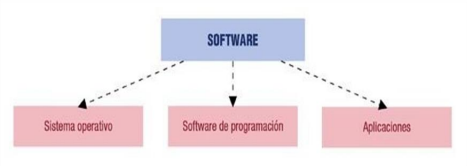
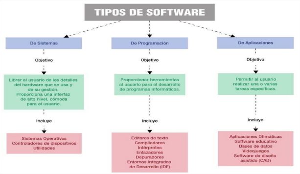
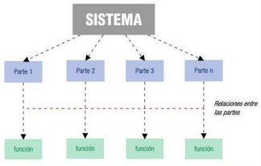
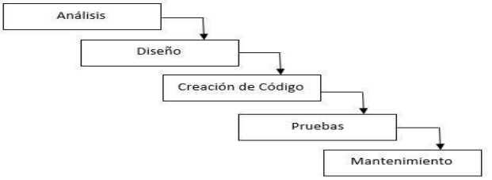
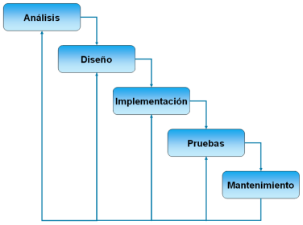

# Desarrollo de software

## Definición de programa informático y software

Un programa informático es un conjunto de instrucciones escritas en un lenguaje de programación que se ejecutan de manera secuencial.

El software es el conjunto de programas informáticos que actúan sobre el hardware para ejecutar lo que el usuario desee.

### Tipos de software

El sistema operativo es el software base que ha de estar instalado y configurado en nuestro ordenador para que las aplicaciones puedan ejecutarse y funcionar.

Windows, Linux, Mac OS X

El software de programación es el conjunto de herramientas que nos permiten desarrollar programas informáticos.

Las aplicaciones informáticas son un conjunto de programas que tienen una finalidad más o menos concreta.

Un procesador de textos, una hoja de cálculo, el software para reproducir música, un videojuegoz

## Conceptos de los lenguajes de programación

Los lenguajes de programación son los que nos permiten comunicarnos con el hardware del ordenador.

Conjunto de instrucciones, operadores, reglas de sintaxis y reglas semánticas.

Hay multitud de lenguajes de programación, cada uno con unos símbolos y unas estructuras diferentes. Además, cada lenguaje está enfocado a la programación de tareas o áreas determinadas. Por ello, la elección del lenguaje a utilizar en un proyecto es una cuestión de extrema importancia.

## Generaciones de los lenguajes de programación

Lenguaje primera generación: son lenguajes de bajo nivel conocidos como lenguaje de máquina.

- Sus instrucciones son combinaciones de unos y ceros
- Es el único lenguaje que entiende directamente el ordenador (no necesita traducción)
- Fue el primer lenguaje utilizado
- Es único para cada procesador (no es portable de un equipo a otro)

Lenguaje segunda generación: son lenguajes ensambladores de bajo nivel.

- Sustituyó al lenguaje máquina para facilitar la labor de programación
- En lugar de unos y ceros se programa usando mnemotécnicos (instrucciones complejas)
- Necesita traducción al lenguaje máquina para poder ejecutarse
- Sus instrucciones son sentencias que hacen referencia a la ubicación física de los archivos en el equipo
- Es difícil de utilizar

Lenguaje tercera generación: son lenguajes de alto nivel, como C, C++, C#, Java, BASIC, JavaScript y Visual Basic.

Lenguaje cuarta generación: son lenguajes que consisten en declaraciones similares a las hechas en un lenguaje humano.

- Los lenguajes de cuarta generación se usan comúnmente en la programación de bases de datos y los ejemplos de scripts incluyen Bash, Perl, PHP, Python, Ruby y SQL

Lenguaje quinta generación: son lenguajes visuales. Ejemplos Mercury, OPS5 y Prolog.

- Están sustituyendo a los lenguajes de alto nivel basados en código
- En lugar de sentencias escritas, se programa gráficamente usando el ratón y diseñando directamente la apariencia del software
- Su correspondiente código se genera automáticamente
- Necesitan traducción al lenguaje máquina
- Son completamente portables de un equipo a otro

## Clasificación de los lenguajes de programación

### Según el nivel de abstracción:

El nivel de abstracción de un lenguaje implica lo alejado que está del código máquina.

Cuanto más parecido sea a nuestro lenguaje y menos al código máquina mayor será el nivel del lenguaje.

- Bajo nivel - Solo hay uno, el código máquina ceros y unos.
- Medio nivel - El lenguaje ensamblador que hace servir instrucciones sencillas para trabajar con datos simples y posiciones de memoria.
- Alto nivel - Todos los demás lenguajes de programación son los que son más cercanos a nuestro lenguaje.

### Según la forma de ejecución:

Compilados: Son los lenguajes que deben ser compilados antes de poder ejecutarse. La compilación es el proceso que consigue que el lenguaje de programación baje de nivel hasta el código máquina y sea capaz de ejecutarse.

Interpretados: Estos lenguajes se ejecutan línea a línea. No necesitamos compilar el programa completo para ejecutarlo. El código interpretado no lo ejecuta directamente el sistema operativo, sino que lo hace un intérprete.

Virtuales: Son parecidos a los lenguajes compilados. No generan un ejecutable propiamente para la máquina en la que se está compilando. Usan una máquina virtual.

### Según el paradigma de programación:

Se basa en:

- El método para llevar a cabo los cálculos en el proceso.
- La forma en la que deben estructurarse las tareas que debe realizar el programa.
- Lenguajes imperativos o estructurados
    
    Se basan en sentencias imperativas. Operaciones una tras otra.
    
    Estas operaciones van modificando los datos de la memoria.
    
    Técnica de la programación estructurada, es decir, de un programa grande y complejo, se divide y se representa con secuencias, selecciones, iteraciones, etc.
    
- Orientado a objetos
    
    Lenguajes que intentan abstraer conceptos de la vida real y representarlos con objetos.
    
    Un objeto es una combinación de datos y métodos diseñados para interactuar entre objetos.
    
- Funcional
    
    Son lenguajes basados en modelos matemáticos.
    
    Funcionan teniendo en cuenta en que el resultado de un cálculo es la entrada del siguiente, siempre de forma sucesiva hasta que se produce un resultado.
    
    Normalmente, estos lenguajes se usan en ámbitos de investigación y aplicaciones matemáticas.
    
- Lógico
    
    Son lenguajes cuya finalidad es la de acabar respondiendo preguntas planteadas al sistema para resolver problemas.
    
    Necesita una base de conocimientos formada por hechos (la información).
    
    También necesitan reglas lógicas que permitan deducir las consecuencias de combinar los hechos.
    
    Se hacen servir para investigación.
    

## Desarrollo de software

Entendemos por Desarrollo de Software todo el proceso que ocurre desde que se concibe una idea hasta que un programa está implementado en el ordenador y funcionando.

La serie de pasos a seguir para desarrollar un programa es lo que se conoce como Ciclo de Vida del Software.

## Fases del desarrollo de software

1. Análisis de requisitos → Se especifican los requisitos funcionales y no funcionales del sistema.
2. Diseño → Se divide el sistema en partes y se determina la función de cada una.
3. Codificación → Se elige un lenguaje de programación y se codifican los programas.
4. Pruebas → Se prueban los programas para detectar errores y se depuran.
5. Documentación → De todas las etapas, se documenta y guarda toda la información.
6. Explotación → Instalamos, configuramos y probamos la aplicación en los equipos del
cliente.
7. Mantenimiento → Se mantiene el contacto con el cliente para actualizar y modificar
la aplicación en el futuro.

### Análisis de requisitos

Es la primera etapa del proyecto, la más complicada y la que más depende de la capacidad del analista.

Se especifican y analizan los requisitos funcionales y no funcionales del sistema.

- Funcionales: Qué funciones tendrá que realizar la aplicación. Qué respuesta dará la aplicación ante todas las entradas. Cómo se comportará la aplicación en situaciones inesperadas.
- No funcionales: Tiempos de respuesta del programa, legislación aplicable, tratamiento ante la simultaneidad de peticiones, etc.

Lo fundamental es la buena comunicación entre el analista y el cliente para que la aplicación que se va a desarrollar cumpla con sus expectativas.

La culminación de esta fase es el documento ERS (Especificación de Requisitos Software). En este documento quedan especificados:

- La planificación de las reuniones que van a tener lugar.
- Relación de los objetivos del usuario cliente y del sistema.
- Relación de los requisitos funcionales y no funcionales del sistema.
- Relación de objetivos prioritarios y temporización.
- Reconocimiento de requisitos mal planteados o que conllevan contradicciones, etc.

### Diseño

Durante esta fase, dónde ya sabemos lo que hay que hacer, el siguiente paso es, ¿cómo hacerlo?

Se debe dividir el sistema en partes y establecer qué relaciones habrá entre ellas. Decidir qué hará exactamente cada parte.

En definitiva, debemos crear un modelo funcional-estructural de los requerimientos del sistema global, para poder dividirlo y afrontar las partes por separado.

En este punto, se deben tomar decisiones importantes, tales como:

- Entidades y relaciones de las bases de datos.
- Selección del lenguaje de programación que se va a utilizar.
- Selección del Sistema Gestor de Base de Datos.

### Codificación. Tipos de código

Durante la fase de codificación se realiza el proceso de programación.

Consiste en elegir un determinado lenguaje de programación, codificar toda la información anterior y llevarlo a código fuente.

Esta tarea la realiza el programador y tiene que cumplir exhaustivamente con todos los datos impuestos en el análisis y en el diseño de la aplicación.

Las características deseables de todo código son:

1. Modularidad: que esté dividido en trozos más pequeños.
2. Corrección: que haga lo que se le pide realmente.
3. Fácil de leer: para facilitar su desarrollo y mantenimiento futuro.
4. Eficiencia: que haga un buen uso de los recursos.
5. Portabilidad: que se pueda implementar en cualquier equipo.

### Pruebas

La realización de pruebas es imprescindible para asegurar la validación y verificación del software construido.

Podemos distinguir dos:

- Pruebas unitarias:
    
    Consisten en probar, una a una, las diferentes partes de software y comprobar su funcionamiento (por separado, de manera independiente). JUnit es el entorno de pruebas para Java.
    
- Pruebas de integración:
    
    Se realizan una vez que se han realizado con éxito las pruebas unitarias y consistirán en comprobar el funcionamiento del sistema completo: con todas sus partes interrelacionadas.
    

La prueba final se denomina comúnmente Beta Test, esta se realiza sobre el entorno de producción donde el software va a ser utilizado por el cliente (a ser posible, en los equipos del cliente y bajo un funcionamiento normal de su empresa).

El período de prueba será normalmente el pactado con el cliente.

### Documentación

Todas las etapas en el desarrollo de software deben quedar perfectamente documentadas.

- Para dar toda la información a los usuarios de nuestro software y poder acometer futuras revisiones del proyecto.
- Una correcta documentación permitirá la reutilización de parte de los programas en otras aplicaciones, siempre y cuando se desarrollen con diseño modular.

Distinguimos tres grandes documentos en el desarrollo de software:

|  | Guia técnica | Guia de uso | Guia de instalación |
| --- | --- | --- | --- |
| Quedan reflejados: | El diseño de la aplicación
La codificación de los programas
Las pruebas realizadas | Descripción de la funcionalidad de la aplicación
Forma de comenzar la ejecución de la aplicación
Ejemplos de uso del programa
Requerimientos del software de la aplicación
Solución de los posibles problemas que se puedan presentar | Toda la información necesaria para:
Puesta en marcha
Explotación
Seguridad del sistema |
| A quien va dirigido? | Al personal técnico en informática (analistas y programadores) | A los usuarios que van a usar la aplicación (clientes) | Al personal informático responsable de la instalación, en colaboración con los usuarios que van a usar la aplicación (clientes) |
| Cuál es su objetivo? | Facilitar un correcto desarrollo, realizar correcciones en los programas y permitir un mantenimiento futuro | Dar a los usuarios finales toda la información necesaria para utilizar la aplicación | Dar toda la información necesaria para garantizar que la implantación de la aplicación se realice de forma segura, confiable y precisa |

### Explotación

- La explotación es la fase en que los usuarios finales conocen la aplicación y comienzan a utilizarla.
- La explotación es la instalación, puesta a punto y funcionamiento de la aplicación en el equipo final del cliente.
- Es muy importante tenerlo todo preparado antes de presentarle el producto al cliente, será el momento crítico del proyecto.

### Mantenimiento

- La etapa de mantenimiento es la más larga de todo el ciclo de vida del software.
- El software es cambiante y deberá actualizarse y evolucionar con el tiempo. Deberá ir adaptándose de forma paralela a las mejoras del hardware en el mercado y afrontar situaciones nuevas que no existían cuando el software se construyó.
- Además, siempre surgen errores que habrá que ir corrigiendo y nuevas versiones del producto mejores que las anteriores.
- Por todo ello, se pacta con el cliente un servicio de mantenimiento de la aplicación (que también tendrá un coste temporal y económico).
- El mantenimiento se define como el proceso de control, mejora y optimización del software.

## Modelos de ciclo de vida

Siempre se debe aplicar un modelo de Ciclo de Vida del Software al desarrollo de cualquier proyecto software.

Algunos tipos de modelos:

1. Modelo en Cascada
2. Modelo en Cascada con Realimentación
3. Modelos Evolutivos:
    1. Modelo Iterativo Incremental
    2. Modelo en Espiral

### Modelo en Cascada

Es el modelo de vida clásico del software. Es prácticamente imposible que se pueda utilizar, ya que requiere conocer de antemano todos los requisitos del sistema.

Solo es aplicable a pequeños desarrollos, ya que las etapas pasan de una a otra sin retorno posible. (Se presupone que no habrá errores ni variaciones del software).

### Modelo en Cascada con Realimentación

Es uno de los modelos más utilizados.

Proviene del modelo anterior, pero se introduce una realimentación entre etapas, de forma que podamos volver atrás en cualquier momento para corregir, modificar o depurar algún aspecto. No obstante, si se prevén muchos cambios durante el desarrollo, no es el modelo más idóneo.

Es el modelo perfecto si el proyecto es rígido (pocos cambios, poco evolutivo) y los requisitos están claros.

### Modelos Evolutivos

Son más modernos que los anteriores. Tienen en cuenta la naturaleza cambiante y evolutiva del software.

Distinguimos dos variantes:

- Modelo Iterativo Incremental: Está basado en el modelo en cascada con realimentación, donde las fases se repiten y refinan, y van propagando su mejora a las fases siguientes.
- Modelo en Espiral: Es una combinación del modelo anterior con el modelo en cascada. En él, el software se va construyendo repetidamente en forma de versiones que son cada vez mejores, debido a que incrementan la funcionalidad en cada versión. Es un modelo bastante complejo.