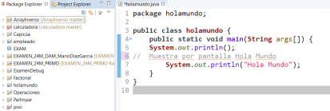
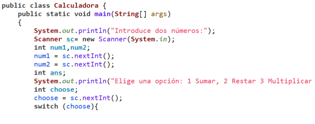
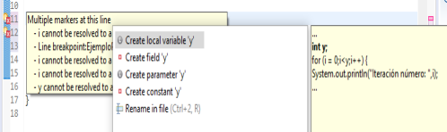
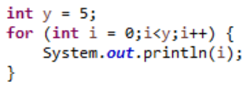
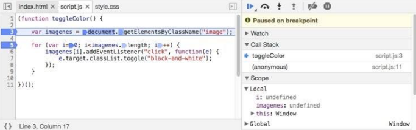
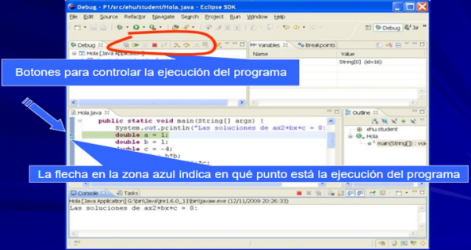
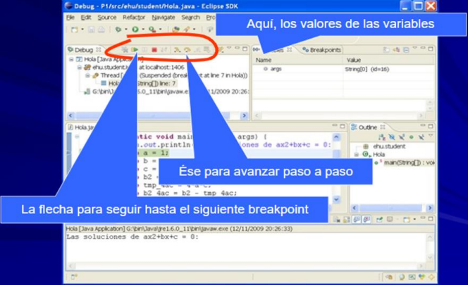

# Entornos de desarrollo integrados (IDE)

## Definición de Entorno de Desarrollo Integrado (IDE)

Tareas del programador:

- Codificar con un lenguaje de programación determinado.
- Asegurarse que código fuente sea valido y tenga sentido antes de ser compilado.
- Compilar el código.
- Verificar que el ejecutable funciona correctamente.

Un IDE es un programa que nos ofrece todas estas herramientas que necesitamos para programar en un único programa.

## Objetivo de un IDE

El objetivo principal es ayudar al programador en la tarea de desarrollar y diseñar software.

Esta ayuda es gracias a las múltiples herramientas que vienen incluidas.

Ejemplo: el editor de código dispone de una serie de herramientas cómo la función de autocompletar, resaltar posibles errores y advertencias.

## ¿En qué nos puede ayudar un IDE?

- Programar de una forma más cómoda
    - Barras de menú
    - Diferentes vistas
    - Atajos de teclado
- Mejorar nuestro rendimiento
    - Herramientas dentro de un mismo programa
    - Integradas unas con otras
    - Ganamos en comodidad a la hora de programar
- Nos ayuda a no depender de diferentes programas
    - Nos proporciona todo junto e integrado

## ¿Qué criterios hemos de tener en cuenta para escoger un IDE?

1. El sistema operativo en el que vamos a trabajar
    - Es el primer software que está en contacto con el hardware.
    - Es el que va a comunicar el código máquina con el hardware.
    - Al descargar Eclipse o NetBeans nos pregunta qué versión de sistema operativo vamos a usar. Esto determina parte de la arquitectura interna del IDE.
2. Para qué sistema operativo se va a desarrollar nuestro software
    - El sistema operativo en el que se va a ejecutar nuestra aplicación (podemos trabajar con Windows y generar ejecutables para Windows y Linux).
    - El ejecutable debe estar adaptado al sistema operativo en que se va a ejecutar.
3. El lenguaje de programación
    - No nos podemos guiar por un lenguaje que nos resulte más fácil, con el que hemos aprendido o que nos guste más.
    - Esta decisión se basa en las necesidades y requisitos que tiene nuestro programa.
    - Un IDE puede soporta varios lenguajes de programación.
4. Las herramientas que dispone el IDE
    - Investigar qué herramientas dispone el IDE y ver si se adecuan a nuestras necesidades o nos pueden resultar prácticas.
    - Ejemplo en Eclipse se le pueden añadir herramientas que se integran fácilmente a modo de plugins.

## Las diferentes herramientas que podemos encontrar en un IDE

1. Compilador
    - Es la herramienta que permite compilar el código fuente de un lenguaje de programación a lenguaje máquina con tal de que pueda ser interpretado por el procesador.
2. Ejecutar de forma virtual
    - El IDE permite ejecutar el programa de forma virtual (RUN).
    - Para ejecutar de forma virtual nuestro código no debe tener errores de compilación.
    
    
    
3. Depurador
    - Es la herramienta que nos permite probar y depurar el código fuente del programa.
    - También nos permite detectar errores.
    - Gracias al depurador podemos:
        - Ejecutar el código línea a línea.
        - Pausar el programa en un momento determinado.
        - Manipular los valores de las variables modificar partes del programa mientras se ejecuta.
4. Control de versiones
    - Es la herramienta que hace posible tener un registro histórico de las tareas hechas o versiones del código fuente.
5. Refactorización
    - Es una técnica que permite reestructurar el código fuente mejorarlo sin alterar la funcionalidad.
    - El IDE puede ayudarnos a refactorizar el código una vez codificado.
6. Documentación
    - Los IDE nos van a ayudar para generar la documentación del código que lo vamos construyendo como por ejemplo pasa con JavaDoc.
7. El gestor de proyectos
    - El IDE de Eclipse nos proporcionará asistentes y ayudas para la creación de proyectos.
    - Por ejemplo, cuando creamos uno, se abre la perspectiva adecuada al tipo de proyecto que estemos creando, con la colección de vistas, editores y ventanas preconfigurada por defecto.
    
    
    
8. El editor de texto
    - Es la ventana que nos permite crear y editar el texto del código fuente.
    - Normalmente es un editor de texto plano.
    
    
    
    1. Autocompletado de código
        - Predice la palabra que el usuario intenta codificar después de solo introducir uno unos pocos caracteres
        - Se anticipa a lo que vamos a escribir.
        - Hace sugerencias con cierta lógica.
        
        
        
    2. Coloreado de sintaxis
        - Resalta las palabras del código fuente con diferentes colores o formato (negrita o cursiva) para mejorar la legibilidad del código.
        - Normalmente se marcan con color diferente las palabras reservadas.
        
        
        
    3. Inspecciones de clases y objetos
        - El inspector nos muestra los componentes de los objetos de forma jerárquica.
        - Nos permite ver la estructura de los objetos y estructura de los componentes.
9. Vistas
    - Son ventanas auxiliares, que nos sirven para mostrar diferentes tipos de contenidos:
        - El valor de las variables
        - El árbol de directorios del proyecto
        - La vista debug
10. Añadir y modificar la barra de herramientas
    - Una perspectiva es un conjunto de ventanas de editores y vistas relacionadas entre sí.
    - Según la perspectiva que tengamos en nuestro IDE tendremos una serie de herramientas u otras. Por ejemplo, no es lo mimo estar en la vista Java que en la vista debug.
    - Todas las barras de herramientas que aparecen, se pueden personalizar. De tal modo que podemos mostrar más herramientas, ocultarlas o cambiar de ubicación.
11. Configurar diferentes interfaces
    - Los IDE nos van a permitir configurar diferentes interfaces con distintas herramientas posición de ventanas mostrar ocultar herramientas o utilidades.
12. Comandos personalizados y atajos de teclado
    - Nos permiten ejecutar tareas de forma más rápida a partir de una combinación de teclas.

## El uso básico de un IDE

El uso podría ser:

- Codificar mediante el editor de código fuente
- Realizar pruebas y verificar el código con el depurador
- Compilar el código fuente
- Trabajar colaborativamente
1. El desarrollo colaborativo
    
    Los proyectos de software casi siempre requieren desarrollo colaborativo, es decir más de un programador va dedicarse a codificar en el mismo proyecto.
    
    - Gracias al IDE, podemos hacer un control de versiones.
    - Elegir qué archivos actualizar.
    - Omitir cambios para no pisar nuestro trabajo con el de otros, y viceversa.
    - Saber qué archivos han cambiado y tenerlo directamente sobre el código que estamos actualmente desarrollando.
    
    En los IDE podemos encontrarnos con herramientas asíncronas que permiten controlar y gestionar las fuentes y versiones del código del repositorio.
    
    Constan de servidor y cliente.
    
    En la parte del servidor se crean repositorios para que los clientes puedan descargar y subir código.
    

## La instalación de un IDE

La instalación de IDE Eclipse, requiere la instalación previa del JDK compatible con la versión de Eclipse que se quiera instalar.

JDK (kit de desarrollo de Java): conjunto de herramientas, utilidades para desarrollar aplicaciones Java.

JDK nos permite ejecutar y desarrollar aplicaciones Java y esta formado por:

- JRE: Es la maquina virtual de Java.
- Java SE: las librerías (códigos) Java necesarios para ejecutar programas de escritorio.

Diferentes implementaciones de JDK:

- J2SE para aplicaciones de escritorio.
- J2EE para aplicaciones distribuidas y webs (Servlets/JSP, RMI, EJB).
- J2ME para plataformas con recursos más reducidos como móviles o PDAs.

## Depuración de código en Eclipse

1. Concepto de depuración
    - Es un proceso que permite identificar y corregir errores mediante la ejecución controlada del software de nuestro proyecto, sin más que ir ejecutando línea a línea las instrucciones que forma el código.
    - Gracias al depurador, podemos observar los valores de los diferentes métodos, variables u objetos. Para este fin, el programador tendrá que colocar una serie de puntos de control (breakpoints) donde se detendrá la ejecución para inspeccionar los valores de las variables.
2. Puntos de ruptura (Breakpoints)
    - Son puntos de control situados en líneas concretas de nuestro código fuente. Cuando el depurador pasa por uno de estos puntos, detiene la ejecución del programa.
    - Antes de arrancar la ejecución, hay que poner al menos uno.
    - Cada punto se establece en una línea concreta del código.
    
    
    
3. Ejecución con el debugger
    - Sitúa el puntero en una línea del programa.
    - Selecciona: Debug As → Java Application
    
    
    
    
    

Resume: continúa la ejecución del programa hasta el próximo punto de ruptura o hasta que finaliza la ejecución.

Terminate: finaliza la ejecución del programa.

Step into: se ejecuta la línea actual, en caso de ser una llamada a un método, la ejecución continúa dentro del método.

- Ejecuta todas sus líneas.

Step over: se ejecuta la línea actual y se pasa a la línea siguiente sin entrar en los métodos.

- Lo ejecuta completamente pero sin ir línea a línea.

Step return: se sigue ejecutando hasta que se ejecute un return.

---

<aside>
⚫ Eclipse

Activar/desactivar ventanas → Window > Show View > `ventana`

Resetear la vista → Window > Perspective > Reset Perspective

Nuevo proyecto → File > New > Proyect >> Java > Java Proyect > 

Apariencia del IDE → Window > Preferences >> General > Apparency >

Cambiar color al texto → Window > Preferences >> Java > Editor > Syntax coloring >> Java > `texto`

Importar configuración de eclipse → File > Import…

Exportar configuración de eclipse → File > Export… >> General > Preferences >> 

Ejecutar código → Run

Asistente de código → Windows > Preferences >> Java > Editor > Content Assist > Auto activation > Auto activation triggers for Java >

Auto comentar línea → ctrl+shift+c

</aside>

<aside>
🔵 VSCode

Activar/desactivar ventanas → View > Appearance > `ventana`

Resetear la vista → Editar >> `%APPDATA%\Code\User\settings.json`

Nuevo proyecto → Ctrl+Shift+p > Create Java Project > No build tools > `Carpeta` > `Nombre`

Apariencia del IDE → Manage > Color Theme >

Cambiar color al texto → Manage > Settings >> Extensions > `*Theme*:Color`

Importar configuración de eclipse → File > Share > Import Profile

Exportar configuración de eclipse → File > Share > Export Profile

Ejecutar código → F5

Asistente de código →  TAB

Auto comentar línea → ctrl+/

</aside>