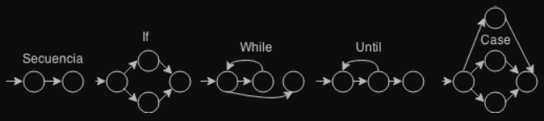
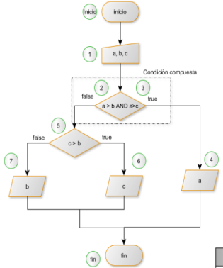
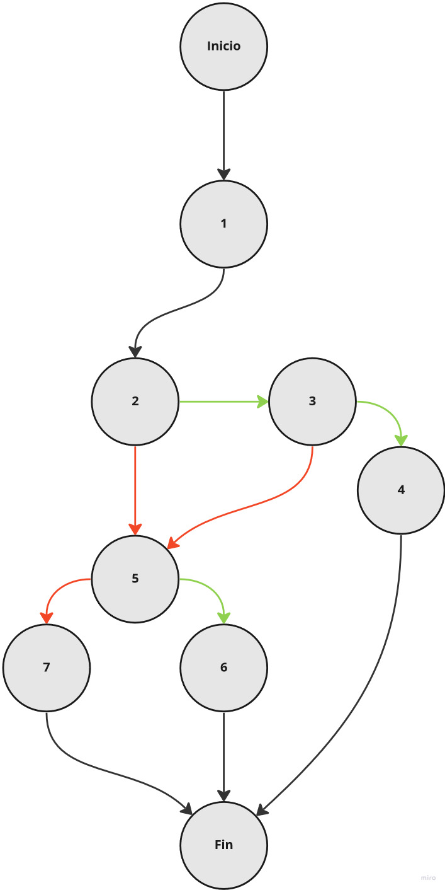
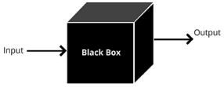
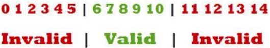

# Pruebas de software

## Introducción

Cada día que pasa, el software es pieza fundamental en el funcionamiento de maquinaria, instalaciones, equipamientos, sistemas expertos, financieros y biomédicos,

Sistemas software en la actualidad:

- Características: mayor tamaño, importante nivel de seguridad y bienestar, y complejidad.
- Aspectos clave: calidad del producto, precio competitivo, reducción de costes, etc.

Para entender las pruebas debemos diferenciar los términos error, fallo y defecto:

- Error: está provocado por la acción humana, por ejemplo el error lo provocará el desarrollador que realizará una incorrecta interpretación de un método del programa que producirá un resultado no esperado.
- Defecto: provocado por un error de implementación, por ejemplo el defecto lo provocará el haber utilizado el operador “x + y > z” en vez de “x + y >= z”
- Fallo: al ejecutar el programa con un defecto obtendremos resultados no deseados, por ejemplo, cuando el resultado de la suma de los dos componentes fuese igual, no obtendríamos los mismos resultados al compararlos con las sentencias indicadas anteriormente. En sistemas muy complejos, como pueden ser una lanzadera espacial o una central eléctrica, pueden llegar a producir efectos catastróficos.

¿Por qué son importantes las pruebas?

Hoy en día, forman parte de nuestras vidas multitud de sistemas que contienen software, como por ejemplo los coches, smartphones, sistemas de producción de energía, programas bancarios, etc.

## Diseño y realización de pruebas

### Las pruebas

Las pruebas de software son un conjunto de procesos con los que se pretende probar un sistema o aplicación en diferentes momentos para comprobar su correcto funcionamiento.

Por norma general, tendremos que probarlo y verificar que todo funciona.

Necesitamos una serie de pruebas que nos garanticen que ejecutamos nuestro código y hace lo que debe hacer.

- Planificar las pruebas
    
    Las pruebas no son algo que se haga sin más, requieren de una planificación.
    
    Normalmente se realizará una checklist con los casos a probar.
    
- ¿Quién se encarga de hacer las pruebas?
    
    Normalmente la misma persona qué se dedica codificar, es decir el programador.
    
    La mejor práctica es ir probando a medida que codificamos y no esperar a una fase posterior para probar.
    
- ¿Cuánto tiempo se debe dedicar a las pruebas?
    
    ¡Podríamos dedicar un tiempo mucho mayor a realizar las pruebas que a codificar!
    
    Mejor práctica:
    
    - Dedicar el tiempo suficiente a las pruebas
    - Acotarlo para evitar que se alargue demasiado

### Herramientas para hacer las pruebas y detectar errores

- El depurador
    
    El depurador es una herramienta permite ver el proceso del programa paso a paso.
    
    Podemos ver cómo funciona el código
    
    Controlar:
    
    - Valores guarda una variable
    - Cómo se comporta una determinada función
- El analizador de código
    
    Esta herramienta nos ayuda a identificar en tiempo real errores en el código.
    
    “Nos ayuda con los despistes o de malas prácticas”
    
    Por ejemplo, cuando codificamos en el IDE eclipse una clase de Java el analizador de código nos puede advertir cosas como:
    
    - Avisar que falta un punto y coma.
    - Que estamos cambiando una variable de tipo.
    - Hemos escrito algo mal y el editor de código no lo entiende.
    
    El analizador estático de código nos indicará si hay Errores o Warnings.
    
    - Los errores
        
        Son avisos de que algo va mal.
        
        - Aspa de color rojo en el margen.
        - Si no corregimos este error no podremos compilar.
    - Los Warnings
        
        Son avisos de que algo podría ir mal.
        
        - Posibles valores de variables que se pueden desbordar.
        - Perdidas de valores en variables.
        - Alguna variable sin inicializar.
        
        Se puede compilar si solo hay warnings
        

### Errores típicos en análisis del código

Se muestra cuando se usa una variable que no se ha declarado previamente.

En Java SIEMPRE se declara una variable antes de su uso.

Declaración de una variable en Java:

`tipo_var nombre_var = valor_inicial;`

Incorrecto:

```java
num=0;

mensaje="Hola";

int num=2;
int num2=3;
num3+num1+num2;
```

Correcto:

```java
int num=0;

String mensaje="Hola";

int num3;
int num=2;
int num2=3;
num3=num+num2;
```

## Error de tipo de variable

Se muestra cuando se ‘mezcla’ el uso de variables con tipos diferentes.

El tipo de una variable es lo que decide qué valores una variable puede contener.

Incorrecto:

```java
int num1=2;
int num2="Hola";

String entrada=br.readLine();
int num1=entrada;

int num1,num3;
String entrada=br.readLine();
String num2=entrada;
num3=num1+num2;
```

Correcto:

```java
int num1=2;
int num2=5;

String entrada=br.readLine();
int num1=Integer.valueOf(entrada);

int num1,num3;
String entrada=br.readLine();
int num2=Integer.valueOf(entrada);
num3=num1+num2;
```

## Error de importación

Se muestra cuando se usa una clase Java pero no se ha importado la librería o el paquete correspondiente.

Una librería Java es un conjunto de clases Java (compiladas) que ofrecen una funcionalidad y pueden ser usadas en nuestros programas.

Por ejemplo, java.io.* es una librería para el manejo de I/O y de las excepciones

`BufferedReader br=new BufferredReader(new InputStreamReader(System.in));`

```java
import java.io.BufferReader;
import java.io.InputStreamReader;

BufferReader br=new BufferReader(new InputStreamReader(System.in));
```

## El desarrollo y la realización de pruebas

### El objetivo de una prueba

El objetivo de una prueba es el de detectar errores.

Una prueba no puede asegurar la ausencia de errores.

Aunque salga bien, no quiere decir que todos los casos funcionen correctamente.

### ¿Qué son los casos de pruebas?

Condiciones que se establecen con el objetivo de determinar si la aplicación funciona correctamente.

- Ejemplo de suma de una calculadora:
    
    En el programa entran los valores A y B y como salida tenemos un único resultado con el valor de la suma. A priori podemos pensar que esta función es muy sencilla y no es necesario probarla. Pero no es así hemos de tener en cuenta una serie de casos:
    
    - Sumar números enteros positivos:
        
        Sumamos A con valor 3 y B con valor 2 como resultado de salida esperamos un 5.
        
        Este caso de prueba nos puede indicar que en el caso de valores positivos enteros funciona correctamente.
        
    - Sumar un número entero negativo con uno positivo:
        
        Sumamos A con valor -3 y B con valor 2. Sí hemos implementado bien la función suma, nos debería aparecer un resultado negativo con valor de -1. Piensa que hubiera pasado si nuestras variables solo soportará números enteros (es decir solo números positivos del 0 en adelante). Nuestra función podría dar error.
        

### Tipos de pruebas

- Pruebas unitarias
    
    Para verificar el correcto funcionamiento de una unidad de código.
    
    - Pruebas individuales
    - Conocemos los datos de entrada
    - Sabemos el resultado esperado
    - Pertenecen a los casos de prueba de caja blanca
    
    Tipos de pruebas unitarias:
    
    - Pruebas de caja blanca
        
        Se centran en el funcionamiento interno del programa, observando y comprobando cómo se realiza una operación.
        
        Mediante esta técnica se pueden obtener casos de prueba que:
        
        - Garanticen que se ejecutan al menos una vez todos los caminos independientes de cada módulo.
        - Ejecuten todas las sentencias al menos una vez.
        - Ejecuten todas las decisiones lógicas en su parte verdadera y en su parte falsa(if, else, etc.). Prueba de condiciones
        - Ejecuten todos los bucles en sus limites.
        
        Notación de grafo de flujo: es una representación de los caminos que puede tomar un programa durante su ejecución.
        
        
        
        - Prueba del camino básico
            
            La prueba del camino básico, es una prueba de “caja blanca” que consiste en verificar el código de nuestros sistemas de manera que comprobemos que todo funciona correctamente, es decir, se debe verificar que todas las instrucciones del programa se ejecutan por lo menos una vez. Estas instrucciones quedan agrupadas en bloques como los que se indican:
            
            
            
            
            
        - Complejidad ciclomática
            
            $V(C)=Aristas-Nodos+2$
            
        - Caminos independientes
            
            
            | Camino | Entrada |
            | --- | --- |
            | I,1,2,3,5,6,F | T,F,T |
            | I,1,2,3,4,F | T,T |
            | I,1,2,5,7,F | F,F |
            | I,1,2,5,6,F | F,T |
    - Pruebas de caja negra
        
        Son las pruebas funcionales. Para entender el concepto de las pruebas tenemos que pensar en que nuestro programa o función es como una caja totalmente opaca, con lo cuál no podemos ver lo que hay dentro. Esta caja solo tiene unos agujeritos por donde entraran unos valores (input) y otros agujeritos por donde saldrá alguna cosa (output). Lo que pasa dentro, no lo vamos a ver, por lo tanto nos centramos en lo que entra y lo que sale.
        
        
        
        - Particiones equivalentes
            
            Consiste en dividir y separar los campos de entrada según el tipo de dato y las restricciones que conllevan.
            
            
            
- Pruebas de integración
    - Detectar errores entre la comunicación entre diferentes funciones o componentes.
    - Se hacen una vez que se han hecho las pruebas unitarias.
    - Prueban diferentes funciones en conjunto.
    
    Ejemplo: para la calculadora, una vez se han probado las funciones suma, resta, multiplicación y división de forma individual, se deben hacer las pruebas de integración entre todas estas (con una operación compuesta 3+2-6*3/2). Ya que tal vez por si solas funcionan correctamente, pero una vez que las funciones están integradas y se deben pasar parámetros de unas a otras será necesario hacer estas pruebas.
    
- Pruebas de sistema
    - Son las pruebas que se deberían hacer después de las pruebas de integración
    - Estas pruebas pretenden verificar que el sistema completo funciona (desde el punto de vista de la aplicación)
    
    Ejemplo: en la calculadora, deberíamos ejecutar el programa de la misma forma que lo haría un usuario y verificar que realiza todas las operaciones correctamente.
    
    Las pruebas de sistema abarcan aspectos como:
    
    - Rendimiento: tiempos de respuesta
    - Seguridad: permisos y proteger el acceso al sistema
    - Usabilidad: experiencia de usuario
    - Instalación: problemas al instalarse en diferentes sistemas operativos o compatibilidades
    1. Pruebas de carga: son pruebas de rendimiento del software.
        
        Ejemplo: se le hace una demanda elevada de peticiones para verificar que no se altera el funcionamiento.
        
    2. Pruebas de estrés: se simula un escenario de situaciones extremas con tal de ver el comportamiento ante estos escenarios.
        
        Ejemplo: provocar que el sistema caiga con un gran número de peticiones y ver si es capaz de recuperarse.
        
    3. Pruebas de seguridad: cuando hay diferentes niveles de permisos en la aplicación.
        
        Ejemplo: una aplicación académica en la que pueden acceder, invitados , alumnos, profesores y directores se puede verificar que cada perfil pueda acceder a sus datos pero no a los de un perfil superior.
        
- Pruebas de aceptación
    
    Validar si el software cumple con las expectativas del cliente y de los usuarios.
    
    Podemos clasificarlas en:
    
    1. Pruebas alfa: estas pruebas se hacen al final del desarrollo con el usuario final acompañado de los programadores o de alguien relacionado en el desarrollo. El cliente y el desarrollador toman nota juntos de los aspectos a corregir o mejorar.
    2. Pruebas beta: estas pruebas se hacen al final del desarrollo con usuarios finales con el software en producción o bien en una fase beta previa al lanzamiento. A diferencia de las pruebas alfa, estas pruebas pretenden que las haga el usuario final en un entorno no controlado. El cliente prueba el software solo y toma nota de los aspectos a corregir o mejorar, después se los enviará al equipo de desarrollo para que lo mejore.

## Pruebas unitarias. Junit

- Son un tipo de pruebas de software de ‘caja blanca’. Pueden resultar esenciales para el buen desarrollo del software. En las empresas de diseño WEB llegan a tener empleados que están destinados a las tareas de ‘software testing’.
- Las pruebas unitarias son pruebas individuales para un método o clase, realizadas de manera sistemática a modo de batería. Podemos lanzar pruebas sobre el software mediante la simulación con valores de entrada concretos, conociendo, de antemano, los valores de  salida esperados.
- Las pruebas han de realizarse con carácter ‘casi obligatorio’. La cantidad de software testeado influye en la cobertura de la aplicación, la cual ha de tener un valor mínimo para poder ser desplegada a producción.

JUNIT es un paquete JAVA que sirve para automatizar las pruebas en las clases.

Un ejemplo de caso de prueba sería el siguiente:

```java
import static org.junit.Assert.*;
import org.junit.Test;

public class Ejemplo {
	@Test
	public void test() {
		//Pruebas
	}
}
```

Dentro de esa clase, preparamos casos de prueba, que son métodos de java:

- No devuelven nada (void)
- Están etiquetados como `@Test`
- No tienen argumentos `()`
- Contienen aserciones

```java
@Test
public void pruebaSuma() {
	assertEquals(4,2+2);
	assertEquals(2,2+0);
	assertEquals(2,0+2);
}
```

### Aserciones para probar

JUnit incluye una serie de métodos para probar que las cosas son como esperamos. Aunque se remite al lector a la documentación detallada del paquete, las siguientes funciones son básicas:

| Aserción | Definición |
| --- | --- |
| assertEquals(x esperado, x real) | Compara un resultado esperado con un resultado obtenido, determina que prueba pasa si son iguales, y que la prueba falla si son diferentes.
Usa el método equals().
Realmente el método es una colección de métodos para una amplia variedad de tipos X. |
| assertSame(x esperado, x real) | Usa == para determinar si es el objeto esperado. |
| assertFalse(boolean resultado) | Verifica que el resultado es false. |
| assertTrue(boolean resultado) | Verifica que el resultado es true. |
| assertNull(Object resultado) | Verifica que el resultado es null. |
| assertNotNull(Object resultado) | Verifica que el resultado no es null. |
| fail | Sirve para detectar que estamos en un sitio del programa donde no deberíamos estar |

## Resumen

Como conclusión de todo lo anterior podríamos sacar las siguientes enseñanzas:

- Las pruebas de software son un conjunto de técnicas que nos permiten asegurar la calidad del producto que estamos desarrollando en sus diferentes etapas del ciclo de vida.
- Aunque tienen un coste de desarrollo y mantenimiento extra, son especialmente útiles para facilitar la calidad del software a medio y largo plazo.
- El tipo y cantidad de pruebas tiene que ser acorde al producto que estamos desarrollando: no es lo mismo un producto grande que una aplicación web para anotar tareas.
- Todo software debería tener algún tipo de prueba para asegurar su calidad independientemente del tamaño del mismo o del número de personas involucradas en su desarrollo.