# Diagramas de clases en UML

UML = Lenguaje unificado de modelado

## Introducción a UML

Se trata de una herramienta que permite a los creadores de sistemas generar diseños del comportamiento y de la estructura del software.

- Permite representar los diseños en una forma fácil de comprender
- Fácil de comunicar a otras personas
- Su objetivo es que sea fácil de entender y rápido de crear

Al ser un lenguaje unificado con unos estándares que todos los programadores entienden, podemos realizar diferentes tipos de diagramas que nos hacen más fácil la tarea de representar muchos apartados del software.

Existen muchos tipos de diagramas UML, aunque en la práctica no siempre será necesario hacer servir todos los diagramas para un proyecto. Normalmente y en el nivel que nos encontramos los que más utilizan son los diagramas de clases, de secuencia, de casos de uso y de actividad.

## Tipos de diagramas

- **Estructura** o visión estática del proyecto: para describir el sistema a través de los elementos que lo forman.
- **Comportamiento** o visión dinámica del proyecto: para describir el sistema explicando lo que ha de pasar.

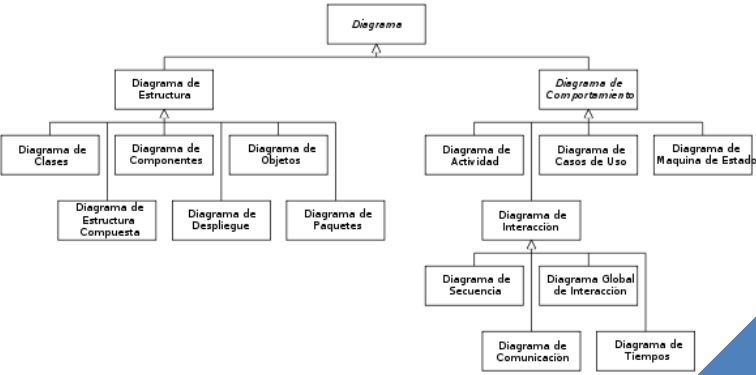

## Conceptos básicos sobre el paradigma de la programación orientado a objetos

- Una clase es la unidad básica que encapsula toda la información de un objeto a través de la cual posemos modelar el entorno. Una clase describe un conjunto de objetos que comparten los mismos atributos y las operaciones que representan las acciones que puede hacer.
- Los atributos son características propias de cada objeto.
- Los métodos son las acciones que podemos llegar a realizar.
- Un objeto es una instancia de una clase.

## Diagramas de clases en UML

Es un diagrama que relaciona las clases y sus diferentes operaciones entre si.

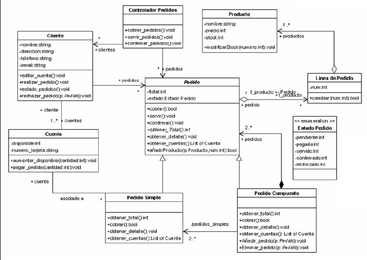

## Notación de los diagramas de clases

### Clases

Se dibuja como un rectángulo compuesto de tres partes:

- Nombre de la clase
- Atributos, habrá que indicar su visibilidad
- Métodos u operaciones con su declaración y visibilidad

### Visibilidad

Los atributos y los métodos tienen una visibilidad:

➕ → Publico: se puede acceder por todas las clases

➖ → Privado: se puede acceder únicamente desde la misma clase

#️⃣ → Protected: puede ser accedida únicamente desde la misma clase o desde las clases que hereden de ella (clases derivadas)

### Relaciones entre clases

- Asociación
    - La asociación es la más básica de las relaciones
    - Se representan mediante una flecha simple
    - Puede tener una cardinalidad
    - Puede ser tanto composición como una agregación
    
    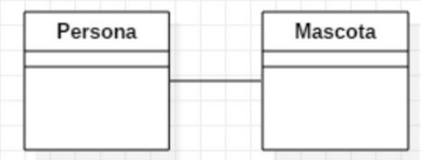
    
- Composición
    
    
    - Define los componentes de las que se compone otra clase (asociación fuerte)
    - La clase que contiene la composición no tiene sentido de existencia si las agregadas desaparecen.
    - Se representa con una flecha con un robo relleno en una de sus puntas, la clase destino es apuntada por el rombo de la relación.
    
    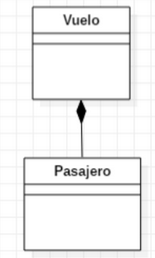
    
- Agregación
    - Asociación que indica que una clase es parte de otra clase (composición débil).
    - La destrucción del compuesto no conlleva la destrucción de los componentes
    - Se representa con una flecha con un rombo vacío en una de sus puntas
    - Los componentes pueden ser compartidas por varios compuestos (de la misma asociación de agregación o de varias asociaciones de agregación distintas).
    - Habitualmente se da con mayor frecuencia que la composición.
- Herencia
    - La herencia es un modo de representar clases y subclases
    - Clases más especificas de una general
    - Se representan mediante una flecha con una punta triangular vacía.

Representar las relaciones

- Asociación: indica alguna colaboración de objetos entre si. Puede ser una composición o una agregación.
    
    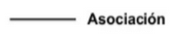
    
- Composición: una clase forma parte integral de otra clase. La clase base se construye a partir de la clase incluida (sin ella no existiría).
    
    
    
- Agregación: una clase puede formar parte de otra clase, pero no está ligada a ella. La clase base utiliza el agregado por su funcionamiento.
    
    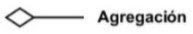
    
- Herencia: la herencia representa clases y subclases (clases más especificas de una general)
    
    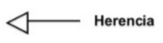
    

### Cardinalidad

- La cardinalidad es un número que representa el número de elementos de cada clase en cada relación.
- El carácter `*` es un comodín para definir un número indeterminados de clases.

| Cardinalidad | Significado |
| --- | --- |
| 1 | Uno y solo uno |
| 0..1 | Cero o uno |
| X..Z | Desde X hasta Z |
| * | Cero o varios |
| 0..* | Cero o varios |
| 1..* | Uno o varios |
- Cuando la multiplicidad mínima es 0, la relación es opcional.
- Si es mayor o igual que 1 establece una relación obligatoria.

## Ejemplo de diagrama de clases

Ejemplo Libreta de contactos

- Cada contacto tiene nombre, email, teléfono y dirección.
- Podemos insertar un nuevo contacto, buscar uno por nombre , y obtenerlos todos.

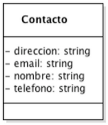

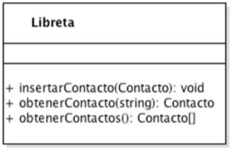

Las dos clases están relacionadas…

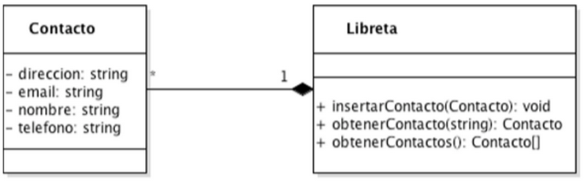

**Relación**: la libreta se compone de (una lista de) contactos.

**Cardinalidad**: una libreta tiene más que un contacto `*`, y cada contacto está en una libreta `1`

Ahora queremos poder añadir grupos de contactos en nuestra libreta de contactos. Por tanto, la libreta contendrá tantos grupos de contactos como contactos, ya que habrá contactos que no estarán en un grupo.

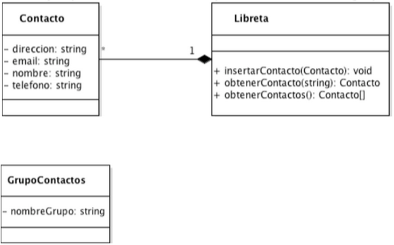

Añadir grupos de contactos en nuestra libreta de contactos.

La libreta contendrá tanto grupos de contactos como contactos, ya que habrá contactos que no estarán en un grupo.

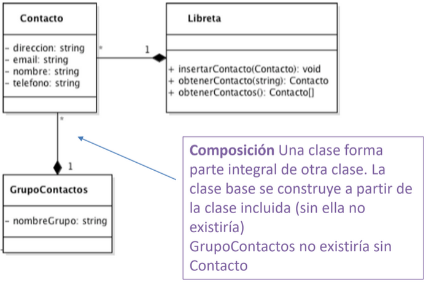

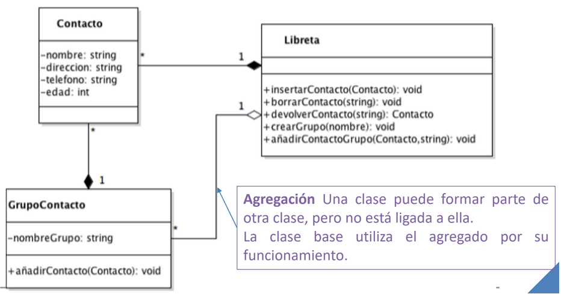

Crear cuenta de usuario para acceder a nuestra libreta de contactos.

La cuenta tendrá un nombre de cuenta y un email y podrá acceder a la libreta.

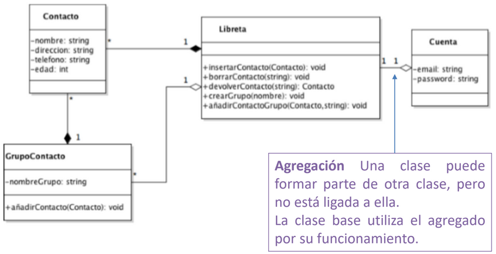

Cada contacto puede ser de trabajo o de familia. Para cada uno de ellos queremos guardar el tipo de relación

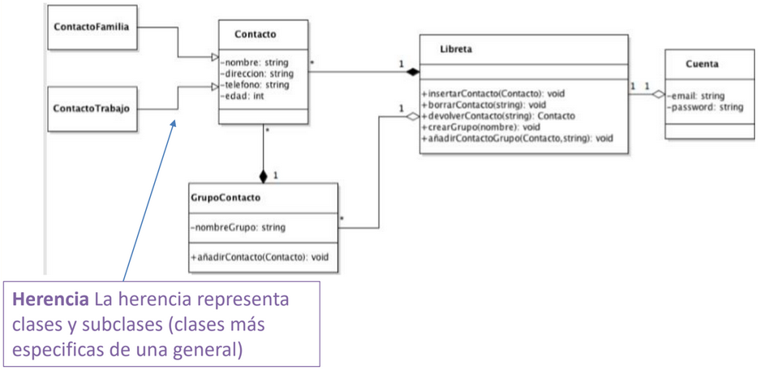

## Ejemplo práctico

A partir de este enunciado en lenguaje natural crear el diagrama de clases:

Desarrollar un programa que permita llevar a cabo la gestión y seguimiento de varios Sites de páginas web. Esta aplicación almacenará toda la información referente a cada Site que se quiera gestionar. Un site tiene un dominio y una fecha de publicación. Para cada Site, habrá dos tipos de personas que podrán estar relacionadas, ya sea para su gestión o para el desarrollo a través de actividades. Estos dos tipos de personas son el TeamLeader y el Developer. De cada persona se requiere su Nombre y su DNI, a más, de los Developers queremos saber si se dedican al FrontEnd o al BackEnd (perfil).

Un Site será liderado por un TeamLeader. Pero un TeamLeader solo podrá gestionar uno o dos Sites. El TeamLeader se encarga de subir a producción. Un Site tiene actividades a desarrollar; cada Site podrá tener desde una a muchas (de forma indefinida) actividades a desarrollar, pero una actividad a desarrollar solo podrá pertenecer a un Site.

Los Developers desarrollarán las actividades a desarrollar. Cada Developer tendrá vinculada como mínimo una actividad a desarrollar, sin un máximo de actividad establecido. Igualmente, las actividades podrán ser desarrolladas por un mínimo de un Developer, sin haber un máximo establecido.

Cada actividad a desarrollar tendrá un valor numérico con el que se establecerá el orden de prioridad.

1. Extraer clases (azul)
    
    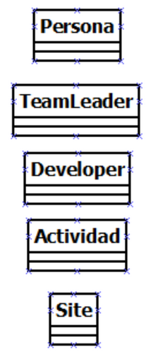
    
2. Asociar atributos y métodos a las clases (subrayado)
    
    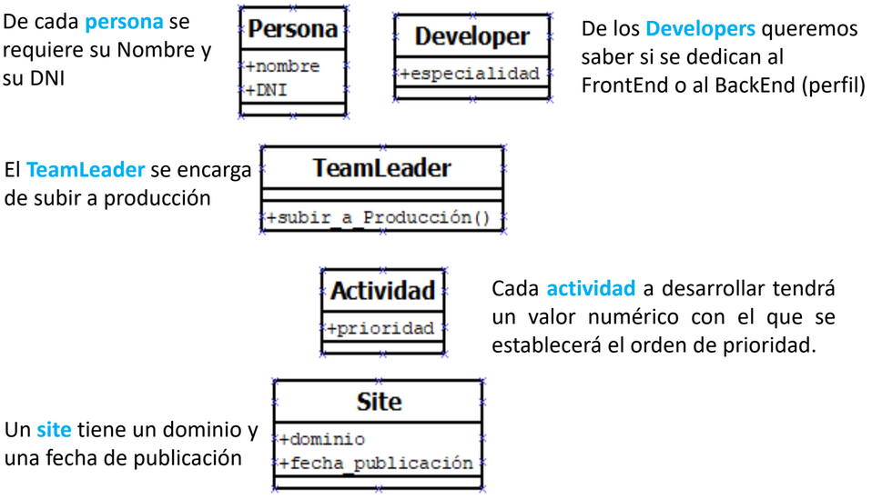
    
3. Relaciones entre las clases
    - Un Site tiene un dominio y una fecha de publicación
    - De cada persona se requiere su Nombre y su DNI
    - De los Developers queremos saber si se dedican al FrontEnd o al BackEnd (perfil)
    - El TeamLeader se encarga de subir a producción
    - Herencia → Developers y TeamLeaders heredan los atributos de Persona
        
        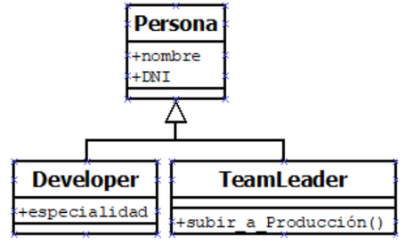
        
    - Un Site tiene actividades a desarrollar
    - Cada Site podrá tener desde una a muchas (de forma indefinida) actividades a desarrollar, pero una actividad a desarrollar solo podrá pertenecer a un Site.
    - Composición → Cada actividad forma parte de un Site
        
        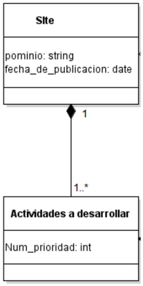
        
        Consideramos que un Site no tiene sentido de existir si no está asignado a un TeamLeader
        
    - Agregación → Un TeamLeader solo podrá gestionar uno o dos Sites
        
        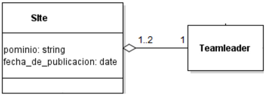
        

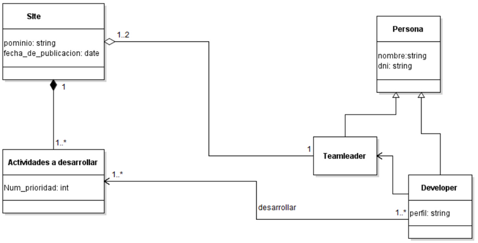

## Ejemplos

HERENCIA: Realizar el diagrama de clases, que represente que Rectángulo, Cuadrado y Círculo son formas y por tanto, tienen una posición en el espacio y se puedan dibujar, además, cada una de ellas tienen propiedades que las hacen diferentes a las demás.

Con la herencia, nos evitamos además tener que definir los métodos “Dibujar” de las clases heredadas, pues se encuentra implícito en el diagrama que cualquiera de ellas puede ser invocada para ser dibujadas.

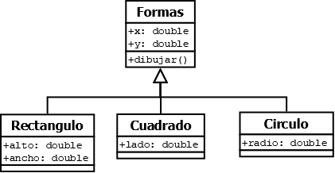

RELACIONES: Definimos nuestra clase, la llamamos Familia, repetiremos la operación creando otra clase llamada Persona. Deberemos añadir los atributos que correspondan para que el diagrama tenga sentido, es decir, sabemos que una familia es un conjunto de personas.

Vamos a realizar también una relación de herencia, ya que sabemos que una familia se compone de un padre, una madre e hijos, es decir, las personas incluidas en una familia están relacionadas entre sí. Suponemos que una familia debe tener un solo padre y una sola madre, y que ellos pueden tener varios niños en conjunto.

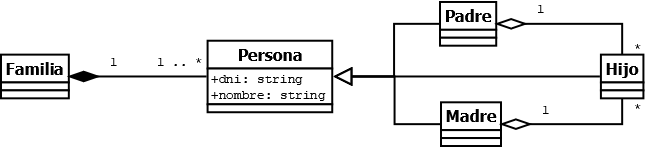

## Resumen Agregación y Composición

Relación de Agregación

- La agregación es un tipo de asociación que indica que una clase es parte de otra clase (composición débil).
- La destrucción del compuesto no conlleva la destrucción de los componentes.
- Habitualmente se da con mayor frecuencia que la composición.
- La agregación se representa en UML mediante un diamante de color blanco colocado en el extremo en el que está la clase que representa el “todo”.
    
    
    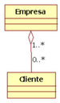
    
    - Tenemos una clase Empresa.
    - Tenemos una clase Cliente.
    - Una empresa agrupa a varios clientes.
    

Relación de Composición

- Composición es una forma fuerte de composición donde la vida de la clase contenida debe coincidir con la vida de la clase contenedor.
- Los componentes constituyen una parte del objeto compuesto.
- Los componentes no pueden ser compartidos por varios objetos compuestos.
- La supresión del objeto compuesto conlleva la supresión de los componentes.
- El símbolo de composición es un diamante de color negro colocado en el extremo en el que está la clase que representa el “todo” (Compuesto).
    
    
    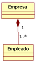
    
    - Tenemos una clase Empresa.
    - Un objeto Empresa está a su vez compuesto por uno o varios objetos del tipo empleado.
    - El tiempo de vida de los objetos Empleado depende del tiempo de vida de Empresa, ya que si no existe una Empresa no pueden existir sus empleados.