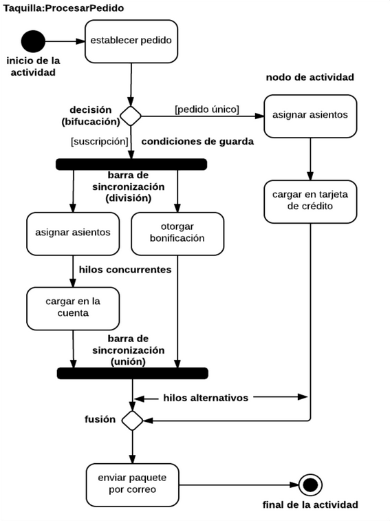

# Diagramas de comportamiento

Existen diversos tipos de diagramas de comportamiento basados en el estándar UML.

Son un modo de representar gráficamente los procesos y formas de uso de un programa, con ellos visualizamos los aspectos dinámicos de un sistema.

## Diagramas de actividad

Un diagrama de actividades es, un diagrama de flujo que muestra actividades ejecutadas por un sistema.

Los diagramas de actividad tienen unas características muy concretas y restrictivas se componen de tres elementos:

- **Estados**:
    
    Se representan como un **rectángulo** con los bordes redondeados.
    
    Definen los diferentes estados o etapas por las que pasa la ejecución del programa.
    
- **Transiciones**:
    
    Se representan como un **flecha unidireccional**.
    
    Son líneas de conexión que enlazan estados entre si con una dirección.
    
- **Nodos** (existen diferentes tipos de nodos):
    - **De decisión**: definen caminos alternativos → Rombo
    - Las **barras de sincronización**: definen actividades que ocurren de manera síncrona → Línea gruesa de color negro
    - Los **nodos iniciales y finales:** son únicos y deben existir en el diagrama. Indican el estado inicial y final del flujo de trabajo → un punto y un punto rodeado por una circunferencia respectivamente
    
    
    

### Significado de los símbolos de diagramas de actividad

El **nodo o estado inicial** representa el comienzo de un proceso o flujo de trabajo en un diagrama de actividad. Puede utilizarse por sí mismo o con un símbolo de nota que explique el punto de comienzo.

El símbolo de **actividad o acción** es el componente principal de un diagrama de actividad. Estas formas indican las actividades que componen un proceso modelado.

El símbolo de **flujo de control o transición** está representado por líneas con flechas que muestran el flujo direccional, el flujo de control, de la actividad. Una flecha entrante comienza un paso de una actividad; una vez que se completa la etapa, el flujo continúa con una flecha saliente.

El símbolo de **unión, o barra de sincronización**, es una línea gruesa horizontal o vertical. Combina dos actividades concurrentes y las reintroduce en el flujo cuando solamente una actividad tiene lugar a la vez.

El símbolo de **división o bifurcación ("fork")** está simbolizada con múltiples líneas con flechas desde una unión. Divide el flujo de una actividad individual en dos actividades concurrentes.

El símbolo de decisión tiene forma de diamante; representa la ramificación o fusión de diversos flujos con el símbolo que actúa como un marco o contenedor.

El símbolo de **nota** permite a los creadores o colaboradores del diagrama comunicar mensajes adicionales que no encajan dentro del diagrama en sí.

El símbolo de **opción de bucle** permite al creador modelar una secuencia repetitiva dentro del símbolo de opción de bucle.

El nodo o **estado final** representa la terminación de un proceso o flujo de trabajo.

### Reglas

- Siempre debe haber un único estado inicial y un único estado final.
    - El nodo inicial es representado por un punto.
    - El nodo final es representado con un punto rodeado por una circunferencia.
- Todas las operaciones, transiciones y procesos ocurren entre esos dos puntos (nodo inicial y final).
- Las transiciones que se realizan entre estados pueden tener nodos de por medio.
- Los nodos de bifurcación y las barras de sincronización pueden unir transiciones y separarlas.

### Ejemplos

Vemos que un diagrama de actividad, parte siempre de un nodo inicial y va siguiendo las transiciones según la dirección. En este caso hacia abajo, la primera acción consiste en despertarse. En cuanto se encuentran con un nodo de decisión, se puede tomar el camino de desayunar y leer el periódico o bien volver a dormirse. Las barras de sincronización, nos permitirán establecer una serie de actividades para que se ejecuten de forma síncronas, las acciones de desayunar y leer el periódico empezaran a la vez y ambas tendrán que finalizar para seguir con el flujo. Finalmente, cuando se llega al nodo final, se acaba el programa.

## Diagramas de secuencia

Son los diagramas que modelan una secuencia lógica a través del tiempo de los mensajes que se producen entre instancias.

### Elementos

**Línea de vida**: representa el intervalo de tiempo en que existe la instancia o instancias que forman parte del elemento conectable, desde su creación hasta su destrucción.

Las **activaciones**: representan los intervalos de tiempo durante los cuales se está ejecutando alguna operación que tiene por objeto de contexto alguna de sus instancias.

Un **mensaje** es la comunicación entre objetos.

Se representa con una flecha del emisor hacia el receptor.

**Mensajes síncronos**: cuando el objeto que envía el mensaje queda bloqueado hasta que termina la llamada. Este tipo de mensajes se representan con flechas con la cabeza llena.

**Mensajes asíncronos**: cuando el objeto que envía el mensaje termina inmediatamente y crea un nuevo hilo de ejecución dentro de la secuencia. Se representan con flechas con la cabeza abierta.

### Reglas

- Cada objeto tiene asociados una línea de vida y activaciones.
- La línea de vida indica el intervalo de tiempo durante el que existe ese objeto.
- Una activación muestra el periodo de tiempo en el cual el objeto se encuentra ejecutando alguna operación, ya sea directamente o mediante un procedimiento concurrente.

### Ejemplos

Ejemplo de una aplicación para préstamos de una biblioteca. El objetivo es llevar un control de los libros, los socios de la biblioteca y de los préstamos que se han llevado a cabo.

De cada libro pueden existir uno o muchos ejemplares, así como cada ejemplar deberá encontrarse en un catálogo. Por ello, se podrá dar entrada a un ejemplar en el catálogo o darle salida.

A la hora de efectuar el préstamo deberá validar que existe el socio que lo pide y la disponibilidad del ejemplar. Las acciones a realizar podrán ser la de prestar un libro y la de devolverlo.

### Ejemplo máquina expendedora de café

La máquina tiene tres períodos de proceso:

1. Cuando le pide los datos al cliente
2. Cuando procesa la solicitud
3. Cuando devuelve los resultados (en este caso un café, el cambio y un recibo) al cliente.

La máquina tiene tres períodos de proceso:

1. Cuando le pide los datos al cliente
2. Cuando procesa la solicitud
3. Cuando devuelve los resultados (en este caso un café, el cambio y un recibo) al cliente.

La máquina tiene tres períodos de proceso:

1. Cuando le pide los datos al cliente
    1. Cuando procesa la solicitud
    2. Cuando devuelve los resultados (en este caso un café, el cambio y un recibo) al cliente.

## Diagramas de casos de uso

Es una lista de pasos que definen la interacción entre un actor (un humano que interactúa con el sistema o un sistema externo) y el sistema propiamente dicho. Los diagramas de casos de uso representan las especificaciones de un caso de uso y modelan las unidades funcionales de un sistema.

### Elementos fundamentales del diagrama de casos de uso

- Actor
    
    Es cualquier elemento que interactúa con el sistema, y es externo a él. No es necesariamente una persona, puede ser un dispositivo u otro sistema.
    
    Los actores se representan con el icono de estereotipo estándar para casos de uso con el nombre del actor al pie de la figura. Los nombres de los actores suelen empezar por mayúscula.
    
    
    
- Caso de uso
    
    Representan el funcionamiento que se produce tras la orden de un actor. Una descripción informal en lenguaje natural o en un lenguaje estructurado.
    
    Varios casos de uso pueden empezar de la misma manera de modo que hasta el final no sabemos cuál se “ejecuta”.
    
    Los casos de uso se representan por una elipse, conteniendo el nombre, que opcionalmente puede ir dentro o debajo de la elipse.
    
    
    
- Relaciones
    1. Relaciona a los actores con los casos de uso, aunque en algunos casos también permiten relacionar unos casos de uso con otros.
        
        
        **Asociación** entre un actor y un caso de uso:
        
        
        
        
        
    2. Relaciones entre casos de uso:
        1. **Incluye** (`<<include>>`): es un estereotipo de dependencia. Un caso de uso inicial incluye a otro caso de uso secundario, cuando para realizar el caso de uso inicial se debe obligatoriamente realizar el caso de uso secundario. Reemplaza el uso común de la antigua relación **usa**.
            
            
            
        2. **Extiende** (`<<extend>>`): es un estereotipo de dependencia. Un caso de uso se extiende de otro, cuando hace algo similar pero amplía la funcionalidad.
            
            
            
        3. **Generalización**: una relación en un caso de uso general y un caso de uso más específico, que hereda y añade propiedades al caso de uso base. El hijo hereda las relaciones y comportamiento del padre y puede agregar atributos y operaciones propios.
            
            
            

### Ejemplos de inclusion y exclusion

### Biblioteca municipal:

En el apartado de reservas, se puede tener mas opciones de casos de uso

### Ejemplos de casos de uso

Se ha de realizar un diagrama de casos de uso de un **cajero automático**

Diagrama de casos de uso de una **máquina expendedora de café**

### Ejemplo de biblioteca

Se quiere modelizar una aplicación para una biblioteca, focalizándonos en dos de sus procesos más habituales, la solicitud de un libro por parte de un usuario de la biblioteca y el retorno del libro.

Obtener el diagrama de casos de uso relativo al servicio de préstamo y devolución (sin validaciones). La única validación será la comprobación de la existencia del usuario o socio de la biblioteca.

1. Resumir las funcionalidades:
    - Un socio de la biblioteca solicita el préstamo de un libro a un bibliotecario.
    - El bibliotecario verifica la disponibilidad del libro y registra el préstamo en el sistema.
    - El bibliotecario entrega el libro solicitado al socio.
2. ¿Que actores intervienen?
    - Usuario
    - Bibliotecario
    - Sistema
3. Flujo de la aplicación
    - Un usuario de la biblioteca solicita el préstamo de un libro.
    - El bibliotecario verifica que el usuario esté dado de alta en el sistema.
    - El bibliotecario comprueba que se tenga disponible alguna copia del libro solicitado.
    - El bibliotecario confirma la reserva, que es registrada en el sistema.
    - Automáticamente, el sistema registra el préstamo del libro en la ficha del socio.
    - Automáticamente, el sistema actualiza el catálogo de la biblioteca, con lo cual disminuye en un el stock disponible del libro prestado.
    - El bibliotecario entrega el libro al socio.

### Especificación de un caso de uso

