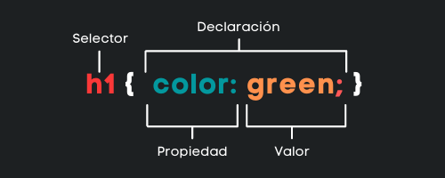
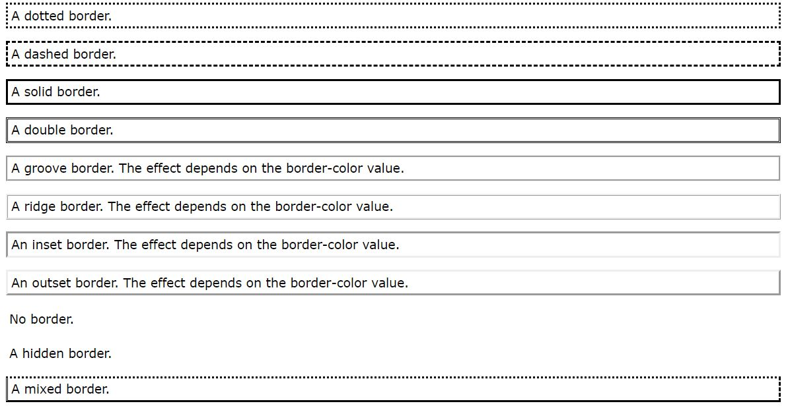

# Introducción al CSS

## HTML CSS

- CSS significa Cascading Style Sheets
- CSS describe **como mostrar** por pantalla los elementos HTML.
- **Separan** el **contenido** del documento de todo el aspecto de **presentación** de este.
- CSS aumenta la eficiencia y ahorra trabajo, se puede controlar los estilos de distintas webs al mismo tiempo.
- La intención original del HTML no fue nunca la de contener etiquetas para dar formato a la página web, era **describir** el contenido.
- A partir del HTML 3.2 (1997) se añadieron etiquetas como Font y color, convirtiendo el desarrollo web en más complicado y costoso para los desarrolladores.
- Para resolver este problema, el W3C creo el CSS

**Sintaxis**: las reglas de sintaxis del CSS consisten en un selector y un bloque de declaraciones (imagen de W3Schools).



Selector: elemento a formatear

Propiedad: atributo del selector que se va a modificar

Valor: valor de la propiedad que se va a establecer

- El selector apunta al elemento al que quieres dar el estilo.
- El bloque de declaraciones contiene una o más declaraciones separadas por punto y coma, cada una de ellas contiene nombre y valor(es) de la propiedad.

Podemos añadir estilos CSS a un HTML de 3 maneras distintas:

- **Inline**: usando el atributo *style* en los diferentes elementos HTML
- **Internal**: usando un elemento `<style>` en la sección `<head>`
- **External**: usando un fichero CSS externo

**Inline CSS**: ya hemos visto algunos ejemplos, se usa el atributo *style* en los elementos a los que queramos dar estilo (”protege” contra estilos externos/internos).

```css
<h1 sytle="color:blue;">Encabezado azul</h1>
```

Usamos la declaración interna de CSS para definir el estilo de un solo documento HTML.

Se define en la sección `<head>` con las etiquetas `<style>`

```html
<html>
	<head>
		<style type="text/css">
			body {background-color:powderblue;}
			h1 {color:blue;}
			p {color:red;}
		</style>
	</head>
	<body>
		<h1>Encabezado de nivel 1</h1>
		<p>Esto es un parrafo</p>
	</body>
</html>
```

**External CSS**: usamos la declaración externa de CSS para definir el estilo para varios documentos HTML.

Se define en un archivo externo con extensión .css

Se enlaza el archivo .css a los documentos que necesitemos aplicar los estilos.

```html
<link rel="stylesheet" type="text/css" href="archivo.css">
```

Los atributos principales de los elementos link son los siguientes:

**rel**: especifica la relación entre el documento actual y el documento a enlazar (en nuestro caso la opción es “stylesheet”)

**type**: especifica el tipo de documento (text/css)

**href**: al igual que con los enlaces, especifica la localización del elemento a enlazar.

Usamos la declaración externa de CSS para definir el estilo para varios documentos HTML.

El fichero externo .css puede escribirse en cualquier editor de texto. El fichero no debe contener código HTML y tiene que tener una extensión .css

```css
body {
	background-color:powderblue;
}
h1 {
	color:blue;
}
p {
	color:red;
}
```

```css
/*Etiqueta HTML*/
h1 {
	/*Atributo CSS:Valor Atributo CSS*/
	font-family:courier,courier-new,serif;
	font-size:20pt;
	color:blue;
	border-bottom:2px solid blue;
}
p {
	font-family:arial,verdana,sans-serif;
	font-size:12pt;
	color:#6B6BD7;
}
.red_txt {
	color:red;
}
```

## Fuentes

- La propiedad CSS **color** define el color del texto a usar.
- La propiedad CSS **font-family** define la fuente a usar.
- La propiedad CSS **font-size** define el tamaño de texto a usar.

```html
<head>
	<style>
		h1 {
			color:blue;
			font-family:verdana;
			font-size:300%;
		}
		p {
			color:red;
			font-family:courier;
			font-size:160%;
		}
	</style>
</head>
```

## Colores

Lista de nombres de colores admitidos por los principales exploradores:

[HTML Color Names](https://www.w3schools.com/colors/colors_names.asp)

Ordenados por su valor HEX:

[HTML Color Values](https://www.w3schools.com/colors/colors_hex.asp)

Color picker:

[HTML Color Picker](https://www.w3schools.com/colors/colors_picker.asp)

Maneras de especificar colores en HTML:

- Por el nombre del color: Blue, Orange, Violet…
- Por valores RGB(a) (El canal alfa o a índica grado de transparencia)
    
    RGBa → 0-255,0-255,0-255,0.0-1.0
    
- Por valores hexadecimales
- Por valores HSL(a)

## Borders (bordes)

Las propiedades de bordes en CSS te permiten especificar el estilo, la anchura y el color de los bordes de los elementos:

Estilos de bordes:

- **dotted** → Borde de puntos
- **dashed** → Borde de guiones
- **solid** → Borde continuo
- **double** → Borde continuo doble
- **groove** → Define un 3D grooved border (estriado). El efecto depende del color.
- **ridge** → Defines a 3D ridged border. El efecto depende del color.
- **inset** → Defines a 3D inset border. El efecto depende del color.
- **autset** → Defines a 3D autset border. El efecto depende del color.
- **none** → Sin borde
- **hidden** → Borde oculto

Estilos de bordes:

```css
p.dotted {border-style: dotted;}
p.dashed {border-style: dashed;}
p.solid {border-style: solid;}
p.double {border-style: double;}
p.groove {border-style: groove;}
p.ridge {border-style: ridge;}
p.inset {border-style: inset;}
p.outset {border-style: outset;}
p.none {border-style: none;}
p.hidden {border-style: hidden;}
p.mix {border-style: dotted dashed solid double;}
```


Anchura de los bordes (border width)

- La propiedad border width especifica la anchura de los 4 lados en un border.
- La anchura puede especificarse con una medida concreta (px, pt, cm, etc) o usando uno de los 3 valores predefinidos (thin, medium, thick).
- La propiedad border width admite hasta 4 valores (uno por cada lado, pudiendo ser distintos)
    - El orden de los bordes es en sentido de las agujas del reloj, (borde superior, derecho, inferior e izquierdo).

Anchura de los bordes (border width)

```css
p.one {
	border-style:solid;
	border-width:5px;
}
p.two {
	border-style:solid;
	border-width:medium;
}
p.tree {
	border-style:solid;
	border-width:2px 10px 4px 20px;
}
```

La propiedad “border-width” no funciona si se usa sola. Siempre hay que especificar la propiedad “border-style” para establecer los borders.

## Padding (relleno)

El padding se utiliza para generar espacio alrededor de contenido.

El espacio se crea dentro de los bordes de un elemento.

Con CSS tienes el control total sobre el padding. Hay propiedades CSS para configurar el padding en cada lado de un elemento (encima, derecho, debajo e izquierda).

Propiedades CSS para configurar el padding en cada lado de un elemento:

1. padding-top
2. padding-right
3. padding-bottom
4. padding-left

Y estas propiedades pueden tener los siguientes valores:

`padding:length|initial|inherit;`

- `length`: especifica el padding en px, pt, cm, etc.
- `inherit`: especifica que el padding tiene que ser heredado del elemento padre ([https://www.sitepoint.com/css-inheriteance-introduction/](https://www.sitepoint.com/css-inheritance-introduction/))

```html
<!DOCTYPE html>
<html>
    <head>
        <style>
            p {
                border: 1px,solid black;
                background-color: lightblue;
                padding-top: 50px;
                padding-right: 30px;
                padding-bottom: 50px;
                padding-left: 80px;
            }
        </style>
    </head>
    <body>
        <h2>Usando padding</h2>
        <p>Este párrafo tiene un top de 50px, un right padding de 30px, un bottom padding de 50px, y un left padding de 80px.</p>
    </body>
</html>
```

## Margin (margen)

El margin se utiliza para generar espacio alrededor del contenido.

Las propiedades del margin establecen el tamaño del espacio de blanco por **fuera** de los bordes.

Con CSS tienes el control total sobre el margin. Hay propiedades CSS para configurar el margin en cada lado de un elemento (encima, derecha, debajo e izquierda).

Propiedades CSS para configurar el margin en cada lado de un elemento:

1. margin-top
2. margin-right
3. margin-bottom
4. margin-left

Y estas propiedades pueden tener los siguientes valores:

- `auto`: el navegador calcula el margen
- `length`: especifica el margin en px, pt, cm, etc.
- `%`: especifica el margin en % de anchura del elemento
- `inherit`: especifica que el margin tiene que ser heredado del elemento padre

## Box Model

Modelo caja (w3schools):

Establece que el tamaño del documento lo define el contenido, el padding y el border.



## El atributo id

Para definir un estilo especifico para un elemento especial podemos añadirle un atributo id a ese elemento (en el archivo HTML)

Archivo HTML:

```html
<p id="p01">Soy diferente</p>
```

Archivo .css (se usa el carácter `#`):

```css
#p01 {
	color:blue;
}
```

## El atributo class

Para definir un estilo específico para un conjunto determinado de elementos podemos añadirle un atributo class a esos elementos (en el HTML)

Archivo HTML:

```html
<p class="error">Soy diferente</p>
```

Archivo .css (se usa el carácter `.`):

```css
.error {
	color:red;
}
```

También podemos especificar que solo elementos específicos sean modificados por la clase.

Archivo HTML:

```html
<p class="error">Me afecta la clase</p>
<h1 class="error">No me afecta</h1>
```

Archivo .css (se usa el carácter `.`):

```css
p.error {
	color:red;
}
```

Además, los elementos pueden ser afectados por más de una clase

Archivo HTML:

```html
<p class="center large">Me afectan las dos clases</p>
```

Archivo .css (se usa el carácter `.`):

```css
p.center {
	text-align:center;
	color:red;
}
p.large {
	font-size:300%;
}
```

## Referencias externas

Archivos CSS externos pueden ser referenciados con una URL completa o con el path relativo a la ubicación del fichero HTML.

```html
<link rel="stylesheet" href="https://www.w3schools.com/html/styles.css">
<link rel="stylesheet" href="/html/style.css">
```

---

Todos los formateos se tienen que hacer en CSS, no en HTML.

Poner todos los párrafos en negrita:

```css
p {
	font-weight: bold;
}
```

Componentes de la box de un elemento de HTML:

1. Border
2. Padding: relleno entre el elemento y su borde
3. Margin: espacio entre dos elementos

Visibility: el elemento no se ve pero ocupa un espacio →  hidden

Display: el elemento no se muestra en el navegador y su espacio puede ser ocupado por otro elemento → none

Si el valor del margen es 0 no hace falta poner la unidad medida.

CSS disponible para todos los navegadores (normalize.css):

[normalize.css](https://github.com/necolas/normalize.css/blob/master/normalize.css)

Reset pone la configuración de CSS a 0 y el normalize establece los valores del diseñador.

box → grid x

maquetación → flex

Flex:

- `display: flex`
- `align-items`
- `justify-content`