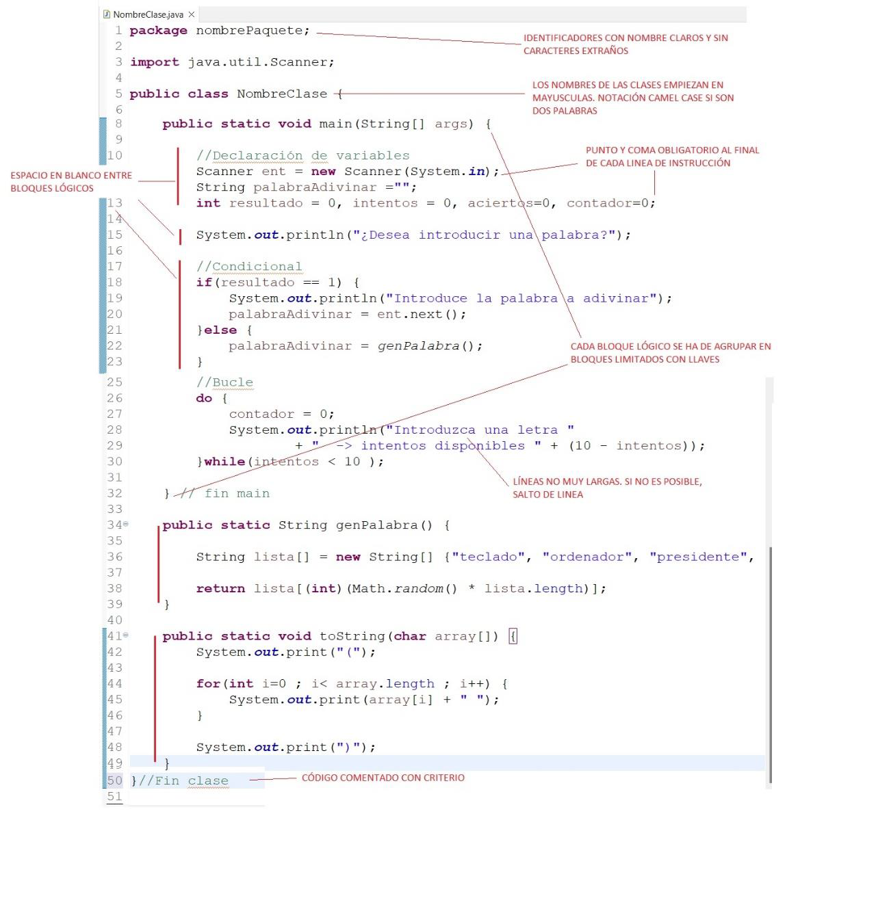

# Buenas prácticas

## Convenciones de nomenclatura

Esto incluye la creación de una serie de normas sobre cómo nombrar clases e interfaces, métodos, variables, constantes, etc.

Un identificador en Java debe tener las siguientes características:

- Se explica por sí mismo
- Distinciones significativas
- Pronunciables

## Reglas de nomenclatura en Java

Estas son algunas de las reglas de nomenclatura que se suelen incluir dentro de las buenas prácticas de programación.

- Los nombres de clase e interfaz deben ser sustantivos, comenzando con una letra mayúscula. → NombrePaquete
- Los nombres de las variables deben ser sustantivos, comenzando con una letra minúscula. → contador
- Los nombres de los métodos deben ser verbos, comenzando con una letra minúscula. → genPalabra
- Los nombres constantes deben tener todas las letras mayúsculas. → PI
- Las palabras compuestas deben seguir la regla CamelCase:
    - NombreClase.
    - nombreVariable o nombreMetodo.

## Ordenar miembros de cada clase por ámbitos

Una de las buenas prácticas de programación con Java es la de organizar cada una de las variables de una determinada clase en función de sus ámbitos. Esto se hace desde el más restrictivo al menos restrictivo.

Pues que debemos ordenar las variables en función de la visibilidad de los modificadores de acceso: privado, predeterminado (paquete), protegido y público. Y cada grupo separado por una línea en blanco.

## Los campos deben ser privados

Una buena práctica en Java es minimizar la accesibilidad de los campos (de cada clase) de la forma más inaccesible posible.

Esto significa que el programador Java debe usar el modificador de acceso más bajo posible para proteger los campos.

Esta práctica está especialmente recomendada para hacer cumplir la ocultación o encapsulación de información en el diseño de software.

## Evitar los bloques de captura vacíos

Uno de los malos hábitos de la programación con Java es dejar bloques de captura vacíos. Esta mala práctica puede hacer que el programa de fallos silenciosos, lo que hace que la depuración del código sea mucho más complicada.

Por lo tanto, es una de las buenas prácticas de programación con Java evitar los bloques de captura vacíos. ¿Cómo se puede hacer? Pues detectado y corrigiendo las excepciones que se generan cuando se crean bloques de captura vacíos.

## Don't Repeat Yourself (DRY)

Principio de “No te repitas”, también conocido como “Una vez y sólo una”. Según este principio, toda pieza de información (código fuente, comentarios, documentación, etc …) nunca debería ser duplicada debido a que la duplicación incrementa la dificultad en los cambios y evolución posterior, puede perjudicar la claridad y crear un espacio para posibles inconsistencias.

