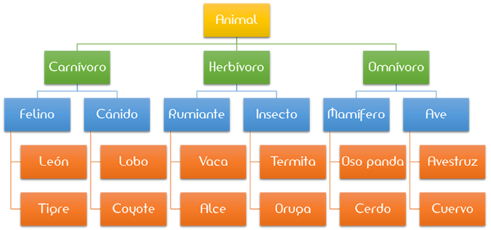
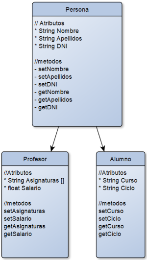
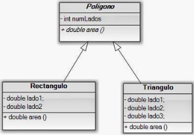

# Herencia

La herencia es un pilar importante de OOP (Programación Orientada a Objetos). Es el mecanismo en Java por el cual una clase permite heredar las características (atributos y métodos) de otra clase.

En el lenguaje de Java, una clase que se hereda se denomina superclase. La clase que hereda se llama subclase. Por lo tanto, una subclase es una versión especializada de una superclase. Hereda todas las variables y métodos definidos por la superclase y agrega sus propios elementos únicos.

## Terminología importante

**Superclase**: la clase cuyas características se heredan se conoce como superclase (o una clase base o una clase principal o padre).

**Subclase**: la clase que hereda la otra clase se conoce como subclase (o una clase derivada, clase extendida o clase hija). La subclase puede agregar sus propios campos y métodos, además de los campos y métodos de la superclase.

**Reutilización**: la herencia respalda el concepto de “reutilización”, es decir, cuando queremos crear una clase nueva y ya hay una clase que incluye parte del código que queremos, podemos derivar nuestra nueva clase de la clase existente. Al hacer esto, estamos reutilizando los campos/atributos y métodos de la clase existente.

## Concepto de Herencia

Podemos definir la herencia como la capacidad de crear clases que adquieren de manera automática los miembros (atributos y métodos) de otras clases que ya existen, pudiendo al mismo tiempo añadir atributos y métodos propios.

Java soporta la herencia permitiendo una clase a incorporar otra clase en su declaración. Esto se hace mediante el uso de la palabra clave `extends`. Por lo tanto, la subclase se añade (se extiende) a la superclase.

### Ventajas de la herencia

Entre las principales ventajas que ofrece la herencia en el desarrollo de aplicaciones, están:

- Reutilización del código: En aquellos casos donde se necesita crear una clase que, además de otros propios, deba incluir los métodos definidos en otra, la herencia evita tener que reescribir todos esos métodos en la nueva clase.
- Mantenimiento de aplicaciones existentes: Utilizando la herencia, si tenemos una clase con una determinada funcionalidad y tenemos la necesidad de ampliar dicha funcionalidad, no necesitamos modificar la clase existente (la cual se puede seguir utilizando para el tipo de programa para la que fue diseñada) sino que podemos crear una clase que herede a la primera, adquiriendo toda su funcionalidad y añadiendo la suya propia.

### Características de las clases derivadas

- Una clase derivada hereda de la clase base sus componentes (atributos y métodos).
- Los constructores no se heredan. Las clases derivadas deberán implementar sus propios constructores.
- Una clase derivada puede acceder a los miembros públicos y protegidos de la clase base como si fuesen miembros propios.
- Una clase derivada no tiene acceso a los miembros privados de la clase base. Deberá acceder a través de métodos heredados de la clase base.
- Si se necesita tener acceso directo a los miembros privados de la clase base, se deben declarar protected en lugar de private en la clase base.
- Una clase derivada puede añadir a los miembros heredados, sus propios atributos y métodos (extender la funcionalidad de la clase).
- También puede modificar los métodos heredados (especializar el comportamiento de la clase base).
- Una clase derivada puede, a su vez, ser una clase base, dando lugar a una jerarquía de clases.

### Modificadores de acceso en Java

| Modificador | Propia clase | Package | Clase derivada | Resto |
| --- | --- | --- | --- | --- |
| private | Si | No | No | No |
| <Sin modificador> | Si | Si | No | No |
| protected | Si | Si | Si | No |
| public | Si | Si | Si | Si |
- Ejemplos:
    
    
    
    
    
    

## Clases abstractas

Una clase abstracta es una clase que no se puede instanciar, es decir, no se pueden crear objetos de esa clase.

Se diseñan solo para que otras clases hereden de ella.

La clase abstracta normalmente es la raíz de una jerarquía de clases y contendrá el comportamiento general que deben tener todas las subclases. En las clases derivadas se detalla la implementación.

Las clases abstractas:

- Pueden contener cero o más métodos abstractos.
- Pueden contener métodos no abstractos.
- Pueden contener atributos.

Todas las clases que hereden de una clase abstracta deben implementar todos los métodos abstractos heredados.

Si una clase derivada de una clase abstracta no implementa algún método abstracto, se convierte en abstracta y tendrá que declararse como tal (tanto la clase como los métodos que siguen siendo abstractos).

Aunque no se pueden crear objetos de una clase abstracta, sí pueden tener constructores para inicializar sus atributos que serán invocados cuando se creen objetos de clases derivadas.

La forma general de declarar una clase abstracta en Java es:

```java
[modificador] abstract class nombreClase{
	...
}
```

- Ejemplos:
    
    ```java
    //Clase abstracta Poligono
    public abstract class Poligono {
    
    	private int numLados;
    	public Poligono() {
    	
    	}
    	public Poligono(int numLados) {
    		this.numLados = numLados;
    	}
    	public int getNumLados() {
    		return numLados;
    	}
    	public void setNumLados(int numLados) {
    		this.numLados = numLados;
    	}
    	//Declaración del método abstracto area()
    	public abstract double area();
    	
    }
    ```
    
    
    
    ```java
    //Clase Rectangulo
    public class Rectangulo extends Poligono{
    
    	private double lado1;
    	private double lado2;
    	public Rectangulo() {
    		
    	}
    	public Rectangulo(double lado1, double lado2) {
    		super(2); //Constructor de la clase padre
    		this.lado1 = lado1;
    		this.lado2 = lado2;
    	}
    	/*
    	 *Implementación del método abstracto area()
    	 *heredado de la clase Polígono
    	 */
    	@Override
    	public double area(){
    		return lado1 * lado2;
    	}
    
    }
    ```
    
    ```java
    //Clase Triangulo
    public class Triangulo extends Poligono{
    
    	private double lado1;
    	private double lado2;
    	private double lado3;
    	public Triangulo() {
    		
    	}
    	public Triangulo(double lado1, double lado2, double lado3) {
    		super(3);
    		this.lado1 = lado1;
    		this.lado2 = lado2;
    		this.lado3 = lado3;
    	}
    	/*
    	 *Implementación del método abstracto area()
    	 *heredado de la clase Polígono
    	 */
    	@Override
    	public double area(){
    		double p = (lado1+lado2+lado3)/2;
    		return Math.sqrt(p * (p-lado1) * (p-lado2) * (p-lado3));
    	}
    
    }
    ```