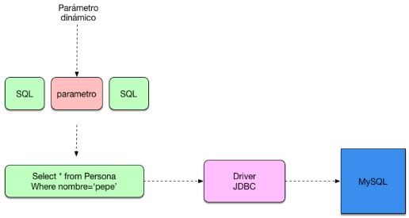
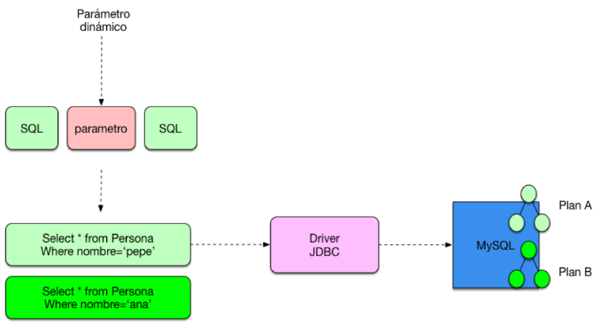
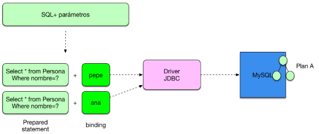

# Manejo de bases de datos

Ejemplo de conexión en una base de datos

```java
public class Pruebas {

	public static void main(String[] args) {

		//Rellenar con los datos de la conexión a la base de datos
		//Nombre de la base de datos
		String bd = "base";
		//URL de la base de datos
		String url = "jdbc:mysql://localhost:3306/" + bd;
		//Usuario y contraseña
		String usuario = "victor";
		String password = "qwerty1234";

		//Objetos propios del paquete sql
		//Objeto para la conexión
		Connection conn = null;
		//Objeto para realizar sentencias SQL
		Statement stmt = null;
		//Objeto donde se almacenan los registros devueltos de una SELECT
		ResultSet rs = null;

		//Cargamos el driver de la conexión
		Class.forName("com.mysql.cj.jdbc.Driver");
		//Creamos la conexión
		conn = DriverManager.getConnection(url, usuario, password);

		//Para ejecutar sentencias SQL creamos un objeto statement sobre el objeto conn
		//Mediante el objeto statement, podemos ejecutar la Query
		stmt = conn.createStatement();
		String select = "SELECT * FROM productos";
		//En el objeto RecordSet se almacenan los registros obtenidos de la SQL
		rs = stmt.executeQuery(select);

		while(rs.next()) {
			//Podemos acceder a los registros de la select mediante el nombre de la columna de la tabla
			System.out.println("nombre :" + rs.getString("nombre"));
			System.out.println("descripcion :" + rs.getString("descripcion"));
			System.out.println("precio :" + rs.getFloat("precio"));
			//O bien acceder al indice de la columna de la tabla
			System.out.println("nombre :" + rs.getString(1));
			System.out.println("descripcion :" + rs.getString(2));
			System.out.println("precio :" + rs.getFloat(3));
			//Es importante que el get del rs coincida con el tipo de campo de la tabla
		}

	}

}
```

## PreparedStatement

Cuando nosotros construimos una consulta normal de JDBC utilizamos un Statement, este Statement o sentencia lo que se encarga de definir una consulta SQL a ejecutar contra el motor de la base de datos.



Muchas veces se nos olvida que para cada consulta SQL que construimos contra la base de datos se construye un plan de ejecución en el que la base de datos decide como esa consulta se ejecuta.



Para solventar este problema existen los JDBC Prepared statement. Estas estructuras permiten mantener las consultas neutras sin tener en cuenta los parámetros que se las pasa, ya que realiza un binding de ellos.



```java
String consulta = "SELECT * FROM persona WHERE nombre = ?";
Connection conexion = DriverManager.getConnection("jdbc:mysql://localhost/prueba", user, pass);
PreparedStatement sentencia = conexion.prepareStatement(consulta);
sentencia.setString(1, "Pepe");
ResultSet rs = sentencia.executeQuery();
sentencia.setString(1,"Ana");
rs = sentencia.executeQuery();
```

## Ejemplo Insert con PreparedStatement

```java
//Metodo para realizar INSERT de forma transaccional
public static Connection getConnection() throws ClassNotFoundException {

	//Objetos propios del paquete SQL
	PreparedStatement str = null;
	Connection cn = null;
	try {
		//Cargamos el driver de la conexión
		Class.forName("com.mysql.cj.jdbc.Driver");
		//Creamos la conexión
		cn = DriverManager.getConnection(url,login,pw);
		//Ponemos por defecto el valor de ejecutar las sentencias automaticamente a false
		cn.setAutoCommit(false);
		/*Coleccion de datos con la información. Es un array de dos dimensiones:
		         Columna 0   Col 1    Col2
		Fila 0:   Platano    fruta    2
		Fila 1:   Melones    fruta    3
		Fila 2:   Calabaza   verdura  6
		*/
		String productos[][] = {{"Platano","Fruta","2"},{"Melones","Fruta","3"},{"Calabaza","Verdura","6"}}
	} catch (Exception exc) {
		System.out.println(exc.getMessage());
	}

	//Preparamos la sentencia generica SQL que se va a ejecutar muchas veces
	str = cn.prepareStatement("INSERT INTO productos(nombre,descripcion,precio) VALUES(?,?,?)");
	for (int i = 0; i < productos.length; i++) {
		/* Recorremos el array bidimensional
			 Cada setString equivale a una ? de la sentencia SQL del INSERT se debe indicar primero la columna
			 del registro u despues el valor setString(columna, valor)
		 */
		str.setString(1,productos[i][0]);
		str.setString(2,productos[i][1]);
		str.setString(3,productos[i][2]);
		//Actualizamos la sentencia con los nuevos valores
		str.executeUpdate();
	}
	//Ejecutamos la escritura en la base de datos
	cn.commit();
	System.out.println("Insertado correctamente");
```