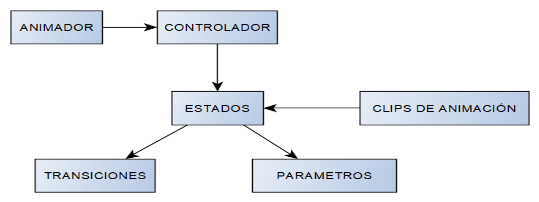

# Animador

## Componentes del animador

- Animador → Componente que se añade al GameObject.
- Controlador → Donde se define el funcionamiento del animador mediante un árbol de estados.
- Clip de Animaciones → Los movimientos programados para cada estado.
- Estados → Definen los eventos que se controlan para cambiar o ejecutar acciones del controlador.
- Transiciones → Permiten controlar el flujo de los estados conectándolos entre ellos.
- Parámetros → Condiciones en tiempo de ejecución para cambiar entre estados.