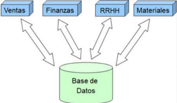
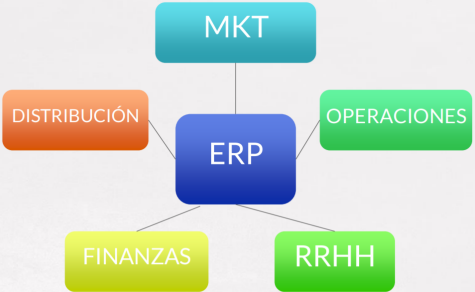
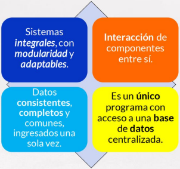
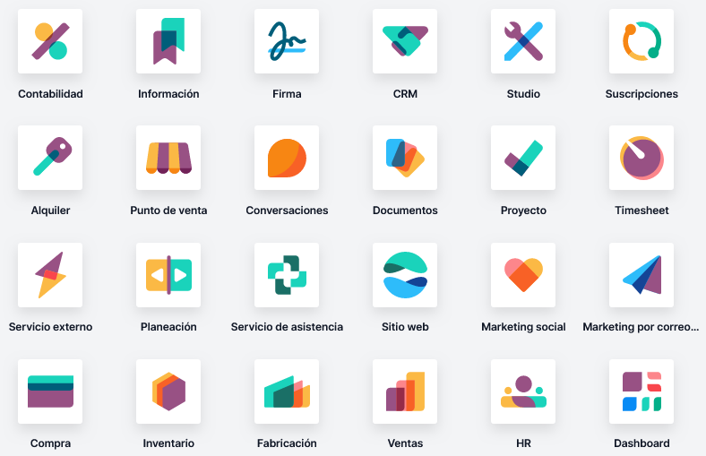

# Introducción a sistemas ERP-CRM

## ¿Qué es un ERP?

Enterprise Resource Planning (ERP)

- Sistemas de planificación de recursos empresariales.
- Son sistemas de información que integran y manejan las actividades de la compañía, ayuda a la toma de decisiones y mantiene información actualizada.

Es un software que permite la gestión empresarial.

Se caracterizan por estar compuestos por módulos: producción, ventas, compras, logística, contabilidad, inventarios y almacenes, pedidos, nóminas, etc.

### Objetivos

- Optimización de los procesos empresariales.
- Acceso a toda la información de forma confiable, precisa y oportuna (integridad de datos).
- La posibilidad de compartir información entre todos los componentes de la organización.
- Eliminación de datos y operaciones innecesarias.

### Características

### Ventajas para usar un ERP

| Competitividad | Control | Integración |
| --- | --- | --- |
| Las empresas requieren continuas optimizaciones de sus procesos de producción, comercialización o administración. | Gestion integral de datos que apoye la toma de decisiones. | Integra la información en areas vitales de empresa. |

### Ejemplo

1. Generación de una solicitud de orden de compra por un repuesto → Se encarga el departamento de mantenimiento
2. Pasa por una ruta de aprobación → Compras, jefe inmediato u otros
3. Al autorizarla el sistema lo envía al proveedor → Proveedores
4. El proveedor entrega el repuesto en almacén  → Almacén genera en el ERP un número de confirmación
5. Le da ingreso al inventario → Almacén e Inventarios
6. Con este número de confirmación el proveedor puede solicitar el pago → Pagos y finanzas
7. El sistema tiene constancia a través del no que ya se recibió el  producto → Finanzas

## Implementación del software ERP

1. Análisis de cambio organizativo
2. Entrega de una visión completa de la solución a implementar
3. Implementación del sistema
4. Controles de calidad
5. Auditoría del entorno técnico y del entorno de desarrollo
6. Definición de objetivos del sistema
7. Definición del modelo del negocio y gestión
8. Definición de la estrategia
9. Alineamiento de la estructura y plataforma tecnológica

### Ventajas:

- La mejor gestión de la información
- El mejor control de los tiempos y en la precisión del aprovisionamiento
- La precisión en el servicio y la entrega a tiempo a los clientes
- El mejor ajuste en las previsiones
- El mayor control sobre RRHH genera una menor rotación y mayor productividad

### Inconvenientes:

- Altos costos de implementación y licencias
- Requiere cambios en la compañía y procesos para su instalación
- Software: Son complejos y muchas compañías no pueden ajustarse a ellos
- Hay pocos expertos en ERPs por lo que se genera alta dependencia de un solo proveedor

### Tipos de desarrollo y requerimientos asociados

- Tradicionalmente, los ERPs han sido alojados en las instalaciones de las organizaciones compradoras de las licencias de la aplicación, desarrollo conocido como on-premise y, en menor grado, como in-house. Pero eso está cambiando.
- Estamos en la época del cloud computing
- Modelos de desarrollo (IaaS, PaaS y SaaS) que se impondrán o convivirán con el modelo tradicional on-premise.
- IaaS (Infrastructure as a Service)
    - El usuario contrata únicamente las infraestructuras tecnológicas (capacidad de proceso, de almacenamiento y/o de comunicaciones) sobre las que instala sus plataformas (sistemas operativos) y aplicaciones.
    - El usuario tiene el control total sobre las plataformas y aplicaciones, pero ninguno sobre las infraestructuras.
- PaaS (Platform as a Service)
    - El usuario contrata un servicio que le permite alojar y desarrollar sus propias aplicaciones (ya sean desarrollos propios o licencias adquiridas) en una plataforma que dispone de herramientas de desarrollo.
    - El usuario no tiene ningún control sobre la plataforma ni sobre la infraestructura, pero mantiene el control total sobre sus aplicaciones.
    - Ejemplos
        
        Google Cloud Platform
        
        AWS
        
        Azure
        
- SaaS (Software as a Service)
    - El usuario contrata la utilización de unas determinadas aplicaciones sobre las que únicamente puede ejercer acciones de configuración y parametrización permitidas por el proveedor.
    - El usuario no tiene ningún control sobre la aplicación, la plataforma y la infraestructura.
    - Ejemplos
        
        Dropbox
        
        Gmail
        
        Office365
        
    - Pagar por licencia o pagar por uso
        
        No debemos confundir tener una aplicación empresarial en la nube, de la que nosotros hemos adquirido licencias pero hemos optado por tenerla instalada en Internet (modelo IaaS o PaaS) en lugar de tenerla en nuestra casa (on-premise), con contratar la utilización de una aplicación que alguien tiene alojada en la nube (modelo SaaS) y por la que no debemos adquirir ninguna licencia sino únicamente prestaciones (número de usuarios y funcionalidades).
        
    - Beneficios del modelo SaaS
        - Integración comprobada de los servicios en red.
        - Prestación de servicios a nivel mundial.
        - Ninguna necesidad de inversión en hardware.
        - Implementación rápida y sin riesgos.
        - La puesta en marcha sólo precisa de la configuración y parametrización permitida por el proveedor.
        - Actualizaciones automáticas rápidas y seguras.
        - Uso eficiente de la energía, ante la energía requerida para el funcionamiento de una infraestructura on-premise.
    - Inconvenientes del modelo SaaS
        - Dependencia de los proveedores de servicios.
        - Disponibilidad de la aplicación ligada a la disponibilidad de Internet.
        - Miedo a sustracción o robo de los datos "sensibles" del negocio, ya que no residen en las instalaciones de las empresas.
        - Peligro de monopolios referentes a los servicios facilitados por los proveedores.
        - Imposibilidad de personalizar la aplicación, fuera de la configuración y parametrización permitida por el proveedor.
        - Actualizaciones periódicas que pueden incidir de manera negativa en el aprendizaje de los usuarios de orientación no tecnológica.
        - Existencia de focos de inseguridad en los canales a recorrer para llegar a la información, si no se utilizan protocolos seguros (HTTPS) para no disminuir la
        velocidad de acceso.
        - Posible degradación en los servicios suministrados por el proveedor ante el aumento de clientes.
        
        El modelo SaaS es la tendencia actual y de futuro, sobre todo para PYMES.
        
        Las grandes empresas disponen de recursos para tener el HW en local.
        

## ERP de Odoo

Odoo es un paquete de aplicaciones de código abierto dirigido a empresas que cubre todas las necesidades de su negocio: CRM, comercio electrónico, contabilidad, inventario, punto de venta, gestión de proyectos etc.

Versiones:

- Enterprise (requiere licencia)
- Community (Open Source)

Características:

- 4 millones de usuarios
- Versión SaaS y On Demand
- Pago por usuario/módulo
- Education Program

