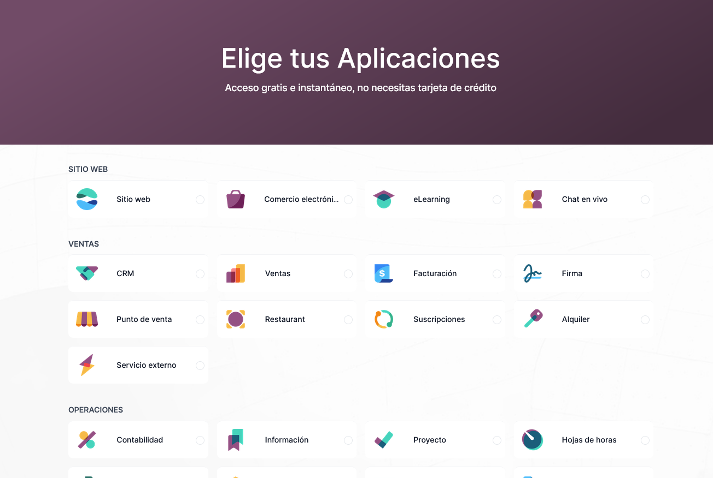

# Instalación y configuración de sistemas ERP-CRM

## Instalación de Odoo en local

### Versiones

- Enterprise (requiere licencia)
- Community (open source)

Comparativa de versiones → [www.odoo.com/es_ES/page/editions](http://www.odoo.com/es_ES/page/editions)

### Community

Página de descarga → [https://www.odoo.com/es_ES/page/download](https://www.odoo.com/es_ES/page/download)

### Instalación

Guía de instalación → [https://www.odoo.com/documentation/13.0/administration/install.html](https://www.odoo.com/documentation/13.0/administration/install.html)

## Trabajar con Odoo online

### Versiones

- Enterprise (requiere licencia)
- Community (open source)

Comparativa de versiones → [www.odoo.com/es_ES/page/editions](http://www.odoo.com/es_ES/page/editions)

### Tarifas de Odoo

Depende de:

- Número de usuarios
- Número y tipo de módulos instalados
- Pago anual o mensual
- Tipo de servidor (on-premise, nube o desarrollo)

[www.odoo.com/es_ES/pricing](http://www.odoo.com/es_ES/pricing)

### Programa educativo

- El programa Educativo ofrece instancia gratuita
- 10 meses (curso escolar)
- En la nube
- Módulos, usuarios y bases de datos sin restricción
- Dominio `edu-xxxxx`

### Crear la base de datos

- Elige los módulos a instalar (aplicaciones) → [https://www.odoo.com/trial](https://www.odoo.com/trial)
- Puedes crear más bases de datos con la cuenta

## Configuración de Odoo

### Versión online

- Cambiar idioma
- Añadir usuarios
- Difusión
- Datos de la empresa
- Instalar aplicaciones