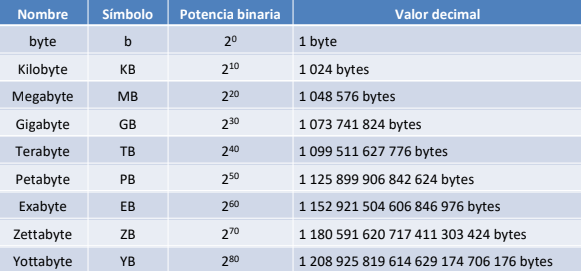
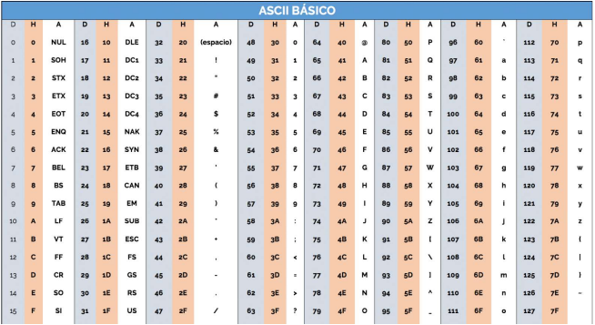

# Introducción a los sistemas informáticos

## Que es la informática?

Es una ciencia que estudia el tratamiento automatizado y racional de la información.

Información + Automática → Informática

El principal objetivo de la informática es hacer tareas relacionadas con el procesamiento
de datos de forma rápida, flexible y cómoda a través de las tecnologías.

## Que es un sistema informático?

Conjunto de elementos unidos entre sí que interaccionan para procesar y almacenar la información.

El sistema informatico es una union de Hardware(tangible) y Software(logico).

### Hardware

Partes físicas y tangibles de una computadora.

- Básico: componentes indispensables que otorgan la funcionalidad minima a una computadora.
- Complementario: componentes que no son estrictamente necesarios, para el funcionamiento de la computadora.
- Componentes
    - Procesamiento → Procesador (CPU): está formada principalmente por el microprocesador. Es el elemento más importante, ya que es el responsable de procesar la información. Interpreta las instrucciones existentes en los programas y procesa los datos.
    - Almacenamiento → Memoria:
        - Memoria primaria: almacena las instrucciones y datos a procesar. Es una memoria volátil, puesto que la información se conserva solo durante el tiempo en que el equipo recibe alimentación eléctrica. Memoria RAM.
        - Memoria secundaria: guardar los datos de manera persistente, es decir, por un tiempo ilimitado y sin recibir alimentación eléctrica. En ella se guardan los datos, archivos y programas. HDD, SSD, CD, DVD, USB, cloud.
    - Periféricos de Entrada (E) / salida (S) / mixtos → Elementos responsables de la entrada y salida de información. Son las herramientas que utilizan los usuarios para interactuar con el sistema. Teclado(E), escaner(E), impresora(S), fotocopiadora(M), tarjeta de red(M).

### Software

Parte intangible del sistema informático, lo forman, todos los programas, las estructuras de datos y la documentación asociada. El software se encuentra distribuido en el hardware y lleva a cabo el proceso lógico que requieren los datos.

- Tipos
    - Software de sistema: es aquel que permite a los usuarios interactuar con el sistema operativo, así como también controlarlo. Algunos software de sistemas son: sistemas operativos, controladores de dispositivo, herramientas de diagnóstico, herramientas de corrección y optimización, servidores. Windows, Linux, MacOS.
    - Software de programación: son aquellas herramientas que un programador utiliza para poder desarrollar programas informáticos. Eclipse, Visual Studio Code, NetBeans.
    - Software de aplicación: es aquel que hace que el computador coopere con el usuario en la realización de tareas típicamente humanas, tales como gestionar contabilidad o escribir texto. Word, Excel, PhotoShop, Dia.
- Tipos de sistemas operativos
    - Libres o de código abierto: aquel que permite la ejecución, copia, distribución, cambio y mejora de su código sin limitaciones. Siempre es gratuito. Linux, FreeBSD, OpenBSD.
    - Propietarios o privativos: aquellos en los que el usuario tiene limitaciones para usarlo, modificarlo o redistribuirlo, ya que la empresa que lo desarrolla tiene derechos reservados en estos aspectos. Windows, MacOS, ChromeOS.

### Componente humano

Constituido por todas las personas participantes en todas las fases de la vida de un sistema.

- Usuarios finales: este grupo es el más numeroso y en el que se incluye la mayor parte de la población que carece de conocimientos informáticos elevados. Estos usuarios utilizan el ordenador de manera cotidiana para navegar por Internet, utilizar servicios en línea o realizar compras.
- Usuarios profesionales: son los que ejercen profesiones relacionadas con la informática.

## Información

Los datos son hechos, objetos, valores… que no han sido manipulados.

La información está formada por datos que han sido procesados con el fin de producir conocimiento.

Los datos que intercambiamos con los sistemas informáticos pueden ser de distintos tipos:

- Numéricos → Formadas por números (0,1…9)
- Alfabéticos → Formadas por letras (A,B…Z)
- Alfanuméricos → Formadas por todos los caracteres. Con estos datos no es posible realizar operaciones matemáticas.

## Tratamiento de la información

Conjunto de operaciones que deben efectuarse sobre los datos que componen la información.

| Operaciones | Función |
| --- | --- |
| Entrada | Recogida de la información
Depuración de los datos
Almacenamiento de los datos |
| Proceso | Aritmética
Lógico |
| Salida | Recogida de los resultados
Distribución de la información |

## Representación de la información

Para un ordenador, todos los datos son números, las cifras, las letras, cualquier símbolo, e incluso las instrucciones son números.

Obligado por su arquitectura, el ordenador almacena los datos utilizando un sistema de numeración distinto al sistema decimal: el sistema binario.

Los datos viajan, se procesan y se almacenan en los ordenadores a través de impulsos eléctricos. Estos impulsos representan dos estados:

- Encendido (1) o apagado (0)

## Medida de la información

BIT (Binary Digit): es la unidad mínima de información que maneja un ordenador. Cada bit representa un impulso eléctrico (un estado).

- Se representa mediante dos símbolos: 0 y 1. Esta opción da 2 combinaciones posibles.
- Un grupo de 8 bits recibe el nombre de byte (Binary Term). El ordenador utiliza los bytes para representar cada símbolo: un número, una letra, un signo de puntuación…
- Con un byte el ordenador puede representar 256 (2^8) símbolos diferentes.

Las unidades de medida de información son potencias de base 2 que toman el byte como base y se expresan con prefijos binarios:

Conversión de medidas de información:

## Sistemas de numeración

Para la representación de números es habitual la utilización de códigos numéricos que se conocen como sistemas de numeración.

Un sistema de numeración se caracteriza por su base, es decir, el número de símbolos diferentes que se usan para expresar cantidades en ese sistema concreto.

En cualquier sistema de numeración, cada posición de un número tiene un peso específico que se multiplica por el valor de la cifra. El valor de un número será la suma de las contribuciones individuales de cada cifra.

El sistema de numeración que utilizamos habitualmente utilizada diez símbolos (0,1,2,3,4,5,6,7,8,9). Por lo tanto, tiene base 10.

- Así, por ejemplo, el número 287 se puede expresar como: 2*10^2+8*10^1+7*10^0

## Sistema de numeración binario

Los ordenadores internamente manejan el sistema de numeración binario. El código binario, a diferencia del resto de sistemas de numeración, no requiere de transformación alguna para su representación interna en el ordenador.

Este sistema utiliza dos símbolos: 0 y 1. Cada cifra en este sistema estará representado por un bit.

Utiliza la base 2, es decir, el peso de cada cifra vendrá dado por el  número en base dos correspondiente a su posición:

## Sistema de numeración octal y hexadecimal

Son dos sistemas derivados del binario que permiten expresar los números con pocos dígitos en vez de grandes ristras de 0 y 1.

- Sistema hexadecimal: tienen base 16 y utiliza los siguientes símbolos: {0,1,2,3,4,5,6,7,8,9,A,B,C,D,E,F}. Cada digito corresponde a 4 bits.
- Sistema octal: tiene base 8 y utiliza los siguientes símbolos: {0,1,2,3,4,5,6,7}. Cada digito corresponde a 3 bits.
- La ventaja que presentan estos dos sistemas para la conversión a binario y viceversa, es que sus bases son potencias enteras de dos: 8=2^3 y 16=2^4

| Decimal | Binario | Octal | Hexadecimal |
| --- | --- | --- | --- |
| 0 | 0000 | 0 | 0 |
| 1 | 0001 | 1 | 1 |
| 2 | 0010 | 2 | 2 |
| 3 | 0011 | 3 | 3 |
| 4 | 0100 | 4 | 4 |
| 5 | 0101 | 5 | 5 |
| 6 | 0110 | 6 | 6 |
| 7 | 0111 | 7 | 7 |
| 8 | 1000 | 10 | 8 |
| 9 | 1001 | 11 | 9 |
| 10 | 1010 | 12 | A |
| 11 | 1011 | 13 | B |
| 12 | 1100 | 14 | C |
| 13 | 1101 | 15 | D |
| 14 | 1110 | 16 | E |
| 15 | 1111 | 17 | F |

## Codificación de la información

Con los sistemas numéricos estudiamos solamente es posible representar información numérica. Cuando los datos a codificar son caracteres alfabéticos o alfanuméricos se necesita utilizar códigos que admitan la representación de más símbolos.

- Codificación ASCII básica:
    - En los 1963 el Instituto Estadounidense de Estándares Nacionales (ANSI) define un código que utiliza 7 bits para representar el alfabeto inglés. Recibió el nombre de American Standard Code for Information Interchange (ASCII básico).
    - Con 7 bits se tienen 128 combinaciones de símbolos, que en ASCII permiten representar los siguientes símbolos:
        - Letras minúsculas [a-z]
        - Letras mayúsculas [A-Z]
        - Cifras numéricas [0-9]
        - Otros símbolos: puntuación, interrogación, exclamación,...

El código ASCII básico es limitado y presenta algunos inconvenientes como la dificultas de representar alfabetos de otros países. Algunos sistemas de codificación más completos son los siguientes:

- Codificación ASCII extendida: A finales de la década de los 70 se añadió un bit a la codificación ASCII. Al utilizar 8 bits para cada carácter comprende 256 símbolos. Permitió incorporar la mayoría de los símbolos de cada lengua.
- Codificación UNICODE: En 1991 la Organización Internacional de Normalización (ISO) desarrolla un sistema de codificación que utiliza 16 bits, es decir, 2 bytes, lo que supone disponer de 65536 símbolos. Actualmente, tiene tres formas de codificación, donde puede utilizar 8, 16 o 32 bits (UTF-8, UTF-16, UTF-32).

## Representación interna de números decimales

En los sistemas de coma fija se representa exclusivamente a números enteros.

La representación de coma o punto flotante (en ingles floating point) es una forma de notación científica usada en los computadores con la cual se pueden representar numeros reales extremadamente grandes y pequeños de una manera muy eficiente y compacta, y con la que se pueden realizar operaciones aritméticas. El estándar actual para la representación en coma flotante es el IEEE 754.

### Coma flotante (float)

Total 32 bits:

- 1 bit signo (S) → Numero positivo=0, Numero negativo=1
- 8 bit exponente (E) → Valor de la potencia de 2 + 127 en binario
- 23 bit mantisa (M) → Valor fraccional binario + Relleno hasta 23 bits

$N=(-1)^S*2^{E-127}*M$

### Coma flotante doble (double)

Total 64 bits:

- 1 bit signo (S) → Numero positivo=0, Numero negativo=1
- 11 bits exponente (E) → Valor de la potencia de 2 + 1023 en binario
- 52 bits mantisa (M) → Valor fraccional binario + Relleno hasta 52 bits

$N=(-1)^S*2^{E-1023}*M$