# Sistemas operativos

# Sistemas operativos

## Justificación

Actualmente, un ordenador es una máquina muy compleja que puede constar de uno o más procesadores, discos, escáneres, tarjetas de comunicaciones, impresoras, módems, etc. Los dispositivos que contiene el ordenador son de tipo diverso (ópticos, magnéticos, etc.), tienen un funcionamiento muy variado, la tecnología de funcionamiento y el tipo de soporte utilizado tienen características diferentes. Así, si un usuario desea utilizar este sistema de manera eficiente, necesita conocer sus características, controlar su funcionamiento, etc. Por lo tanto, hay que pensar que debe haber una solución que permita a los usuarios utilizar esta máquina de una manera más sencilla, fácil y eficiente.

Un sistema operativo es un programa o conjunto de programas que actúa como intermediario entre el usuario y el hardware del ordenador, gestionando los recursos del sistema y optimizando su uso.

## Objetivos

Desde el punto de vista del usuario, el sistema operativo consiste en una serie de programas y funciones que ocultan los detalles del hardware, ofreciéndole una vía sencilla y flexible de acceso al mismo, teniendo dos objetivos fundamentales:

- Seguridad: El sistema operativo debe actuar contra cualquier manipulación extraña, ya sea accidental o premeditada, que pudiera dañar la información, perjudicar a otros usuarios o provocar un funcionamiento indeseado del sistema.
- Abstracción: La tendencia actual del software y de los lenguajes de programación es ocultar lo más posible los detalles de más bajo nivel, intentando dar a los niveles superiores una visión más sencilla, global y abstracta, ofreciéndoles operaciones para manipular dichas estructuras ocultas, desconociendo por completo la gestión interna de las mismas.
    
    Gracias a la abstracción, los sistemas operativos enmascaran los recursos físicos, permitiendo su manejo con funciones más generales que ocultan las básicas, constituyendo verdaderos recursos ficticios o virtuales, que mejoran y son más potentes que los físicos.
    

## Funciones

La gestión del procesador:

- Creación y finalización de procesos
- Control de recursos
- Asignación y liberación de recursos críticos, accesibles por varios procesos
- Solucionar posibles bloqueos en el uso de recursos

La gestión de la memoria:

- Reserva y liberación de memoria
- Conversión de direcciones virtuales
- Comprobación del uso de memoria
- Uso de memoria virtual

La gestión del sistema de archivos:

- Creación y eliminación de archivos y directorios
- Modificación de los ficheros y directorios
- Asignación y manejo de permisos de archivos

La gestión de E/S:

- Coordinación de los procesos a los diferentes dispositivos de E/S
- Manejo de la memoria para el acceso directo del dispositivo
- Proporcionar interfaz entre sistema y dispositivo
- Proporcionar interfaz entre usuario y dispositivo

La interfaz de usuario:

- Proporcionar un entorno (interprete de comandos) en el que el usuario pueda comunicarse con el SO
- En los SO actuales proporcionar Interfaces Gráficas de Usuario (GUI), cada vez más intuitivas y fáciles de usar

La interfaz para el uso en aplicaciones:

- Proporcionar un interfaz con funciones para ser usadas en el desarrollo de aplicaciones software y que puedan hacer uso de los recursos (API)

## Componentes

Un sistema operativo básicamente está formado por:

- El núcleo o kernel
- Los servicios
- El intérprete de ordenes o Shell

El núcleo

El núcleo del sistema operativo, también llamado kernel (núcleo en alemán) es aquella parte de un sistema operativo que interactúa de forma directa con el hardware de una máquina. Se encarga de la gestión de los recursos, como el procesador, la memoria, etc.

La gestión de los recursos las realiza en función de los servicios, por ejemplo, si una aplicación necesita el uso de la memoria, realiza una llamada al sistema para alertar al gestor de memoria, éste se encarga de localizar las zonas ocupadas y finalmente el núcleo entra en contacto con el hardware para que se lleve a cabo la acción.

Servicios:

Son la interfaz de comunicación entre las aplicaciones y un componente que es el gestor del elemento que en cada caso necesitamos usar.

Los gestores de servicios se pueden agrupar según su finalidad:

- Gestor de memoria: Se encarga de conocer las partes de la misma, que están libres u ocupadas, además de la asignación y liberación de procesos.
- Gestor de procesos: Se encarga de la gestión del procesador, designando que proceso debe usar en un determinado momento el procesador y de destruir el proceso una vez finalizada su ejecución.
- Gestión de E/S: Encargado de la gestión de los dispositivos periféricos.
- Gestión de archivos y directorios: Encargado de la gestión del almacenamiento secundario (archivos y directorios).
- Comunicación y sincronización entre procesos: establece mecanismos para que los procesos puedan comunicarse entre sí.
- Seguridad: Se encarga de conocer qué privilegios tiene cada usuario que accede al sistema para indicar al núcleo que recursos puede usar.

Modelo estructural basado en módulos:

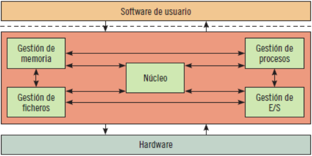

El intérprete de órdenes o Shell:

- Proporciona al usuario una interfaz por la que puede comunicarse con el PC. Según sea el Sistema Operativo, el Shell variará y las órdenes serán diferentes.
- Dependiendo del tipo de interfaz que empleen, los shells pueden ser:

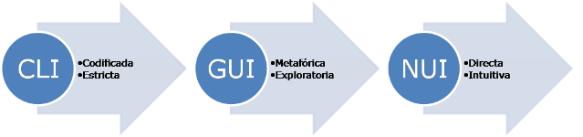

CLI (Command-Line Interface, interfaz de línea de comandos):

Codificada - Estricta

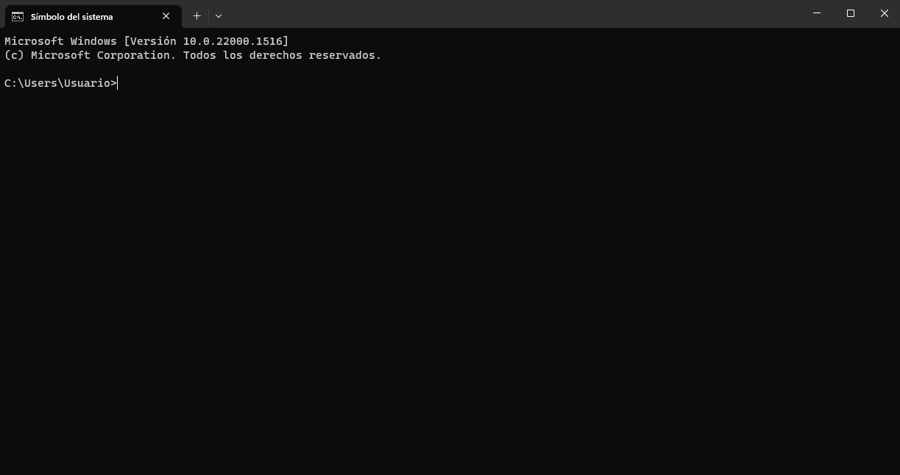

GUI (Graphical User Interface, interfaz gráfica de usuario):

Metafórica - Explorativa

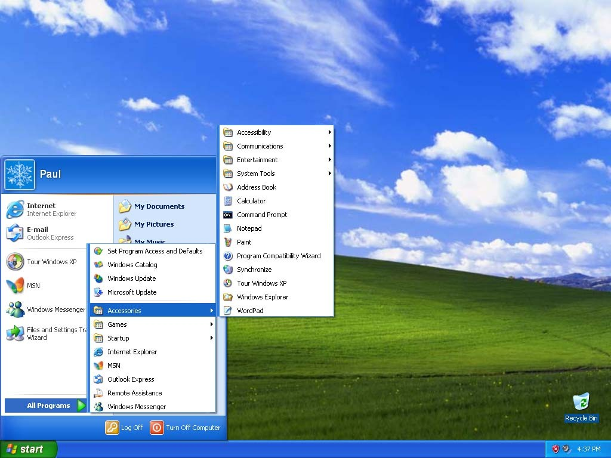

NUI (Natural User Interface, interfaz natural de usuario):

Directa – intuitiva

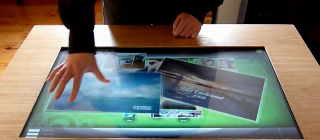

## Clasificación por su estructura interna

- Estructura monolítica: es la estructura de los primeros sistemas operativos constituidos fundamentalmente por un solo programa compuesto de un conjunto de rutinas entrelazadas de tal forma que cada una puede llamar a cualquier otra.
- Estructura jerárquica: se dividió el sistema operativo en pequeñas partes, de tal forma que cada una de ellas estuviera perfectamente definida y con un claro interface con el resto de elementos.
- Máquina virtual: Se trata de un tipo de sistemas operativos que presentan una interface a cada proceso, mostrando una máquina que parece idéntica a la máquina real. El objetivo de los sistemas operativos de máquina virtual es el de integrar distintos sistemas operativos, dando la sensación de ser varias máquinas diferentes.
- Cliente – Servidor (Microkernell): En esta arquitectura la computadora de cada uno de los usuarios, llamada cliente, produce una demanda de información a cualquiera de las computadoras que proporcionan información, conocidas como servidores estos últimos responden a la demanda del cliente que la produjo.
- Los clientes y los servidores pueden estar conectados a una red local o una red amplia, como la que se puede implementar en una empresa o a una red mundial, como lo es la Internet.

## Clasificación por los servicios ofrecidos

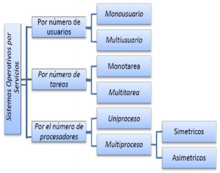

### Según el número de usuarios

Monousuarios: soportan a un usuario a la vez. Las computadoras personales típicamente se han clasificado en esta sección.

Multiusuario: son capaces de dar servicio a más de un usuario a la vez, ya sea por medio de varias terminales conectadas a la computadora o por medio de sesiones remotas en una red de comunicaciones.

### Según el número de tareas

Monotarea: son aquellos que solo permiten una tarea a la vez por usuario. Puede darse el caso de un sistema multiusuario y monotarea, en el cual se admiten varios usuarios al mismo tiempo, pero cada uno de ellos puede estar haciendo solo una tarea a la vez.

Multitareas: permite al usuario estar realizando varias labores al mismo tiempo. Por ejemplo, puede estar editando el código fuente de un programa durante su depuración mientras compila otro programa, a la vez que está recibiendo correo electrónico en un proceso en background (segundo plano).

### Según el número de procesadores que puede gestionar

Uniproceso: es capaz de manejar solamente un procesador de la computadora. Por ejemplo, Windows 98 es un sistema operativo Uniproceso.

Multiproceso: es capaz de manejar más de un procesador en el sistema, distribuyendo la carga de trabajo entre todos los procesadores que existan en el sistema. Generalmente estos sistemas trabajan de dos formas: simétricamente o asimétricamente.

- Cuando se trabaja de manera asimétrica, el sistema operativo selecciona a uno de los procesadores, el cual jugará el papel de procesador maestro y servirá como pivote para distribuir la carga a los demás procesadores, que reciben el nombre de esclavos.
- Cuando se trabaja de manera simétrica, los procesos o partes de ellos (threads, hebras o hilos) son enviados indistintamente a cualquiera de los procesadores disponibles.

## Clasificación por la forma de ofrecer sus servicios

Sistemas operativos de escritorio: estos sistemas operativos se utilizan en los equipos personales, estaciones de trabajo, portátiles, etc. También se suelen conocer como sistemas operativos clientes.

Sistemas operativos en red: se definen como aquellos que tiene la capacidad de interactuar con sistemas operativos en otras computadoras por medio de un medio de transmisión con el objeto de intercambiar información, transferir archivos, ejecutar comandos remotos y un sin fin de otras actividades.

Sistemas operativos distribuidos: se definen como una colección de equipos informáticos separados físicamente y conectados entre sí por una red de comunicaciones distribuida; cada máquina posee sus componentes de hardware y software de modo que el usuario percibe que existe un solo sistema (no necesita saber qué cosas están en qué máquinas). El usuario accede a los recursos remotos de la misma manera en que accede a recursos locales, ya que no percibe que existan varios ordenadores, sino que solo es capaz de ver uno formado por todos los anteriores.

## Clasificación por su disponibilidad

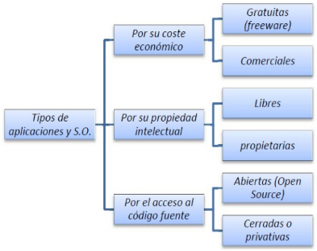

## Clasificación por su tipo de licencia

Dentro de los sistemas operativos comerciales, propietarios y privativos, nos podemos encontrar con diversos tipos de licencia de uso:

OEM (Original Equipment Manufacturer): la particularidad de este tipo de licencias, es el que el sistema operativo viene preparado para ese hardware específicamente, de modo que no tenemos realmente una licencia de uso del sistema operativo, sino una licencia de uso del sistema operativo únicamente para ese hardware en concreto.

Retail: es la licencia que compramos directamente del desarrollador. Somos propietarios de la licencia, podemos instarlo en cualquier tipo de hardware compatible, podemos revender la licencia o cederla, etc.

VCM (Licencias por Volumen): para una empresa con cientos de ordenadores, es complicado controlar las licencias individuales de cada una de sus máquinas. Existe la posibilidad de contratar un tipo de licencia especial con el desarrollador, de modo que, con una única clave de licencia, podemos utilizar varias máquinas a la vez.

MSDN (Licencias para Educación): son unas licencias especiales de Microsoft que permiten su uso únicamente para actividades educativas y de formación. Cualquier uso de estas licencias en equipos que desarrollen actividades fuera de este ámbito, es ilegal.

## Familias

Existen diversos tipos de mercado, cada uno con diferentes funciones. Los más populares:

Windows: es un sistema operativo comercial desarrollado por Microsoft. Windows ha ido evolucionando a lo largo del tiempo a través de numerosas versiones orientadas a ordenadores personales y servidores. Es uno de los sistemas más difundidos entre ordenadores portátiles y de escritorio.

Linux: es un sistema operativo basado en UNIX y que cuenta con multitud de distribuciones. Linus Torvalds, estudiante finlandés, creó su núcleo en 1991 y lo difundió como software libre. Este sistema se popularizó rápidamente y, en la actualidad, cuenta con millones de desarrolladores que colaboran en todo el mundo.

Mac OS: es un sistema operativo comercial desarrollado por Apple para ordenadores Macintosh. Su arquitectura está basada en el sistema operativo UNIX, por lo que es bastante estable. Fue el primero en popularizar la interfaz gráfica de usuario.

Sistemas operativos móviles: creados para dispositivos inalámbricos con pantallas pequeñas y táctiles, como los teléfonos y tabletas. El más utilizado es Android, seguido por otros como iOS, BlackBerry OS, Symbian OS y Windows Phone.

Sistemas operativos en la nube: son sistemas operativos que interactúan directamente con el usuario a través del navegador Web, por lo que son independientes del dispositivo utilizado para acceder a la información. Proporcionan total disponibilidad de la información, ofrecen gran seguridad al ser sistemas operativos libres de virus, sus aplicaciones siempre están actualizadas, aunque se requiere un gran ancho de banda para utilizarlas eficientemente. Algunos ejemplos son ChromeOS, Glide OS, SilveOS. Las versiones actuales ya ofrecen servicios para iniciar sesión o almacenar información en la nube.

# Virtualización

¿Qué es la virtualización?

El término virtualización en un contexto informático se utiliza para referirnos a la creación mediante software de una versión virtual de algún recurso tecnológico, como puede ser una plataforma de hardware, un sistema operativo, un dispositivo de almacenamiento u otros recursos de red.

Si decidimos virtualizar un PC, estamos indicando que de algún modo estamos simulando mediante software el funcionamiento de un PC real con todos los componentes y comportamientos que ello conlleva.

Ventajas de la virtualización:

- Aprovechamiento de recursos
- Reducción de costes
- Flexibilidad
- Uso de varias tecnologías simultáneamente
- Realización de pruebas, se pueden cometer errores y volver atrás sin problemas

# Maquinas virtuales

Una máquina virtual es un programa informático que simula a un ordenador y puede ejecutar programas como si fuese uno real, es decir, virtualizarlo; en este sentido, también se le llama aplicación de virtualización.

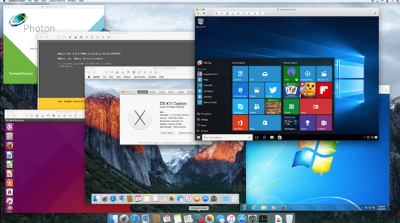

## Conceptos

Los dos conceptos más importantes para entender qué es la virtualización que llevan a cabo las máquinas virtuales son los de anfitrión e invitado. Ambos conceptos se refieren a nuestros sistemas operativos y, por lo tanto, se debería hablar de sistema operativo anfitrión y sistema operativo invitado.

El anfitrión ("host", en inglés) es el sistema operativo del ordenador en el cual se instala un programa de virtualización y que asignará o prestará determinados recursos de hardware a la máquina virtual que se cree, que pueden ser varias (limitadas por los recursos de la máquina real), es decir, es el que alberga al invitado.

El invitado o huésped ("guest", en inglés) es el sistema operativo que se instala en la máquina virtual creada, a la cual se le ha asignado determinados recursos de la máquina física para funcionar.

El Hypervisor también llamado Virtual Machine Monitor, VMM, es un software que permite el funcionamiento del sistema huésped en el anfitrión.

Cuando usamos máquinas virtuales tenemos:

- Un PC con un sistema operativo instalado llamado Sistema Operativo Anfitrión
- Unos recursos hardware disponibles: CPU, memoria, disco, red…)
- Una capa software llamada VMM (Virtual Machine Monitor), que se encuentra entre el hardware y el Sistema Operativo de la máquina virtual, de forma que consigue abstraer los recursos de esta máquina para que sean distribuidos por todas las máquinas virtuales instaladas, es decir, el sistema operativo huésped.

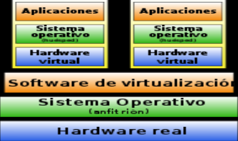

## Tipos de virtualización

Virtualización de hardware:

Es el más complicado de conseguir. Consiste en emular los elementos físicos del PC, host o anfitrión. De este modo, el sistema operativo huésped no se ejecuta sobre el hardware real sino sobre el hardware virtual creado. La virtualización de hardware permite emular diferentes arquitecturas.

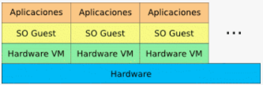

Virtualización a nivel de Sistema Operativo:

Se dispone del hardware real y un único kernel del sistema operativo anfitrión que usaran todos los sistemas virtualizados. Los procesos se agrupan para realizar las funciones de los sistemas operativos que se quieren visualizar.

La ventaja de este enfoque es la separación de los procesos de usuario prácticamente sin pérdida en el rendimiento, pero al compartir todos los servidores virtuales el mismo kernel no pueden obtenerse el resto de las ventajas de la virtualización.

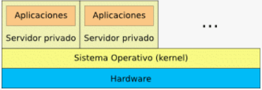

Virtualización completa:

En este tipo de virtualización, el hypervisor simula un entorno completo de hardware para cada máquina virtual. Cada máquina virtual dispone entonces de su propio conjunto de recursos de hardware virtuales asignados por el hipervisor y ejecuta aplicaciones sobre esta base, de modo que el sistema alojado no tiene acceso al hardware físico del sistema anfitrión. Las soluciones de software más conocidas de este tipo de virtualización son Oracle VM VirtualBox, Parallels Workstation, VMware Workstation, Microsoft Hyper-V y Microsoft Virtual Server.

Ventajas: Admite casi todos los sistemas operativos invitados sin modificación, lo que significa que la compatibilidad es buena.

Desventajas: Debido a que algunas partes tienen funciones analógicas, la E/S y el rendimiento es algo peor.

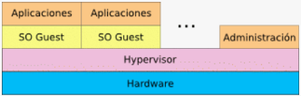

Paravirtualización:

Mientras que en la virtualización completa se dispone de un entorno de hardware completo para cada máquina virtual, en la paravirtualización el hypervisor ofrece solo una interfaz de programación (API) a través de la que los sistemas alojados acceden al hardware físico del anfitrión, con lo que el rendimiento mejora. Como requisito se exige que la API integre el kernel del sistema operativo del huésped, es decir, solo se puede “paravirtualizar” sistemas huésped modificados. Los proveedores de sistemas propietarios, como Microsoft Windows, no permiten por norma general este tipo de modificación. Entre los hipervisores que permiten la paravitualización se encuentran Xen y Oracle VM Server for SPARC. El concepto también tiene su aplicación en el sistema operativo para computadoras z/VM de IBM.

Ventajas: en comparación con la virtualización completa, la paravirtualización está más optimizada y tiene ciertas ventajas en la velocidad general.

Desventajas: el sistema operativo del usuario debe modificarse, por lo que hay menos sistemas operativos compatibles.

Actualmente Intel y AMD han incorporado en sus microprocesadores nuevas tecnologías que facilitan la paravirtualización y la virtualización completa: Intel VT y AMD-V.

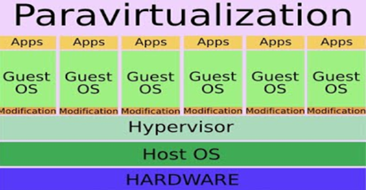

## VirtualBox

Desarrollado por Oracle Corporation. Permite desarrollar arquitecturas x86/Amd 64 y sistemas operativos Linux, Windows, Solaris, Mac OS…).

VirtualBox es uno de los programas de virtualización más populares para la arquitectura x86/amd64. Permitiendo ejecutar diferentes sistemas operativos en máquinas con otros instalados, sin la necesidad de reiniciar. Por ejemplo, Windows en máquinas Linux o Mac.

Características: VirtualBox (VB) es un software de virtualización donde los usuarios pueden cargar múltiples sistemas operativos invitados en un solo SO anfitrión. Cada invitado se puede configurar, iniciar, pausar o parar de forma independiente. El SO anfitrión y los sistemas operativos invitados pueden comunicarse entre sí a través de una serie de mecanismos, entre ellos un portapapeles común, carpetas compartidas, arrastrando y soltando ficheros, etc.

Las principales características que nos ofrece VirtualBox son:

- Es una herramienta multiplataforma compatible con Windows, macOS, Linux y Solaris.
- Puede controlarse a través de símbolo de sistema.
- Cuenta con herramientas especiales para compartir archivos entre máquinas.
- Permite crear instantáneas para restaurar el estado anterior de una VM fácilmente.
- Soporte limitado para gráficos 3D.
- Permite utilizar aplicaciones virtualizadas como si se trataran de aplicaciones del sistema «separándolas».
- Es compatible con las máquinas virtuales de VMware.
- Cuenta con una herramienta de captura de vídeo.
- Cifrado de unidades virtuales (con una extensión).
- Soporte para puertos USB 2.0 y 3.0 (con una extensión).

VM VirtualBox es uno de los mejores programas para crear máquinas virtuales gratis. Se trata de un software gratuito de muy sencillo manejo desarrollado por Oracle Corporation. Es realmente fácil aprender a manejarse con su interfaz, y cuenta con funcionalidades para cambiar la configuración de forma rápida.

El módulo de “Guest Additions” nos permite abrir un canal para que sea posible el intercambio de carpetas o información entre máquinas virtuales o el equipo raíz. De este modo podremos copiar carpetas, periféricos o unidades de una máquina virtual a otra.

En resumen, el Guest Additions de Virtualbox tiene te permite otorgar una serie de privilegios adicionales a las máquinas virtuales que crees en tu ordenador. Esto simplificará mucho más su manejo.

Virtual Box es también multiplataforma, por lo que puede ser instalado en todo tipo de sistemas operativos, ya sea Windows, MAC o Linux. Esto es algo que sin duda le ha hecho ganar una gran cantidad de usuarios frente a otros programas de virtualización.

Tiene también una opción para realizar Snapshots o capturas de estado de las máquinas virtuales. De este modo, podemos restaurar el estado de la máquina en cierto punto en caso de que rompamos algo de la configuración.