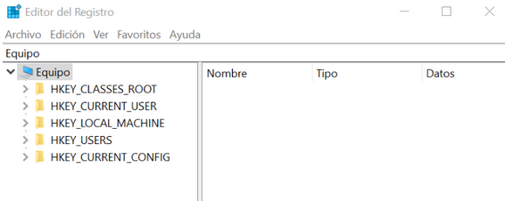
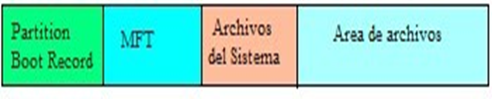

# Windows 10

## Instalación y configuración

Windows 10 es el vigente sistema operativo desarrollado por Microsoft como parte de la familia de sistemas operativos herederos de Windows NT.  Fue dado a conocer oficialmente en septiembre de 2014, Entró en fase beta de prueba en octubre de 2014 y fue lanzado al público en general el 29 de julio de 2015.

Windows 10 es uno de los sistemas operativos cliente más usados en la actualidad. Es un software propietario o privativo con licencia de Microsoft.

### Nuevas características

- **La interfaz**: Diseñada para llegar al mayor número de dispositivos posibles, de forma que puede arrancar tanto en dispositivos móviles, tablets, como en ordenadores de sobremesa.
- **Menú inicio**: Windows 10 trae de vuelta el menú de Inicio y le da más flexibilidad para convertirse en una buena opción para dispositivos con mouse y teclado o con pantallas táctiles.
- **Paint 3D**: Es el programa sucesor del Paint original, permite al usuario realizar dibujos desde cero en 3D o convertir dibujos 2D en 3D. Presenta diversidad de modelos para usar y herramientas para aplicar texturas, colores, etc.
- Windows Hello: Microsoft incorpora el uso de la huella dactilar y el reconocimiento del rostro. Es una forma de desbloquear tu dispositivo en lugar de introducir la clásica contraseña o el pin de turno. Para ello, el sistema recurre a tu cara, a tus ojos y a tu huella dactilar para establecer un patrón posterior.
    
    Para activar Windows Hello sólo hay que pulsar en el botón de “Inicio” (abajo a la izquierda) y entrar en el icono de “Ajustes” -> “Configuración”. Cuando te salga la pantalla correspondiente accede a “Cuentas”. De todos los campos que salen ahora para elegir, quédate sólo con el que pone “Opciones de inicio de sesión”. Entra y verás que aparece Windows Hello como método para ser activado. Obviamente, aquí tienes dos opciones: que tu dispositivo sea compatible o no.
    
- Windows Ink: Es una característica muy interesante para usar en pantallas táctiles, tablets o dispositivos móviles. Con el uso de un lápiz digital permite escribir en el dispositivo como si se hiciera en papel, crear notas adhesivas, dibujar en una pizarra blanca y compartir de manera fácil notas analógicas en el mundo digital. Esta herramienta es de gran utilidad para los usuarios de Office que pueden compartir sus ideas o simplemente realizar anotaciones con bastante facilidad.
- Cortana: Es un asistente virtual. Cortana puede establecer recordatorios, reconocer voz natural sin la necesidad de ingresar el teclado y responder preguntas utilizando información del motor de búsqueda Bing.
- Microsoft Edge: Es el nuevo navegador web diseñado de forma expresa para Windows 10. Está programado para trabajar con Cortana y hacer que las búsquedas sean más fáciles que desbanca por completo a Microsoft Explorer. Tiene la posibilidad de realizar anotaciones sobre páginas web, compartir estas o marcar artículos para leer con posterioridad.
- Seguridad: Windows 10 es hasta la fecha el sistema operativo más seguro de Microsoft. Las nuevas tecnologías de seguridad de Windows 10, como Windows Hello, Microsoft SmartScreen, encriptación más versátil, los nuevos controles parentales, etc. Hacen del nuevo sistema un software más robusto frente a los espías y el malware. Es necesario mantener el sistema actualizado para poder disfrutar de las nuevas opciones de seguridad y mantener seguro el software.
- Continuum: Es la nueva característica que da sentido a que Windows 10 sea un sistema operativo diseñado para trabajar en cualquier dispositivo. Con Continuum podemos conectar nuestro teléfono a un monitor, teclado o ratón y proyectar en pantalla aplicaciones tipo Office mientras que se puede seguir utilizando el dispositivo móvil para otras funciones. Esta funcionalidad hace que podamos trabajar desde cualquier lugar con facilidad.

### Versiones de Windows 10

- Windows 10 Home
    - Es la edición básica original orientada a PCs de sobremesa y portátiles, tabletas y convertibles, e incluye todas las características orientadas al usuario final convencional para este tipo de equipos.
    - En ella se incluyen Cortana, el navegador Microsoft Edge, el soporte del modo tableta y de la tecnología biométrica Windows Hello. Se incluyen diversas aplicaciones nativas como la de Correo, Fotos, Mapas, Calendario o Música y Vídeo, y contamos también con opciones específicas para aquellos usuarios que disfrutan de los juegos con la Game Bar como protagonista.
- Windows 10 Pro
    - Como en el caso anterior, esta edición está orientada a esos mismos tipos de dispositivo, pero además de integrar todo lo que ya tiene la versión Home se añaden diversas opciones específicas para profesionales y PYMES.
    - Entre otras mejoras se tiene soporte para unir equipos a un dominio de trabajo, para contar con el soporte de la gestión de políticas de grupo o para poder usar la tecnología Bitlocker y el Escritorio Remoto.
- Windows 10 Enterprise
    - Un paso más allá en el caso de usuarios profesionales tenemos la edición Enterprise, que va dirigida a compañías de mayor tamaño y que sobre todo añade capacidades en la protección de esos equipos empresariales y de los datos que se manejan en ellos.
    - Solo se puede acceder a esta edición a través del programa Volume Licensing de Microsoft, y entre las características más destacadas está el llamado DirectAccess, que permite a usuarios remotos acceder a una red interna a través de un sistema similar a una VPN.
- Windows 10 Enterprise LTSB
    - Otra versión especializada, en este caso directamente derivada de la edición Enterprise, y que se diferencia de esta última en el soporte a largo plazo (long-term support).
- Windows 10 Education
    - Ese nombre podría confundirnos, porque, aunque esta edición está orientada efectivamente a entornos educativos, no es para alumnos, sino para las plantillas que conforman esas organizaciones académicas
- Windows10 Pro Education
    - Pequeña edición "avanzada" de la anterior que se lanzó en julio de 2016 para fabricantes de hardware que podían disfrutar de licencias especiales para la educación primaria y secundaria en países como Estados Unidos o Australia.
- Windows 10 Mobile
    - La edición de Windows 10 orientada a smartphones y pequeñas tabletas no está teniendo (de momento) el éxito que se esperaba, pero sigue siendo una de las variantes más llamativas de este sistema operativo
- Windows 10 Mobile Enterprise
    - Tenemos también variante empresarial para la plataforma móvil de Microsoft, que al igual que ocurría con la diferenciación entre la versión para usuarios finales y empresariales de Windows 10 para equipos de escritorio, llega con características específicas para esos usuarios de móviles empresariales.

### Requisitos para la instalación

- Procesador: Procesador a 1 GHz o más rápido o sistema en un chip (SoC)
- RAM: 2 GB para 64 bits
- Espacio en disco duro: 16 GB para un SO de 32 bits o 32 GB para un SO de 64 bits
- Tarjeta gráfica: DirectX 9 o posterior con un controlador WDDM 1.0
- Pantalla: 800×600
- Conexión a Internet

### Registro

Contiene información sobre todo tipo de configuraciones del sistema operativo. Entre sus usos, destaca:

- Información sobre aplicaciones instaladas.
- Asociación del tipo de archivo con la aplicación correspondiente.
- Programas que deben iniciarse al encender el equipo.
- Gestionar HW del PC y los drivers.
- Guardar configuraciones de las cuentas de usuario.

Se accede al registro a partir de la aplicación ‘Editor del registro’.



No debe manipularse sin los conocimientos adecuados.

Las carpetas principales que contiene son las siguientes:

- HKEY_CLASSES_ROOT: contiene una lista de extensiones de distintos tipos de archivos. En cada una se define qué programa debe abrirlos por defecto.
- HKEY_CURRENT_USER: incluye todas las configuraciones del usuario que está usando Windows en ese momento (cuenta activa).
- HKEY_LOCAL_MACHINE: engloba las configuraciones de software, hardware, aspecto,… de todas las cuentas de usuario del PC.
- HKEY_USERS: contiene datos sobre perfiles de usuario que haya en Windows.
- HKEY_CURRENT_CONFIG: tiene información sobre el perfil de HW del equipo.

## Administración

### Personalización de la interfaz

Aunque la personalización de Windows 10 no es compleja, existe una gran variedad de programas que ayudan al usuario a llevarla a cabo en menos tiempo y con mayor facilidad.

Configuración de la pantalla:

- Ajuste de resolución: Inicio → Configuración → Sistema → Pantalla → Escala distribución
- Ajuste de brillo y color: Inicio → Configuración → Sistema → Pantalla → Color

### Cambiar efectos visuales y sonido

Podemos modificar el escritorio, ventanas, iconos y demás componentes gráficos:

- Inicio → Configuración → Personalización

Fondo: Podemos usar algunas de las imágenes que proporciona Windows o bien aquella que queramos haciendo clic en el botón Examinar.

Colores: Se pueden modificar los colores que se usan en ventanas y aplicaciones y el efecto que podemos dar a estas.

Pantalla de bloqueo: Es la que se muestra cuando encendemos el PC o dejamos de usarlo durante un tiempo, previamente configurado. El protector de pantalla también se puede configurar desde aquí.

Temas: Permite cambiar de forma rápida toda la configuración de apariencia del equipo.

Inicio: Podemos configurar las aplicaciones a mostrar activando o desactivando Mostrar más iconos en Inicio. Mostrar lista de aplicaciones en el menú Inicio. Mostrar aplicaciones agregadas recientemente y Mostrar aplicaciones más usadas.

Para Anclar/Desanclar iconos dinámicos: Windows 10 opta por dejar una serie de iconos dinámicos, accesibles desde el menú Inicio, que no bloquean la pantalla y que se pueden eliminar o agregar con facilidad.

- Para eliminar un icono: clic sobre el botón derecho del ratón sobre el icono y clic en Desanclar en Inicio.
- Para agregar un icono: Localizar la aplicación, hacer clic con el botón derecho del ratón y seleccionar Anclar a Inicio.

Barra de tareas: Ubicada normalmente en la zona inferior de la pantalla y se puede: Ocultar automáticamente la barra de tareas. Usar botones pequeños. Establecer su ubicación. Configurar el área de notificación.

- Se visualiza el menú contextual haciendo clic con el botón derecho del ratón sobre la barra de tareas.

### Modificación de la seguridad del sistema

Activar las actualizaciones automáticas: Harán que el equipo sea más seguro, de forma que si en la instalación no fueron activadas se puede hacer ahora:

- Inicio → Configuración → Actualización y seguridad → Windows Update

### Sistemas de archivos

Es la forma en la que el sistema operativo almacena la información en el disco. Windows 10 utiliza el sistema NTFS que es el sistema más robusto y seguro de los empleados por Windows. Se introduce con las primeras versiones NT de Windows y es el estándar obligatorio desde Windows XP.

Admite, además, archivos FAT, FAT32, exFAT y ReFS.

La unidad mínima de almacenamiento física es el sector. Los sectores contiguos se agrupan en cluster. NTFS permite definir el tamaño de clúster (siempre y cuando sea potencia de dos: 2,4,8,16,…). Un volumen es una partición sobre un disco duro real y está formado por uno o varios clústers. El tamaño máximo de volumen para NTFS es de 264 bytes.

En NTFS cada elemento en un volumen es un archivo y cada archivo tiene asignado una serie de atributos.

- **Partition Boot Record**: Partición del sector de arranque, mantiene información sobre la estructura y disposición del sistema de archivos, así como del arranque del volumen.
- **MTF**: La tabla maestra de archivos, contiene el dónde y el cómo están almacenados los archivos junto con todos los atributos asociados a estos.
- **Archivos del sistema**: Contiene la información sobre los datos y operaciones que se realizan sobre el sistema de archivos: espacio libre, log de transaccionalidad, etc.
- **Área de archivos**: Donde realmente se almacenan los datos del usuario.



### Nombre de ficheros

Cuando creamos un archivo o directorio en Windows 10 debemos de tener en cuenta una serie de reglas:

- No puede exceder de 255 caracteres (incluida la ruta completa).
- Los ficheros se componen de un nombre y extensión separada por un punto.
- Pueden usarse números, letras o cualquier símbolo que no se encuentre entre los siguientes: `\` , `/`, `*`, `"`, `¿`, `>`, `<`, `|`.
- No existe distinción entre mayúsculas y minúsculas.
- Se pueden usar espacios en blanco y tildes cero no son aconsejables.

### Operaciones con archivos y carpetas

Los archivos almacenan información que será procesada a través de algún software de aplicación.

Un directorio o carpeta es un contenedor encargado de agrupar conjuntos de ficheros.

Operaciones básicas que se pueden realizar:

Crear, Borrar, Abrir, cerrar, Leer directorio, Renombrar, Duplicar y Mover.

Usando el botón derecho del ratón y a través del menú contextual se pueden crear carpetas o archivos vacíos.

O bien haciendo uso del Explorador de Windows: Inicio → Explorador de archivos

### Cuentas de usuario

Las cuentas de usuario contienen la información relacionada con la persona que accede al sistema. Nos permiten tener un control de las personas que pueden entrar en el sistema y de las acciones que pueden realizar. Una cuenta nos permite acceder al sistema y además identifica:

- Los ficheros y directorios que esa persona puede leer o modificar.
- Los recursos que puede utilizar.
- Los cambios que puede hacer en el sistema.
- Sus preferencias personales como fondo de escritorio, aspecto de las ventanas, etc.

La carpeta donde se almacenan los perfiles de usuarios se denomina Usuarios y se ubica en el directorio raíz de la partición donde se haya procedido a la instalación.

Existen dos tipos de cuentas:

- Cuenta de usuario estándar: Es la cuenta normal con privilegios limitados de acceso a determinadas ubicaciones y recursos, diseñada para el usuario habitual del PC.
- Cuenta de usuario administrador: Tiene todos los privilegios y puede realizar cualquier acción en el sistema operativo.

En esta versión se pueden clasificar a los usuarios en función a la afinidad que tengamos con ellos. Así hay dos grupos de usuarios: Familia y Otros Usuarios:

- Familia: Se crean este tipo de cuentas cuando tengamos necesidad de controlar los accesos del usuario, sitios web que visita, historial de su actividad, etc. Este tipo nos permite muchas opciones de control parental.
- Otros Usuarios: En este grupo estarán aquellos usuarios a los que limitaremos su uso en función de si les convertimos en administradores o no y sobre los que no queremos tener un control exhaustivo.

Crear una cuenta:

- Creación de una cuenta para el usuario “familia”: Inicio → Configuración → Cuentas → Familia y Otras personas
- En la zona Tu familia clic en Agregar familiar
- Escribir la cuenta de correo del usuario
- La persona recibirá un correo que debe ser validado

Para poder crear una cuenta de tipo Familia es necesario que estemos registrados con una cuenta de Microsoft.

Creación de una cuenta para el usuario “otras personas”:

- Inicio → Configuración → Cuentas → Familia y Otras Personas
- En la zona Otras Personas clic en Agregar otra persona al equipo
- Cuadro de diálogo donde piden dirección de correo o teléfono.
    - Usar cuenta de correo Microsoft: escribirla, clic en Siguiente e introducir contraseña.
    - No usar cuenta de correo Microsoft:
        - clic en el enlace “no tengo los datos de inicio de sesión”.
        - En la nueva vista nos da opción a crear una cuenta de correo local, si no lo hacemos clic en Agregar un usuario sin cuenta Microsoft.
        - Aparecerá cuadro de diálogo para introducir nombre de usuario y contraseña y clic en Siguiente.

Modificar características de una cuenta:

Para modificar los datos relacionados con una cuenta que no sea la nuestra debemos tener una cuenta de administrador. Para modificar las características de una cuenta:

En el panel de búsqueda: Panel de control → Cuentas de Usuario → Administrar otra cuenta. 

Opciones:

- Cambiar contraseña (es segura si tiene mínimo 8 caracteres y está formada por una combinación de letras  mayúsculas y minúsculas, números y símbolos).
- Cambiar el nombre de la cuenta.
- Cambiar el tipo de cuenta.
- Eliminar cuenta.

Cada usuario puede modificar la imagen a mostrar sobre su cuenta:

- Inicio → Configuración → Cuentas → Tu información → Crear tu imagen.

### Seguridad local en los recursos

Para que un determinado recurso sea común a todos los usuarios y que sea accesible de diferente forma por cada uno de ellos, los permisos se conceden mediante la pestaña Seguridad de su ventana de Propiedades (clic en botón derecho del ratón y propiedades).

Los permisos permiten proteger los archivos contra un acceso, modificación o borrado no autorizado. Los gestiona el propietario, el administrador o un usuario que disponga de los permisos requeridos.

Asignación de permisos:

Podemos denegar o permitir acceso a usuarios o grupos de usuarios:

- Clic en Editar: permite Agregar o Quitar usuarios
- Clic en opciones avanzadas: permite ver, agregar o quitar permisos, así como deshabilitar herencias.

### Permisos de usuarios y grupos

| Permisos | Sobre ficheros | Sobre directorios |
| --- | --- | --- |
| Control total | Leer, escribir, modificar permisos y eliminar archivos | Leer, escribir, modificar permisos y eliminar archivos y subcarpetas |
| Modificar | Leer, escribir y eliminar archivos | Leer y escribir sus archivos y subcarpetas y eliminar carpetas |
| Lectura y ejecución | Similar al de lectura, pero con el añadido de ejecución | Similar al de lectura y se pueden ejecutar archivos |
| Mostrar contenido de carpeta |  | Ver y listar ficheros y directorios. Además de ejecutar archivos |
| Lectura | Ver el fichero y tener acceso al contenido | Entrar y listar el contenido de la carpeta |
| Escritura | Escribir en un archivo | Agregar nuevos archivos y subcarpetas |

Que pueden asignarse usando la configuración avanzada de asignación de permisos.

### Administración avanzada

Windows 10 aporta al administrador del sistema una serie de herramientas por las que puede configurar el mismo y controlar su funcionamiento:

Panel de control → Sistema y seguridad → Herramientas administrativas

Podemos hacer entre otras cosas:

- Visualizar los eventos a través del Visor de Eventos, útil para observar lo que pasa en nuestro equipo y averiguar la causa de problemas. Cada suceso tiene asociado un identificador, palabra clave, la fecha y hora de lo que se produce y una breve descripción.
- Gestionar las Carpetas compartidas, así se puede averiguar quien ha accedido o está accediendo a una capeta en concreto y qué ficheros está usando. Muy útil cuando se crean usuarios móviles u obligatorios.
- Configurar Usuarios y grupos locales.
- Observar el Rendimiento del sistema.
- Visualizar los dispositivos instalados en el sistema a través del Administrador de dispositivos.
- Configurar los discos duros, sus particiones, y lectores de CD/DVD a través de la Administración de discos.
- Administrar los servicios del sistema a través de Servicios y Aplicaciones.
- Un servicio puede estar iniciado, pausado o detenido. Es interesante observar el tipo de inicio de cada servicio, los tipos posibles son: Automático (inicia al arrancar el sistema), Manual (es el usuario el encargado de iniciarlo) y Deshabilitado (el servicio no está disponible y no puede ser iniciado de forma manual).

### Configuración del sistema

Esta herramienta permite cambiar características relacionadas con el arranque del sistema. Podemos configurar el sector de arranque, estableciendo que sistema operativo debe arrancar de forma predeterminada, en que orden deben mostrarse los sistemas instalados, etc.

Se puede acceder a la configuración del sistema desde la carpeta Herramientas administrativas o escribiendo msconfig en el cuadro de búsqueda del inicio.

### Gestión del software

Para gestionar el software instalado disponemos de la herramienta aplicaciones

Inicio → Configuración → Aplicaciones → Aplicaciones y características

## Comandos de la consola

La ventana de comandos de Windows o Símbolo del sistema continúa siendo una gran herramienta con la que reparar el PC o administrar cualquier Windows sin tener que usar su interfaz gráfica.

La ventana de comandos de Símbolo del sistema se ha mantenido hasta nuestros días y todavía resulta una herramienta muy útil para la administración del sistema.

Windows 10 nos ofrece 2 herramientas para ejecutar comandos de consola:

- CMD
- PowerShell

### Acceder al símbolo del sistema

CMD y PowerShell

En las últimas actualizaciones de Windows 10 Microsoft ha potenciado el uso de Windows PowerShell, la versión avanzada de Símbolo del sistema.

- Pulsando la combinación de teclas Windows + X o haciendo clic con el botón derecho del ratón sobre el botón Inicio nos aparece la posibilidad de entrar en PowerShell.

Para acceder a los comandos CMD se realiza como en anteriores versiones:

- Pulsando Windows +R y Ejecutar cmd.

Para que en el menú avanzado se pueda recuperar: Símbolo del sistema o Símbolo del sistema (administrador) acceder al menú Configuración-Personalización en el panel lateral elige Barra de Tareas. Entre las opciones de este apartado encontrarás una que te indica que se reemplaza el Símbolo del sistema por Windows PowerShell. Desactiva ese interruptor y la opción de Símbolo del sistema volverá a aparecer en el menú avanzado de Windows 10.

### Personalizar el aspecto de la ventana de comandos CMD

Se puede personalizar el fondo y tipo de letra de esta herramienta CMD para hacerla más agradable de usar. Para ello hay que hacer clic con el botón derecho del ratón sobre la barra de título de la ventana de comandos de Windows y elegir la opción Propiedades.

Aparecerá un cuadro de configuración desde el que, accediendo a las distintas pestañas, podrás ajustar el color de fondo de la herramienta, el tipo y tamaño de la letra o el tamaño que ocupará la ventana.

### Lista de comandos CMD

- Para moverse por el sistema y gestionar archivos
    
    
    | Comando | Descripción |
    | --- | --- |
    | cls | Limpia la ventana de CMD |
    | exit | Cierra la ventana de CMD
    Si se ha iniciado un comando de procesado por lotes cierra el proceso, pero mantiene abierta la CMD |
    | help | Muestra todos los comandos disponibles y una breve descripción.
    Para obtener información sobre un comando en concreto, escribe el comando seguido de una barra diagonal y un signo de interrogación |
    | cd | Moverte por las carpetas de tu PC
    Dependiendo del atributo que lo acompañe realizará una acción u otra |
    | dir | Muestra el contenido de un directorio listando los archivos y carpetas que se encuentran en él |
    | copy “origen” “destino” | Copia un archivo de origen en una nueva ubicación de cualquier ruta |
    | robocopy | Copia ofreciendo mayor velocidad y permitiendo cancelar y retomar la tarea, ya que muestra un indicador de progreso |
    | move “origen” “destino” | Mover un archivo desde su ubicación actual a la nueva ubicación que le indiques |
    | del “archivo/directorio” | Elimina un archivo concreto o todo el contenido de la carpeta indicada |
    | rd | Elimina un directorio concreto |
    | ren “origen” “destino” | Renombra un archivo |
    | format | Borra por completo una unidad de disco |
    | md “directorio” | Crear nuevos directorios |
    | tree “directorio” | Permite obtener una vista completa del árbol de directorios de una ruta concreta en la que se mostrarán todos los archivos y directorios |
    | type “archivo” | Abrir archivos en la CMD |
    | undel | Recuperar archivo borrado |
- Para administrar el equipo o recuperar fallos
    
    
    | Comando | Descripción |
    | --- | --- |
    | ver | Muestra la versión de Windows |
    | control panel | Abre el panel de control |
    | time | Ver la hora del sistema |
    | sfc | Examina la integridad de todos los archivos de sistema y reemplaza los dañados por la versión correcta de Microsoft |
    | cleanmgr | Liberar espacio en disco de manera automática, sin que tengas que configurar nada más |
    | winsat | Lanzar un benchmark que analizará el rendimiento del equipo y te permitirá conocer si sus componentes funcionan como debieran |
    | defrag | Desfragmenta el disco duro que se le indique |
    | diskpart | Permite conocer y configurar las propiedades de los discos y particiones presentes en el sistema |
    | chkdsk | Realiza un chequeo de la superficie del disco duro y permite detectar sectores defectuosos y otros fallos del disco |
    | ipconfig | Muestra información detallada de tu conexión de red para cualquier adaptador del equipo |
    | getmac | Muestra la dirección MAC o dirección física del adaptador de red de existir uno en el equipo |
    | ping “host” | Ejecuta un ping al host indicado |
    | netstat | Muestra estadísticas del protocolo y conexiones TCP/IP en uso |
    | tracert “host” | Muestra todos los redireccionamientos que tu conexión lleva a cabo
    hasta llegar al host indicado |
    | shutdown | Permite apagar o reiniciar el sistema |
    | logoff | Cierra la sesión de usuario actual |
    | attrib | Quita o añade atributos |
    | date | Cambia la fecha |

### ¿Qué es PowerShell?

Windows PowerShell es un shell de línea de comandos, un lenguaje de scripting y un entorno para la automatización de tareas creado por Microsoft. Se basa en el framework .NET y es perfecto para automatizar procesos por lotes y tareas del sistema. PowerShell está disponible para Windows y Linux.

PowerShell es un lenguaje de scripting, interpretado.

En PowerShell, los comandos reciben el nombre de “cmdlet”, y se puede utilizar la tecla de tabulación para que Powershell autocomplete el nombre del cmdlet que se quiere usar.

### Lista de comandos CMDLET

| Comando | Descripción |
| --- | --- |
| Get-Command | Permite conocer todas las funciones y características que incluyen sus cmdlets |
| Get-Host | Obtiene la versión de Windows PowerShell que está usando el sistema |
| Get-History | Obtiene un historial de todos los comandos que se ejecutaron bajo una sesión de PowerShell que se encuentra ejecutándose |
| Get-Random | Obtiene un número aleatorio entre 0 y 2147483646 |
| Get-Service | Presenta una lista de todos los servicios con sus respectivos estados |
| Get-Help | Presenta una ayuda básica de los cmdlets y sus funciones |
| Get-Date | Día de una determinada fecha del pasado |
| Copy-Item | Copia carpetas o archivos |
| Invoke-Command | Ejecuta un script o comando (de forma local o remota, en uno o varios ordenadores) |
| Invoke-Expression | Ejecuta un comando a nivel local después de analizarlo |
| Set-ExecutionPolicy | Modifica la categoría de seguridad |
| Get-Item | Busca información acerca de un directorio o archivo con una ubicación concreta |
| Remove-Item | Borra carpetas, archivos, funciones, variables o claves del registro |
| Get-Content | Examina el contenido de un archivo sin necesidad de abrirlo |
| Set-Content | Almacena texto en un archivo |
| Set-Variable | Establece, modifica o reinicia el valor de una variable |
| Get-Variable | Muestra los valores |
| Get-Process | Ofrece información acerca de los procesos |
| Start-Process | Ejecuta procesos en el equipo |
| Stop-Process | Detiene un proceso |
| Start-Service | Inicia un servicio en el sistema |
| Stop-Service | Detiene los servicios que se encuentran en ejecución en el equipo |
| Exit | Salir de PowerShell |

## Ficheros BATCH

### Administración de MS-DOS

Un archivo batch es un archivo de texto sin formato guardado con la extensión bat o cmd y que contiene un conjunto de órdenes llamadas comandos de DOS.

Es muy útil para automatizar tareas, por ejemplo, un programa que nos abra todas las herramientas que necesitamos para trabajar en un determinado proyecto.

Para crear un archivo batch solo es necesario un editor de texto plano.

Comandos específicos:

- `@REM` → Cuando el intérprete del fichero batch se encuentre algo que empiece por REM no lo va a ejecutar, es para poner comentarios y organizar el código.
- `ECHO` → Controla el eco de las órdenes y visualiza mensajes
    - `ECHO` → Indica si está activado o desactivado el eco de las órdenes.
    - `@ECHO ON` → Activa el eco
    - `@ECHO OFF` → Desactiva el eco
    - `ECHO *mensaje*` → Visualiza un mensaje en pantalla.

Visualizar variables de entorno:

- Sintaxis → `ECHO %*variable*%`
- `ECHO %USERNAME%` → Nombre de usuario
- `ECHO %COMPUTERNAME%` → Nombre ordenador
- `ECHO %USERDOMAIN%` → Nombre de equipo en dominio
- `ECHO %SYSTEMDRIVE%` → Letra unidad donde se está ejecutando Windows.

```bash
@ECHO OFF
ECHO.
ECHO %USERNAME%
ECHO.
ECHO %COMPUTERNAME%
ECHO.
PAUSE
EXIT
```

Variables:

- El valor introducido para una variable puede estar asignado por el programa o introducido por teclado.
- `SET variable=*valor*` → Esta opción asigna el valor a VARIABLE
- `SET /P variable=*introduzca un valor*` → Esta sentencia pide introducir un valor por teclado y se lo asigna a variable
- Referir una variable → `%*variable*%`
- `SET /A variable=%*dato1*% + %*dato2*%` → Esta sentencia almacena en la variable la operación aritmética realizada.

```bash
@ECHO OFF
SET name=usuario
ECHO Nombre de usuario por defecto: %name%
SET /P name=Introduzca nombre de usuario: 
ECHO Nuevo nombre de usuario: %name%
```

Gestión de parámetros:

- Los parámetros son informaciones adicionales colocadas detrás del nombre de una orden o archivo .bat.
- Para referirnos a un parámetro introducido en la línea de órdenes del programa, debemos escribir el signo de porcentaje (`%`) seguido del número del parámetro. Podemos gestionar parámetros desde el `%1` hasta el `%9` (el `%0` es el nombre del programa).
- `parametro0.bat *parametro1* *parametro2*`

Control de flujo:

- `PAUSE` → Provoca una pausa en la ejecución del programa. Se reanuda la ejecución del programa pulsando una tecla. Se puede acompañar con un mensaje, pero para ello tiene que estar activado el echo.
- `GOTO` → Desvía incondicionalmente la secuencia del programa a un punto que tendremos que identificar con una cadena alfanumérica que denominaremos etiqueta. Para identificar una etiqueta hay que poner dos puntos delante de la etiqueta.
- `IF` → Desvía condicionalmente el proceso de ejecución de un fichero por lotes.

`IF EXIST *fichero* *orden*` → Si existe el fichero se ejecuta la orden.

`IF NOT EXIST *fichero* *orden*` → Si no existe el fichero se ejecuta la orden.

`IF "*cadena1"*=="*cadena2"* *orden*` → Si ambas cadenas son iguales, se ejecuta la orden.

`IF NOT "*cadena1"*=="*cadena2"* *orden*` → Si ambas cadenas son diferentes, se ejecuta la orden.

`IF *%variable%*==*valor*` → Si la variable es igual a valor.

`IF *%variable%* LSS *valor*` → Si la variable es menor a valor. (Less Than)

`IF *%variable%* GTR *valor*` → Si la variable es mayor a valor. (Greater Than)

`IF *%variable%* LEQ *valor*` → Si la variable es menor o igual. (Less Than or Equal To)

`IF *%variable%* GEQ *valor*` → Si la variable es mayor o igual. (Greater Than or Equal To)

`IF ERRORLEVEL` y `IF NOT ERRORLEVEL` : Generalmente un código de salida 0 indica
que no hubo ningún problema y un código de salida superior hace referencia a diferentes errores.

```bash
@ECHO OFF
:inicio
CLS
SET /P resultado=Cuanto son 2+2?
IF %resultado%==4 GOTO correcto ELSE goto incorrecto

:incorrecto
ECHO Respuesta incorrecta.
echo Presione cualquier tecla para volver a intentarlo
PAUSE>NUL
GOTO inicio

:correcto
ECHO Has acertado
ECHO Presione cualquier tecla para salir
PAUSE>NUL
EXIT
```

```bash
@ECHO OFF

:menu
CLS
ECHO Selecciona una opcion
ECHO.
ECHO 1. Primera opcion
ECHO 2. Segunda opcion
ECHO 3. Salir
SET /P var=Introduce:
IF %var%==1 GOTO :primero
IF %var%==2 GOTO :segundo
IF %var%==3 GOTO :exit
IF %var% GTR 3 ECHO Error
GOTO :menu

:primero
ECHO Has seleccionado la primera opcion
ECHO Presione cualquier tecla para salir del programa...
PAUSE>nul
GOTO :menu

:segundo
ECHO Has seleccionado la segunda opcion
ECHO Presione cualquier tecla para salir del programa...
PAUSE>nul
GOTO :menu

:exit
ECHO Presione cualquier tecla para salir del programa...
PAUSE>nul
EXIT
```

`CALL` → Sirve para llamar a un programa batch (esclavo) desde otro programa batch (principal) de tal manera que una vez terminada la ejecución del programa esclavo se sigue con la ejecución del programa principal en el punto que se realizó la llamada CALL.

`FOR` → Esta orden repite la orden especificada para cada valor del conjunto.

`FOR %%*variable* IN (*conjunto*) DO (*orden*)`

Donde:

- Variable: tiene un único carácter, que se utilizará para recorrer los elementos del conjunto.
- Conjunto: especifica un conjunto de archivos separados por comas. Si aparecen comodines (`*`,`?`) el comando se ejecutará para cada archivo que cumpla la expresión regular.
    - `*` → Cualquier cadena
    - `?` → Cualquier carácter
- Orden: es un comando MS-DOS que se ejecutará con cada elemento de la lista.

```bash
for %%i in (%1\*.jpg,* %1*\*.mp3, %1\*.bmp) do (
	move %%i C:\prueba
)
```

La sentencia anterior mueve cada elemento con extensión jpg, mp3 y bmp desde el directorio pasado como parámetro hasta el directorio C:\prueba.

```bash
for /L %%n in (1 2 10) do (
	echo %%n
)
```

Con el parámetro /L podemos crear el típico bucle por contador que indique (inicio salto final). En este ejemplo se imprimen los números impares del 1 al 10.

## Scripts de PowerShell

### ¿Qué es PowerShell?

PowerShell es una solución de automatización de tareas multiplataforma formada por un shell de línea de comandos, un lenguaje de scripting y un marco de administración de configuración. PowerShell funciona en Windows, Linux y macOS.

### Shell de línea de comandos

PowerShell es un shell de comandos moderno que incluye las mejores características de otros shells populares. A diferencia de la mayoría de los shells que solo aceptan y devuelven texto, PowerShell acepta y devuelve objetos .NET.

El shell incluye las siguientes características:

- Un historial de línea de comandos sólido (`Get-History`).
- Finalización con tabulación y predicción de comandos.
- Admite alias de comando y parámetro(`Set-Alias`).
- Canalización para encadenar comandos (`|`).
- Sistema de ayuda en la consola, similar a las páginas man de UNIX (`Get-Help`).

### Lenguaje de scripting

Como lenguaje de scripting, PowerShell se usa normalmente para automatizar la administración de sistemas. También se usa para compilar, probar e implementar soluciones, a menudo en entornos de CI/CD. PowerShell se basa en .NET Common Language Runtime (CLR). Todas las entradas y salidas son objetos de .NET. No es necesario analizar la salida de texto para extraer información de la salida. El lenguaje de scripting de PowerShell incluye las siguientes características:

- Extensible mediante funciones, clases, scripts y módulos.
- Sistema de formato extensible para una salida fácil.
- Sistema de tipos extensible para crear tipos dinámicos.
- Compatibilidad integrada con formatos de datos comunes, como CSV, JSON y XML.

### Plataforma de automatización

La naturaleza extensible de PowerShell ha habilitado un ecosistema de módulos de PowerShell para implementar y administrar casi cualquier tecnología con la que trabaje. Por ejemplo:

Microsoft

- Azure
- Windows
- Exchange
- SQL

Aplicaciones de terceros

- AWS
- VMWare
- Google Cloud

### Notas

- Canalización de comandos
    
    Una canalización es una serie de comandos conectados por operadores de canalización (`|`) (|ASCII 124). Cada operador de canalización envía los resultados del comando anterior al siguiente comando.
    
    La salida del primer comando se puede enviar para su procesamiento como entrada al segundo comando. Y esa salida se puede enviar a otro comando. El resultado es una cadena de comandos compleja o una canalización que se compone de una serie de comandos simples.
    
- CI/CD
    
    Continue Implementation/Continue Distribution
    

### Escribir y ejecutar scripts en Windows PowerShell

Se pueden crear y ejecutar script desde la aplicación Windows Power Shell ISE.

O al igual que con los archivos Batch con cualquier editor de texto, generamos un archivo con extensión `.ps1` y ejecutar desde el PowerShell: `script.ps1`.

### Uso de variables en Powershell:

Las variables en PowerShell comienzan por `$`.

- `$home` devuelve el directorio actual.

Parámetros: Al igual que en batch podemos pasarle variables a la hora de ejecutar la instrucción.

En este caso podemos hacer referencia a las variables pasadas por la consola como: `$args[0]`, `$args[1]`, `$args[2]`.

```powershell
$name="usuario"
Write-Host "Nombre de usuario por defecto: " $name
$name=Read-Host -Prompt "Introduzca nuevo nombre de usuario "
Write-Host "Nuevo nombre de usuario: " $name
```

### Operadores comunes en Powershell:

En Powershell tenemos operadores comparación y asignación.

Comparación:

| = | Operador de asignación |
| --- | --- |
| eq | Igual a |
| ne | Distinto de |
| lt | Menor que |
| gt | Mayor que |
| ge | Mayor o igual que |
| le | Menor o igual que |

Aritméticos:

| + | Suma |
| --- | --- |
| - | Resta |
| * | Multiplicación |
| / | División |
| % | Resto |

Lógicos:

| -and | Y |
| --- | --- |
| -or | O |
| -xor | Exclusión |
| -not | Negación |

### Comandos específicos:

Comentarios → `#`

`Write-Host` → Muestra los objetos por la consola.

`Write-Output` → Envía los objetos especificados al siguiente comando en la canalización.

`Read-Host` → Lee una línea de entrada de la consola.

`$var= Read-Host`

Si queremos que muestre un mensaje indicando lo que se pide

`$var = Read-Host -Prompt "Introduce un valor : "`

### Control de flujo:

`IF(Condición) {comando1} ELSE {comando2}`

```powershell
If ($args[0] –eq $numero) {
	Write-Output "Son iguales"
}
```

`Test-Path` → Verificar si existe un archivo o carpeta con Powershell

```powershell
IF (Test-Path c:\test\textfile.txt) {
	Write-Output 'Hacer algo con el archivo'
} ELSE {
	Write-Output 'El archivo no existe'
}
```

```powershell
cls
$resultado=Read-Host -Prompt "¿Cuánto son dos más dos?"
if ($resultado -eq 4) {
	Write-Host "Respuesta correcta"
}
else {
	Write-Host "Respuesta incorrecta"
}
```

Bucle For

```powershell
For ($a=1; $a –le 100; $a++) {
Write-Output $a
}
```

Bucle While

```powershell
$a = 0
While ($a –lt 5) {
	$a++
}
```

Bucle Do While

```powershell
**Do {
	$a++
} While ($a –lt 5)**
```

Switch

```powershell
Switch ($input) {
	'1' {...}
	'2' {...}
}
```

```powershell
do {
	Write-Host "El menú tiene las siguientes opciones: "
	Write-Host "1. Primera opción"
	Write-Host "2. Segunda opción"
	Write-Host "3. Salir"
	$opcion = Read-Host -prompt "Seleccione una opción del menú: "
	Switch ($opcion) {
		'1' {
			cls
			Write-Host "$Has seleccionado la primera opción"
			Read-Host -Prompt "Presione cualquier tecla para volver al menú"
		}
		'2' {
			cls
			Write-Host "$Has seleccionado la segunda opción"
			Read-Host -Prompt "Presione cualquier tecla para volver al menú"
		}
		'3' {
			Read-Host -Prompt "Press Enter to exit"
			Exit
		}
	}
} while ($opcion -ne 3)
```

### Redireccionar o Anexar:

Redireccionar → Pasar el contenido de algo a un fichero `>`

`$variable>fichero.txt`

Anexar → Añadir el contenido de un fichero a otro `>>`

`Get-content (fichero1.txt)>>fichero2.txt`

### Funciones:

En PowerShell, como en muchos lenguajes, una función es un conjunto de instrucciones a las que damos un nombre. El principal interés de las funciones es que podemos llamarlas varias veces, sin tener que volver a escribir las instrucciones en cada llamada. Una función está constituida de los siguientes elementos:

- Un nombre
- Un tipo de ámbito (opcional)
- Uno o varios argumentos (opcionales)
- Un bloque de instrucciones

```powershell
Function Hola {
	$date = Get-Date
	Write-Host "Hola, hoy es el $date“
}
```